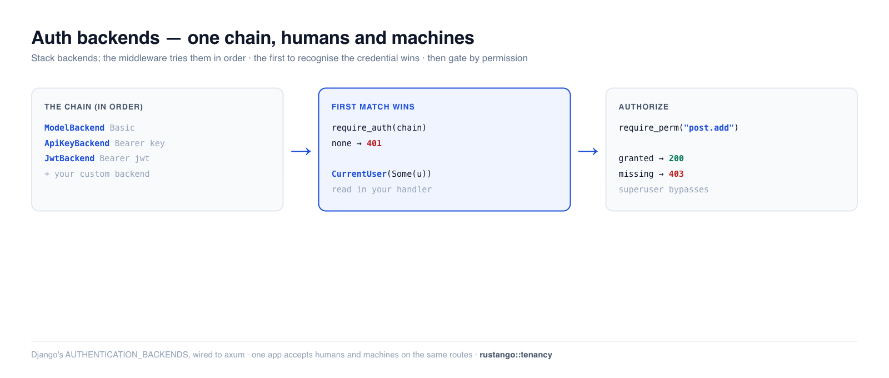

# Auth backends

An **auth backend** answers one question: *given an incoming request, who is the
user?* **Rustango** lets you stack several — HTTP Basic, API key, JWT — into a
chain that the auth middleware tries in order, so one app can accept humans and
machines on the same routes. This is Django's `AUTHENTICATION_BACKENDS` idea,
wired to axum. Pair it with `require_auth` / `require_perm` to gate routes and
the `CurrentUser` extractor to read the result.

[](img/auth-backends.png)

> **New to a term here?** *Backend*, *middleware*, *extractor*, *permission codename* —
> see the [glossary](glossary.md).

> **Source:** `rustango::tenancy::auth_backends` (`AuthBackend`, `ModelBackend`,
> `ApiKeyBackend`, `JwtBackend`, `AuthUser`, `AuthError`) and
> `rustango::tenancy::{RouterAuthExt, CurrentUser}` — behind the `tenancy`
> feature. A portable, DB-agnostic registry also lives at
> `rustango::auth_backends` (always compiled).
>
> **Runnable version:** every snippet is copied from
> [`auth_backends_doc.rs`](../crates/rustango/tests/auth_backends_doc.rs)
> (`cargo test -p rustango --features sqlite,tenancy --test auth_backends_doc`).

## Table of contents

- [The chain](#the-chain) · [The built-in backends](#the-built-in-backends)
- [Gating routes: require_auth](#gating-routes-require_auth)
- [Reading the user: CurrentUser](#reading-the-user-currentuser)
- [Permissions: require_perm](#permissions-require_perm)
- [The portable registry](#the-portable-registry)
- [See also](#see-also)

---

## The chain

You hand `require_auth` a `Vec<Arc<dyn AuthBackend>>`. On each request the
middleware tries them **in order**:

- the **first** backend that recognises the credential wins (returns the user);
- a backend that doesn't recognise it returns "none" and the next is tried;
- if a backend hard-errors (e.g. an inactive account on a *valid* token) the
  chain stops with that error;
- if none match, the request is `401` (with `require_auth`) or proceeds
  anonymously (with `optional_auth`).

```rust
use std::sync::Arc;
use rustango::tenancy::auth_backends::{ApiKeyBackend, AuthBackend, ModelBackend};

let backends: Vec<Arc<dyn AuthBackend>> = vec![
    Arc::new(ModelBackend),    // HTTP Basic  → humans
    Arc::new(ApiKeyBackend),   // Bearer key  → machines
];
```

---

## The built-in backends

| Backend | Credential it reads | Identifies a user by |
|---|---|---|
| `ModelBackend` | `Authorization: Basic <base64(user:pass)>` | username + argon2id password verify against `rustango_users` |
| `ApiKeyBackend` | `Authorization: Bearer <prefix.secret>` | the `rustango_api_keys` table (see [API keys](auth-api-keys.md)) |
| `JwtBackend` | `Authorization: Bearer <jwt>` | a signed HS256 token (see [JWT](auth-jwt.md)) |

`ApiKeyBackend` and `JwtBackend` both read `Bearer` and disambiguate by shape (an
API key's first dot-segment is exactly 8 chars). Construct `JwtBackend` with a
secret of **at least 32 bytes** (`JwtBackend::new(secret)` panics otherwise):

```rust
use rustango::tenancy::auth_backends::JwtBackend;

let backends: Vec<Arc<dyn AuthBackend>> = vec![
    Arc::new(ModelBackend),
    Arc::new(JwtBackend::new(jwt_secret_at_least_32_bytes.to_vec())),
];
```

Write a custom backend by implementing the trait (one async method that inspects
the request `Parts` and returns `Option<AuthUser>`):

```rust
use async_trait::async_trait;   // add `async-trait` to your Cargo.toml
use axum::http::request::Parts;
use rustango::sql::Pool;
use rustango::tenancy::auth_backends::{AuthBackend, AuthError, AuthUser};

struct HeaderBackend;

#[async_trait]
impl AuthBackend for HeaderBackend {
    async fn authenticate(&self, parts: &Parts, _pool: &Pool)
        -> Result<Option<AuthUser>, AuthError>
    {
        // ...inspect parts.headers, return Some(AuthUser{..}) or Ok(None)
        Ok(None)
    }
}
```

---

## Gating routes: require_auth

`RouterAuthExt` adds the middleware. `require_auth` rejects anonymous requests
with `401`; `optional_auth` lets them through (so a handler can branch on
logged-in vs not):

```rust
use rustango::tenancy::RouterAuthExt;

let app = Router::new()
    .route("/profile", get(profile))
    .require_auth(backends, pool);     // 401 if no backend matches
```

Verified behaviour:

```rust
// no credentials               → 401
// Basic alice:<correct>        → 200
// Basic alice:<wrong>          → 401   (no backend accepted; no enumeration)
// Bearer <valid api key>       → 200
```

---

## Reading the user: CurrentUser

Handlers read the authenticated user with the `CurrentUser` extractor. It's
infallible — `Some(user)` when a backend resolved one, `None` otherwise:

```rust
use rustango::tenancy::CurrentUser;

async fn profile(CurrentUser(user): CurrentUser) -> Response {
    match user {
        Some(u) => format!("hello {}", u.username).into_response(),
        None    => StatusCode::UNAUTHORIZED.into_response(),
    }
}
```

> **Foot-gun:** because `CurrentUser` is infallible, forgetting `require_auth`
> doesn't fail to compile — every request just sees `None`. Behind
> `require_auth`, anonymous requests are already `401`'d, so `user` is always
> `Some` there.

---

## Permissions: require_perm

`require_perm` gates a route on a permission **codename** (`{table}.{action}`,
e.g. `post.add`). Apply it to the inner sub-router and `require_auth` to the
outer one, so the user is resolved *before* the permission is checked:

```rust
let admin = Router::new()
    .route("/admin", get(admin_only))
    .require_perm("post.add", pool.clone());   // inner: needs the codename

let app = Router::new()
    .route("/profile", get(profile))
    .merge(admin)
    .require_auth(backends, pool);             // outer: resolves the user first
```

```rust
// alice (granted post.add)   → /admin 200
// bob   (authed, no grant)   → /admin 403
// anonymous                  → /admin 401   (auth runs first)
```

Resolution: a **superuser** (active) passes everything; a **deactivated** user
is denied even with grants; an explicit per-user override wins over role grants;
otherwise any role the user holds that grants the codename passes. Grant with
`set_user_perm_pool` / roles via `create_role_pool` + `assign_role_pool` (the
permission tables are created by `ensure_tables_pool`).

---

## The portable registry

Separately, `rustango::auth_backends` (note: crate root, **not** `tenancy`) is a
small **framework-agnostic** registry — a `Credentials` → `Principal` chain with
its own `AuthBackend` trait. It has no HTTP/axum glue; use it when you want
Django-style backend pluggability inside your own auth code:

```rust
use rustango::auth_backends::{AuthBackendChain, Credentials, RemoteUserBackend};

let chain = AuthBackendChain::new().with(Arc::new(RemoteUserBackend::trust_username()));
let principal = chain.authenticate(&Credentials::remote("alice")).await?;
```

Same "first success wins / first error stops" semantics as the HTTP chain. For
gating real routes, use the `tenancy` middleware above.

---

## See also

- [API keys](auth-api-keys.md) and [JWT](auth-jwt.md) — the credentials
  `ApiKeyBackend` / `JwtBackend` consume.
- [Passwords](auth-passwords.md) — the hashing `ModelBackend` verifies against.
- [Access decorators](auth-decorators.md) — per-handler `login_required` /
  `permission_required` gating, the decorator-style alternative to
  `require_auth`/`require_perm`.
- [Sessions](auth-sessions.md) — cookie-based auth for browsers.
