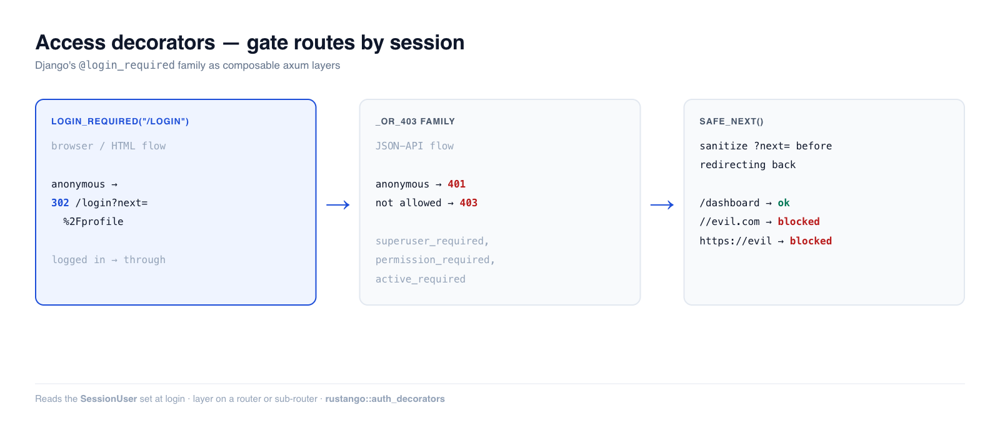

# Access decorators

Once a user is authenticated, you gate routes. **Rustango** ships Django's
`@login_required` family as composable axum **layers**: attach one to a router
and anonymous requests are turned away — 302'd to your login page (browser flow)
or answered with 401/403 (API flow) — before they ever reach the handler.

[](img/auth-decorators.png)

> **Source:** `rustango::auth_decorators` (`login_required`, `login_required_or_401`,
> `user_passes_test`, `superuser_required`, `active_required`,
> `permission_required` + `_or_403` variants; `safe_next`, `extract_next`) —
> behind the `tenancy` feature (the gates read the `SessionUser` extractor).
>
> **Runnable version:** the gating behavior is covered by the tested
> [`auth_demo`](https://github.com/ujeenet/rustango/blob/main/crates/rustango/examples/auth_demo/tests/auth_decorators.rs) —
> `cargo test -p auth_demo --test auth_decorators`.

> **New to a term here?** *middleware/layer*, *extractor*, *401/403* — see the
> [glossary](glossary.md).

> Deep dive companion to the [Security guide](security.md). The gates read the
> session set at login — see [Sessions](auth-sessions.md).

---

## Table of contents
- [Quick start](#quick-start) · [Browser vs API gates](#browser-vs-api-gates)
- [The gate family](#the-gate-family) · [Predicate & role gates](#predicate-and-role-gates)
- [Permission gates](#permission-gates) · [The `?next=` round-trip](#the-next-round-trip)
- [Notes & limits](#notes-and-limits)

---

## Quick start

```rust
use rustango::auth_decorators::login_required;

// Scope the gate to a sub-router (the idiomatic shape):
let private = Router::new()
    .route("/profile", get(profile))
    .route("/settings", get(settings))
    .layer(login_required("/login"));      // anonymous → 302 /login?next=...

let app = Router::new()
    .route("/", get(home))                 // public
    .merge(private);
```

Anonymous requests to `/profile` are redirected to `/login?next=%2Fprofile`; an
authenticated request passes through to the handler.

---

## Browser vs API gates

The same gate comes in two response shapes. Pick by what the caller can do with
the response:

- **Browser / HTML** → the base gates **302-redirect** to your login page (a
  human can follow it and log in).
- **JSON API** → the `_or_403` family returns **status codes**: `401 Unauthorized`
  for anonymous, `403 Forbidden` for authenticated-but-not-allowed (a client
  can't render an HTML login page, and the 401/403 split lets it tell "log in"
  from "you can't do that" apart).

```rust
// Browser: redirect to /login
let app = Router::new().route("/dashboard", get(dash)).layer(login_required("/login"));

// API: 401 for anonymous, never a redirect
let api = Router::new().route("/api/me", get(me)).layer(login_required_or_401());
```

---

## The gate family

| Gate (browser, 302) | API variant (401/403) | Lets through |
|---|---|---|
| `login_required(url)` | `login_required_or_401()` | any logged-in user |
| `active_required(url)` | `active_required_or_403()` | logged-in **and** `active` |
| `superuser_required(url)` | `superuser_required_or_403()` | `is_superuser && active` |
| `user_passes_test(url, pred)` | `user_passes_test_or_403(pred)` | predicate over the `User` row |
| `permission_required(url, codename)` | `permission_required_or_403(codename)` | holds the permission codename |

All are tower layers — `.layer(...)` them onto a router or sub-router.

---

## Predicate and role gates

`user_passes_test` runs your closure against the resolved `User` row, so you can
gate on any field:

```rust
use rustango::auth_decorators::{user_passes_test, superuser_required_or_403};

// Staff-only sub-router (browser):
let staff = Router::new()
    .route("/admin/dashboard", get(dashboard))
    .layer(user_passes_test("/login", |u| u.is_superuser));

// Superuser-only JSON API → 401 anonymous / 403 non-superuser:
let api = Router::new()
    .route("/api/admin/stats", get(stats))
    .layer(superuser_required_or_403());
```

`superuser_required` / `active_required` are pinned shortcuts for the common
`is_superuser && active` / `active` predicates so call sites don't silently
diverge on whether deactivated accounts still count.

---

## Permission gates

`permission_required` checks a permission codename against the tenant's
permission engine (superusers bypass automatically). It additionally resolves
the `Tenant` extractor, so routes using it must be mounted under the tenant
context:

```rust
use rustango::auth_decorators::permission_required;
use rustango::tenancy::permissions::ACCESS_ADMIN_CODENAME;

let admin = Router::new()
    .route("/admin", get(dashboard))
    .layer(permission_required("/login", ACCESS_ADMIN_CODENAME));
```

---

## The `?next=` round-trip

`login_required` preserves the originally-requested URL in `?next=` so your login
handler can send the user back after authenticating. **You must sanitize that
value** — echoing it into a redirect unchecked is a textbook open-redirect
(phishing) hole. `safe_next` is the guard:

```rust
use rustango::auth_decorators::{extract_next, safe_next};

async fn login_post(Query(q): Query<HashMap<String, String>>, /* … */) -> Response {
    // … verify credentials, set the session …
    let dest = extract_next(&q)
        .and_then(|n| safe_next(&n))          // rejects open redirects
        .unwrap_or_else(|| "/".to_owned());
    Redirect::to(&dest).into_response()
}
```

`safe_next` only accepts same-origin, root-relative paths — it rejects absolute
URLs, scheme-relative `//host`, backslash variants, and their percent-encoded
forms:

```rust
assert_eq!(safe_next("/dashboard"),            Some("/dashboard".to_owned()));
assert_eq!(safe_next("https://evil.example/x"), None);
assert_eq!(safe_next("//evil.example/x"),       None);   // scheme-relative
assert_eq!(safe_next("%2F%2Fevil.example/x"),   None);   // decodes to //evil
```

---

## Notes and limits

- **These gates read the session.** "Logged in" means the [`SessionUser`](auth-sessions.md)
  extractor resolved a user from the session cookie — so they're for
  session/cookie auth. API token auth ([JWT](auth-jwt-api.md), [API
  keys](auth-api-keys.md)) gates at the [backend chain](auth-backends.md) layer
  instead, reading the `Authorization` header.
- **Layer ordering matters.** `.layer(gate)` protects every route added to the
  router *before* it; routes added after are public. Scoping the gate to a
  dedicated sub-router (the quick-start shape) avoids that footgun.
- **`permission_required` needs tenant context** (it queries the tenant perm
  engine) — mount it under the tenant; an untenant'd route 500s.
- The redirect's `?next=` is always percent-encoded, so CRLF / response-splitting
  can't leak into the `Location` header.


---

## See also

- [Auth backends](auth-backends.md)
- [Sessions](auth-sessions.md)
- [Security guide](security.md)
