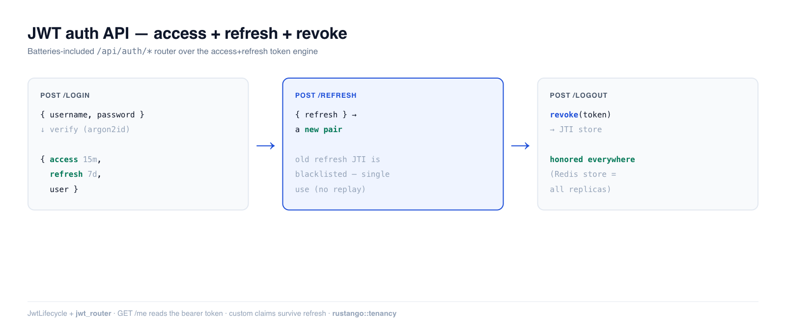

# JWT auth API

The [standalone JWT](auth-jwt.md) module signs and verifies one token. A real
API needs the whole **lifecycle**: a short-lived *access* token, a long-lived
*refresh* token, rotation on refresh, and **revocation** for logout. **Rustango**
ships that as `JwtLifecycle` — and a batteries-included router that mounts
`POST /api/auth/login`, `/refresh`, `/logout`, and `GET /me` for you.

[](img/auth-jwt-api.png)

> **Source:** `rustango::tenancy::jwt_lifecycle` (`JwtLifecycle`, `JwtTokenPair`,
> `JwtClaims`) and `rustango::tenancy::auth_routes` (`jwt_router`, `Config`) +
> `rustango::jti_store` (`JtiStore`, `InMemoryJtiStore`) — behind `jwt` +
> `tenancy`.
>
> **Runnable version:** the token engine is covered by the tested
> [`auth_demo`](../crates/rustango/examples/auth_demo/tests/auth_jwt_api.rs) —
> `cargo test -p auth_demo --test auth_jwt_api`. The HTTP endpoints are
> tenant-scoped and exercised end-to-end by the framework's own
> `crates/rustango/tests/tenant_auth_live.rs`.

> Deep dive companion to the [Security guide](security.md)'s "Issuing and
> refreshing JWTs" section. For a single, manually-managed token instead, see
> [JWT (standalone)](auth-jwt.md).

---

## Contents

- [The built-in router](#the-built-in-router) · [Wiring it up](#wiring-it-up)
- [The token engine](#the-token-engine-jwtlifecycle) · [Refresh & rotation](#refresh-and-rotation)
- [Revocation & the JTI store](#revocation-and-the-jti-store) · [Custom claims](#custom-claims)
- [Notes & limits](#notes-and-limits)

---

## The built-in router

`jwt_router` mounts the standard four endpoints against the per-tenant
`rustango_users` table — the ~50 lines of login boilerplate every project
otherwise rewrites:

| Method | Path | Body / Auth | Returns |
|---|---|---|---|
| POST | `/api/auth/login` | `{username, password}` | `{access, refresh, user}` |
| POST | `/api/auth/refresh` | `{refresh}` | `{access, refresh}` |
| POST | `/api/auth/logout` | `Authorization: Bearer <access>` | `204` (revokes the JTI) |
| GET | `/api/auth/me` | `Authorization: Bearer <access>` | `{user_id, username, is_superuser}` |

Login verifies the password with [argon2id](auth-passwords.md), then issues a
pair. Paths, TTLs, and the signing key are configurable via `Config`.

## Wiring it up

```rust
use rustango::tenancy::auth_routes::{jwt_router, Config};

rustango::manage::Cli::new()
    .tenancy()
    .api(my_app::urls::api()
        .merge(jwt_router(Config::default())))   // mounts /api/auth/*
    .run()
    .await
```

`Config::default()` signs with `RUSTANGO_SESSION_SECRET` (the same key as the
admin session cookie) and uses 15-min access / 7-day refresh TTLs. Override
`prefix`, `access_ttl_secs`, `refresh_ttl_secs`, or `session_secret` as needed.
The endpoints run under the tenant context, so mount them in a tenancy app.

```sh
# Login → access + refresh
curl -sX POST localhost:8080/api/auth/login \
  -H 'content-type: application/json' \
  -d '{"username":"alice","password":"hunter2hunter"}'

# Call a protected endpoint
curl localhost:8080/api/auth/me -H "Authorization: Bearer $ACCESS"
```

---

## The token engine (`JwtLifecycle`)

Under the router sits `JwtLifecycle` — usable directly if you want the lifecycle
without the built-in HTTP shape:

```rust
use rustango::tenancy::jwt_lifecycle::JwtLifecycle;

let jwt = JwtLifecycle::new(secret_32_bytes);

// Login: issue the pair.
let pair = jwt.issue_pair(user_id);
// → pair.access  (short TTL, send in the Authorization header)
// → pair.refresh (long TTL, store in an HttpOnly cookie / secure storage)

// Authenticated request: verify the access token.
match jwt.verify_access(&access) {
    Some(claims) => { /* claims.sub is the user id */ }
    None => { /* 401: invalid, expired, revoked, or wrong type */ }
}
```

Access and refresh tokens are **not interchangeable** — `verify_access` rejects
a refresh token and vice versa, so a stolen short-lived access token can't be
used to mint new ones:

```rust
let pair = jwt.issue_pair(42);
assert!(jwt.verify_refresh(&pair.access).is_none());
assert!(jwt.verify_access(&pair.refresh).is_none());
```

---

## Refresh and rotation

`refresh` exchanges a valid refresh token for a **new pair** and blacklists the
old refresh token's JTI — sliding expiry with single-use refresh tokens (replay
of the old one is rejected):

```rust
let pair = jwt.issue_pair(7);
let rotated = jwt.refresh(&pair.refresh).expect("refresh ok");
assert_ne!(pair.access, rotated.access);
assert!(jwt.refresh(&pair.refresh).is_none());   // old refresh is now dead
```

By default `refresh` **preserves** the token's custom claims. If permissions may
have changed (role revoked, scope downgraded), use `refresh_with(token, new_claims)`
to substitute a fresh payload while still blacklisting the old refresh JTI.

---

## Revocation and the JTI store

Each token carries a unique `jti`. `revoke` adds it to a blacklist so subsequent
`verify_*` calls fail until the token would have expired anyway — this is what
`POST /api/auth/logout` calls:

```rust
let pair = jwt.issue_pair(1);
assert!(jwt.revoke(&pair.access));
assert!(jwt.verify_access(&pair.access).is_none());
```

The blacklist lives in a pluggable `JtiStore`. The default `InMemoryJtiStore` is
**single-process and loses revocations on restart** — fine for one instance. Any
multi-replica deployment MUST install a shared, durable store (Redis / DB) so a
logout on one replica is honored by all:

```rust
use rustango::jti_store::{InMemoryJtiStore, JtiStore};
use std::sync::Arc;

let shared: Arc<dyn JtiStore> = Arc::new(InMemoryJtiStore::new()); // swap for Redis in prod
let a = JwtLifecycle::new(secret.clone()).with_jti_store(Arc::clone(&shared));
let b = JwtLifecycle::new(secret).with_jti_store(Arc::clone(&shared));

let pair = a.issue_pair(5);
a.revoke(&pair.access);
assert!(b.verify_access(&pair.access).is_none());   // B sees A's revocation
```

> Without a shared store, `/logout` is best-effort: a revoked token may still be
> accepted on another replica until its natural expiry. This is the single most
> important production setting for JWT auth.

---

## Custom claims

Embed `roles` / `tenant` / `scope` directly in the token so verification needs no
DB lookup. Reserved names (`sub`, `exp`, `jti`, `typ`) are rejected:

```rust
let custom = serde_json::json!({ "roles": ["admin"], "tenant": "acme" })
    .as_object().unwrap().clone();
let pair = jwt.issue_pair_with(99, custom)?;

let claims = jwt.verify_access(&pair.access).unwrap();
let roles: Vec<String> = claims.get_custom("roles").unwrap();   // ["admin"]
```

Custom claims survive `refresh` (carried onto the new pair) unless you use
`refresh_with`.

---

## Notes and limits

- **Sessions vs JWT vs this:** a plain [JWT](auth-jwt.md) can't be revoked; a
  [Session](auth-sessions.md) is revocable but needs a per-request store lookup;
  `JwtLifecycle` is the middle path — stateless verify, plus a JTI blocklist for
  the revocations you actually need (logout, rotation).
- **HTTP endpoints are tenant-scoped.** `jwt_router` resolves users via the
  tenant context + `rustango_users`; mount it in a `.tenancy()` app. The token
  engine (`JwtLifecycle`) itself has no such requirement.
- **Pair this with** the [auth backend chain](auth-backends.md)'s `JwtBackend`
  to authenticate arbitrary routes from the `Authorization: Bearer` header.
- **HS256 signing**, 32-byte key floor — same algorithm and constraints as
  [standalone JWT](auth-jwt.md#security-model).
