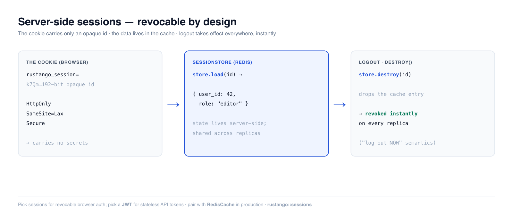

# Sessions

A session keeps a user logged in across requests by handing the browser an
**opaque ID** in a cookie and keeping everything else server-side. **Rustango**'s
`SessionStore` puts that state in a cache (Redis in production, in-memory for
tests), so the cookie carries no secrets and a session can be **revoked
instantly** — delete the entry and every replica sees the logout on the next
request.

[](img/auth-sessions.png)

> **Source:** `rustango::sessions` (`Session`, `SessionStore`) +
> `rustango::cache` (`BoxedCache`, `InMemoryCache`) — behind the `sessions`
> feature (on by default; pulls `cache`). For a Redis-backed store in
> production, add the `cache-redis` feature (off by default) to get `RedisCache`.
>
> **Runnable version:** snippets below are copied from the tested
> [`auth_demo`](https://github.com/ujeenet/rustango/blob/main/crates/rustango/examples/auth_demo/tests/auth_sessions.rs)
> example — `cargo test -p auth_demo --test auth_sessions`.

> **New to a term here?** *session*, *opaque id*, *cookie*, *cache* — see the
> [glossary](glossary.md).

> Deep dive companion to the [Security guide](security.md). Gating routes behind
> a logged-in session is covered in [Auth decorators](auth-decorators.md); for
> stateless API tokens instead, see [JWT](auth-jwt.md).

---

## Table of contents
- [Quick start](#quick-start) · [Sessions vs JWT](#sessions-vs-jwt)
- [The session bag](#the-session-bag) · [The cookie](#the-cookie)
- [Picking a backend](#picking-a-backend) · [Expiry & sliding renewal](#expiry-and-sliding-renewal)
- [Updating in place](#updating-a-session-in-place) · [Notes & limits](#notes-and-limits)

---

## Quick start

```rust
use rustango::sessions::{Session, SessionStore};
use rustango::cache::{BoxedCache, RedisCache};
use std::sync::Arc;

let store = SessionStore::new(Arc::new(RedisCache::new("redis://localhost/0")?) as BoxedCache);

// After the password check (see auth-passwords.md): stash who the user is,
// save → an opaque id, and set that id as the cookie.
let mut session = Session::new();
session.set("user_id", user.id);
let sid = store.save(&session).await?;
// Set-Cookie: rustango_session={sid}; HttpOnly; SameSite=Lax; Secure; Path=/

// On later requests: read the id from the cookie, load the session back.
let session = store.load(&sid).await?.unwrap_or_default();
let user_id: Option<i64> = session.get("user_id");

// Logout: drop the server-side entry — the cookie is now meaningless.
store.destroy(&sid).await?;
```

The id is 192 bits of OS-CSPRNG randomness, base64url-encoded to 32 chars — well
above the 128-bit floor for session tokens, and unguessable.

---

## Sessions vs JWT

Both answer "who is this request?", with opposite trade-offs:

| | Session | [JWT](auth-jwt.md) |
|---|---|---|
| State | server-side (cache lookup per request) | stateless (self-contained token) |
| Revocation | **instant** — `destroy()` the entry | hard — valid until expiry (needs a blocklist) |
| Best for | browser apps, "log this user out NOW" | APIs, service-to-service, no shared store |

Reach for sessions when you need to forcibly log someone out (password change,
"sign out all devices", a banned account). Reach for JWT when you want zero
per-request lookups and have no shared cache.

---

## The session bag

`Session` is a typed key→value bag with a dirty bit (so the store can skip a
write when nothing changed):

```rust
let mut s = Session::new();
s.set("user_id", 42_i64);            // serialize any Serialize value
s.set("role", "editor");
let uid: Option<i64> = s.get("user_id");   // None if absent or wrong type
s.remove("role");
s.clear();                            // wipe everything (e.g. on logout)
```

`get` is **fail-soft**: a missing key *or* a value that doesn't deserialize as
the requested type returns `None` rather than panicking — so a schema change
never 500s a request.

---

## The cookie

The cookie holds only `sid`. Set it with the security attributes a session
cookie needs:

- **`HttpOnly`** — JavaScript can't read it (blunts XSS token theft).
- **`SameSite=Lax`** — not sent on cross-site sub-requests (CSRF defense; pair
  with [CSRF tokens](security.md#protecting-against-csrf) for form posts).
- **`Secure`** — HTTPS only (drop only for local HTTP dev).
- **`Path=/`** — visible to the whole app.

Nothing sensitive is in the cookie, so a leaked cookie is exactly as powerful as
the session it points at — and you can revoke that server-side at any time.

---

## Picking a backend

`SessionStore::new` takes any `BoxedCache`:

- **`RedisCache`** — production. Shared across replicas, so a login on one
  instance and a logout on another are both visible everywhere.
- **`InMemoryCache`** — single process / tests. Fast, zero deps, but sessions
  don't survive a restart and aren't shared between replicas.

```rust
use rustango::cache::{BoxedCache, InMemoryCache};
use std::sync::Arc;

// Tests / single-process:
let store = SessionStore::new(Arc::new(InMemoryCache::new()) as BoxedCache);
```

---

## Expiry and sliding renewal

Sessions default to a **2-week** TTL. Override per store, and `touch` on each
authenticated request for sliding expiration (active users stay logged in,
idle ones age out):

```rust
use std::time::Duration;

let store = SessionStore::new(cache).ttl(Duration::from_secs(60 * 60)); // 1 hour

// On each request, after a successful load — extend without rewriting:
store.touch(&sid).await?;   // Ok(false) if the session is already gone
```

---

## Updating a session in place

`save` always mints a fresh id (use it at login). To modify an existing session
during a request, load → mutate → `save_with_id` under the same id:

```rust
let mut s = store.load(&sid).await?.unwrap_or_default();
s.set("last_seen", chrono::Utc::now().to_rfc3339());
store.save_with_id(&sid, &s).await?;
```

---

## Notes and limits

- **Revocation is the headline feature** — `destroy()` (logout) and TTL expiry
  both take effect on the next request, on every replica sharing the cache.
- **Corrupt or unknown ids load as `None`** (fail-open): a cache schema change
  or a tampered cookie yields an empty session, not an error — the request is
  simply unauthenticated.
- **The store doesn't set the cookie for you** — it manages server-side state;
  you attach/read the `sid` cookie in your handler (or via a layer). This keeps
  it usable from any framework wiring.
- **Mint a fresh session id on privilege change** (e.g. right after login) to
  avoid session fixation — `save` already does this since it always generates a
  new id.


---

## See also

- [Auth decorators](auth-decorators.md)
- [JWT](auth-jwt.md)
- [Auth backends](auth-backends.md)
- [Security guide](security.md)
