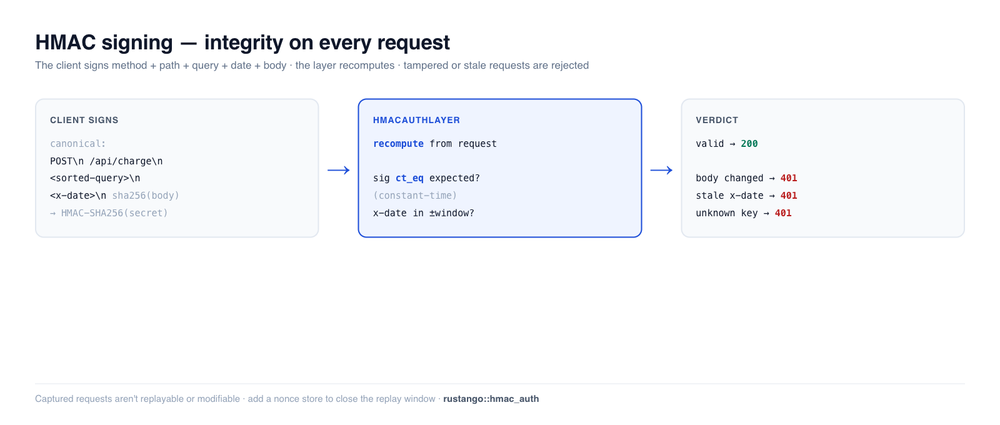

# HMAC-Anfragesignierung

Die HMAC-Signierung beweist **sowohl, wer eine Anfrage gesendet hat, als auch,
dass sie unterwegs nicht verändert wurde**. Der Client signiert jede Anfrage mit
einem gemeinsamen Secret; der Server berechnet die Signatur neu und vergleicht.
Anders als ein Bearer-[API-Schlüssel](auth-api-keys.md) — der bei Abfangen
wiederholbar ist — deckt eine HMAC-Signatur die Methode, den Pfad, den
Query-String, den Zeitstempel und den Body ab, sodass eine manipulierte oder
veraltete Anfrage abgelehnt wird. Es ist das Schema, das AWS SigV4 und
Webhook-Signaturen verwenden, und **Rustango** liefert es als einen einzigen
Tower-Layer.

[](../img/auth-hmac.png)

> **Ein Begriff hier neu für Sie?** *HMAC*, *gemeinsames Secret*, *Replay*, *Vergleich in konstanter Zeit* —
> siehe das [Glossar](glossary.md).

> **Quelle:** `rustango::hmac_auth` (`HmacAuthLayer`, `KeyResolver`, `sign_now`,
> `sign_request`) — hinter dem Feature `hmac-auth` (standardmäßig aktiviert; der
> Replay-Schutz benötigt zusätzlich `cache`).
>
> **Lauffähige Version:** Jedes Snippet ist aus
> [`auth_hmac_doc.rs`](https://github.com/ujeenet/rustango/blob/main/crates/rustango/tests/auth_hmac_doc.rs) kopiert
> (`cargo test -p rustango --test auth_hmac_doc`).

## Inhaltsverzeichnis

- [Wann einsetzen](#when-to-use-it)
- [Was signiert wird](#what-gets-signed)
- [Server: mit dem Layer verifizieren](#server-verify-with-the-layer)
- [Client: eine Anfrage signieren](#client-sign-a-request)
- [Uhren-Skew und Replay](#clock-skew-and-replay)
- [Grenzen](#limits)
- [Siehe auch](#see-also)

---

## Wann einsetzen

| Verwenden Sie… | Wann |
|---|---|
| [API-Schlüssel](auth-api-keys.md) (Bearer) | Einfache Maschinen-Auth; Abfangrisiko ist akzeptabel (TLS, kurze Rotation). |
| **HMAC-Signierung** | Sie benötigen **Integrität pro Anfrage + Replay-Resistenz** — Webhooks, Partner-APIs, alles, wo eine abgefangene Anfrage nicht wiederverwendbar oder modifizierbar sein darf. |
| [JWT](auth-jwt.md) | Zustandslose, selbstbeschreibende Benutzer-Tokens mit Claims. |

HMAC erfordert, dass beide Seiten dasselbe Secret out-of-band halten (Sie stellen
es bereit) und einigermaßen synchronisierte Uhren.

---

## Was signiert wird

Der Client baut eine kanonische Zeichenkette und wendet HMAC-SHA256 mit dem
gemeinsamen Secret darauf an:

```text
<UPPERCASE-METHOD>\n
<PATH>\n
<SORTED-QUERY>\n
<X-DATE>\n
<HEX-SHA256(BODY)>
```

Zwei Anfrage-Header tragen das Ergebnis:

- `X-Date` — ein RFC-3339-Zeitstempel (ebenfalls Teil der signierten
  Zeichenkette).
- `Authorization: HMAC-SHA256 keyId=<id>,signature=<base64>`

Weil der Query-String auf beiden Seiten **sortiert** wird, erzeugen `?b=2&a=1`
und `?a=1&b=2` dieselbe Signatur. Weil der Body in die Zeichenkette gehasht wird,
macht das Ändern eines einzigen Bytes sie ungültig.

---

## Server: mit dem Layer verifizieren

`HmacAuthLayer::new` nimmt einen **`KeyResolver`** — eine Closure, die eine
`keyId` auf ihr Secret abbildet (`None` ⇒ unbekannter Schlüssel ⇒ 401). Hängen
Sie ihn als normalen Tower-Layer vor die Routen, die Sie schützen wollen:

```rust
use std::sync::Arc;
use rustango::hmac_auth::{HmacAuthLayer, KeyResolver};
use tower::Layer;

// Schlüssel-IDs auf Secrets auflösen — hinterlegen Sie dies mit Ihrer DB / Ihrem Secret-Store.
let resolver: KeyResolver = Arc::new(|key_id: &str| {
    (key_id == "k_demo").then(|| b"shared-secret-at-least-32-bytes-long!!".to_vec())
});

let layer = HmacAuthLayer::new(resolver)
    .tolerance_secs(300);                 // ±5-Min-Uhren-Skew-Fenster (Standard)

let app = protected_router.layer(layer);
```

Eine korrekt signierte Anfrage passiert; manipulieren Sie den Body, lassen Sie
`X-Date` weg oder signieren Sie mit einem unbekannten Schlüssel, und es ist ein
`401`:

```rust
// korrekt signiert            → 200
// Body nach dem Signieren geändert → 401  (Signatur stimmt nicht überein)
// fehlender X-Date-Header      → 401
// keyId, die der Resolver ablehnt → 401
```

> **Kein Identitäts-Extraktor.** Der Layer verifiziert die Signatur, **injiziert
> aber nicht**, welche `keyId` signiert hat, in die Anfrage — es gibt keinen
> `HmacUser`-Extraktor. Wenn ein Handler die Aufrufer-Identität benötigt, umhüllen
> Sie den Layer oder führen Sie sie selbst mit. Ablehnungen sind schlichte
> `401`/`413`-Antworten, kein typisierter Fehler, auf den Sie matchen.

---

## Client: eine Anfrage signieren

`sign_now` signiert mit der aktuellen Zeit und liefert die beiden anzuhängenden
Header-Werte (`sign_request` ist die Variante, die ein explizites
RFC-3339-Datum nimmt):

```rust
use rustango::hmac_auth::sign_now;

let body = br#"{"amount": 100}"#;
let (x_date, authorization) =
    sign_now("k_demo", b"shared-secret-at-least-32-bytes-long!!",
             "POST", "/api/charge", "", body);

// Hängen Sie beide Header an und senden Sie den EXAKTEN Body, den Sie signiert haben:
let req = http::Request::post("/api/charge")
    .header("x-date", x_date)
    .header("authorization", authorization)
    .body(body.to_vec())?;
```

Die Signatur ist base64; der Body-Hash innerhalb der kanonischen Zeichenkette ist
hex. Senden Sie den Body Byte für Byte wie signiert — jeder Proxy, der ihn
umschreibt (Neukomprimierung, JSON-Neuserialisierung), bricht die Verifizierung.

---

## Uhren-Skew und Replay

Der `X-Date`-Zeitstempel begrenzt Replay: Eine Anfrage, deren Datum außerhalb von
`tolerance_secs` (Standard ±300 s) liegt, wird abgelehnt, sodass eine abgefangene
Anfrage nur innerhalb dieses kurzen Fensters wiederverwendbar ist. Um es ganz zu
schließen, hängen Sie einen **Nonce-Store** an (irgendeinen `cache::Cache`), und
jede Signatur kann innerhalb des Fensters nur einmal ausgegeben werden:

```rust
use rustango::cache::InMemoryCache;

let layer = HmacAuthLayer::new(resolver)
    .tolerance_secs(120)
    .nonce_store(Arc::new(InMemoryCache::new()));  // Replays ablehnen
```

Verwenden Sie in der Produktion einen **gemeinsamen** Store (Redis), damit der
Schutz über Replicas hinweg hält — ein In-Process-Cache schützt nur eine
Instanz. Die Replay-Prüfung schlägt bei einem Cache-Fehler „fail open“ fehl
(Verfügbarkeit vor dem engen In-Fenster-Risiko).

---

## Grenzen

- **Symmetrischer ±Skew, RFC-3339-Daten.** Beide Uhren müssen ungefähr
  synchronisiert sein; der Client muss denselben Zeitstempel senden, den er
  signiert hat (`sign_now` liefert ihn für Sie).
- **Vollständige Body-Pufferung.** Der Body wird zum Hashen in den Speicher
  gelesen (Standardobergrenze 10 MiB → `413`; anheben mit `.body_limit(n)`, aber
  auf den Speicher achten). Streaming-Bodies werden nicht unterstützt.
- **Die Signatur ist base64 auf dem Draht, der Body-Hash ist hex** — leicht zu
  verwechseln, wenn man einen Client in einer anderen Sprache schreibt.
- **Halten Sie den Layer am äußersten** relativ zu allem, was den Body mutiert.

---

## Siehe auch

- [API-Schlüssel](auth-api-keys.md) — einfacheres Bearer-Credential, wenn
  Integrität/Replay keine Rolle spielen.
- [Auth-Backends](auth-backends.md) — zum Identifizieren eines *Benutzers* pro
  Anfrage (HMAC beweist die Nachrichtenintegrität, nicht eine Session-Identität).
- [Webhooks](security.md) — das eingehende Gegenstück: Signaturen auf Ereignissen
  verifizieren, die Sie empfangen.
- [Middleware](middleware.md) — wie sich Tower-Layer anhängen und ordnen.
