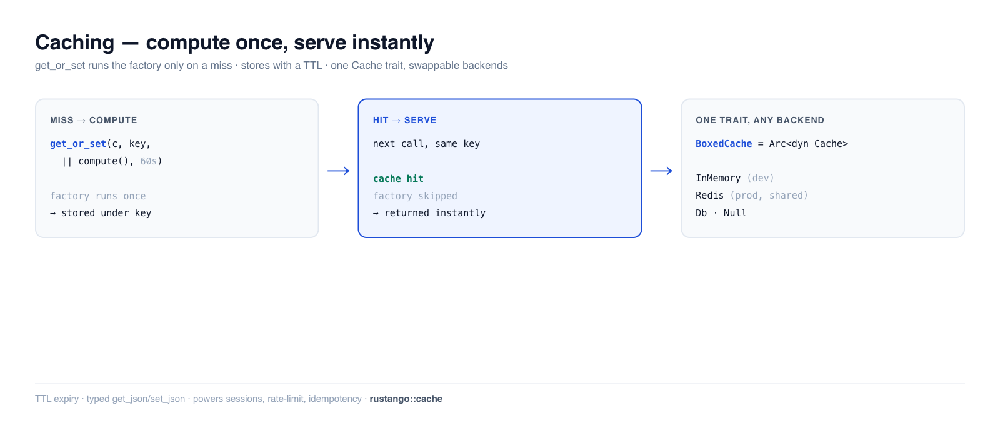

# Caching

Caching speichert das Ergebnis teurer Arbeit — eine schwere Query, ein
gerendertes Fragment, einen Drittanbieter-API-Aufruf — sodass der nächste
Request es sofort erhält, statt es neu zu berechnen. **Rustango** gibt dir einen
`Cache`-Trait mit austauschbaren Backends (In-Memory, Redis, Datenbank), einen
Compute-on-Miss-Helfer (`get_or_set`) und typisierte JSON-Helfer. Tausche das
Backend, ohne eine einzige Aufrufstelle anzufassen — wie Djangos Cache-Framework
oder Laravels `Cache`-Fassade.

[](../img/caching.png)

> **Ein Begriff hier neu für dich?** *Cache*, *TTL*, *Key*, *Backend* — siehe
> das [Glossar](glossary.md).

> **Quelle:** `rustango::cache` (`Cache`, `InMemoryCache`, `NullCache`,
> `get_or_set`, `get_json`, `set_json`, `BoxedCache`, `from_settings`) — hinter
> der `cache`-Feature (standardmäßig aktiv). `RedisCache` benötigt die
> `cache-redis`-Feature (standardmäßig aus).
>
> **Ausführbare Version:** jeder Codeausschnitt ist aus
> [`cache_doc.rs`](https://github.com/ujeenet/rustango/blob/main/crates/rustango/tests/cache_doc.rs) kopiert
> (`cargo test -p rustango --test cache_doc`); das Datenbank-Backend wird per
> Dogfooding auf SQLite durch
> [`cache_db_backend_sqlite_live.rs`](https://github.com/ujeenet/rustango/blob/main/crates/rustango/tests/cache_db_backend_sqlite_live.rs)
> erprobt.

## Inhaltsverzeichnis

- [Schritt 1 — Ein Backend wählen](#step-1--pick-a-backend)
- [Schritt 2 — get / set / delete](#step-2--get--set--delete)
- [Schritt 3 — get_or_set (Cache-Aside)](#step-3--get_or_set-cache-aside)
- [Typisierte JSON-Werte](#typed-json-values)
- [TTL und Ablauf](#ttl-and-expiry)
- [Backends tauschen](#swapping-backends)
- [Caching unter Multi-Tenancy](#caching-under-multi-tenancy)
- [Referenz](#reference)
- [Siehe auch](#see-also)

---

## Schritt 1 — Ein Backend wählen

Jedes Backend implementiert denselben `Cache`-Trait, dein Code ist also
identisch, welches du auch wählst. Der App-Code hält einen **`BoxedCache`**
(`Arc<dyn Cache>`) und nennt nie den konkreten Typ:

```rust
use rustango::cache::{BoxedCache, InMemoryCache};
use std::sync::Arc;

let cache: BoxedCache = Arc::new(InMemoryCache::new());
```

| Backend | Feature | Verwenden für |
|---|---|---|
| `InMemoryCache` | `cache` | Dev, Tests, Einzelprozess (HashMap pro Prozess + TTL) |
| `RedisCache` | `cache-redis` | Produktion; über Replicas geteilt |
| `DbCache` | `cache` | Produktion ohne Redis; eine `rustango_cache`-Tabelle |
| `NullCache` | `cache` | Caching deaktivieren (jeder Read verfehlt) — praktisch in Tests |

---

## Schritt 2 — get / set / delete

Der Kern des Traits sind vier async-Methoden. `set` nimmt ein optionales TTL
(`None` = kein Ablauf); `get` gibt `Option<String>` zurück (`None` bei einem
Miss):

```rust
use rustango::cache::{Cache, InMemoryCache};

let cache = InMemoryCache::new();

assert_eq!(cache.get("greeting").await?, None);     // miss
cache.set("greeting", "hello", None).await?;        // store, no expiry
assert_eq!(cache.get("greeting").await?.as_deref(), Some("hello"));
assert!(cache.exists("greeting").await?);

cache.delete("greeting").await?;                    // gone
```

Es gibt auch Batch-Varianten — `get_many` / `set_many` / `delete_many`.

---

## Schritt 3 — get_or_set (Cache-Aside)

Das ist die, zu der du am häufigsten greifst. `get_or_set` gibt den gecachten
Wert zurück, oder — bei einem Miss — führt deine Factory aus, speichert das
Ergebnis mit einem TTL und gibt es zurück. Die Factory **läuft nur bei einem
Miss**:

```rust
use rustango::cache::get_or_set;
use std::time::Duration;

let stats: HomeStats = get_or_set(
    &*cache,                       // &dyn Cache
    "home:stats",
    || async { compute_home_stats(&pool).await },   // runs only on a miss
    Some(Duration::from_secs(60)),                   // cache for 60s
).await?;
```

Der zugrunde liegende Test ruft `get_or_set` zweimal für denselben Key auf und
stellt sicher, dass die Factory **genau einmal** lief — der zweite Aufruf wird
aus dem Cache bedient.

> **Bei Schreibvorgängen invalidieren.** Cache-Aside bedeutet veraltete Daten,
> bis das TTL abläuft. Für Daten, die sich ändern, mache auch `delete(key)`, wenn
> du sie schreibst — z. B. aus einem [`post_save`-Signal](orm.md) — damit der
> nächste Read neu berechnet.

---

## Typisierte JSON-Werte

`get_json` / `set_json` serialisieren jeden `Serialize`/`Deserialize`-Typ nach
JSON, sodass du Structs und Listen cachst, nicht nur Strings:

```rust
use rustango::cache::{get_json, set_json};

#[derive(serde::Serialize, serde::Deserialize)]
struct Profile { id: i64, name: String }

set_json(&*cache, "profile:7", &profile, None).await?;
let back: Option<Profile> = get_json(&*cache, "profile:7").await?;   // None on a miss
```

(`get_or_set` verwendet diese unter der Haube, weshalb sein Werttyp
`Serialize + Deserialize` sein muss.)

---

## TTL und Ablauf

Übergib eine `Duration` an `set` (oder `get_or_set`) und der Eintrag verschwindet
danach. Verifiziert: ein 50-ms-Eintrag ist sofort lesbar und nach 80 ms weg.

```rust
cache.set("flash", "x", Some(Duration::from_millis(50))).await?;
// ...50ms later...
assert_eq!(cache.get("flash").await?, None);   // expired
```

`InMemoryCache::with_default_ttl(d)` setzt ein Standard-TTL, das angewendet wird,
wenn du `None` übergibst.

---

## Backends tauschen

Weil alles der `Cache`-Trait ist, ist der Wechsel von In-Memory zu Redis eine
einzeilige Änderung beim Start — meist von der Konfiguration gesteuert, sodass sie
sich pro Umgebung unterscheidet:

```rust
// Build the cache from `[cache]` settings (backend = "memory" | "redis" | "db" | "null").
let cache: BoxedCache = rustango::cache::from_settings(&settings.cache);
```

In der Produktion richtest du es auf Redis (über alle deine Replicas geteilt):

```rust
use rustango::cache::RedisCache;   // needs the `cache-redis` feature
let cache: BoxedCache = std::sync::Arc::new(RedisCache::new("redis://localhost").await?);
```

Dieselben `get` / `set` / `get_or_set`-Aufrufe — nur der Konstruktor hat sich
geändert.

---

## Caching unter Multi-Tenancy

`Cache` ist ein flacher, `&str`-indizierter Store — und das macht unter
Multi-Tenancy den naheliegenden Key zum undichten Key: ein Handler (oder
schlimmer ein Background-Task, der gar keinen ambienten Tenant hat) schreibt
`"stats:monthly"` für einen Tenant, und jeder andere Tenant liest es zurück.

Wickle den gemeinsamen Cache in einen **`ScopedCache`**, damit der Namespace
für dich angewendet wird und die Aufrufstelle es nicht vergessen kann:

```rust
use rustango::cache::ScopedCache;

// From the Org the resolver already produced:
let cache = ScopedCache::for_tenant(shared.clone(), &t.org.slug);

cache.set("stats:monthly", &json, ttl).await?;   // stored as tenant:acme:stats:monthly
cache.get("stats:monthly").await?;               // reads only acme's entry
cache.clear().await?;                            // drops ONLY acme's entries
```

`ScopedCache` ist selbst ein `Cache` und passt damit überall hinein, wo ein
`BoxedCache` erwartet wird — `cache_page`, `cache_fragment`, die Rate-Limiter,
`DistributedLock`. Er leitet mit gemappten Keys an das innere Backend weiter,
statt etwas neu zu implementieren, sodass native Primitive (Redis `INCRBY`,
`SET NX`, `MGET`) ihre Atomarität und Batching behalten.

**Atomare Zähler und Sperren.** `Cache::incr` steckt hinter
[Rate-Limiting](middleware.md) und Konto-Sperren; `Cache::add` (set-if-absent)
steckt hinter `DistributedLock`. Beide sind atomar bei `RedisCache` (natives
`INCRBY` / `SET NX`) und bei `InMemoryCache` (das seine Sperre über das
Read-Modify-Write hält); `DatabaseCache` belässt beide beim nicht-atomaren
Standard — für einen Prozess in Ordnung, aber greife zu Redis, wenn ein Zähler
oder eine Sperre über Replikate hinweg exakt sein muss.

Zwei Dinge, die man wissen sollte:

| | |
|---|---|
| **Ein Namespace, keine Sicherheitsgrenze** | Alles liegt weiter in einem Backend, und Code mit dem *ungescopeten* Cache kann jeden Key lesen. Der Punkt ist, dass der ergonomische Pfad der korrekte ist. |
| **`clear()` braucht Key-Enumeration** | Es läuft über `Cache::delete_prefix`. `InMemoryCache` filtert seine Map, `DatabaseCache` schickt ein `DELETE … LIKE 'prefix%'`. Ein Backend, das *nicht* enumerieren kann — `FileCache` hasht Keys in Pfade — fällt darauf zurück, alles zu leeren, und loggt eine Warnung. Das ist Absicht: zu wenig zu löschen ließe einen anderen Namespace einen veralteten Eintrag lesen (ein Korrektheitsfehler), zu viel zu löschen kostet nur einen Cache-Miss. |

Das ungescopete `Cache::clear()` ist weiterhin prozessweit — greife also zur
gescopeten Sicht, wann immer die Änderung eines einzelnen Tenants die
Invalidierung ausgelöst hat.

---

## Referenz

**`Cache`-Trait:** `get` · `set(key, value, ttl)` · `delete` · `exists` ·
`get_many` / `set_many` / `delete_many` · `get_or(key, default)`.

**Freie Helfer:** `get_or_set(cache, key, factory, ttl)` ·
`get_json` / `set_json` · `from_settings(&CacheSettings)`.

**Was auf dem Cache aufbaut:** serverseitige [Sessions](auth-sessions.md),
verteiltes [Rate Limiting](middleware.md) (`CacheRateLimitLayer`),
Idempotenz-Schlüssel und Feature-Flags nehmen alle einen `BoxedCache` — sodass
eine einzige Redis-Instanz sie alle stützt.

---

## Siehe auch

- [Hintergrund-Jobs](jobs.md) — die andere Hälfte, um Requests schnell zu halten
  (Arbeit aufschieben, statt ihr Ergebnis zu cachen).
- [Sessions](auth-sessions.md) — ein serverseitiger Store, der auf `Cache`
  aufbaut.
- [Middleware](middleware.md) — `CacheRateLimitLayer` teilt einen Zähler über
  Replicas hinweg via Cache.
- [ORM-Cookbook](orm.md) — gecachte Reads aus einem `post_save`-Signal
  invalidieren.
