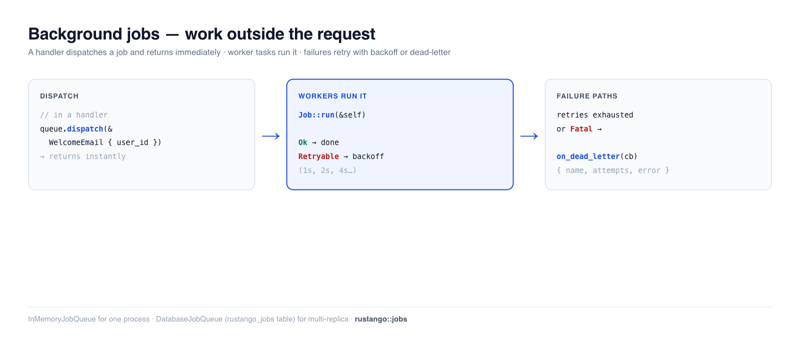

# Hintergrund-Jobs

Manche Arbeit sollte nicht während eines Requests passieren — eine
Willkommens-E-Mail senden, einen Upload skalieren, eine Drittanbieter-API
synchronisieren. Es inline zu tun lässt den Benutzer warten und koppelt die
Response an einen unzuverlässigen externen Aufruf. Ein **Hintergrund-Job**
verschiebt diese Arbeit auf eine Queue: der Handler kehrt sofort zurück, und ein
Pool von Workern führt den Job Augenblicke später aus, mit **automatischen
Retries** und einem **Dead-Letter**-Pfad für Fehlschläge. Das ist Django-Q /
Celery / Laravel-Queues, in Rust.

[](../img/jobs.png)

> **Ein Begriff hier neu für dich?** *Queue*, *Worker*, *Retry/Backoff*,
> *Dead-Letter* — siehe das [Glossar](glossary.md).

> **Quelle:** `rustango::jobs` (`Job`, `JobQueue`, `InMemoryJobQueue`,
> `JobError`, `JobDeadLetter`) und `rustango::jobs::DatabaseJobQueue` (die
> tabellengestützte Queue, Alias von `pg::PgJobQueue`) — hinter der
> `jobs`-Feature (standardmäßig aktiv).
>
> **Ausführbare Version:** die In-Memory-, Retry- und Dead-Letter-Snippets sind
> aus [`jobs_doc.rs`](https://github.com/ujeenet/rustango/blob/main/crates/rustango/tests/jobs_doc.rs) kopiert
> (`cargo test -p rustango --test jobs_doc`); die persistente Queue wird per
> Dogfooding auf SQLite durch
> [`jobs_sqlite_live.rs`](https://github.com/ujeenet/rustango/blob/main/crates/rustango/tests/jobs_sqlite_live.rs)
> erprobt (`cargo test -p rustango --features sqlite,jobs-postgres --test jobs_sqlite_live`).

## Inhaltsverzeichnis

- [Schritt 1 — Einen Job definieren](#step-1--define-a-job)
- [Schritt 2 — Eine Queue starten](#step-2--start-a-queue)
- [Schritt 3 — Aus einem Handler dispatchen](#step-3--dispatch-from-a-handler)
- [Schritt 4 — In deine App verdrahten](#step-4--wire-it-into-your-app) — das vollständige Beispiel
- [Die Worker laufen lassen (CLI + Produktion)](#running-the-workers-cli--production)
- [Retries und Backoff](#retries-and-backoff)
- [Der Dead-Letter-Handler](#the-dead-letter-handler)
- [Die persistente Queue (Produktion)](#the-persistent-queue-production)
- [Jobs unter Multi-Tenancy](#jobs-under-multi-tenancy)
- [Geplante Sweeps unter Multi-Tenancy](#scheduled-sweeps-under-multi-tenancy)
- [Referenz](#reference)
- [Siehe auch](#see-also)

---

## Schritt 1 — Einen Job definieren

Ein Job ist ein serialisierbares Struct, das `Job` implementiert. Die Payload
ist das, was in die Queue gestellt wird (nach JSON serialisiert); `run()` ist
die Arbeit. `NAME` routet eine in die Queue gestellte Payload zurück zu ihrem
Handler, er muss also eindeutig sein.

Erzeuge ein Gerüst mit der CLI — `cargo run -- make:job WelcomeEmail` — oder
schreibe es von Hand:

```rust
use rustango::jobs::{Job, JobError};
use serde::{Deserialize, Serialize};

#[derive(Serialize, Deserialize)]
struct WelcomeEmail {
    user_id: i64,
}

#[async_trait::async_trait]   // add `async-trait` to your Cargo.toml
impl Job for WelcomeEmail {
    const NAME: &'static str = "welcome_email";

    async fn run(&self) -> Result<(), JobError> {
        // ... look up the user and send the email
        Ok(())
    }
}
```

`run()` gibt zurück:

- `Ok(())` — erledigt.
- `Err(JobError::Retryable(msg))` — transient; der Worker wiederholt mit
  Backoff.
- `Err(JobError::Fatal(msg))` — permanent; überspringe Retries, Dead-Letter es
  sofort.

Überschreibe `const MAX_ATTEMPTS: u32 = 3;` auf dem Impl, um die
Retry-Obergrenze zu ändern (Standard 5).

---

## Schritt 2 — Eine Queue starten

Für einen einzelnen Prozess (und für Dev und Tests) führt `InMemoryJobQueue`
Jobs auf tokio-Worker-Tasks aus — ohne Datenbank. **Registriere jeden Job-Typ,
dann `start()` die Worker** (Jobs werden nicht aufgenommen, bis du es tust):

```rust
use rustango::jobs::{InMemoryJobQueue, JobQueue};
use std::sync::Arc;

let queue = Arc::new(InMemoryJobQueue::with_workers(4));   // 4 worker tasks
queue.register::<WelcomeEmail>().await;                    // before start/dispatch
queue.start().await;

// ... app runs ...

queue.shutdown().await;   // on shutdown: drain in-flight jobs, then stop
```

Behalte den `Arc<InMemoryJobQueue>` in deinem App-State, damit Handler ihn
erreichen können.

> **In-Memory bedeutet In-Memory.** In der Queue stehende oder in Bearbeitung
> befindliche Jobs gehen **beim Neustart verloren**. Für alles, dessen Verlust
> du dir nicht leisten kannst, verwende die [persistente
> Queue](#the-persistent-queue-production).

---

## Schritt 3 — Aus einem Handler dispatchen

Sobald die Queue läuft, ist das Dispatchen ein einziger Aufruf — er stellt in
die Queue und kehrt sofort zurück, sodass der Request nicht auf die Arbeit
wartet:

```rust
queue.dispatch(&WelcomeEmail { user_id: 42 }).await?;
```

Ein Worker nimmt ihn auf und führt `run()` Augenblicke später aus. Durchgängig
verifiziert: alle drei dispatchten Jobs laufen auf den Workern.

```rust
for user_id in 1..=3 {
    queue.dispatch(&WelcomeEmail { user_id }).await.unwrap();
}
// → all three WelcomeEmail::run() calls execute on the worker pool
```

---

## Schritt 4 — In deine App verdrahten

Die Schritte 1–3 zusammengesetzt: baue die Queue und registriere jeden Job
**einmalig beim Boot**, starte die Worker, übergib die Queue an deine Routen,
damit Handler sie erreichen können, und drain dann beim Shutdown. Die Queue lebt
in deiner `main.rs`:

```rust
// src/main.rs
use std::sync::Arc;
use rustango::jobs::{InMemoryJobQueue, JobQueue};
use rustango::manage::Cli;

#[rustango::main]
async fn main() -> Result<(), Box<dyn std::error::Error>> {
    // 1. Build the queue + register every job type BEFORE starting workers.
    let queue = Arc::new(InMemoryJobQueue::with_workers(4));
    queue.register::<WelcomeEmail>().await;
    queue
        .on_dead_letter(|dl| async move {
            tracing::error!(job = dl.name, attempts = dl.attempts, error = %dl.error,
                            "job dead-lettered");
        })
        .await;

    // 2. Start the workers — tokio tasks that run inside THIS process.
    queue.start().await;

    // 3. Share the queue with handlers (axum extension/state).
    let app = urls::api().layer(axum::Extension(queue.clone()));

    // 4. Boot the server. Cli::run() blocks until Ctrl-C / SIGTERM.
    Cli::new().api(app).with_health().run().await?;

    // 5. On shutdown: drain in-flight jobs, then stop.
    queue.shutdown().await;
    Ok(())
}
```

Ein Handler dispatcht, indem er die Queue aus dem Request wieder ausliest:

```rust
use axum::Extension;
use std::sync::Arc;
use rustango::jobs::{InMemoryJobQueue, JobQueue};

async fn signup(Extension(queue): Extension<Arc<InMemoryJobQueue>>) -> StatusCode {
    // ... create the user ...
    queue.dispatch(&WelcomeEmail { user_id: 42 }).await.ok();  // returns instantly
    StatusCode::CREATED
}
```

> **Speichere den konkreten Queue-Typ.** Der `JobQueue`-Trait ist **nicht
> object-safe** (seine `register`/`dispatch` sind generisch), du kannst also
> nicht `Arc<dyn JobQueue>` im State halten — behalte den konkreten
> `Arc<InMemoryJobQueue>` (oder `Arc<DatabaseJobQueue>`).

---

## Die Worker laufen lassen (CLI + Produktion)

`start()` spawnt die Worker als **tokio-Tasks innerhalb des aktuellen
Prozesses**. Wenn du also deine App mit der CLI startest — `cargo run` (das den
Server ausführt) — laufen die Worker direkt daneben. Für die meisten Apps ist
das alles, was du brauchst: **ein Prozess bedient Requests *und* leert die
Queue**; es gibt keinen separaten Worker-Befehl.

```bash
cargo run                 # starts the server AND the in-process workers
cargo run -- make:job WelcomeEmail   # scaffold a new job type
```

### Ein dedizierter Worker-Prozess (Produktion)

Im großen Maßstab willst du die Worker oft **getrennt** von der Web-Ebene — damit
ein Traffic-Spike keine Jobs aushungern kann und du beide unabhängig skalierst.
Mit der [persistenten Queue](#the-persistent-queue-production) zieht jeder Prozess
aus derselben `rustango_jobs`-Tabelle, führe also einfach ein zweites,
serverloses Binary aus, das die Queue baut, startet und bis zu einem Signal
blockiert:

```rust
// src/bin/worker.rs — run with `cargo run --bin worker`
use std::sync::Arc;
use rustango::jobs::{DatabaseJobQueue, JobQueue};

#[rustango::main]
async fn main() -> Result<(), Box<dyn std::error::Error>> {
    let pool = /* connect your tri-dialect Pool */;
    DatabaseJobQueue::ensure_table_pool(&pool).await?;

    let queue = Arc::new(DatabaseJobQueue::with_workers_pool(pool, 8));
    queue.register::<WelcomeEmail>().await;   // register the SAME job types
    queue.start().await;

    tokio::signal::ctrl_c().await?;            // block until Ctrl-C / SIGTERM
    queue.shutdown().await;                     // drain in-flight, then exit
    Ok(())
}
```

Deploye es als eigenen Container/Service und skaliere auf **N Replicas** — sie
ziehen alle sicher aus der geteilten Tabelle. Der Web-Prozess muss dann nur noch
`dispatch` (er muss keine Worker `start()`). Kopple den Worker mit einem
periodischen [`reclaim_stuck_jobs_pool`](#the-persistent-queue-production)-Sweep,
um Jobs eines abgestürzten Workers zurückzuholen.

---

## Retries und Backoff

Ein Job, der `Retryable` zurückgibt, wird mit **exponentiellem Backoff** (1s, 2s,
4s, 8s, …) bis zu `MAX_ATTEMPTS` erneut in die Queue gestellt. Verwende es für
transiente Fehler — einen Timeout, eine rate-limitierte API, einen Deadlock:

```rust
#[async_trait::async_trait]
impl Job for FlakyImport {
    const NAME: &'static str = "flaky_import";
    async fn run(&self) -> Result<(), JobError> {
        match call_external_api().await {
            Ok(_)  => Ok(()),
            Err(e) => Err(JobError::Retryable(e.to_string())),   // try again later
        }
    }
}
```

Der zugrunde liegende Test dispatcht einen Job, der einmal fehlschlägt und dann
gelingt, und stellt sicher, dass er **mehr als einmal lief und schließlich
gelang** — das Retry findet tatsächlich statt.

---

## Der Dead-Letter-Handler

Wenn ein Job seine Retries erschöpft — oder sofort `Fatal` zurückgibt — wird er
an den **Dead-Letter**-Callback übergeben, statt zu verschwinden. Registriere
einen (vor `start`), um den Fehlschlag zu loggen, zu alarmieren oder zu
persistieren:

```rust
queue
    .on_dead_letter(|dl| async move {
        // dl: JobDeadLetter { name, payload, attempts, error }
        tracing::error!(job = dl.name, attempts = dl.attempts, error = %dl.error,
                        "job dead-lettered");
    })
    .await;
```

Ein `Fatal`-Fehler überspringt Retries und landet hier beim ersten Versuch:

```rust
async fn run(&self) -> Result<(), JobError> {
    Err(JobError::Fatal("unprocessable payload".into()))   // → dead-letter now
}
```

Der Test bestätigt, dass der Callback für einen `Fatal`-Job genau einmal
feuert, mit intaktem `name` und `error` des Jobs.

---

## Die persistente Queue (Produktion)

`InMemoryJobQueue` ist Einzelprozess und vergisst beim Neustart. Für echte
Deployments — mehrere Worker, mehrere Replicas, Jobs, die einen Absturz
überstehen müssen — verwende **`DatabaseJobQueue`** (derselbe Typ wie
`PgJobQueue`). Jobs leben in einer `rustango_jobs`-Tabelle; Worker nehmen sie
mit einem transaktionsbegrenzten `UPDATE … RETURNING` auf, es ist also über
Prozesse hinweg sicher. Sie ist **tri-dialektisch** (PostgreSQL, MySQL, SQLite).
Die `Job`-Definitionen aus Schritt 1 bleiben unverändert.

```rust
use rustango::jobs::DatabaseJobQueue;   // = rustango::jobs::pg::PgJobQueue
use rustango::jobs::JobQueue;
use std::sync::Arc;
use std::time::Duration;

// 1. Create the jobs table once at boot (idempotent, tri-dialect).
DatabaseJobQueue::ensure_table_pool(&pool).await?;

// 2. Build the queue over your pool + N workers, and start it.
let queue = Arc::new(
    DatabaseJobQueue::with_workers_pool(pool.clone(), 4)
        .poll_interval(Duration::from_millis(50)),
);
queue.register::<WelcomeEmail>().await;
queue.start().await;

// 3. Dispatch exactly as before — now it's durable.
queue.dispatch(&WelcomeEmail { user_id: 42 }).await?;
```

**Abgestürzte Worker wiederherstellen.** Stirbt ein Worker mitten im Job, bleibt
die Zeile gesperrt. Führe einen periodischen Sweep aus, um Sperren älter als eine
Schwelle freizugeben, damit ein anderer Worker den Job wieder aufnimmt:

```rust
// e.g. from a scheduled task every few minutes:
let reclaimed = DatabaseJobQueue::reclaim_stuck_jobs_pool(&pool, Duration::from_secs(300)).await?;
```

Sowohl der Dispatch-and-Run-Fluss als auch `reclaim_stuck_jobs_pool` werden per
Dogfooding gegen SQLite in `jobs_sqlite_live.rs` erprobt.

---

## Jobs unter Multi-Tenancy

Ein Worker ist kein Request. Nichts hat für ihn einen Tenant aufgelöst — kein
Host, kein Header, keine Middleware lief — also **trägt ein Job keinen
Tenant-Kontext**: `run(&self)` erhält nur das deserialisierte Payload. Die
Isolation kommt aus **dem Pool, auf dem die Queue gebaut wurde**, und daraus
folgt die Regel:

> Eine Queue pro Tenant-Pool. Eine Tenant-Id im Payload ist Routing, keine
> Isolation.

Diese eine Entscheidung ist es, die jeden Modus sicher macht:

| Modus | Wo `rustango_jobs` liegt | Warum ein Worker gescoped bleibt |
|---|---|---|
| `database` | in der eigenen Datenbank / SQLite-Datei des Tenants | die Zeilen eines anderen Tenants stehen nicht in der Tabelle, die der Worker abfragt — Cross-Tenant-Lesezugriffe sind nicht ausdrückbar |
| `schema` (PG) | im Schema des Tenants | `scoped_pool_dyn` liefert einen Pool, in dessen **Connect-Options** `search_path` eingebacken ist, statt eines `SET` pro Request — jeder Checkout ist also für die gesamte Lebensdauer des Pools gescoped, auch bei einem Worker, der tagelang läuft |

Baue die Queues beim Boot, eine pro aktivem Tenant:

```rust
use rustango::core::Column as _;
use rustango::jobs::{DatabaseJobQueue, JobQueue};
use rustango::sql::FetcherPool as _;
use rustango::tenancy::{Org, TenantPools};
use std::sync::Arc;
use std::time::Duration;

let pools = Arc::new(TenantPools::new(registry));
let registry_pool = pools.registry_pool();

// The registry holds the tenant list; each `Org` names its own
// database (or PG schema).
let orgs: Vec<Org> = Org::objects()
    .where_(Org::active.eq(true))
    .fetch(&registry_pool)
    .await?;

let mut queues = Vec::new();
for org in orgs {
    let pool = pools.scoped_pool_dyn(&org).await?;   // scoped for its lifetime
    DatabaseJobQueue::ensure_table_pool(&pool).await?;

    let queue = Arc::new(
        DatabaseJobQueue::with_workers_pool(pool, 2)
            .poll_interval(Duration::from_secs(1)),
    );
    queue.register::<WelcomeEmail>().await;
    queue.start().await;
    queues.push((org.slug, queue));
}
```

Der Dispatch geht dann an *die Queue dieses Tenants* — in einem
Request-Handler an die, die unter dem `Org` liegt, das der Resolver schon
erzeugt hat.

**Was man nicht tun sollte.** Eine Queue auf dem Registry-Pool mit einem
`org_id`-Feld im Payload legt die Jobs aller Tenants in eine gemeinsame
Tabelle und überlässt es jedem `run()`, sich ans Re-Scoping zu erinnern. Ein
einziges vergessenes Re-Scoping ist ein Cross-Tenant-Write. Wenn du aus
betrieblichen Gründen eine gemeinsame Queue brauchst, löse den Tenant-Pool als
*erstes* in `run()` auf und fasse den Registry-Pool danach nicht mehr an.

**Bekannte Grenzen.** Das Framework übernimmt den Fan-out nicht für dich: es
gibt keinen Worker-Supervisor pro Tenant, kein `Job::run(&ctx)` mit
angehängtem Tenant und keinen Tenant-bewussten `reclaim_stuck_jobs_pool`-Sweep
— du iterierst selbst über die Tenants, wie oben. Tenants, die nach dem Boot
provisioniert werden, bekommen bis zum Prozess-Neustart keine Worker.
Verfolgt in
[#1223](https://github.com/ujeenet/rustango/issues/1223).

**Auch kein ambienter Kontext.** Worker werden per `tokio::spawn` gestartet,
und Task-Locals überqueren keinen Spawn — ein Job läuft also mit der
Audit-Quelle auf `AuditSource::System` und der Default-Zeitzone, egal was der
dispatchende Request gesetzt hatte. Nimm mit, was du brauchst, im Payload, oder
betritt den Scope in `run()` erneut mit `audit::with_source`. Verfolgt in
[#1229](https://github.com/ujeenet/rustango/issues/1229).

---

## Geplante Sweeps unter Multi-Tenancy

Dasselbe „ein Worker ist kein Request"-Problem trifft auch *zeitbasierte*
Arbeit, und die Sweep-Helfer des Frameworks sind die Stelle, an der es beißt:
`MediaManager::purge_orphans`, `audit::cleanup_older_than_pool` und
`prunable::prune_all` nehmen jeweils **einen Pool**, und jede Tabelle, die sie
anfassen, ist pro Tenant. Ein Pool heißt ein Tenant — und ein Registry-Pool im
Schema-Modus heißt nur `public`, während die Zeilen jedes Tenants anwachsen und
der Sweep trotzdem Erfolg meldet.

Mach den Fan-out mit **`for_each_tenant`**: es löst für jeden aktiven Tenant
dessen eigenen Pool auf und macht weiter, wenn ein Tenant scheitert:

```rust
use rustango::tenancy::for_each_tenant;

let opts = &opts;
let sweep = for_each_tenant(&pools, move |_org, pool| async move {
    rustango::prunable::prune_all(&pool, opts).await
})
.await?;

tracing::info!(ok = sweep.succeeded(), failed = sweep.failed(), "nightly prune");
for (slug, err) in sweep.errors() {
    tracing::warn!(%slug, %err, "tenant prune failed");
}
```

Ein kaputter Tenant — rotiertes Credential, nicht erreichbare Datenbank —
landet im Report, statt den Lauf abzubrechen, und kann so die Tenants danach
nicht aushungern. Inaktive Orgs werden übersprungen. `purge_orphans` ist der
eine Sweep, der über die Datenbank hinausgreift (er löscht Storage-Objekte),
darum gibt es `purge_orphans_dry_run`: dieselbe Query, löscht nichts — ein Blick
darauf lohnt sich, bevor du das echte Ding verdrahtest.

Wenn du den Sweep so absicherst, dass nur eine Replica ihn ausführt, dann
**scope das Lock pro Tenant**:

```rust
use rustango::distributed_lock::DistributedLock;

let lock = DistributedLock::new(cache.clone()).for_tenant(&org.slug);
lock.with_lock("nightly_prune", ttl, || async { /* … */ }).await;
```

Ungescoped konkurrieren alle Tenants um dasselbe `lock:nightly_prune`: der
erste Tenant gewinnt, die übrigen werden für die gesamte TTL übersprungen — und
zwar still, denn ein abgelehntes Acquire ist das erwartete Ergebnis, es wird
nichts geloggt. Verfolgt in
[#1226](https://github.com/ujeenet/rustango/issues/1226) und
[#1228](https://github.com/ujeenet/rustango/issues/1228).

---

## Referenz

**Backends**

| Backend | Verwenden für | Übersteht Neustart? |
|---|---|---|
| `InMemoryJobQueue` | Einzelprozess, Dev, Tests | nein |
| `DatabaseJobQueue` (`PgJobQueue`) | Produktion; Multi-Worker / Multi-Replica | ja (`rustango_jobs`-Tabelle) |

**`JobError`**

| Variante | Wirkung |
|---|---|
| `Retryable(String)` | erneut in die Queue mit exponentiellem Backoff, bis zu `MAX_ATTEMPTS` |
| `Fatal(String)` | Retries überspringen → sofort Dead-Letter |
| `Queue(String)` | interner Queue-Fehler (Serialisierung/Registrierung) |

**`JobQueue`-Methoden:** `register::<T>()` · `dispatch(&payload)` · `start()` ·
`shutdown()` · `pending_count()`. `DatabaseJobQueue` ergänzt
`ensure_table_pool`, `with_workers_pool`, `poll_interval` und
`reclaim_stuck_jobs_pool`.

---

## Siehe auch

- [Scheduler](manage.md) — für *zeitbasierte* wiederkehrende Arbeit (cron-artig),
  im Gegensatz zu On-Demand-Jobs.
- [E-Mail](email.md) — die kanonische „mach es in einem Job"-Workload.
- [Caching](caching.md) — der andere Weg, Request-Handler schnell zu halten.
- [Signals](orm.md) — Fire-and-Forget-Hooks, die oft einen Job *dispatchen*.
- [Tenancy-Befehle](manage.md#tenancy-commands) — das Provisionieren der
  Tenants, über die eine Queue pro Tenant fan-out macht.
