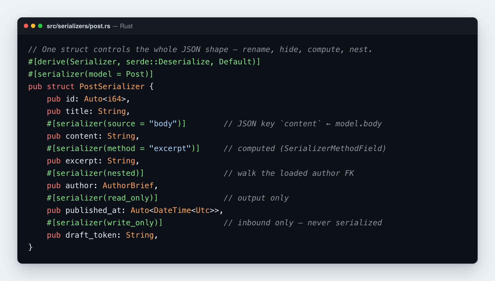

# Serializer

Ein Serializer verwandelt eine Modellinstanz in eine typisierte, JSON-fertige
Form — und auf dem Rückweg wieder zurück. Er ist **Rustango**s Antwort auf einen
`ModelSerializer` des Django REST Framework oder eine Laravel-API-Resource:
Deklariere ein Struct, annotiere seine Felder, und du bekommst kontrollierte
Ausgabe (umbenennen, verbergen, berechnen, verschachteln), Validierung auf Feld-
und Objektebene sowie eine saubere Anbindung an ViewSets.

Eine Sache solltest du dir gleich zu Beginn einprägen, denn sie unterscheidet
sich von DRF: ein Rustango-Serializer **formt Daten, er persistiert sie nicht**.
Es gibt kein `serializer.save()`, das in die Datenbank schreibt — das erledigt
das ORM. Der Serializer bildet ein Modell auf JSON ab (`from_model` →
`to_value`), deklariert, welche Felder schreibbar sind, und validiert. Du
kombinierst ihn mit dem ORM und den ViewSets, statt Schreibvorgänge *durch* ihn
zu leiten.

> **Neu bei einem Begriff hier?** — *serializer*, *model*, *ORM*, *DRF*? Das
> [Glossar](glossary.md) erklärt jeden Begriff in klarer Sprache.

[](../img/serializers.png)

> **Quelle:** `rustango::serializer` (`ModelSerializer`, `#[derive(Serializer)]`,
> die `#[serializer(...)]`-Feldattribute) — hinter dem `serializer`-Feature
> (standardmäßig aktiv).
>
> **Lauffähige Versionen:** der minimale Serializer ist Teil des getesteten
> [`getting_started_blog`](https://github.com/ujeenet/rustango/blob/main/crates/rustango/examples/getting_started_blog/src/post_serializer.rs)-Beispiels,
> und das vollständige Verhalten des Derive wird durch die eigenen Unit-Tests des
> Frameworks abgedeckt — `crates/rustango/tests/serializer_derive.rs` und
> `serializer_cross_validate.rs`. Wenn ein Snippet seltsam aussieht, vergleiche
> es damit.

---

## Inhaltsverzeichnis
- [Schnellstart](#quick-start) · [Der `ModelSerializer`-Trait](#the-modelserializer-trait)
- [Feldattribute](#field-attributes) — die vollständige Referenz
- [Berechnete Felder](#computed-fields) · [Verschachtelte Serializer](#nested-serializers) · [Sammlungen](#collections-many) · [Slug-Felder](#slug-related-fields)
- [Validierung](#validation) · [Unique-together-Validierung](#unique-together-validation)
- [Hyperlink-Ausgabe](#hyperlinked-output) · [Listen serialisieren](#serializing-lists)
- [Einen Serializer mit einem ViewSet verwenden](#using-a-serializer-with-a-viewset) · [Validierung in einem eigenen Handler](#validating-in-a-custom-handler)
- [OpenAPI](#openapi-schemas) · [Scaffolding](#scaffolding) · [Feinheiten & Grenzen](#tweaks-and-current-limits)

---

## Schnellstart

Ein Serializer ist ein einfaches Struct mit `#[derive(Serializer)]` und einem
`#[serializer(model = …)]`, das auf das Modell zeigt, von dem es abbildet. Es
benötigt zwei begleitende Derives: `serde::Deserialize` (damit es auch
eingehendes JSON parsen kann) und `Default` (damit ausgeschlossene/optionale
Felder initialisiert werden können).

```rust
use rustango::Serializer;
use rustango::serializer::ModelSerializer;

#[derive(Serializer, serde::Deserialize, Default)]
#[serializer(model = Post)]
pub struct PostSerializer {
    pub id: Auto<i64>,
    pub title: String,

    #[serializer(source = "body")]      // JSON key `content`, read from model.body
    pub content: String,

    #[serializer(read_only)]            // in output, never accepted on write
    pub published_at: Auto<DateTime<Utc>>,
}
```

Verwende ihn:

```rust
let post = Post::objects().find(42, &pool).await?.expect("post 42");

let one  = PostSerializer::from_model(&post).to_value();   // a JSON object
let many = PostSerializer::many_to_value(&posts);          // a JSON array
```

`from_model` klont die Felder des Modells in das Struct (unter Beachtung der
Attribute weiter unten); `to_value` serialisiert es (überspringt
`write_only`-Felder). Das ist die gesamte Kernschleife.

---

## Der `ModelSerializer`-Trait

`#[derive(Serializer)]` implementiert `ModelSerializer` (plus ein
`serde::Serialize`, das `write_only` respektiert, und eine `OpenApiSchema`-Impl
unter dem `openapi`-Feature). Die Trait-Oberfläche:

| Methode | Signatur | Anmerkungen |
|---|---|---|
| `from_model` | `fn(model: &Self::Model) -> Self` | Bildet ein Modell → Serializer ab. Generiert; nicht überschreibbar. |
| `to_value` | `fn(&self) -> serde_json::Value` | Serialisiert zu JSON (überspringt `write_only`). Überschreibbar. |
| `many` | `fn(&[Self::Model]) -> Vec<Self>` | Batch-`from_model`. Überschreibbar. |
| `many_to_value` | `fn(&[Self::Model]) -> serde_json::Value` | Batch → JSON-Array. Überschreibbar. |
| `writable_fields` | `fn() -> &'static [&'static str]` | Serializer-Feldnamen, die beim Schreiben akzeptiert werden (schließt `read_only`, `skip`, `method`, `nested`, `many`, `slug` aus). |
| `writable_source_fields` | `fn() -> &'static [&'static str]` | Die **Modellspalten** der schreibbaren Felder (`source`-aufgelöst). Der Schreibpfad des ViewSet persistiert nur diese. Generiert. |
| `from_writable_json` | `fn(&Value) -> Result<Self, FormErrors>` | Baut eine Instanz aus einem Request-Body und nutzt dabei nur die schreibbaren Felder (der Rest bekommt Default-Werte); Parse-Fehler pro Feld → `FormErrors`. Generiert. |
| `validate` | `fn(&self) -> Result<(), FormErrors>` | Führt die deklarierten Validatoren pro Feld + feldübergreifend aus. No-op, wenn keine deklariert sind; überschreibbar. |

Es gibt bewusst **kein** `create` / `update` / `save` auf dem Trait —
Schreibvorgänge laufen über das ORM (`model.save(&pool)`). Wenn ein Serializer
in ein [ViewSet](viewsets.md) eingebunden ist, nutzt der Create-/Update-Pfad
`from_writable_json()` + `validate()` + `writable_source_fields()`, um den
Request zu validieren und zu filtern, bevor gespeichert wird.

---

## Feldattribute

Alles wird über `#[serializer(...)]` an jedem Feld gesteuert. Der vollständige
Satz:

| Attribut | `from_model` tut | In JSON-Ausgabe? | Schreibbar? |
|---|---|---|---|
| *(keins)* | bildet vom Modell ab | ja | ja |
| `read_only` | bildet vom Modell ab | ja | **nein** |
| `write_only` | `Default::default()` | **nein** | ja |
| `source = "x"` | bildet von `model.x` ab (benennt um) | ja | ja |
| `skip` | `Default::default()` — setze es selbst | ja | nein |
| `method = "fn"` | ruft `Self::fn(&model)` auf | ja | nein |
| `nested` | folgt einem FK → `Child::from_model(parent)` | ja | nein |
| `nested(strict)` | dasselbe, panickt aber, wenn der FK nicht geladen wurde | ja | nein |
| `many = ChildSer` | initialisiert `Vec::new()`; füllt via `set_<field>(&[Child])` | ja | nein |
| `slug = "name"` | klont `model.<source>.value()?.name` | ja | nein |
| `validate = "fn"` | Validator pro Feld, ausgeführt von `validate(&self)` | n. v. | n. v. |

**Gegenseitig ausschließend** (Compile-Fehler bei Kombination): `read_only` +
`write_only`; `method` + `source`; `slug` + eines von `method` / `nested` /
`many`.

**Deklarative Validatoren.** `max_length = N`, `min_length = N`, `min = N` und
`max = N` fügen einem Feld Schreibzeit-Validierung hinzu, ohne dessen
Ausgabeform zu ändern (und ein Feld ohne diese erbt die Grenzen des Modells).
Siehe [Validierung](#validation).

`write_only` ist für rein eingehende Daten (ein Passwort, ein Einmal-Token):
vorhanden in `writable_fields()`, fehlt in der Ausgabe. `skip` ist das
gegenteilige Schlupfloch — das Feld wird nicht aus dem Modell gelesen und ist
nicht schreibbar, du befüllst es also nach `from_model` von Hand (z. B. eine
Liste von Tag-IDs, die du separat holst).

> **`write_only` transformiert den Wert nicht.** Ein `write_only`-Feld wird beim
> Schreiben akzeptiert und **wortwörtlich** persistiert — der Serializer hasht
> oder verschlüsselt es nie. Bei einem Passwort hashe es selbst (siehe
> [Passwörter](auth-passwords.md)) vor `save()`; `read_only`-Felder werden
> umgekehrt beim Schreiben stillschweigend ignoriert statt abgelehnt.

---

## Berechnete Felder

`method = "fn"` ist DRFs `SerializerMethodField`. Deklariere das Feld und
schreibe dann eine zugehörige Funktion `fn(&Model) -> FieldType`; sie wird
während `from_model` aufgerufen:

```rust
#[derive(Serializer, serde::Deserialize, Default)]
#[serializer(model = Post)]
pub struct PostSerializer {
    pub title: String,
    #[serializer(method = "excerpt")]
    pub excerpt: String,
}

impl PostSerializer {
    fn excerpt(model: &Post) -> String {
        model.body.chars().take(80).collect::<String>() + "…"
    }
}
```

Berechnete Felder sind ausgabeseitig (ausgeschlossen aus `writable_fields()`).

---

## Verschachtelte Serializer

`nested` bettet einen weiteren Serializer ein, indem es einem geladenen
Fremdschlüssel folgt. Der Typ des Feldes ist der Kind-Serializer:

```rust
#[derive(Serializer, serde::Deserialize, Default)]
#[serializer(model = Comment)]
pub struct CommentSerializer {
    pub id: Auto<i64>,
    pub body: String,
    #[serializer(nested)]               // reads the loaded `author` FK
    pub author: AuthorBrief,
}
```

Der FK muss bereits geladen sein (via `select_related` / ein Eager-Fetch). Wenn
er **nicht** geladen wurde, fällt das Feld auf `Default::default()` zurück,
statt zu panicken — die Produktion degradiert bei einem fehlenden Prefetch
elegant. In Tests nutze `#[serializer(nested(strict))]`, um diesen Fallback in
ein Panic zu verwandeln, damit ein weggelassener Prefetch erkannt wird. Zeige mit
`source` auf einen anders benannten FK:

```rust
#[serializer(nested, source = "owner")]
pub author: AuthorBrief,
```

Verschachtelte Felder sind in der Ausgabeform **schreibgeschützt** —
schreibbare verschachtelte Objekte werden noch nicht unterstützt (siehe
[Grenzen](#tweaks-and-current-limits)).

---

## Sammlungen (`many`)

Für 1:n- oder M2M-Kinder deklariert `many = ChildSerializer` ein `Vec<…>`-Feld.
Da der M2M-/Related-Accessor asynchron ist, kann das Makro ihn nicht automatisch
laden; es initialisiert den Vec leer und emittiert einen
`set_<field>(&[ChildModel])`-Helfer, den du nach dem Laden der Kinder aufrufst:

```rust
#[derive(Serializer, serde::Deserialize, Default)]
#[serializer(model = Post)]
pub struct PostWithTags {
    pub id: Auto<i64>,
    pub title: String,
    #[serializer(many = TagBrief)]
    pub tags: Vec<TagBrief>,
}

// usage
let tags = post.tags_m2m().all(&pool).await?;
let mut s = PostWithTags::from_model(&post);
s.set_tags(&tags);                       // generated setter, named set_<field>
let json = s.to_value();
```

---

## Slug-Related-Felder

`slug = "name"` ist DRFs `SlugRelatedField`: statt einer FK-ID oder eines
vollständigen verschachtelten Objekts wird ein einzelnes benanntes Feld
ausgegeben, das aus dem geladenen Elternobjekt gezogen wird.

```rust
#[derive(Serializer, serde::Deserialize, Default)]
#[serializer(model = Post)]
pub struct PostSerializer {
    pub id: Auto<i64>,
    pub title: String,
    #[serializer(slug = "name", source = "author")]   // author.name as a flat field
    pub author_name: String,
}
```

Wie nested liest es von einem geladenen FK und fällt auf den Default zurück, wenn
nicht geladen; es dient nur der Anzeige (nicht schreibbar).

---

## Validierung

Drei Schichten, die alle als `rustango::forms::FormErrors` erscheinen (und bei
einem ViewSet-Schreibvorgang als `400` in DRF-Form). Sie laufen in dieser
Reihenfolge: deklarative Constraints, dann Validatoren pro Feld, dann der
feldübergreifende Hook.

**Deklarative Constraints (DRF `validators`, automatisch geerbt).**
`max_length`, `min_length`, `min` und `max` sind Feldattribute — und wenn du sie
weglässt, **erbt ein Feld die** `max_length` / `min` / `max` / `choices` **des
Modells**. So wird eine `#[rustango(max_length = 200)]`-Spalte längengeprüft ganz
ohne Serializer-Attribut (Verhalten von DRFs `ModelSerializer`). Sie werden bei
jedem schreibbaren Feld geprüft und verwandeln potenzielle
Datenbank-Constraint-`500`s in freundliche `400`s:

```rust
#[serializer(model = Widget)]
struct WidgetSerializer {
    pub code: String,               // inherits the model's max_length
    #[serializer(max_length = 4)]   // overrides the model's bound
    pub note: String,
    pub priority: i64,              // inherits the model's min / max
    pub status: String,             // inherits the model's choices
}
```

Die Meldungen entsprechen Django/DRF: `"Ensure this value has at most N
characters."`, `"Ensure this value has at least N characters."`, `"Ensure this
value is ≥ N."` / `"≤ N"` und `"Select a valid choice."`. (`min_length` gibt es
nur im Serializer; `choices` wird vom Modell geerbt — es gibt kein
`choices`-Attribut.)

**Pro Feld** (benutzerdefiniert) — deklariere `validate = "fn"` und schreibe
`fn(value: &FieldType) -> Result<(), String>`:

```rust
#[derive(Serializer, serde::Deserialize, Default)]
#[serializer(model = Post)]
pub struct PostSerializer {
    #[serializer(validate = "title_min_3")]
    pub title: String,
    pub body: String,
}

impl PostSerializer {
    fn title_min_3(t: &String) -> Result<(), String> {
        if t.chars().count() < 3 { Err("title must be at least 3 chars".into()) } else { Ok(()) }
    }
}
```

Das Derive generiert ein `validate(&self)`, das jeden Validator pro Feld
ausführt und Fehlschläge in einer nach Feldnamen indizierten `FormErrors`
sammelt.

**Feldübergreifend** — deklariere einen Hook auf Struct-Ebene, und die
Validatoren verschmelzen. Füge entweder `#[serializer(validate =
"cross_validate")]` am Struct hinzu (das `Result<(), FormErrors>` zurückgibt),
oder implementiere schlicht selbst `validate(&self)`, wenn es keine Validatoren
pro Feld gibt, die es generieren würden:

```rust
impl PostSerializer {
    pub fn validate(&self) -> Result<(), rustango::forms::FormErrors> {
        let mut errors = rustango::forms::FormErrors::default();
        if self.title.is_empty() {
            errors.add("title", "title cannot be empty");          // field error
        }
        if self.body.starts_with(&self.title) {
            errors.add_non_field("body must not repeat the title"); // object-level error
        }
        if errors.is_empty() { Ok(()) } else { Err(errors) }
    }
}
```

`FormErrors` trennt **Feld**-Fehler (`add(field, msg)`, eine
`HashMap<String, Vec<String>>`) von **Nicht-Feld**-Fehlern
(`add_non_field(msg)`). Untersuche sie mit `.fields()`, `.non_field()`,
`.get(field)`, `.is_empty()` und kombiniere mit `.merge(other)`. Jenseits der
deklarativen Constraints oben (`max_length` / `min_length` / `min` / `max` /
geerbte `choices`) sind benutzerdefinierte Regeln einfache Funktionen — es gibt
keine `email`-/Regex-Magie, was die benutzerdefinierte Validierung explizit und
testbar hält. Außerhalb eines ViewSet rendert das Framework `FormErrors` nicht
automatisch in einen HTTP-Body; bilde es selbst auf deine 400-Antwort ab (die
Trennung von Feld/Nicht-Feld passt zu DRFs Fehler-JSON).

---

## Unique-together-Validierung

Für Djangos `UniqueTogetherValidator` — eine Prüfung vor dem Speichern, dass eine
Kandidatenzeile nicht mit einem Unique-Index über mehrere Spalten kollidiert —
rufe `check_unique_together_pool` vor dem Speichern auf:

```rust
use std::collections::HashMap;
use rustango::core::SqlValue;
use rustango::serializer::check_unique_together_pool;

let mut values: HashMap<&'static str, SqlValue> = HashMap::new();
values.insert("org_id",  SqlValue::I64(self.org_id));
values.insert("user_id", SqlValue::I64(self.user_id));

// None on insert; Some(&pk) on update so the row doesn't clash with itself.
check_unique_together_pool(&pool, Membership::SCHEMA, &values, None).await?;
```

Es durchläuft die deklarierten Unique-Indexe des Modells über mehrere Spalten
und gibt `Err(FormErrors)` mit einem Nicht-Feld-Fehler pro Kollision zurück
(`"The fields a, b must be unique together."`). Einspaltiges `unique` wird der
Konfliktbehandlung des Inserts überlassen; partielle
(`unique_when`)-Indexe werden übersprungen.

---

## Hyperlink-Ausgabe

Für eine Form im Stil eines `HyperlinkedModelSerializer` (Ressourcen-URLs statt
nackter IDs) nachbearbeiten zwei Helfer das JSON:

```rust
use rustango::serializer::{hyperlink_url, hyperlinked_to_value};
use std::collections::HashMap;

let base = PostSerializer::from_model(&post).to_value();

let mut fk_templates = HashMap::new();
fk_templates.insert("author_id", "/api/users/{pk}");

let out = hyperlinked_to_value(base, "/api/posts/{pk}", "id", &fk_templates);
// → { "url": "/api/posts/42", "author_id_url": "/api/users/7", "id": 42, ... }
```

`hyperlink_url(template, &pk)` führt eine einmalige `{pk}`-Ersetzung durch;
`hyperlinked_to_value` fügt ein `url` auf oberster Ebene plus ein `<fk>_url` pro
Template hinzu (Null-FK → Null-URL). Die ursprünglichen `id`/`<fk>_id`-Schlüssel
bleiben erhalten (entferne sie danach, wenn du sie loswerden willst).

---

## Listen serialisieren

`many_to_value(&models)` gibt ein JSON-Array serialisierter Objekte zurück.
ViewSets verpacken eine Seite davon in den Standard-Umschlag:

```json
{ "count": 100, "page": 1, "page_size": 20, "last_page": 5, "results": [ { … }, { … } ] }
```

(Das ist der Standard-Umschlag mit Seitennummern; siehe
[Pagination](viewsets.md#pagination) für die Cursor- und
Limit/Offset-Formen.)

---

## Einen Serializer mit einem ViewSet verwenden

Binde einen Serializer in ein [ViewSet](viewsets.md) ein, und er steuert die
gesamte REST-Ressource — **Ausgabe und Eingabe**, auf jedem Backend
(PostgreSQL, MySQL, SQLite):

```rust
#[derive(ViewSet)]
#[viewset(model = Post, serializer = crate::PostSerializer, ordering = "-published_at")]
pub struct PostViewSet;
// or, on the builder: ViewSet::for_model(Post::SCHEMA).serializer::<PostSerializer>()…
```

- **Ausgabe** — `list` / `retrieve` / `create` / `update`-Antworten rendern
  über `from_model`, sodass `source` / `method` / `read_only` / `write_only`
  das JSON formen.
- **Eingabe** — `create` / `update` führen das `validate()` des Serializers aus
  (ein Fehlschlag ist ein `400` in DRF-Form, `{field: [msgs]}`), und nur
  schreibbare Felder werden geschrieben — `read_only`-/berechnete Felder, die
  ein Client postet, werden ignoriert, `source`-aufgelöst auf die Modellspalte.

Das ViewSet steuert dies über drei `ModelSerializer`-Methoden, die das Derive
generiert: `validate()`, `writable_source_fields()` und `from_writable_json()`.
Siehe den [ViewSets-Leitfaden](viewsets.md#the-serializer-marriage-input--output)
für das vollständige Verhalten und ein durchgearbeitetes Beispiel.

Du kannst einen Serializer auch **eigenständig** verwenden — bilde eine Zeile ab
und gib ihr JSON aus jedem beliebigen Handler aus:

```rust
let post = Post::objects().find(42, &pool).await?.expect("post 42");
let body = PostSerializer::from_model(&post).to_value();   // shaped JSON
```

---

## Validierung in einem eigenen Handler

Außerhalb eines ViewSet leitet der Serializer `serde::Deserialize` ab, sodass du
einen Request-Body in ihn parsen, `.validate()` ausführen und — bei Erfolg — die
Daten auf ein Modell abbilden und `save(&pool)` kannst. `from_writable_json()`
baut eine Instanz nur aus den schreibbaren Schlüsseln (schreibgeschützte /
berechnete Felder bekommen Default-Werte), und `writable_fields()` /
`writable_source_fields()` sagen dir, welche Schlüssel akzeptiert werden — dieselbe
Maschinerie, die das ViewSet intern nutzt.

---

## OpenAPI-Schemata

Mit aktivem `openapi`-Feature emittiert das Derive zusätzlich eine
`OpenApiSchema`-Impl: Feldtypen bilden auf JSON-Schema-Typen ab, `Option<T>` wird
nullable-und-nicht-erforderlich, und `write_only`-Felder werden aus dem
Antwortschema ausgeschlossen. Das speist die generierten API-Docs — kein
separates Schema zu pflegen.

> **Vertiefung:** [OpenAPI](openapi.md) — verwandle dieses Schema (plus die
> CRUD-Pfade deines ViewSet) in eine vollständige OpenAPI-3.1-Spec, die mit
> Swagger UI / Redoc ausgeliefert wird.

---

## Scaffolding

Generiere ein Serializer-Gerüst mit der manage-CLI:

```bash
cargo run -- make:serializer PostSerializer --model Post
```

Es schreibt ein Startmodul, das du ausfüllst:

```rust
//! Auto-scaffolded by `manage make:serializer PostSerializer`.

use rustango::Serializer;

#[derive(Serializer, serde::Deserialize, Default)]
#[serializer(model = Post)]
pub struct PostSerializer {
    pub id: i64,
    // pub title: String,
    // #[serializer(read_only)]
    // pub created_at: chrono::DateTime<chrono::Utc>,
}
```

Registriere dann das Modul (`mod post_serializer;`) neben deinen anderen.

---

## Feinheiten und aktuelle Grenzen

Ein paar scharfe Kanten und Schlupflöcher, die man kennen sollte:

- **Bedingte Felder.** Es gibt keine Feldauswahl zur Laufzeit (Felder sind zur
  Compile-Zeit fixiert). Für „nur einbeziehen, wenn vorhanden“ nutze `Option<T>`
  plus `#[serde(skip_serializing_if = "Option::is_none")]` am Feld — die
  benutzerdefinierte `Serialize`-Impl respektiert serde-Attribute.
- **Benutzerdefinierte Ausgabeform.** Überschreibe `to_value(&self)` an deinem
  Struct für ein vollständig maßgeschneidertes JSON-Objekt, wenn die Attribute
  nicht ausreichen.
- **Schreibbare verschachtelte Objekte** werden nicht unterstützt — `nested` /
  `many` / `slug`-Felder sind ausgabeseitig. Nimm Schreibvorgänge als skalare
  IDs entgegen und löse sie selbst auf.
- **Eingebaute Validatoren sind nur Länge/Bereich/Auswahl** — `max_length` /
  `min_length` / `min` / `max` (und geerbte `choices`) sind deklarativ; andere
  Regeln (`email`, Regex, …) sind Funktionen, die du schreibst (siehe
  [Validierung](#validation)).
- **Ein Validator pro Feld je Feld.** Für mehrere Regeln an einem Feld
  kombiniere sie in der Funktion dieses Feldes, oder füge ein feldübergreifendes
  `validate(&self)` hinzu.
- **Der Serializer persistiert nicht.** Abbilden → validieren → die Daten an das
  ORM übergeben; es gibt kein `serializer.save()`.

---

## Probier es aus

Der minimale Serializer ist Teil des
[`getting_started_blog`](https://github.com/ujeenet/rustango/blob/main/crates/rustango/examples/getting_started_blog/src/post_serializer.rs)-Beispiels
(Schritt 13 des Getting-Started-Leitfadens). Das vollständige Verhalten des
Derive — die Feldattribute, berechnete/verschachtelte/many-Felder und beide
Validierungsschichten — wird durch die eigenen Unit-Tests des Frameworks
abgedeckt (keine Datenbank nötig):

```bash
cd crates/rustango
cargo test --test serializer_derive          # field attrs, method, nested, many, slug, OpenAPI
cargo test --test serializer_cross_validate  # per-field + cross-field validation aggregation
```

---

## Siehe auch

- [ViewSets](viewsets.md) — binde einen Serializer in eine JSON-CRUD-API ein.
- [HTML-Views](html-views.md) — die serverseitig gerenderte Alternative zu einer JSON-API.
- [OpenAPI](openapi.md) — die Felder eines Serializers werden zu einem Component-Schema.
- [ORM-Kochbuch](orm.md) — die Modelle, von denen Serializer abbilden.
