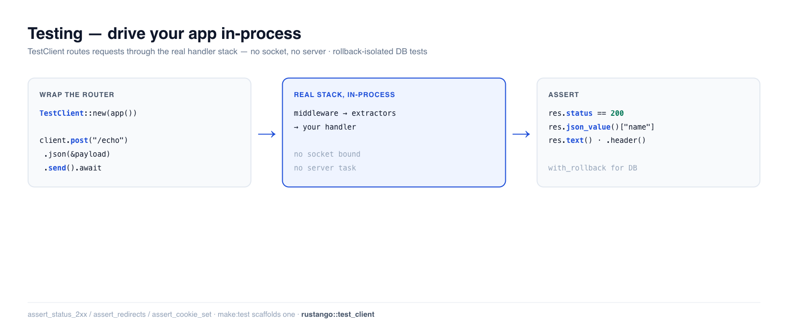

# Testen

Schnelle, zuverlässige Tests müssen deine App so ansteuern, wie es ein Client tut — ohne
einen Server zu booten oder das Netzwerk zu berühren. **Rustango**s `TestClient` führt deinen
Router **in-process** aus: du rufst `client.get("/path")` auf, es routet die Anfrage
durch den echten Stack (Extractors, Middleware, Handler) und gibt dir die
Antwort zum Assertieren zurück. Füge Transaction-Rollback-Isolation für Datenbanktests und
ein Set von Response-Assertions hinzu, und du hast Djangos Test-Client + `TestCase`, in
Rust.

[](../img/testing.png)

> **Neu bei einem Begriff hier?** *router*, *handler*, *fixture*, *rollback* — siehe das
> [Glossar](glossary.md).

> **Quelle:** `rustango::test_client` (`TestClient`, `TestResponse`),
> `rustango::test_assertions` (`assert_status_2xx`, `assert_redirects`,
> `assert_cookie_set`, …) und `rustango::test_db` (`with_rollback`) — immer
> kompiliert.
>
> **Lauffähige Version:** die untenstehenden Snippets *sind* ein bestehender Test —
> [`testing_doc.rs`](https://github.com/ujeenet/rustango/blob/main/crates/rustango/tests/testing_doc.rs)
> (`cargo test -p rustango --test testing_doc`). Nahezu jede andere `*_doc.rs`
> in diesem Repo verwendet `TestClient` auf dieselbe Weise.

## Inhaltsverzeichnis

- [Schritt 1 — Steuere deine App mit TestClient an](#step-1--drive-your-app-with-testclient)
- [Schritt 2 — Assertiere auf die Response](#step-2--assert-on-the-response)
- [JSON, Header und Bodies senden](#sending-json-headers-and-bodies)
- [Eine echte API testen](#testing-a-real-api)
- [Datenbanktests mit Rollback](#database-tests-with-rollback)
- [Response-Assertion-Helper](#response-assertion-helpers)
- [Siehe auch](#see-also)

---

## Schritt 1 — Steuere deine App mit TestClient an

Umschließe einen beliebigen `axum::Router` in einem `TestClient` und sende Anfragen — kein Socket wird gebunden,
kein Server-Task gestartet. Die Anfrage fließt durch deine echte Middleware und
Handler:

```rust
use rustango::test_client::TestClient;

let client = TestClient::new(app());          // app() returns your Router

let res = client.get("/ping").send().await;   // routed in-process
assert_eq!(res.status, 200);
```

`TestClient` hat `get` / `post` / `put` / `patch` / `delete` / `head`, jeweils
einen Builder zurückgebend, den du mit `.send().await` abschließt.

---

## Schritt 2 — Assertiere auf die Response

`TestResponse` macht den Status und Body in jeder Form verfügbar, die du brauchst:

```rust
let res = client.get("/ping").send().await;

res.status;                 // u16 — e.g. 200
res.text();                 // body as a String
res.header("content-type"); // Option<&str>
```

```rust
// JSON, two ways:
let res = client.post("/echo").json(&json!({ "name": "Ada" })).send().await;
assert_eq!(res.json_value()["name"], "Ada");   // untyped

#[derive(serde::Deserialize)]
struct Out { name: String }
let out: Out = res.json();                       // typed
assert_eq!(out.name, "Ada");
```

---

## JSON, Header und Bodies senden

Der Request-Builder verkettet alles vor `.send()`:

```rust
let res = client
    .post("/api/posts")
    .header("authorization", "Bearer <token>")   // auth, content negotiation, …
    .json(&json!({ "title": "Hello", "body": "..." }))
    .send()
    .await;
assert_eq!(res.status, 201);
```

Nutze `.body(...)` für rohe (Nicht-JSON-)Bodies, und eine fehlende Route gibt ein echtes
`404` zurück — verifiziert im zugrunde liegenden Test.

---

## Eine echte API testen

`app()` in deinen Tests ist einfach dein Router. Für eine DB-gestützte API baue ihn genau
so, wie es `main.rs` tut, aber mit einem Test-Pool — das Muster, das die meisten `*_doc.rs`-Tests verwenden:

```rust
async fn app() -> axum::Router {
    let pool = test_pool().await;                 // a sqlite::memory: or test DB pool
    PostViewSet::router("/api/posts", pool)
}

#[tokio::test]
async fn create_then_list() {
    let client = TestClient::new(app().await);
    let created = client.post("/api/posts")
        .json(&json!({ "title": "Hi", "body": "b" }))
        .send().await;
    assert_eq!(created.status, 201);

    let list = client.get("/api/posts").send().await;
    assert!(list.json_value()["results"].is_array());
}
```

Dies ist der [ViewSets](viewsets.md)-Test aus jenem Leitfaden — derselbe `TestClient`.

---

## Datenbanktests mit Rollback

Tests, die in eine Datenbank schreiben, dürfen keinen Zustand ineinander lecken lassen.
`test_db::with_rollback` führt deinen Test innerhalb einer Transaktion aus und **rollt sie zurück**
am Ende, sodass jeder Test vom selben sauberen Zustand startet und nichts persistiert wird:

```rust
use rustango::test_db::with_rollback;

#[tokio::test]
async fn creating_a_post_persists_it() {
    with_rollback(&pool, |tx| async move {
        // ... insert + assert against `tx` ...
        // everything here is rolled back when the closure returns
    }).await;
}
```

Für SQLite verwenden die `*_sqlite_live.rs`-Tests überall in diesem Repo stattdessen eine In-Memory-
Datenbank pro Test — ebenfalls vollständig isoliert, mit null externem Setup.

---

## Response-Assertion-Helper

Für rohe `axum::Response`-Werte (z. B. aus `tower::oneshot`) liest sich `test_assertions`
wie Djangos `assertContains` / `assertRedirects`:

```rust
use rustango::test_assertions::{assert_status_2xx, assert_redirects, assert_cookie_set};

assert_status_2xx(&res);
assert_redirects(&res, "/login?next=/dashboard");
assert_cookie_set(&res, "rustango_session", None);
```

Ebenfalls verfügbar: `assert_status` / `assert_status_in` / `assert_status_4xx` /
`assert_status_5xx`, `assert_header`, `assert_content_type`,
`assert_redirect_chain`, `assert_cookie_not_set` und `assert_messages`.

---

## Siehe auch

- [ViewSets](viewsets.md) · [HTML-Views](html-views.md) — worauf du den
  `TestClient` richtest.
- [Middleware](middleware.md) — `TestClient` übt auch die Layer aus (DB-frei,
  via `tower::oneshot` in `middleware.rs`).
- [Erste Schritte](getting-started.md) — Schritt 16 schreibt den ersten Test.
- [`manage` CLI](manage.md) — `make:test` scaffoldet ein Test-Modul.
