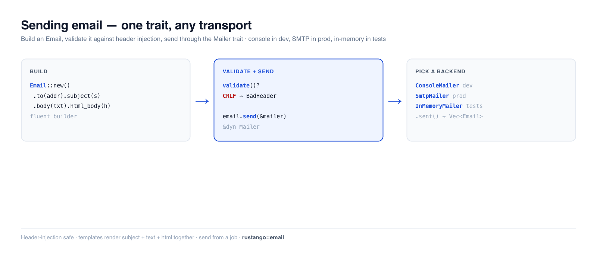

# Sending email

Welcome messages, password resets, receipts, alerts — most apps send
transactional email. **Rustango** gives you a `Mailer` trait with swappable
backends (console for dev, SMTP for production, an in-memory recorder for tests),
a fluent `Email` builder with header-injection protection, and template
rendering. Write `mailer.send(&email)` once; switch from printing to your
terminal to real SMTP with a one-line change — like Django's email framework.

[](img/email.png)

> **New to a term here?** *transactional email*, *SMTP*, *mailer backend* — see
> the [glossary](glossary.md).

> **Source:** `rustango::email` (`Mailer`, `Email`, `ConsoleMailer`,
> `InMemoryMailer`, `NullMailer`, `SmtpMailer`, `BoxedMailer`, `send_mail`,
> `MailError`) — behind the `email` feature (on by default). SMTP needs the
> `email-smtp` feature.
>
> **Runnable version:** every snippet is copied from
> [`email_doc.rs`](https://github.com/ujeenet/rustango/blob/main/crates/rustango/tests/email_doc.rs)
> (`cargo test -p rustango --test email_doc`); the send helpers and attachments
> are dogfooded by `email_send_helpers.rs` and `email_attachments.rs`.

## Table of contents

- [Step 1 — Build an email](#step-1--build-an-email)
- [Step 2 — Pick a mailer](#step-2--pick-a-mailer)
- [Step 3 — Send it](#step-3--send-it)
- [Validation and header-injection safety](#validation-and-header-injection-safety)
- [Testing email](#testing-email)
- [Templates](#templates)
- [Send it off the request](#send-it-off-the-request)
- [Reference](#reference)
- [See also](#see-also)

---

## Step 1 — Build an email

`Email` is a fluent builder. Set recipients, subject, and a text and/or HTML
body:

```rust
use rustango::email::Email;

let email = Email::new()
    .to("ada@example.com")
    .from("noreply@example.com")
    .subject("Welcome")
    .body("Thanks for signing up.")              // plain-text part
    .html_body("<p>Thanks for signing up.</p>"); // optional HTML part
```

`.cc(...)`, `.reply_to(...)`, and attachments are available too.

---

## Step 2 — Pick a mailer

Every backend implements `Mailer`, so your code never names the concrete type —
hold a **`BoxedMailer`** (`Arc<dyn Mailer>`):

| Backend | Feature | Use for |
|---|---|---|
| `ConsoleMailer` | `email` | dev — prints the message to stdout |
| `SmtpMailer` | `email-smtp` | production — real delivery over SMTP |
| `InMemoryMailer` | `email` | tests — records messages, sends nothing |
| `FileMailer` | `email` | dev/CI — writes each message to a file |
| `NullMailer` | `email` | disable email entirely |

Build it from config so it differs per environment (`ConsoleMailer` locally,
`SmtpMailer` in prod) via `email::from_settings(&settings.email)`.

---

## Step 3 — Send it

`Email::send` takes any `&dyn Mailer`:

```rust
email.send(&mailer).await?;
```

For a quick one-off, `send_mail` skips the builder:

```rust
use rustango::email::send_mail;

send_mail(
    &mailer,
    "Your report is ready",                  // subject
    "Download it from your dashboard.",      // body
    Some("noreply@example.com"),             // from (or None for the default)
    &["ops@example.com", "qa@example.com"],  // recipients
).await?;
```

`send_many` sends a batch in one call.

---

## Validation and header-injection safety

`Email::validate()` runs before sending (and you can call it yourself). It
rejects incomplete messages **and** defends against header injection — a newline
smuggled into a header is how attackers add a hidden `Bcc`:

```rust
// Missing recipients or an empty subject → MailError::InvalidMessage
Email::new().subject("hi").validate()?;          // Err: no recipients

// A CRLF in any header field → MailError::BadHeader (Django's BadHeaderError)
Email::new()
    .to("a@example.com")
    .subject("Hello\r\nBcc: victim@example.com")  // injection attempt
    .body("x")
    .validate()?;                                  // Err: BadHeader
```

Both are verified in the backing test.

---

## Testing email

Use `InMemoryMailer` — it records every message instead of sending, so tests
assert on what *would* have gone out, with no network:

```rust
use rustango::email::InMemoryMailer;

let mailer = InMemoryMailer::new();
welcome_flow(&mailer).await?;          // your code under test

let sent = mailer.sent();              // Vec<Email>
assert_eq!(sent.len(), 1);
assert_eq!(sent[0].to, vec!["ada@example.com".to_string()]);
assert_eq!(sent[0].subject, "Welcome");
```

---

## Templates

For anything beyond a line of text, render the body from a [Tera](html-views.md)
template instead of inlining HTML. The `email_templates` feature's `EmailRenderer`
follows a `name.subject.txt` / `name.txt` / `name.html` convention — one template
set produces the subject, the plain-text part, and the HTML part together, so the
three never drift. The `Mailable` trait packages "a thing that knows how to turn
itself into an `Email`" for reusable messages.

---

## Send it off the request

Sending email inline makes the user wait on your SMTP server and couples the
response to its availability. Send it from a [background job](jobs.md) instead —
the handler returns immediately and a worker delivers it (with retries if SMTP is
down):

```rust
// in the handler: enqueue, don't send inline
queue.dispatch(&SendWelcomeEmail { user_id }).await?;

// the job (see the Background jobs guide):
async fn run(&self) -> Result<(), JobError> {
    let email = Email::new().to(/* ... */).subject("Welcome").body("...");
    email.send(&*mailer).await.map_err(|e| JobError::Retryable(e.to_string()))?;
    Ok(())
}
```

The `email_jobs` feature wires this up for you.

---

## Reference

**`Email` builder:** `to` · `cc` · `from` · `reply_to` · `subject` · `body` ·
`html_body` · attachments · `validate()` · `send(&mailer)`.

**Helpers:** `send_mail(mailer, subject, body, from, &recipients)` ·
`send_many(mailer, &emails)` · `from_settings(&EmailSettings)`.

**`MailError`:** `InvalidMessage` (incomplete) · `BadHeader` (CRLF injection) ·
`Transport` (backend/delivery failure).

---

## See also

- [Background jobs](jobs.md) — deliver email off the request with retries.
- [Account flows](auth-flows.md) — password-reset / verification / magic-link
  emails built on this.
- [HTML views](html-views.md) — the Tera engine email templates also use.
- [Caching](caching.md) — the same swap-the-backend trait pattern.
