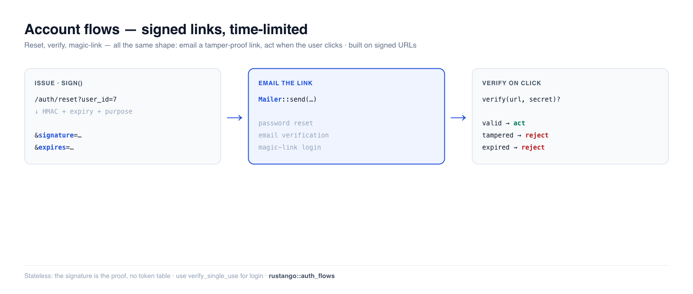

# Flujos de cuenta (restablecimiento, verificación, enlace mágico)

Los flujos que toda aplicación necesita en los márgenes del inicio de sesión: **restablecimiento
de contraseña**, **verificación de correo electrónico** e **inicio de sesión por enlace mágico (sin
contraseña)**. Los tres tienen la misma forma — enviar por correo al usuario un enlace a prueba de
manipulaciones y con tiempo limitado, y luego actuar cuando hace clic en él — y **Rustango** los
construye sobre un mismo sustrato: las **URL firmadas**. Una URL firmada es una URL normal con una
firma HMAC añadida, de modo que el servidor puede confiar en sus parámetros sin almacenar nada.

[](../img/auth-flows.png)

> **¿Algún término aquí es nuevo para ti?** *HMAC*, *token*, *caducidad* — consulta el [glosario](glossary.md).

> **Fuente:** `rustango::signed_url` (`sign`, `verify`, `SignedUrlError`) y
> `rustango::auth_flows` (`PasswordReset`, `EmailVerification`, `MagicLink`,
> `confirm_password_reset_pool_into`) — tras las funcionalidades `signed_url` / `auth_flows`
> (activadas por defecto; la confirmación de restablecimiento también necesita `passwords` + un backend de BD).
>
> **Versión ejecutable:** cada fragmento está copiado de
> [`auth_flows_doc.rs`](https://github.com/ujeenet/rustango/blob/main/crates/rustango/tests/auth_flows_doc.rs)
> (`cargo test -p rustango --features sqlite --test auth_flows_doc`).

## Tabla de contenidos

- [URL firmadas: el sustrato](#signed-urls-the-substrate)
- [Restablecimiento de contraseña](#password-reset)
- [Verificación de correo electrónico](#email-verification)
- [Inicio de sesión por enlace mágico](#magic-link-login)
- [Tokens de un solo uso](#single-use-tokens)
- [Lo que aportas tú](#what-you-provide)
- [Véase también](#see-also)

---

## URL firmadas: el sustrato

`sign` añade una firma HMAC-SHA256 (y una caducidad opcional) sobre la ruta + la query de la URL.
`verify` la vuelve a calcular: manipula cualquier parámetro, usa el secreto equivocado o deja que
caduque, y falla.

```rust
use rustango::signed_url::{sign, verify, SignedUrlError};

let url = "https://app.example.com/files/42?user_id=7";
let signed = sign(url, secret, None);     // None = never expires
assert!(verify(&signed, secret).is_ok());

// Flip any signed byte → InvalidSignature.
let tampered = signed.replace("user_id=7", "user_id=8");
assert_eq!(verify(&tampered, secret), Err(SignedUrlError::InvalidSignature));
```

Añade un TTL y un enlace caducado se rechaza (`sign_at` / `verify_at` toman segundos unix
explícitos para pruebas deterministas):

```rust
use rustango::signed_url::{sign_at, verify_at, SignedUrlError};

let signed = sign_at(url, secret, Some(100));         // expires at t=100
assert!(verify_at(&signed, secret, 50).is_ok());      // before → ok
assert_eq!(verify_at(&signed, secret, 1000), Err(SignedUrlError::Expired));
```

La query se ordena antes de firmar, así que el orden de los parámetros no importa. Los errores son
`MissingSignature`, `MalformedSignature`, `InvalidSignature`, `Expired`.

---

## Restablecimiento de contraseña

Los asistentes de `auth_flows` envuelven las URL firmadas con una **etiqueta de propósito** (para
que un token de restablecimiento no pueda reproducirse como un enlace mágico) y codifican el
identificador del usuario. `PasswordReset` también incluye un asistente de confirmación que
verifica el token y **rota el hash almacenado** en una sola llamada.

```rust
use std::time::Duration;
use rustango::auth_flows::{PasswordReset, confirm_password_reset_pool_into};

// 1. User asks to reset → look them up → issue a link → email it.
let url = PasswordReset::issue(
    "https://app.example.com/auth/reset",   // your callback route
    user_id,                                // encoded in the token
    secret,
    Duration::from_secs(3600),              // 1-hour TTL
);
mailer.send(&Email::new().to(addr).subject("Reset your password").body(&url)).await?;

// 2. User clicks + submits a new password → verify + rotate the hash.
let user_id = confirm_password_reset_pool_into(
    &pool, &url, "a-brand-new-strong-password", secret,
    "rustango_users", "id", "password_hash",  // table, pk col, password col
).await?;
```

El asistente de confirmación exige una longitud mínima, aplica argon2id al nuevo password y lo
escribe — rechazando entradas débiles, caducadas, manipuladas o con el secreto equivocado sin tocar
la fila:

```rust
// valid token + strong pw → hash rotated (starts "$argon2…")
// "short"                  → Err(WeakPassword), nothing written
// user_id tampered         → Err(InvalidSignature), nothing written
```

> `confirm_password_reset_pool` es la forma cómoda que asume los valores por defecto
> `rustango_users` / `id` / `password_hash`; usa `_into` para apuntar a tu propia
> tabla/columnas.

---

## Verificación de correo electrónico

`EmailVerification` codifica tanto el identificador del usuario **como** el correo electrónico, de
modo que al verificar recuperas ambos y puedes confirmar que la dirección sigue coincidiendo
(atrapando enlaces enviados antes de un cambio de correo). Aquí no hay ninguna escritura en BD
integrada — tú defines tu propia columna «verificado»:

```rust
use rustango::auth_flows::EmailVerification;

// On signup:
let url = EmailVerification::issue(callback, user_id, &email, secret, Duration::from_secs(86_400));
mailer.send(&Email::new().to(&email).subject("Confirm your email").body(&url)).await?;

// On click:
let (user_id, email) = EmailVerification::verify(&url, secret)?;
// → if email still matches the user's current address, mark them verified
```

---

## Inicio de sesión por enlace mágico

`MagicLink` codifica solo el correo electrónico — el usuario hace clic, tú buscas la cuenta y
acuñas una [sesión](auth-sessions.md). Mantén el TTL corto (10–30 min) y hazlo **de un solo uso**
(siguiente sección), ya que el enlace *es* la credencial:

```rust
use rustango::auth_flows::MagicLink;

let url = MagicLink::issue(callback, &email, secret, Duration::from_secs(900));
mailer.send(&Email::new().to(&email).subject("Your sign-in link").body(&url)).await?;

// On click:
let email = MagicLink::verify_single_use(&url, secret, &cache).await?;
// → look up the user by email, create a session
```

---

## Tokens de un solo uso

`verify` por sí solo únicamente comprueba firma + caducidad, así que un enlace filtrado es
reproducible hasta que caduca. Para el inicio de sesión y el restablecimiento, prefiere
`verify_single_use(url, secret, &cache)` — registra la firma del token en un `Cache` y rechaza un
segundo uso:

```rust
// first click  → Ok(email)
// same link reused → Err(AuthFlowError::AlreadyUsed)
```

Respáldalo con un caché **compartido** (Redis) en producción para que un token no pueda
reproducirse contra una réplica distinta. La comprobación falla en modo cerrado (un error de caché
rechaza en lugar de arriesgar una reproducción).

---

## Lo que aportas tú

El framework emite/verifica los tokens y (para el restablecimiento) escribe el hash; tu aplicación
aporta el resto:

- Un **secreto** (una clave de aplicación estable; 32 bytes por convención).
- Un **mailer** para enviar los enlaces — `rustango::email` incluye `ConsoleMailer`,
  `SmtpMailer` e `InMemoryMailer` (útil en pruebas).
- Una **tabla de usuarios** con las columnas que cada flujo necesita (correo para la búsqueda de
  verificación/enlace mágico; una columna de hash de contraseña para el restablecimiento; una
  columna «verificado» que es tuya).
- Las **rutas de callback** que reciben el clic y la acuñación de sesión para el inicio de sesión
  por enlace mágico.

---

## Véase también

- [Contraseñas](auth-passwords.md) — el hashing que rota el restablecimiento.
- [Sesiones](auth-sessions.md) — lo que el inicio de sesión por enlace mágico crea al tener éxito.
- [Firma de peticiones HMAC](auth-hmac.md) — la misma primitiva HMAC, aplicada a peticiones de API
  en lugar de a URL.
- [Guía de seguridad](security.md) — la lista de endurecimiento más amplia.
