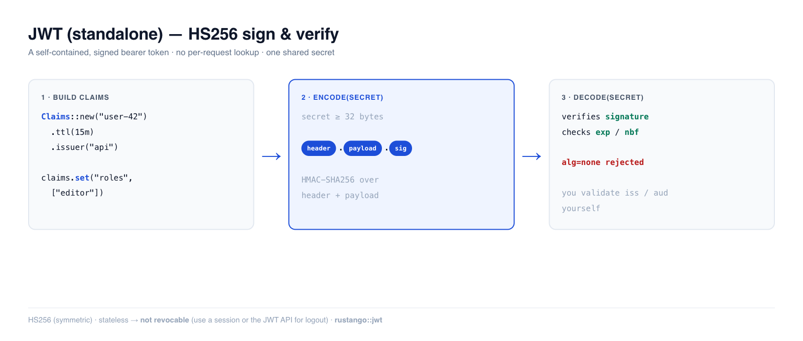

# JWT (independiente)

Un JSON Web Token es una credencial **sin estado**: una cadena firmada y
autónoma que el cliente envía en cada petición, y que tu servidor verifica con
un secreto — sin consultas a base de datos ni a caché por petición. El módulo
`rustango::jwt` de **Rustango** es el bloque mínimo: `encode` para firmar
claims, `decode` para verificarlos y volver a leerlos, HS256 por debajo.

[](../img/auth-jwt.png)

> **Fuente:** `rustango::jwt` (`Claims`, `encode`, `decode`, `decode_at`,
> `decode_unverified`, `JwtError`) — tras la característica `jwt` (activada por
> defecto). Para una **API** access+refresh lista para usar con revocación, consulta
> [API de autenticación JWT](auth-jwt-api.md).
>
> **Versión ejecutable:** los fragmentos están copiados del test
> [`auth_demo`](https://github.com/ujeenet/rustango/blob/main/crates/rustango/examples/auth_demo/tests/auth_jwt.rs) —
> `cargo test -p auth_demo --test auth_jwt`.

> **¿Algún término te resulta nuevo?** *JWT*, *claims*, *sin estado*, *secreto* — consulta el
> [glosario](glossary.md).

> Complemento en profundidad de la sección «Emitir y renovar JWT» de la
> [Guía de seguridad](security.md).

---

## Tabla de contenidos
- [Inicio rápido](#quick-start) · [Cuándo usarlo](#when-to-use-standalone-jwt)
- [Construir claims](#building-claims) · [Verificar](#verifying-a-token)
- [Modelo de seguridad](#security-model) — léelo · [Inspeccionar sin confiar](#inspecting-without-verifying)
- [Notas y límites](#notes-and-limits)

---

## Inicio rápido

```rust
use rustango::jwt::{Claims, encode, decode};
use std::time::Duration;

// HS256 es simétrico — el mismo secreto firma y verifica. Debe tener >= 32 bytes.
let secret = b"a-shared-signing-secret-at-least-32-bytes!!";

let mut claims = Claims::new("user-42").ttl(Duration::from_secs(900));
claims.set("roles", vec!["editor", "author"]);

let token = encode(&claims, secret)?;        // header.payload.signature

let verified = decode(&token, secret)?;       // comprueba la firma + exp/nbf
assert_eq!(verified.subject(), Some("user-42"));
let roles: Vec<String> = verified.get("roles").unwrap();
```

---

## Cuándo usar un JWT independiente

Recurre a `rustango::jwt` cuando quieras un simple token firmado y vayas a
gestionar el ciclo de vida tú mismo:

- **Enlaces mágicos / tokens de un solo uso** — unos pocos claims (id de
  usuario, propósito, `exp` corto).
  Consulta [Enlaces mágicos y flujos de autenticación](auth-flows.md).
- **Tokens bearer de servicio a servicio** (el hermano JWT de la [firma de
  peticiones HMAC](auth-hmac.md) — HMAC para peticiones canónicas al estilo AWS,
  JWT para un bearer sin estado).
- **Tokens SSO** que entregas a un tercero.

Si quieres una API llave en mano **login → access + refresh → refresh →
logout** con revocación de tokens, no la construyas sobre esto — usa la
[API de autenticación JWT](auth-jwt-api.md), que envuelve este módulo con
rotación + un almacén de revocación. Y si necesitas cerrar la sesión de un
usuario a la fuerza *ahora mismo*, prefiere una [Sesión](auth-sessions.md)
revocable: un JWT simple es válido hasta que expire.

---

## Construir claims

`Claims` envuelve un objeto JSON, de modo que los claims estándar y tus propios
campos de extensión coexisten:

```rust
let mut claims = Claims::new("user-42")     // establece `sub` + `iat=now`
    .ttl(Duration::from_secs(3600))         // establece `iat`=now y `exp`=now+ttl
    .issuer("api.example.com")              // `iss`
    .audience("web-client")                 // `aud`
    .jti("unique-token-id");                // `jti` (para tu propia lista de bloqueo)
claims.set("role", "admin");                // cualquier valor Serialize
claims.set("org_id", 7_i64);
```

| Builder / setter | Claim |
|---|---|
| `Claims::new(sub)` | `sub` + `iat` |
| `Claims::empty()` | ninguno (control total) |
| `.ttl(Duration)` | `iat` (now) + `exp` (now+ttl) |
| `.expires_at(secs)` / `.not_before(secs)` | `exp` / `nbf` absolutos |
| `.issuer(s)` / `.audience(s)` / `.jti(s)` | `iss` / `aud` / `jti` |
| `.set(name, value)` | cualquier claim personalizado |

Léelos de vuelta con `.subject()` y `.get::<T>(name)` (devuelve `None` para un
claim ausente o con tipo incorrecto).

---

## Verificar un token

```rust
use rustango::jwt::{decode, JwtError};

match decode(&token, secret) {
    Ok(claims) => { /* confiar en claims.subject() etc. */ }
    Err(JwtError::Expired(_))      => { /* 401 — token caducado */ }
    Err(JwtError::BadSignature)    => { /* 401 — falsificado o clave incorrecta */ }
    Err(JwtError::NotYetValid(_))  => { /* nbf en el futuro */ }
    Err(_)                         => { /* malformado / alg no soportado */ }
}
```

`decode` verifica la **firma**, luego `exp` y `nbf`. Para probar el
comportamiento de la ventana temporal (o añadir tolerancia de desfase),
`decode_at(token, secret, now)` te permite fijar el segundo «actual»:

```rust
let token = encode(&Claims::new("x").expires_at(1000), secret)?;
assert!(decode_at(&token, secret, 500).is_ok());                     // antes de exp
assert!(matches!(decode_at(&token, secret, 2000), Err(JwtError::Expired(_)))); // después
```

---

## Modelo de seguridad

Esto es código de frontera de autenticación — tres cosas que debes saber
obligatoriamente:

1. **`decode` NO valida `iss` / `aud`.** Una firma válida prueba que el token se
   acuñó con tu secreto, no que se acuñó *para tu servicio*. Si estableces
   `iss`/`aud` en el momento de la emisión, **compruébalos tú mismo** sobre los
   claims decodificados:

   ```rust
   let c = decode(&token, secret)?;
   if c.get::<String>("aud").as_deref() != Some("web-client") {
       return Err("wrong audience");
   }
   ```

2. **El secreto debe tener ≥ 32 bytes** — `encode` se niega a firmar con una
   clave más corta (una clave corta es adivinable, y una clave HMAC adivinable
   significa tokens falsificables). HS256 es simétrico: cualquiera que tenga el
   secreto de verificación también puede *acuñar* tokens, así que permanece
   dentro de tu frontera de confianza (servicio único / backend compartido). La
   emisión de tokens entre organizaciones requiere RS256/ES256 asimétrico, que
   este módulo deliberadamente no incluye.

3. **`alg=none` y la manipulación se rechazan.** `decode` fija HS256 (la
   falsificación clásica «alg: none» se rechaza), y cualquier cambio en la
   cabecera o el payload rompe la firma — verificada por una comparación de
   tiempo constante.

No hay **ninguna holgura para el desfase de reloj**: `exp`/`nbf` se comparan con
el segundo actual exacto. Si los relojes del emisor y del verificador se
desvían, resta unos segundos mediante `decode_at`.

---

## Inspeccionar sin verificar

`decode_unverified` lee el payload **sin** comprobar la firma ni la expiración —
útil solo para echar un vistazo a un claim (p. ej. un id de clave) para poder
elegir el secreto correcto, y luego llamar a `decode` de verdad.

```rust
let peek = rustango::jwt::decode_unverified(&token)?;   // NO fiable
let kid = peek.get::<String>("kid");
// ... busca el secreto para `kid`, luego verifica correctamente:
let claims = decode(&token, &resolved_secret)?;
```

**Nunca autorices sobre la salida de `decode_unverified`** — no lleva ninguna
garantía de integridad.

---

## Notas y límites

- **Solo HS256** — simétrico, un único secreto compartido. Sin RS256/ES256
  (mantiene pequeño el árbol de dependencias siempre activo; la mayoría de las
  aplicaciones de un solo servicio usan HS256 de todos modos).
- **Sin estado = no revocable.** Un JWT simple es válido hasta `exp`. Si
  necesitas «cerrar sesión ahora» / revocación por token, usa la
  [API de autenticación JWT](auth-jwt-api.md) (lista de bloqueo JTI) o una
  [Sesión](auth-sessions.md) (elimina la entrada del servidor).
- **Mantén `exp` corto** para los access tokens (minutos). Los JWT simples de
  larga duración son un riesgo precisamente porque no se pueden revocar.
- Combina la emisión con [Contraseñas](auth-passwords.md) (verificar, luego
  emitir) y protege las rutas de la API mediante el `JwtBackend` de la [cadena de
  backends de autenticación](auth-backends.md).


---

## Véase también

- [API de autenticación JWT](auth-jwt-api.md)
- [Backends de autenticación](auth-backends.md)
- [Claves de API](auth-api-keys.md)
- [Sesiones](auth-sessions.md)
