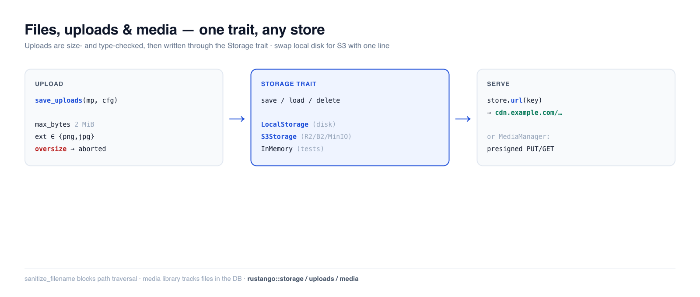

# Files, uploads & media

Almost every app stores user files — avatars, attachments, exported reports,
images. **Rustango** gives you a `Storage` trait with swappable backends (local
disk, S3-compatible object storage, in-memory for tests), a safe multipart
**upload** helper with size/type guards, and — when you need a tracked media
library — a database-backed `MediaManager` with presigned URLs. Write your code
once against the trait; switch from local disk to S3 with a one-line change.

[](img/files.png)

> **New to a term here?** *storage backend*, *multipart*, *object storage*,
> *presigned URL* — see the [glossary](glossary.md).

> **Source:** `rustango::storage` (`Storage`, `LocalStorage`, `InMemoryStorage`,
> `s3::S3Storage`, `BoxedStorage`), `rustango::uploads` (`save_uploads`,
> `UploadConfig`, `sanitize_filename`), and `rustango::media`
> (`Media`, `MediaManager`) — behind the `storage` / `uploads` / `storage-s3` /
> `media` features (all on by default).
>
> **Runnable version:** the Storage + upload-guard snippets are copied from
> [`files_doc.rs`](../crates/rustango/tests/files_doc.rs)
> (`cargo test -p rustango --test files_doc`); the end-to-end multipart
> `save_uploads` flow is dogfooded by the in-file tests in
> `crates/rustango/src/uploads.rs`, and the media library by
> [`media_sqlite_live.rs`](../crates/rustango/tests/media_sqlite_live.rs).

## Table of contents

- [Step 1 — Pick a storage backend](#step-1--pick-a-storage-backend)
- [Step 2 — Save, load, and serve files](#step-2--save-load-and-serve-files)
- [Step 3 — Accept an upload](#step-3--accept-an-upload)
- [Safe filenames](#safe-filenames)
- [Production: S3-compatible storage](#production-s3-compatible-storage)
- [The media library](#the-media-library)
- [Reference](#reference)
- [See also](#see-also)

---

## Step 1 — Pick a storage backend

Every backend implements the same `Storage` trait, so your code never names the
concrete type — it holds a **`BoxedStorage`** (`Arc<dyn Storage>`):

```rust
use rustango::storage::{BoxedStorage, LocalStorage};
use std::path::PathBuf;
use std::sync::Arc;

let storage: BoxedStorage = Arc::new(LocalStorage::new(PathBuf::from("./uploads")));
```

| Backend | Feature | Use for |
|---|---|---|
| `LocalStorage` | `storage` | single-server deployments — files on local disk |
| `S3Storage` | `storage-s3` | production — S3 / R2 / B2 / MinIO object storage |
| `InMemoryStorage` | `storage` | tests — a `HashMap`, never touches disk |

---

## Step 2 — Save, load, and serve files

The trait is four async methods, keyed by a string path. `save` writes bytes,
`load` reads them back, plus `exists` / `delete`:

```rust
use rustango::storage::{Storage, InMemoryStorage};

let store = InMemoryStorage::new();
store.save("avatars/7.png", &png_bytes).await?;
assert!(store.exists("avatars/7.png").await?);
let bytes = store.load("avatars/7.png").await?;
store.delete("avatars/7.png").await?;
```

**Serving the file.** Attach a base URL (your CDN or static host) and `url(key)`
builds the public address you store on the model and hand to the browser:

```rust
let store = LocalStorage::new("./uploads".into())
    .with_base_url("https://cdn.example.com/uploads");

store.url("docs/report.pdf");   // Some("https://cdn.example.com/uploads/docs/report.pdf")
```

Without a base URL, `url()` returns `None` — you'd stream the bytes through a
handler instead. `LocalStorage` also guards against path traversal in keys.

---

## Step 3 — Accept an upload

`save_uploads` consumes an axum `Multipart` body, validates each file against an
`UploadConfig`, and writes the survivors to your `Storage` — streaming, so an
oversize file is rejected mid-transfer instead of buffering into memory first.

```rust
use rustango::uploads::{save_uploads, UploadConfig};
use axum::extract::Multipart;

async fn upload(mp: Multipart) -> Result<impl IntoResponse, UploadError> {
    let cfg = UploadConfig::new("avatars/")          // key prefix
        .max_bytes(2 * 1024 * 1024)                  // reject files over 2 MiB
        .allowed_extensions(&["png", "jpg", "jpeg", "webp"])
        .randomize_filename(true);                   // avoid collisions

    let saved = save_uploads(mp, &cfg, &storage).await?;   // Vec<SavedUpload>
    Ok(Json(saved))
}
```

The guards are enforced (and verified): `allowed_extensions` is **case-insensitive**
(`"PNG"` and `"png"` are the same), and `max_bytes` aborts the stream as soon as
the size is exceeded. The in-file `uploads` tests drive real multipart bodies and
assert files land in storage, oversize files are rejected, and disallowed
extensions are refused.

```rust
let cfg = UploadConfig::new("avatars/").allowed_extensions(&["PNG", "Jpg"]);
assert!(cfg.allowed_extensions.contains("png"));   // normalized to lowercase
assert!(cfg.allowed_extensions.contains("jpg"));
```

---

## Safe filenames

Never trust a client-supplied filename. `sanitize_filename` reduces it to a safe
basename — stripping directory components (path traversal) and replacing unsafe
characters:

```rust
use rustango::uploads::sanitize_filename;

sanitize_filename("../../etc/passwd");   // "passwd"   — no traversal
sanitize_filename("my photo!.png");      // "my_photo_.png"
sanitize_filename("");                    // "upload"   — never empty
```

`save_uploads` applies this for you; call it directly only if you build keys by
hand.

---

## Production: S3-compatible storage

For multi-server deployments, swap `LocalStorage` for `S3Storage` (behind the
`storage-s3` feature). It speaks the S3 API with a hand-rolled SigV4 signer, so
it works with **AWS S3, Cloudflare R2, Backblaze B2, and MinIO**. The trait is
identical — only the constructor changes:

```rust
use rustango::storage::s3::S3Storage;   // needs the `storage-s3` feature

let storage: BoxedStorage = Arc::new(
    S3Storage::new(/* bucket, region, endpoint, credentials */)
);
// save / load / delete / url — exactly the same calls as LocalStorage
```

Your handlers and models don't change; only the wiring at startup does.

---

## The media library

When files are first-class records — tracked in the database, browsable in the
admin, with thumbnails and CDN/presigned delivery — reach for `rustango::media`
instead of raw `Storage`. `MediaManager` persists a `Media` row per file and
supports two upload flows:

- **Server-side:** `manager.save_bytes(...)` stores the bytes and the row in one
  call.
- **Direct-to-storage:** `manager.begin_upload(...)` returns a **presigned PUT**
  URL the browser uploads to directly (your server never proxies the bytes),
  then you confirm the row.

```rust
use rustango::media::{Media, MediaManager};

let manager = MediaManager::new_pool(pool.clone(), registry);
// Hand the browser a short-lived download link:
let url = manager.presigned_get(&media, Duration::from_secs(3600)).await?;
```

It also handles soft-delete and orphan purging. The full flow is dogfooded in
`media_sqlite_live.rs`; the manager's presigned/direct-upload methods are
PostgreSQL-oriented.

---

## Reference

**`Storage` trait:** `save(key, &bytes)` · `load(key)` · `delete(key)` ·
`exists(key)` · `url(key) -> Option<String>`.

**`UploadConfig`:** `new(prefix)` · `.max_bytes(n)` · `.allowed_extensions(&[..])`
(case-insensitive) · `.randomize_filename(bool)`. Used by
`save_uploads(multipart, &cfg, &storage)`.

**Backends:** `LocalStorage` (disk) · `S3Storage` (object storage, `storage-s3`)
· `InMemoryStorage` (tests). All return a `BoxedStorage`.

---

## See also

- [The admin](admin.md) — media and FK widgets surface uploaded files in the UI.
- [Background jobs](jobs.md) — resize/transcode an upload off the request.
- [Caching](caching.md) — the same swap-the-backend trait pattern.
- [Security guide](security.md) — validating untrusted upload input.
