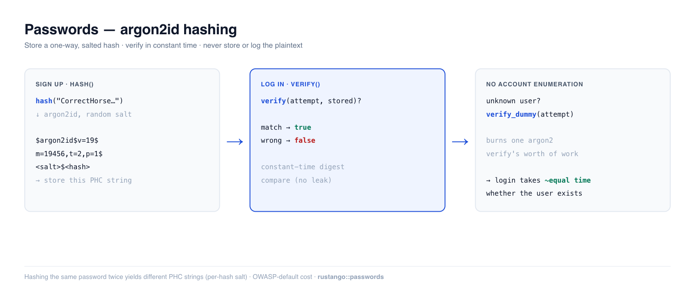

# Mots de passe

Stocker un mot de passe, c'est stocker quelque chose qu'un attaquant ne peut pas
inverser même avec toute votre base de données en main. **Rustango** vous offre
cela en deux appels — `hash` à l'entrée, `verify` à la sortie — reposant sur
**argon2id**, le lauréat *memory-hard* de la Password Hashing Competition et le
premier choix actuel de l'OWASP. Vous ne stockez, ne journalisez et ne comparez
jamais le texte en clair.

[](../img/auth-passwords.png)

> **Source :** `rustango::passwords` (`hash`, `verify`, `verify_dummy`,
> `strength_score`, `StrengthIssue`) — derrière la fonctionnalité `passwords`
> (activée par défaut). Pour les utilitaires de mot de passe utilisateur
> intégrés à la tenancy, voir `rustango::tenancy::password`.
>
> **Version exécutable :** chaque extrait ci-dessous est copié depuis l'exemple
> testé [`auth_demo`](https://github.com/ujeenet/rustango/blob/main/crates/rustango/examples/auth_demo/tests/auth_passwords.rs)
> — `cargo test -p auth_demo --test auth_passwords`.

> **Un terme vous est inconnu ici ?** *hash*, *salt*, *argon2id*, *chaîne PHC* —
> voir le [glossaire](glossary.md).

> Ceci est l'approfondissement de la section « Hachage et vérification des mots
> de passe » du [guide de sécurité](security.md).

---

## Table des matières
- [Démarrage rapide](#quick-start) · [Pourquoi argon2id](#why-argon2id)
- [Hachage à l'inscription](#hashing-on-signup) · [Vérification à la connexion](#verifying-on-login)
- [Connexions à temps constant](#timing-safe-logins-account-enumeration) · [Contrôles de robustesse](#strength-checks)
- [Où vit le hash](#where-the-hash-lives) · [Remarques et limites](#notes-and-limits)

---

## Démarrage rapide

```rust
use rustango::passwords::{hash, verify};

// Signup — store the returned PHC string, never the plaintext.
let stored: String = hash("CorrectHorseBatteryStaple!42")?;

// Login — check an attempt against the stored hash.
if verify("CorrectHorseBatteryStaple!42", &stored)? {
    // credentials good
}
```

`hash` renvoie une [chaîne PHC](https://github.com/P-H-C/phc-string-format) — une
ligne auto-descriptive qui embarque l'algorithme, ses paramètres de coût, le sel
aléatoire et l'empreinte :

```text
$argon2id$v=19$m=19456,t=2,p=1$<base64 salt>$<base64 hash>
```

Comme le sel et les paramètres voyagent *à l'intérieur* de la chaîne, `verify` n'a
besoin que de la valeur stockée et de la tentative — il n'y a pas de colonne de
sel séparée à gérer.

---

## Pourquoi argon2id

`hash` utilise **argon2id** avec les valeurs par défaut recommandées par l'OWASP
(m=19 Mio, t=2, p=1). argon2id est *memory-hard* : chaque tentative coûte de la
RAM réelle, ce qui est précisément ce qui émousse les fermes de GPU/ASIC rendant
les hachages rapides (MD5, SHA-256, et même bcrypt à faible coût) vulnérables au
force brute. Deux propriétés comptent pour l'exactitude :

- **Le salage est automatique et propre à chaque hash.** Hacher deux fois le même
  mot de passe produit deux chaînes PHC différentes, si bien que des mots de
  passe identiques n'entrent pas en collision dans votre table et que les
  attaques par tables arc-en-ciel précalculées ne s'appliquent pas.

  ```rust
  let a = hash("same-password-12345")?;
  let b = hash("same-password-12345")?;
  assert_ne!(a, b);                 // different random salt each time
  assert!(verify("same-password-12345", &a)?);
  assert!(verify("same-password-12345", &b)?);
  ```

- **La vérification est à temps constant** dans la comparaison de l'empreinte (le
  `PasswordVerifier` propre à argon2), de sorte qu'une fuite de temps octet par
  octet ne peut pas révéler quelle part d'une tentative était correcte.

---

## Hachage à l'inscription

```rust
use rustango::passwords::{hash, strength_score};

fn create_user(username: &str, plaintext: &str) -> Result<String, String> {
    // Optional: nudge users away from weak choices (see below).
    let issues = strength_score(plaintext);
    if !issues.is_empty() {
        return Err(format!("password too weak: {issues:?}"));
    }
    // Store the PHC string on the user row (e.g. auth_users.password_hash).
    hash(plaintext).map_err(|e| e.to_string())
}
```

---

## Vérification à la connexion

```rust
use rustango::passwords::verify;

// `stored` is the PHC string you saved at signup.
let ok = verify(attempt, &stored)?;
```

`verify` renvoie :
- `Ok(true)` — la tentative correspond.
- `Ok(false)` — elle ne correspond pas.
- `Err(PasswordError::Verify)` — `stored` n'était pas une chaîne PHC valide (une
  colonne corrompue ou tronquée) ; traitez-la comme un échec de connexion, pas
  comme une erreur 500.

---

## Connexions à temps constant (énumération de comptes)

Si votre connexion n'exécute le coûteux `verify` **que** lorsque le nom
d'utilisateur existe, un nom d'utilisateur inconnu renvoie une réponse
sensiblement plus rapide qu'un vrai — et cet écart de temps permet à un attaquant
d'énumérer les comptes valides. `verify_dummy` le comble : appelez-le sur la
branche utilisateur-introuvable (et compte-inactif) pour que chaque connexion
consacre le travail d'un `verify` argon2, quoi qu'il arrive.

```rust
use rustango::passwords::{verify, verify_dummy};

let row = users::find_by_username(username).await?;
let authenticated = match row {
    Some(u) if u.is_active => verify(attempt, &u.password_hash)?,
    _ => {
        verify_dummy(attempt); // burn the same work, then fail
        false
    }
};
```

---

## Contrôles de robustesse

`strength_score` renvoie un `Vec<StrengthIssue>` — vide signifie « suffisamment
bon ». C'est une heuristique intentionnellement légère destinée à *encourager*
les utilisateurs, et non un verrou de politique stricte ; associez-la à une
vérification par liste de fuites (HIBP / pwned-passwords) pour les déploiements
sérieux.

```rust
use rustango::passwords::{strength_score, StrengthIssue};

assert!(strength_score("Tr0ub4dor&3-CorrectBattery").is_empty());
assert!(strength_score("password123").contains(&StrengthIssue::KnownWeak));
assert!(strength_score("short").contains(&StrengthIssue::TooShort));
```

| `StrengthIssue` | Déclenché quand |
|---|---|
| `TooShort` | moins de 12 caractères |
| `NoDigitsOrSymbols` | lettres uniquement — aucun chiffre ni symbole |
| `NoVariety` | uniquement des lettres minuscules |
| `KnownWeak` | correspond à la petite liste intégrée de mots de passe faibles (insensible à la casse) |

---

## Où vit le hash

La chaîne PHC n'est qu'une colonne `String` sur le modèle de compte que vous
possédez. Dans l'exemple [`auth_demo`](https://github.com/ujeenet/rustango/blob/main/crates/rustango/examples/auth_demo/src/models.rs) :

```rust
#[derive(Model, Clone, Debug)]
#[rustango(table = "auth_users", display = "username")]
pub struct User {
    #[rustango(primary_key)]
    pub id: Auto<i64>,
    #[rustango(max_length = 150, unique)]
    pub username: String,
    #[rustango(max_length = 254)]
    pub email: String,
    #[rustango(max_length = 255)]      // PHC strings are ~95 chars at these params
    pub password_hash: String,
    pub is_active: bool,
    pub is_superuser: bool,
}
```

Une fois l'utilisateur authentifié, passez le relais à une
[session](auth-sessions.md) (pour les applications navigateur) ou émettez un
[JWT](auth-jwt.md) (pour les API).

---

## Remarques et limites

- **Ne jamais** stocker, journaliser ni comparer avec `==` le texte en clair.
  `hash` → stocker ; `verify` → vérifier. C'est tout le contrat.
- **Les paramètres de coût sont les valeurs par défaut de l'OWASP**, intégrées.
  Ils constituent un plancher raisonnable ; les augmenter plus tard est sûr — les
  anciens hachages se vérifient toujours (leurs paramètres vivent dans la chaîne
  PHC), et vous pouvez re-hacher à la prochaine connexion réussie pour les mettre
  à niveau.
- `strength_score` est une heuristique, pas un moteur de politique — elle ne
  détectera pas `Summer2024!`. Superposez une recherche par liste de fuites pour
  une vraie application de la robustesse.
- Pour les applications multi-locataires utilisant le magasin d'utilisateurs du
  framework, préférez `rustango::tenancy::password` (même argon2id, intégré au
  modèle d'utilisateur du locataire). Ce module est la version autonome pour les
  applications qui possèdent leur propre table User.


---

## Voir aussi

- [Sessions](auth-sessions.md)
- [Flux de compte](auth-flows.md)
- [Backends d'authentification](auth-backends.md)
- [Guide de sécurité](security.md)
