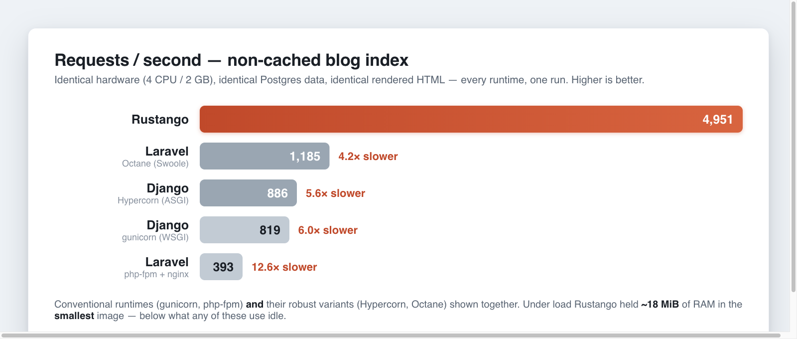

# Benchmarks : Rustango vs Django vs Laravel vs Go

À quel point **Rustango** est-il rapide, vraiment ? Cette page présente un benchmark
en tête-à-tête face aux deux frameworks dont **Rustango** s'inspire — Django et Laravel — et
face à une référence **Go** (le `net/http` de la bibliothèque standard) qui ancre ce qu'un
second runtime compilé et natif atteint sur la même charge de travail. Tous utilisent
des sites de blog *fonctionnellement identiques* : mêmes données, même schéma, mêmes endpoints,
même budget matériel — la seule variable est le runtime. Django et Laravel sont
chacun mesurés dans **les deux** cas : leur déploiement de production conventionnel *et* un
runtime plus robuste : **Django** sur **gunicorn** (WSGI) et sur **Hypercorn**
(ASGI) ; **Laravel** sur **php-fpm + nginx** et sur **Octane** (Swoole). Rustango
et Go sont chacun un unique binaire résident, il n'y en a donc qu'un de chaque.

Chaque chiffre ci-dessous est **mesuré et reproductible**, issu d'une exécution cohérente d'un
harnais en une seule commande (voir [Reproduce](#reproduce)). Rien ici n'est esquivé à la légère.

> **En bref.** Sur un matériel identique servant des pages HTML rendues identiques, les deux
> runtimes **compilés et natifs** — **Rustango** et **Go** — laissent les
> frameworks interprétés **5 à 30× derrière** et se disputent la tête entre eux. Sur
> l'index non caché, **Go** menait à **6 651 req/s** et **Rustango** suivait à
> **4 781** — **5,6×** Django (gunicorn) et **11,7×** Laravel (php-fpm). L'avance
> de Go est la plus large sur la page de détail non cachée (**13 921 vs 6 538**, 2,1×).
> **Rustango** reprend la tête là où cela compte pour le trafic servi : les
> chemins **cachés en Redis** (**25 546** vs 20 929 de Go sur l'index ; 35 781 vs
> 29 470 sur le détail) et le **pur calcul** (14 341 vs 11 573). Il a aussi conservé la
> **plus faible RAM sous charge** (18,5 Mio, sans GC) et — contrairement à l'application Go stdlib —
> livre un framework complet et tout compris. Même le résultat non compilé le plus rapide,
> **Laravel sur Octane**, reste 4 à 7× derrière les deux binaires.

[](../img/benchmarks.png)

---

## Le dispositif

Quatre applications de blog — **auteurs, articles, tags (plusieurs-à-plusieurs) et commentaires** —
rendant des pages HTML :

| Route | Rend | Caché ? |
|---|---|---|
| `GET /` | les 20 derniers articles, chacun avec auteur, tags, nombre de commentaires | non |
| `GET /cached` | identique à `/` | Redis, 60 s |
| `GET /post/{slug}` | corps de l'article + auteur + tags + tous les commentaires | non |
| `GET /post/{slug}/cached` | identique au détail | Redis, 60 s |
| `GET /tag/{slug}` | les articles portant un tag | non |
| `GET /compute` | somme de tous les nombres premiers en dessous de 20 000 (borné CPU ; sans BDD, sans cache) | non |

Les cinq premières sont bornées par l'E/S + le rendu ; `/compute` est une charge de travail purement CPU — le
même algorithme de division d'essai dans chaque langage — pour isoler la vitesse brute
du runtime. Chaque application charge ses relations **de manière avide** (pas de N+1) : **Rustango** regroupe les
requêtes explicitement, Django utilise `select_related` / `prefetch_related` /
`annotate(Count)`, Laravel utilise `with()` + `withCount()`, **Go** charge par lots
avec des requêtes `= ANY($1)`. Les templates sont délibérément minuscules et équivalents (Tera,
templates Django, Blade, `html/template` de Go), afin que nous mesurions le *framework*, et non
l'effort de template.

### Ce qui en fait un combat équitable

- **Données identiques.** Un schéma PostgreSQL et un seed déterministe partagés par les
  quatre applications — elles lisent les *mêmes tables* : 10 auteurs, 30 tags, **1 000 articles**,
  2 600 liens article-tag, **10 000 commentaires**. L'index affiche les 20 mêmes articles dans
  le même ordre sur chaque framework, et le HTML rendu est octet-pour-octet identique
  (au style d'échappement d'entités de chaque moteur près).
- **Budget matériel identique.** Chaque application tourne dans un conteneur plafonné à
  **4 CPU / 2 Go de RAM**. PostgreSQL et Redis sont partagés et identiques.
- **Une à la fois.** Les applications sont testées en charge séquentiellement afin qu'elles ne se disputent jamais
  l'hôte (une machine 12 cœurs / 18 Go). Générateur de charge :
  [`oha`](https://github.com/hatoo/oha), 50 connexions concurrentes, 10 s par
  endpoint, keep-alive HTTP activé. Chaque exécution a rapporté **100 % de succès**.
- **Tout en mode production.** Cela compte énormément (voir ci-dessous).

### Configuration de production

| | Runtime | Durcissement de production |
|---|---|---|
| **Rustango** | un binaire `--release` (axum + Tokio, async, tous les cœurs) | `opt-level=3` + LTO ; cache de page Redis via `CachePageLayer` |
| **Go** | un binaire statique (`net/http` stdlib, goroutines, tous les cœurs) | pool `pgx` + cache de page `go-redis` ; templates embarqués ; livré sur `scratch` |
| **Django 5.2** · gunicorn | workers gthread + keep-alive (WSGI) | `DEBUG=False` ; cache Redis intégré + `@cache_page` ; connexions BDD persistantes |
| **Django 5.2** · Hypercorn | serveur ASGI, 4 workers, keep-alive | même application, servie via ASGI ; les vues synchrones tournent dans un threadpool |
| **Laravel 13** · php-fpm | php-fpm + nginx, OPcache **activé**, 16 workers | `APP_ENV=production` ; `composer install --no-dev --optimize-autoloader` ; Blade caché ; `Cache::remember` sur Redis |
| **Laravel 13** · Octane | Octane + **Swoole**, workers persistants | même application sur un runtime résident en mémoire — pas de bootstrap du framework par requête |

> Le mode production n'est pas une note de bas de page. La première exécution (non tunée) de Laravel n'a atteint
> que ~53 req/s ; activer OPcache, l'autoloader optimisé et un vrai pool de
> workers l'a porté à ~408 req/s — un **écart de 7,7×** dû à la seule configuration. Les
> chiffres ci-dessous proviennent tous de la configuration de production.

---

## Résultats

### Débit — requêtes par seconde (plus haut est meilleur)

Les deux binaires compilés, puis chaque framework interprété dans son runtime
conventionnel **et** son runtime robuste :

| Endpoint | **Rustango** | **Go** | Django · gunicorn | Django · Hypercorn | Laravel · php-fpm | Laravel · Octane |
|---|--:|--:|--:|--:|--:|--:|
| index, non caché | 4 781 | **6 651** | 850 | 910 | 408 | 1 238 |
| index, **caché** | **25 546** | 20 929 | 4 841 | 1 537 | 1 224 | 5 777 |
| détail, non caché | 6 538 | **13 921** | 1 983 | 916 | 464 | 1 790 |
| détail, **caché** | **35 781** | 29 470 | 4 843 | 1 320 | 793 | 5 811 |
| tag, non caché | 3 926 | **4 353** | 1 129 | 1 033 | 398 | 1 179 |
| **compute** (borné CPU) | **14 341** | 11 573 | 452 | 400 | 716 | 1 504 |

Trois enseignements sautent aux yeux. Premièrement, **Go et Rustango se regroupent loin au-dessus de tous les
autres** — l'écart entre les deux binaires natifs (des dizaines de pour cent, avec Go en tête
sur l'E/S non cachée et Rustango en tête sur les hits cachés + le calcul) est faible face au
gouffre de 5 à 30× vers les runtimes interprétés. Deuxièmement, **Laravel + Octane** (Swoole) est
un **bond de 3 à 7×** par rapport à php-fpm — un worker résident qui évite le bootstrap
du framework Laravel à chaque requête — et c'est le résultat non compilé le plus rapide sur chaque page.
Troisièmement, **Django + Hypercorn** (ASGI) est à peu près **plat, et plus lent sur les chemins
cachés** : les vues du blog sont *synchrones*, donc l'ASGI ne fait qu'ajouter un saut vers un threadpool
sans aucun des gains de concurrence que des vues *async* apporteraient. Même le meilleur de
ce peloton (Octane, 1 238 req/s sur l'index non caché ; 5 811 sur le détail caché) accuse
un retard de 4 à 7× sur les deux binaires.

### Latence — p50 en millisecondes (plus bas est meilleur)

| Endpoint | **Rustango** | **Go** | Django · gunicorn | Django · Hypercorn | Laravel · php-fpm | Laravel · Octane |
|---|--:|--:|--:|--:|--:|--:|
| index, non caché | 10.2 | **7.2** | 56.9 | 43.2 | 114.7 | 39.9 |
| index, caché | **1.8** | 2.1 | 9.3 | 5.0 | 20.2 | 7.6 |
| détail, caché | **1.3** | 1.5 | 5.8 | 32.1 | 81.8 | 7.6 |
| compute (borné CPU) | 3.5 | **2.5** | 70.8 | 130.0 | 87.4 | 32.9 |

(Médianes indiquées ; les p50 / p95 / p99 complets pour chaque endpoint et runtime sont dans
`bench/results/summary.tsv`.) Les médianes de **Rustango** et de **Go** sur l'index
non caché (10,2 / 7,2 ms) sont inférieures à celles de tous les concurrents interprétés, et
leurs médianes cachées (1,3 à 2,1 ms) sont un ordre de grandeur en dessous même du
runtime de framework le plus rapide. Un bémol en faveur de Go *et* contre lui : son p50 de
calcul (2,5 ms) bat celui de Rustango, mais son p99 de calcul grimpe à ~47 ms sur une pause
GC — une traîne que le binaire Rust sans GC n'a pas.

### Empreinte — taille d'image, mémoire, CPU

| | **Rustango** | **Go** | Django · gunicorn | Django · Hypercorn | Laravel · php-fpm | Laravel · Octane |
|---|--:|--:|--:|--:|--:|--:|
| Image de conteneur (non compressée) | 164 MB | **18.5 MB** | 293 MB | 293 MB | 959 MB | 1.01 GB |
| RAM, au repos | 12.1 MiB | **5.2 MiB** | 128 MiB | 173 MiB | 92 MiB | 248 MiB |
| RAM, sous charge | **18.5 MiB** | 34.7 MiB | 218 MiB | 277 MiB | 133 MiB | 267 MiB |
| CPU sous charge (sur un plafond de 400 %) | 295 % | 366 % | 356 % | 408 % | 406 % | 335 % |

**Go** livre l'image la plus petite — un binaire statique sur `scratch`, **18,5 MB** — et
tourne au repos à seulement **5,2 Mio**. Mais sous charge, son tas GC croît jusqu'à **34,7 Mio**,
~1,9× les **18,5 Mio** stables de **Rustango** : sans ramasse-miettes et sans
allocation par requête, le binaire Rust sous pleine charge tient dans moins de RAM que Go n'en
utilise, et en deçà de ce que n'importe quel runtime interprété consomme *au repos*. Les runtimes
robustes coûtent *plus* de mémoire, pas moins : Octane conserve un Laravel résident dans chaque
worker ; Hypercorn ajoute la pile ASGI par-dessus Django.

### Efficacité — travail accompli par ressource (la vraie histoire)

Le débit brut est une chose ; le **débit par unité de ressource** est ce que votre
facture cloud suit réellement (index non caché) :

| Métrique | **Rustango** | **Go** | Django · gunicorn | Django · Hypercorn | Laravel · php-fpm | Laravel · Octane |
|---|--:|--:|--:|--:|--:|--:|
| Requêtes/s **par Mio de RAM** | **258** | 192 | 3.9 | 3.3 | 3.1 | 4.6 |
| Requêtes/s **par % de CPU** | 16.2 | **18.2** | 2.4 | 2.2 | 1.0 | 3.7 |

Par mégaoctet de mémoire, **Rustango** accomplit le plus de travail de tous les runtimes ici —
~35× le meilleur résultat interprété et ~1,3× celui de Go, parce que son empreinte reste plate
sous charge. Par pourcentage de CPU, **Go** prend légèrement l'avantage (il convertit les cœurs
supplémentaires qu'il mobilise en un débit un peu plus élevé). Dans tous les cas, pour égaler le
débit d'index d'un seul binaire compilé, il vous faudrait faire tourner ~4 Laravel sous Octane ou ~6
Django sous gunicorn — chacun portant sa propre empreinte de plusieurs centaines de Mo.

---

## Ce que change le cache

Chaque runtime est le plus rapide lorsqu'un cache de page Redis lui permet de sauter la base de données et
le rendu entièrement — req/s de l'index non caché → **caché** :

- **Rustango** : 4 781 → **25 546** (5,3× grâce au cache) — reprend la première place.
- **Go** : 6 651 → **20 929** (3,1×) — en tête sans cache, deuxième avec cache.
- **Laravel · Octane** : 1 238 → **5 777** (4,7×) — le meilleur du peloton interprété.
- **Django · gunicorn** : 850 → **4 841** (5,7×).
- **Django · Hypercorn** : 910 → **1 537** (1,7×) — la surcharge du threadpool ASGI
  plafonne le gain même sur les hits de cache.
- **Laravel · php-fpm** : 408 → **1 224** (3,0×).

Le cache aide tout le monde, mais il n'efface pas l'écart — et c'est là que les deux
binaires compilés se séparent : sans aucun code applicatif en exécution, le
chemin accept HTTP → lecture de cache → réponse est tout ce qui reste, et le
`CachePageLayer` sans allocation de **Rustango** (25 546 req/s) devance le chemin `go-redis` de Go
(20 929), les deux à ~4× le meilleur runtime de framework.

---

## Calcul brut : compilé vs interprété (et compilé vs compilé)

Les cinq routes de page sont dominées par la base de données et le moteur de template. La
route `/compute` les évacue — elle somme tous les nombres premiers en dessous de 20 000 par division
d'essai, le *même* algorithme en Rust, Go, Python et PHP. Tous les quatre retournent
la même réponse (`21171191`) ; seule la vitesse diffère :

| | **Rustango** | **Go** | Django | Laravel |
|---|--:|--:|--:|--:|
| Débit | **14 341 req/s** | 11 573 | 452 | 716 |
| Latence p50 | 3.5 ms | **2.5 ms** | 70.8 ms | 87.4 ms |

Les deux binaires natifs exécutent la boucle **~26 à 32×** plus vite que Django et
**~16 à 20×** plus vite que Laravel — l'écart entre du code machine compilé et un
interpréteur de bytecode. Entre Rust et Go, la boucle `--release` avec LTO de Rust s'empare de la
couronne du débit tandis que la latence médiane de Go est en réalité plus basse ; le GC de Go se
manifeste alors en latence de traîne (p99 ~47 ms) que le binaire Rust ne paie jamais. Fait intéressant, PHP 8.3
(avec OPcache) surpasse CPython en calcul sur cette boucle d'entiers serrée, si bien que Laravel
*surpasse en calcul* Django ici, même s'il perd sur chaque page bornée par l'E/S. C'est
la charge de travail où le langage, et non le framework, domine — et où pousser
la logique chaude dans **Rustango** rapporte le plus.

---

## Réserves honnêtes

Un benchmark que vous ne pouvez pas critiquer ne vaut pas la peine d'être publié. Donc :

- Les chiffres proviennent d'**un** hôte 12 cœurs / 18 Go (macOS + Docker). Les valeurs
  absolues varient sur d'autres matériels ; c'est le tableau **relatif** qui voyage.
- Il s'agit d'une charge de travail **à forte lecture, rendue côté serveur** — la forme de blog
  la plus courante. Elle ne mesure pas les écritures, les flux d'authentification, les websockets ou une
  logique métier lourde.
- **Go ici est la bibliothèque standard, pas un framework pair.** Rustango, Django,
  et Laravel sont des frameworks tout compris (ORM, admin, migrations, routage,
  templating, multi-tenancy) ; l'application Go est du `net/http` écrit à la main + du SQL brut —
  la référence la plus dépouillée et la plus rapide qu'un service Go atteint réalistement, et
  la représentation la plus équitable du langage. Qu'il fasse jeu égal ou batte Rustango sur le
  débit brut non caché est exactement là où réside le propos : **Rustango offre des performances
  de classe Go avec une expérience développeur de classe Django/Laravel.** L'avance de Go sur les
  endpoints non cachés s'achète en écrivant soi-même le SQL, le mappage et le câblage.
- Les runtimes sont fondamentalement différents : Rustango et Go sont chacun un seul binaire
  utilisant tous les cœurs avec des tâches bon marché ; Django et Laravel utilisent des pools fixes de
  processus/threads worker. Cette différence *fait* partie du résultat, et les
  nombres de workers ont été réglés à des valeurs par CPU sensées, non tunées pour favoriser quiconque.
- Django et Laravel sont chacun présentés dans **les deux** runtimes — conventionnel
  (gunicorn, php-fpm) et robuste (Hypercorn, Octane). **Laravel sur Octane est
  3 à 7× plus rapide** que php-fpm ; **Django sur Hypercorn** (vues synchrones) est à peu près
  plat. Les deux réduisent l'écart avec les binaires compilés ; aucun ne le comble.

Le propos n'est pas que Django ou Laravel soient lents — ils propulsent une immense part du
web. C'est que **Rustango** vous offre cette même expérience développeur tout compris avec
les performances et l'empreinte de Rust compilé — égalant un service Go réglé à la main tout en
vous livrant le framework que Go vous oblige à construire.

---

## Reproduire

Le harnais complet — les quatre applications, le schéma PostgreSQL partagé + le seed
déterministe, la configuration Docker Compose et le runner — est un projet autonome
(`rustango-bench`). Depuis son répertoire :

```sh
bench/vendor.sh                       # vendor the framework into the build
docker compose build                  # build all six images
DURATION=10s CONCURRENCY=50 bench/run.sh
```

Prérequis : Docker + Compose et Rust (pour `cargo install oha`). Ajustez le
plafond matériel dans `.env` (`CAP_CPUS`, `CAP_MEM`) et la charge avec `DURATION` /
`CONCURRENCY`. La sortie brute par exécution atterrit dans `bench/results/`.


---

## Voir aussi

- [Getting started](getting-started.md)
- [ORM cookbook](orm.md)
