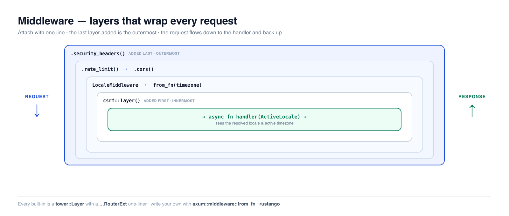

# Middleware

Un middleware est du code qui s'exécute **autour** de chaque requête — avant que
votre handler ne la voie et après qu'il a produit une réponse. C'est là que
vivent les préoccupations transversales : journalisation, limitation de débit,
en-têtes de sécurité, CSRF, résolution de la locale et du fuseau horaire.
**Rustango** fournit un catalogue riche de middlewares prêts à l'emploi et rend
l'écriture des vôtres possible en quelques lignes. Si vous venez de Django,
c'est la liste `MIDDLEWARE` ; d'Express, c'est `app.use()` ; de Laravel, c'est
le kernel HTTP — la même idée, rattachée à votre routeur.

[](../img/middleware.png)

> **Source :** le middleware est bâti sur [`tower::Layer`](https://docs.rs/tower) +
> `axum::middleware::from_fn`. Les composants intégrés se répartissent dans
> `rustango::{access_log, rate_limit, cors, security_headers, request_id, …}`,
> plus `rustango::forms::csrf` (la feature `csrf`) et `rustango::i18n`
> (`middleware::LocaleMiddleware`, `timezone`). La plupart sont activés par
> défaut.
>
> **Version exécutable :** chaque extrait ci-dessous est copié depuis l'exemple
> testé situé dans
> `crates/rustango/examples/getting_started_blog/tests/middleware.rs`
> (locale, fuseau horaire, en-têtes de sécurité, CSRF — tous sans base de
> données). Lancez-le avec
> `cargo test -p getting_started_blog --test middleware`.

> **Un terme vous est inconnu ?** *Middleware*, *layer*, *CSRF*, *locale* — le
> [glossaire](glossary.md) les explique en langage clair.

## Table des matières

- [Comment fonctionne le middleware dans Rustango](#how-middleware-works-in-rustango)
- [L'ordre compte](#ordering-matters)
- [Le catalogue intégré](#the-built-in-catalog)
- [Middleware sensible à la locale](#locale-aware-middleware)
- [Middleware sensible au fuseau horaire](#timezone-aware-middleware)
- [En-têtes de sécurité](#security-headers)
- [Protection CSRF](#csrf-protection)
- [Écrire votre propre middleware](#writing-your-own-middleware)
- [Voir aussi](#see-also)

---

## Comment fonctionne le middleware dans Rustango

Il existe deux formes, et vous utiliserez les deux :

1. **Un `tower::Layer`** — une structure middleware réutilisable et
   configurable. Chaque composant intégré en est un (`SecurityHeadersLayer`,
   `RateLimitLayer`, …). Vous attachez un layer avec le `.layer(...)` d'axum,
   ou — pour la plupart des composants intégrés — avec un **one-liner de trait
   d'extension** qui se lit mieux :

   ```rust
   use rustango::security_headers::{SecurityHeadersLayer, SecurityHeadersRouterExt};

   // These two are equivalent; the second is the ergonomic form.
   let app = router.layer(SecurityHeadersLayer::strict());
   let app = router.security_headers(SecurityHeadersLayer::strict());
   ```

   Chaque module intégré exporte un trait `…RouterExt` (`SecurityHeadersRouterExt`,
   `RateLimitRouterExt`, …). Amenez-le dans la portée et vous obtenez une méthode
   `.security_headers()` / `.rate_limit()` / `.cors()` directement sur `Router`.
   C'est la manière idiomatique de câbler une pile :

   ```rust
   let app = router
       .request_id(RequestIdLayer::default())
       .access_log(AccessLogLayer::default())
       .rate_limit(RateLimitLayer::per_ip(60, Duration::from_secs(60)))
       .cors(CorsLayer::new().allow_origins(vec!["https://app.example.com"]))
       .security_headers(SecurityHeadersLayer::strict());
   ```

2. **Une fonction via `axum::middleware::from_fn`** — le moyen le plus rapide
   d'en écrire un ponctuel. Vous recevez la `Request` et un `Next` ; vous
   appelez `next.run(req)` pour continuer, et vous pouvez faire du travail de
   part et d'autre de cet appel. L'[exemple de fuseau
   horaire](#timezone-aware-middleware) ci-dessous est exactement cela.

Les deux se composent librement — un middleware `from_fn` *est* un layer, donc
il s'empile avec les composants intégrés dans la même chaîne `.layer(...)`.

---

## L'ordre compte

Un layer enveloppe tout ce qui a été ajouté **avant** lui, donc le **dernier**
layer que vous attachez est le **plus externe** — il s'exécute en premier à
l'aller et en dernier au retour. Imaginez la pile comme un oignon ; la requête
descend jusqu'au handler et la réponse remonte :

```text
            ┌──────────────────────────────────────┐
request  →  │ security_headers   (added last = top) │  → response
            │   ┌────────────────────────────────┐  │
            │   │ rate_limit                     │  │
            │   │   ┌──────────────────────────┐ │  │
            │   │   │ request_id (added first) │ │  │
            │   │   │      → handler →         │ │  │
            │   │   └──────────────────────────┘ │  │
            │   └────────────────────────────────┘  │
            └──────────────────────────────────────┘
```

Conséquences pratiques :

- **Placez `request_id` / `access_log` près du bas** (ajoutés en premier) afin
  que l'identifiant de corrélation et le span de journalisation couvrent tout
  ce qui s'exécute après eux.
- **Placez les gardes à rejet peu coûteux près du haut** (ajoutés en dernier) —
  `allowed_hosts`, `rate_limit`, `body_limit` — afin qu'une requête bloquée
  soit écartée avant d'atteindre les layers internes coûteux.
- **`security_headers` le plus à l'extérieur** afin que les en-têtes soient
  apposés sur *chaque* réponse, y compris celles court-circuitées par un layer
  interne (un 429, un 403).

---

## Le catalogue intégré

Chaque entrée est un `tower::Layer` avec un one-liner `…RouterExt` associé, sauf
mention contraire. Amenez le trait `…RouterExt` du module dans la portée pour
obtenir la méthode.

| Préoccupation | Layer | Câblez-le avec |
| --- | --- | --- |
| **Sécurité & accès** | | |
| En-têtes de sécurité (HSTS, XFO, CSP…) | `SecurityHeadersLayer` | `.security_headers(..)` |
| CSRF (cookie double-submit) | `CsrfLayer` | `.layer(csrf::layer())` |
| CORS | `CorsLayer` | `.cors(..)` |
| Liste blanche d'hôtes | `AllowedHostsLayer` | `.allowed_hosts(..)` |
| Autorisation/blocage d'IP | `IpFilterLayer` | `.ip_filter(..)` |
| Forcer HTTPS | `SslRedirectLayer` | `.ssl_redirect(..)` |
| Nonce CSP par requête | `CspNonceLayer` | `.csp_nonce(..)` |
| Signature de requête HMAC | `HmacAuthLayer` | `.layer(..)` |
| **Trafic & résilience** | | |
| Limitation de débit (par IP/globale) | `RateLimitLayer` | `.rate_limit(..)` |
| Limitation de débit distribuée (adossée au cache) | `CacheRateLimitLayer` | `.cache_rate_limit(..)` |
| Timeout de requête | `RequestTimeoutLayer` | `.request_timeout(..)` |
| Taille de corps maximale | `BodyLimitLayer` | `.body_limit(..)` |
| Mode maintenance (503) | `MaintenanceLayer` | `.maintenance(..)` |
| Clés d'idempotence | `IdempotencyLayer` | `.idempotency(..)` |
| Restreindre les méthodes HTTP | `MethodRestrictLayer` | `.require_get()` / `.require_post()` / `.require_safe()` |
| **Observabilité** | | |
| Identifiant de requête (`X-Request-Id`) | `RequestIdLayer` | `.request_id(..)` |
| Journal d'accès (PII expurgées) | `AccessLogLayer` | `.access_log(..)` |
| Spans `tracing` | `TracingLayer` | `.layer(..)` |
| En-tête `Server-Timing` | `ServerTimingLayer` | `.server_timing(..)` |
| IP client réelle (derrière des proxys) | `RealIpLayer` | `.real_ip(..)` |
| **Contenu & réponse** | | |
| Compression gzip/br | `CompressionLayer` | `.compression(..)` |
| ETag / GET conditionnel | `EtagLayer` | `.etag(..)` |
| Redirection de slash final | `TrailingSlashLayer` | `.trailing_slash(..)` |
| Mise en cache de page | `CachePageLayer` | `.layer(..)` |
| **Localisation** | | |
| Négociation de locale | `LocaleMiddleware` | `.layer(..)` (+ extracteur `ActiveLocale`) |
| Fuseau horaire actif | *(à composer avec `from_fn`)* | voir [ci-dessous](#timezone-aware-middleware) |
| **Développement** | | |
| Rechargement à chaud | `LiveReloadLayer` | `.livereload(..)` |
| Panneau de débogage | `DebugPanelLayer` | `.debug_panel(..)` |

Les sections suivantes détaillent celles que la requête a demandées.

---

## Middleware sensible à la locale

`LocaleMiddleware` résout une locale par requête et l'injecte dans la requête
afin que n'importe quel handler puisse la lire. L'ordre de sélection est celui
de Django : **cookie → `Accept-Language` → valeur par défaut**. La première
locale que vous listez est la valeur par défaut, sauf si vous la surchargez.

```rust
use rustango::i18n::middleware::{ActiveLocale, LocaleMiddleware};

// First entry is the default; `.default("en")` is explicit here. `ar`
// (Arabic) is included so we can prove the RTL convenience too.
let layer = LocaleMiddleware::new(&["en", "fr", "ar"]).default("en");

let app = Router::new()
    .route(
        "/",
        // The extractor pulls the locale the layer chose for THIS request.
        get(|loc: ActiveLocale| async move { format!("{} {}", loc.0, loc.direction()) }),
    )
    .layer(layer);
```

Les handlers lisent le résultat avec l'extracteur `ActiveLocale`. Il est
`Infallible` — si aucun middleware ne s'est exécuté, il retombe sur `"en"` — et
il porte des helpers RTL afin que les templates puissent brancher selon la
bidirectionnalité :

```rust
loc.0            // the picked locale, e.g. "fr"
loc.direction()  // "ltr" / "rtl" — feed straight into <html dir="…">
loc.is_rtl()     // true for ar, he, fa, …
```

Le nom du cookie est par défaut `django_language` (compatible Django) ;
changez-le avec `.cookie_name("…")`, ou passez `None` pour désactiver
entièrement la recherche par cookie. L'ordre de résolution, vérifié de bout en
bout :

```rust
// Cookie says fr, Accept-Language says ar → the cookie wins.
//   Cookie: django_language=fr ; Accept-Language: ar   → "fr ltr"
//
// No cookie → negotiate Accept-Language (ar is RTL).
//   Accept-Language: ar,en;q=0.5                        → "ar rtl"
//
// Neither cookie nor a supported language → the default locale.
//   (no headers)                                        → "en ltr"
```

Pour des locales en préfixe d'URL (`/en/about`, `/fr/about`) au lieu de la
négociation par en-tête, montez un sous-routeur par locale avec
`Router::nest("/fr", …)` et injectez-y la locale.

---

## Middleware sensible au fuseau horaire

Il n'y a délibérément **aucun layer de fuseau horaire**. À la place, le
framework vous donne un décalage actif task-local (`rustango::i18n::timezone`)
et un décodeur d'en-tête/cookie, et vous composez un middleware d'une ligne qui
l'active — l'exemple canonique du « écrivez le vôtre ». Cela reflète le
`USE_TZ=True` de Django : stockez en UTC, affichez selon l'horloge locale de
l'utilisateur.

```rust
use axum::middleware::{from_fn, Next};
use rustango::i18n::timezone::{current_offset, from_request_headers, with_offset};

/// Per-request middleware: decode the client's UTC offset from the
/// `tz_offset` cookie (or a `Time-Zone:` header), then run the rest of the
/// stack with that offset active so `current_offset()` / the `localtime`
/// Tera filter see it. Falls back to UTC when nothing parseable is sent.
async fn timezone_mw(req: Request<Body>, next: Next) -> Response {
    match from_request_headers(req.headers(), "tz_offset") {
        Some(offset) => with_offset(offset, next.run(req)).await,
        None => next.run(req).await,
    }
}

let app = Router::new()
    .route(
        "/now",
        // The handler runs inside the activated scope, so the task-local
        // offset is visible here (and inside any `.await` it makes).
        get(|| async { current_offset().local_minus_utc().to_string() }),
    )
    .layer(from_fn(timezone_mw));
```

`with_offset` installe le décalage dans un **`tokio::task_local`**, de sorte
qu'il survit aux points `.await` et aux sauts de thread au sein de la requête —
contrairement à un thread-local, il ne disparaît pas quand tokio replanifie la
tâche. À l'intérieur de la portée :

- `current_offset()` retourne le `FixedOffset` actif (UTC en dehors de toute
  portée),
- `localtime(utc_dt)` convertit un `DateTime` UTC stocké vers celui-ci,
- le filtre Tera `{{ ts | localtime }}` (enregistré avec
  `timezone::register_filters`) l'affiche automatiquement.

`from_request_headers` accepte d'abord le cookie `tz_offset`, puis un en-tête
`Time-Zone:` (ou `X-Timezone:`). Les formats acceptés sont flexibles —
`"+05:30"`, `"+0530"`, `"Z"`/`"UTC"`, ou des **minutes entières signées**
(`"330"`, `"-300"`), la forme que produit `Date.getTimezoneOffset()` de JS. Le
cookie est généralement posé par un minuscule extrait au chargement de la page :

```html
<script>
  // getTimezoneOffset() is positive west-of-UTC, so flip the sign.
  const minutes = -new Date().getTimezoneOffset();
  document.cookie = `tz_offset=${minutes};path=/;max-age=31536000`;
</script>
```

Comportement, vérifié :

```rust
// Cookie: tz_offset=330  (UTC+05:30)   → current_offset() = +19800s
// Header: Time-Zone: -300 (UTC-05:00)  → current_offset() = -18000s
// nothing sent                          → current_offset() = 0 (UTC)
```

> **Note — `FixedOffset`, pas IANA.** Cela modélise le fuseau horaire actif
> comme un décalage fixe, ce qui est tout ce dont un *instant unique* a besoin
> et évite la base `chrono-tz` d'environ 3 Mo. Cela ne gère **pas** les
> transitions d'heure d'été. Pour un support IANA complet, parsez le `Tz` de
> l'utilisateur avec `chrono-tz` au moment de la requête et passez
> `tz.offset_from_utc_datetime(...)` à `with_offset` — la forme du middleware
> ci-dessus est inchangée.

---

## En-têtes de sécurité

`SecurityHeadersLayer` appose les en-têtes standard de durcissement du
navigateur — HSTS, `X-Frame-Options`, `X-Content-Type-Options`,
Referrer-Policy, et une Content-Security-Policy optionnelle — sur chaque
réponse, en une ligne.

```rust
use rustango::security_headers::{CspBuilder, SecurityHeadersLayer, SecurityHeadersRouterExt};

let app = Router::new()
    .route("/", get(|| async { "ok" }))
    .security_headers(SecurityHeadersLayer::strict().csp(CspBuilder::strict_starter().build()));
```

Cela durcit chaque réponse :

```rust
// strict-transport-security: max-age=31536000; includeSubDomains; preload
// x-content-type-options:     nosniff
// x-frame-options:            DENY
// content-security-policy:    <built from CspBuilder::strict_starter()>
```

Trois presets couvrent les cas courants :

| Preset | À utiliser pour | HSTS | `X-Frame-Options` |
| --- | --- | --- | --- |
| `strict()` | production | 1 an + preload | `DENY` |
| `relaxed()` | pages intégrables | 1 an | `SAMEORIGIN` |
| `dev()` | dev local | *(omis)* | — |

Utilisez `dev()` en local — HSTS épinglerait autrement votre navigateur sur
HTTPS pendant un an sur `localhost`. Construisez une CSP de manière fluide avec
`CspBuilder` (`.default_src(..)`, `.script_src(..)`, …, `.build()`), et
déployez-la en toute sécurité avec `.csp_report_only(true)` +
`.csp_report_uri("/csp-report")` avant de l'appliquer.

---

## Protection CSRF

Le CSRF (cross-site request forgery) survient quand un autre site trompe le
navigateur d'un utilisateur connecté pour lui faire soumettre une requête à
votre application. **Rustango** se défend avec le pattern **double-submit
cookie**, dans `rustango::forms::csrf` (derrière la feature `csrf`, activée
automatiquement par `admin`).

```rust
use rustango::forms::csrf;

let app = Router::new()
    .route("/form", get(|| async { "render form" }))
    .route("/submit", post(|| async { "accepted" }))
    .layer(csrf::layer());
```

Une méthode sûre (GET/HEAD/OPTIONS) émet un cookie `rustango_csrf`. Une méthode
non sûre (POST/PUT/PATCH/DELETE) doit renvoyer la valeur de ce cookie, soit dans
l'en-tête `X-CSRF-Token` soit dans le champ de formulaire `_csrf` ; une
non-concordance donne un `403 Forbidden` :

```rust
// GET /form                            → 200 + Set-Cookie: rustango_csrf=…
//
// POST /submit  (no token)             → 403 Forbidden
//
// POST /submit  with both:
//   Cookie:        rustango_csrf=<t>
//   X-CSRF-Token:  <t>                 → 200 OK   (double-submit matches)
```

Dans les templates Tera, `{{ csrf_token }}` donne le jeton brut et
`{{ csrf_input }}` un `<input name="_csrf">` caché prêt à l'emploi — déposez-en
un dans chaque formulaire. Surchargez les noms de cookie/en-tête ou le flag
`Secure` avec `csrf::with_config(CsrfConfig)` ; pour des configurations SPA,
ajoutez `.with_trusted_origins([...])` pour activer la vérification de
défense en profondeur de l'en-tête Origin en plus du jeton. Pour des endpoints
collecteurs append-only atteints via `navigator.sendBeacon` (p. ex. analytics)
qui ne peuvent pas envoyer d'en-tête de jeton, `CsrfConfig::exempt_prefix("/path")`
saute l'application pour un préfixe de chemin étroit. L'auto-admin active le CSRF
sur chaque mutation, sans possibilité d'opt-out.

---

## Écrire votre propre middleware

Vous avez déjà vu la forme rapide — le [middleware de fuseau
horaire](#timezone-aware-middleware) est un exemple `from_fn` complet. Utilisez
`from_fn` chaque fois que la logique est spécifique à l'application et que vous
n'avez pas besoin de la configurer :

```rust
use axum::middleware::{from_fn, Next};

async fn add_app_version(req: Request<Body>, next: Next) -> Response {
    let mut resp = next.run(req).await;          // run the rest of the stack
    resp.headers_mut()
        .insert("X-App-Version", HeaderValue::from_static(env!("CARGO_PKG_VERSION")));
    resp                                          // …then touch the response
}

let app = router.layer(from_fn(add_app_version));
```

Optez pour un **`tower::Layer`** complet lorsque le middleware est réutilisable
et configurable — quand vous le distribueriez comme partie d'une bibliothèque.
Le pattern est une petite structure `Layer` qui construit un `Service`, plus
(par convention) un trait d'extension `…RouterExt` pour le one-liner.
`rustango::request_id` est la plus petite référence complète à copier :

- `RequestIdLayer` — le layer configurable (`::default()`, `.always_generate()`),
- `RequestIdService<S>` — enveloppe le service interne ; lit/pose l'en-tête
  `X-Request-Id` à l'intérieur de `call`,
- `RequestId` — un extracteur `FromRequestParts` pour que les handlers puissent
  lire l'identifiant,
- `RequestIdRouterExt` — fournit `Router::request_id(layer)`.

`LocaleMiddleware` (à lire dans `crates/rustango/src/i18n/middleware.rs`) est un
second exemple travaillé — les mêmes quatre pièces, plus une méthode pure
`.pick(&req)` testable unitairement sans démarrer de serveur. Modélisez vos
nouveaux layers sur l'un ou l'autre.

---

## Voir aussi

- [Guide de sécurité](security.md) — la pile complète de défense en profondeur
  et une checklist au moment du déploiement (`manage check --deploy`).
- [Authentification](auth-sessions.md) — les backends d'auth et le middleware
  `CurrentUser` s'appuient sur le même mécanisme de layer.
- [URLs & routage](urls.md) — où les layers s'attachent aux routeurs et
  sous-routeurs.
