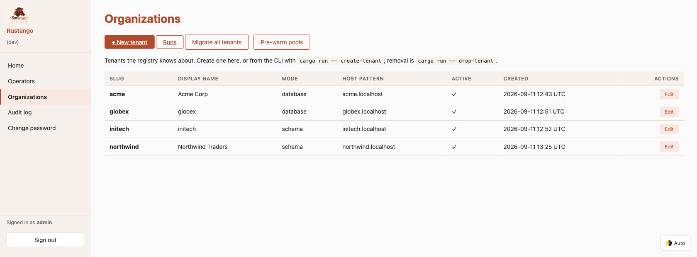
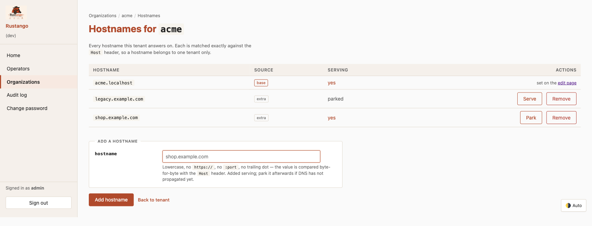
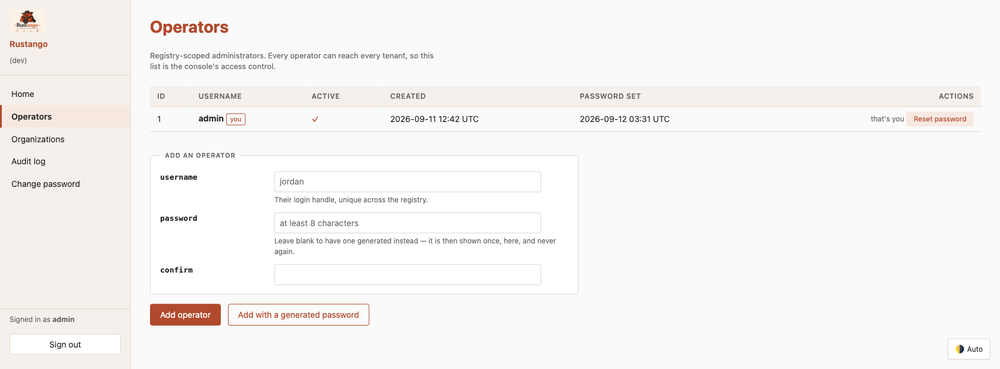
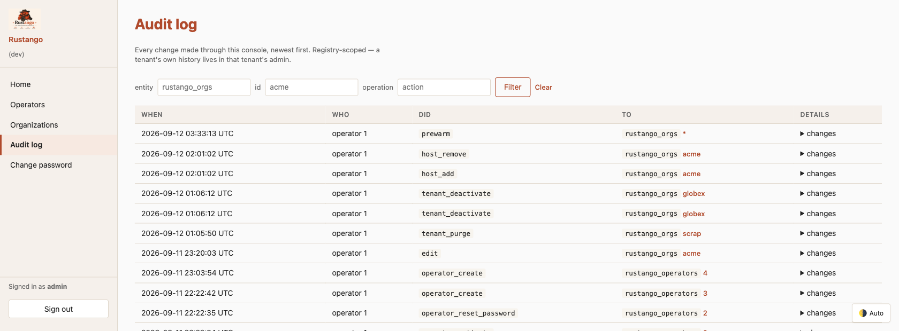
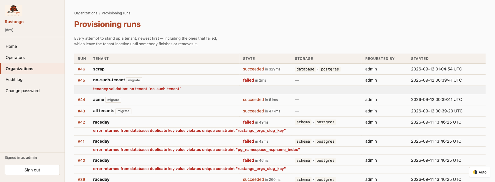

# La console opérateur

Un projet multi-tenant a deux sortes d'administrateurs, et elles ne se mélangent jamais :

- Les **opérateurs** exploitent le *déploiement*. Ils vivent dans le registry, se connectent sur le domaine apex et atteignent chaque tenant.
- Les **utilisateurs de tenant** exploitent *un* tenant. Ils vivent dans la base de ce tenant et ne voient jamais la console.

La console opérateur est l'interface web de la première sorte — provisionner des tenants, attacher des noms d'hôte, gérer les opérateurs, lire la piste d'audit et mettre un tenant hors service. Tout cela est aussi un [verbe `manage`](manage.md#commandes-de-tenancy), car une action qui n'existe que sur une seule surface ne peut pas être automatisée, et une qui n'existe que dans un shell ne peut pas être déléguée.

[](../img/operator-console.png)

## Table des matières

- [Le monter](#le-monter)
- [Ce que fait chaque page](#ce-que-fait-chaque-page)
- [Noms d'hôte](#noms-dhôte)
- [Opérateurs](#opérateurs)
- [Le journal d'audit](#le-journal-daudit)
- [Exécutions de provisioning](#exécutions-de-provisioning)
- [Les trois niveaux de capacité](#les-trois-niveaux-de-capacité)

---

## Le monter

La console est un routeur que vous montez ; ce qu'elle peut faire dépend de ce que vous lui confiez.

```rust
use rustango::tenancy::operator_console::{router, router_with_pools, router_with_provisioning, SessionSecret};

// Lecture seule : parcourir les tenants, les opérateurs et le journal d'audit.
let app = router(registry.clone(), SessionSecret::from_env_or_random());

// …plus l'édition des tenants, la gestion des opérateurs et des noms d'hôte, le préchauffage des pools.
let app = router_with_pools(registry.clone(), pools.clone(), secret);

// …plus le provisioning de nouveaux tenants et l'exécution des migrations.
let app = router_with_provisioning(registry.clone(), pools.clone(), provisioner, secret);
```

Dans un projet `tenant` généré, tout est déjà câblé — `Cli::new().tenancy().with_tenant_provisioning("migrations")` monte la version complète. Voir [Échafaudage](scaffolding.md).

La console répond sur le domaine **apex** (`RUSTANGO_APEX_DOMAIN`), pas sur un sous-domaine de tenant : `http://localhost:8080/login` avec l'apex `localhost`. Une requête vers `127.0.0.1` n'est pas l'apex et ne correspondra pas.

---

## Ce que fait chaque page

| Page | À quoi elle sert |
|---|---|
| **Organizations** | Chaque tenant, avec mode de stockage, motif d'hôte et état actif |
| **Organizations → Edit** | Nom affiché, motif d'hôte, préfixe de chemin, port, URL de base, identité visuelle |
| **Hostnames** | Les domaines supplémentaires auxquels un tenant répond |
| **Operators** | Qui peut se connecter à cette console |
| **Audit log** | Chaque changement effectué via la console |
| **Runs** | Exécutions de provisioning et de migration, diffusées en direct |

---

## Noms d'hôte

Un tenant est joignable à son sous-domaine et, en option, aux noms d'hôte supplémentaires que vous lui attachez. Un nom d'hôte mène à exactement un tenant.

[](../img/operator-console-hosts.png)

Deux choses à savoir :

**L'hôte de base n'a pas de bouton de suppression.** Il provient de la colonne `host_pattern` du tenant et non de la table des noms d'hôte : il n'y a donc pas de ligne à retirer — changez-le sur la page d'édition du tenant. C'est structurel, pas une règle d'interface : le moteur le refuse aussi, si bien qu'un opérateur qui devine le `POST` obtient la même réponse que celui qui lit la page.

**La mise en attente conserve la ligne.** *Park* retire un hôte du service sans perdre l'enregistrement — utile pendant la propagation DNS, ou pour retirer un domaine que vous voudrez peut-être récupérer. *Serve* le remet en service.

Les noms d'hôte sont normalisés à l'entrée : minuscules, sans schéma, sans port, sans chemin. La valeur stockée est comparée octet par octet à l'en-tête `Host`, donc une valeur qui ne pourrait jamais correspondre est refusée plutôt qu'enregistrée.

Depuis la CLI : [`list-hosts` / `add-host` / `remove-host` / `set-host-enabled`](manage.md#noms-dhôte).

---

## Opérateurs

[](../img/operator-console-operators.png)

Les opérateurs sont désactivés, jamais supprimés : la ligne reste, de sorte qu'un « qui a fait ça ? » se résout encore plus tard. La console la relit à **chaque** requête, si bien qu'une désactivation prend effet au clic suivant plutôt qu'à l'expiration du cookie.

Deux choses que la page refuse, pour la même raison :

- **Vous désactiver vous-même.** Votre requête suivante serait rejetée.
- **Désactiver le dernier opérateur actif.** Cela enferme tout le monde dehors, et seul un shell sur le registry pourrait le défaire.

Un mot de passe généré s'affiche **une fois**, dans le corps de la réponse — jamais via une redirection, qui le mettrait dans la barre d'adresse, l'historique, le référent et chaque journal d'accès intermédiaire.

Depuis la CLI : [`list-operators` / `set-operator-active`](manage.md#list-operators).

---

## Le journal d'audit

[](../img/operator-console-audit.png)

Chaque modification passée par la console est enregistrée : éditions de tenant, changements de noms d'hôte, gestion des opérateurs, usurpation d'identité, purges, préchauffages. La colonne `source` porte `operator:<id>:<verbe>`, ce qui permet de séparer après coup l'activité des opérateurs de celle des utilisateurs de tenant.

C'est le journal du **registry**. L'historique propre à un tenant vit dans l'admin de ce tenant — mélanger les deux imposerait d'éventer une requête sur chaque pool de tenant pour afficher une seule page.

Il grossit avec l'usage de la console : élaguez-le régulièrement avec [`audit-cleanup`](manage.md#audit-cleanup), qui balaie le journal du registry et celui de chaque tenant actif.

Depuis la CLI : [`audit-log`](manage.md#voir-ce-qui-sest-passé).

---

## Exécutions de provisioning

[](../img/operator-console-runs.png)

Provisionner un tenant, ce sont plusieurs étapes contre une base qui peut être lente ou injoignable : c'est donc enregistré comme une **exécution** plutôt que comme une requête qui aboutit ou non. Chaque exécution diffuse ses étapes en direct et survit à un rechargement, à une reconnexion, ou au fait d'être suivie depuis un second pod.

Les tenants créés depuis la CLI sont enregistrés eux aussi, marqués `requested_by = cli`, si bien que l'historique couvre les deux surfaces.

Depuis la CLI : [`list-runs` / `show-run`](manage.md#voir-ce-qui-sest-passé).

---

## Les trois niveaux de capacité

Les routes qui existent dépendent du constructeur que vous avez monté :

| | `router` | `router_with_pools` | `router_with_provisioning` |
|---|---|---|---|
| Parcourir tenants, opérateurs, journal d'audit | ✓ | ✓ | ✓ |
| Éditer un tenant, gérer les noms d'hôte | | ✓ | ✓ |
| Ajouter / désactiver des opérateurs | | ✓ | ✓ |
| Préchauffer les pools | | ✓ | ✓ |
| Mettre un tenant hors service | | ✓ | ✓ |
| Provisionner un tenant, exécuter les migrations | | | ✓ |
| Consulter les exécutions de provisioning | | | ✓ |

Les routes non montées renvoient 404 plutôt que 403 — une console en lecture seule n'annonce pas ce qu'elle ne sait pas faire.

**Chaque opérateur peut tout faire.** Il n'y a pas de garde-fous de permission par opérateur : un opérateur atteint chaque tenant et chaque action offerte par la console. La frontière de contrôle d'accès est la liste des opérateurs elle-même — c'est précisément pour cela qu'une désactivation prend effet à la requête suivante.
