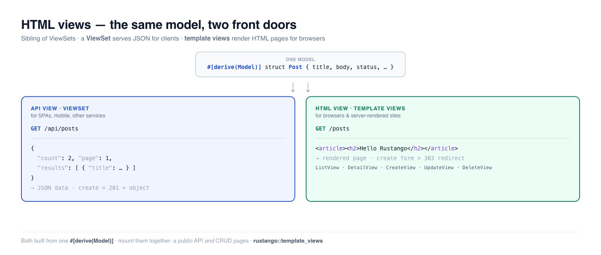

# HTML views — server-rendered pages

An HTML view turns a model into **server-rendered web pages** — a list page, a
detail page, and create/edit/delete forms — from one declaration. It's the
**sibling of [ViewSets](viewsets.md)**: where a ViewSet emits JSON for API
clients, an HTML view emits a rendered page for a browser. Both are built from
the same `#[derive(Model)]`, and you can serve a model *both* ways at once.

These are **Rustango**'s equivalent of Django's generic class-based views
(`ListView`, `DetailView`, `CreateView`, `UpdateView`, `DeleteView`) or Laravel's
resource controllers returning Blade views. They render through [Tera](https://keats.github.io/tera/)
templates.

[](img/html-views.png)

> **New to a term here?** If *model*, *template*, *router* or *server-rendered* are
> unfamiliar, the [glossary](glossary.md) explains each in plain language.

> **Source:** `rustango::template_views` (`ListView`, `DetailView`, `CreateView`,
> `UpdateView`, `DeleteView`, `TemplateView`, `RedirectView`) — behind the
> `template_views` feature (on by default).
>
> **Runnable version:** the API-vs-HTML example below is pinned by the
> framework test
> [`html_and_api_contrast_sqlite_live.rs`](../crates/rustango/tests/html_and_api_contrast_sqlite_live.rs)
> (`cargo test -p rustango --features sqlite --test html_and_api_contrast_sqlite_live`).
> The individual views are covered by `template_view.rs` and
> `template_views_context_object_name_sqlite_live.rs`.

## Table of contents

- [API views vs HTML views — which do you want?](#api-views-vs-html-views--which-do-you-want)
- [The five model views](#the-five-model-views)
- [ListView](#listview) · [DetailView](#detailview)
- [CreateView, UpdateView, DeleteView](#createview-updateview-deleteview)
- [The Tera context](#the-tera-context)
- [TemplateView and RedirectView](#templateview-and-redirectview)
- [Single-tenant vs multi-tenant](#single-tenant-vs-multi-tenant)
- [Serving one model both ways](#serving-one-model-both-ways)
- [See also](#see-also)

---

## API views vs HTML views — which do you want?

This is the first decision. Both turn a model into endpoints; they differ in
*what comes out* and *who's calling*.

| | **API view** — [ViewSet](viewsets.md) | **HTML view** — this guide |
|---|---|---|
| Module | `rustango::viewset` | `rustango::template_views` |
| Sends back | **JSON data** | a **server-rendered HTML page** |
| Built for | SPAs, mobile apps, other services | browsers, server-rendered sites, admin-style CRUD |
| A "create" | `POST` JSON → `201` + the new object | `POST` a form → `303` redirect to a success page |
| On bad input | `400` + a field-keyed JSON error map | re-render the form with the errors shown |
| Reads a list as | a paginated JSON envelope | a `<table>`/loop in your template |
| Usually authed by | tokens / JWT / API keys | session cookies |
| Django analogue | DRF `ModelViewSet` | generic class-based views |

You don't have to choose globally — pick per resource, and you can mount **both
on the same model** (see [below](#serving-one-model-both-ways)). Rules of thumb:

- Building a **JSON backend** for a frontend framework or mobile app → ViewSet.
- Building a **server-rendered site** (the server returns HTML pages) → HTML
  views.
- Need both (a public API *and* internal CRUD pages) → mount both.

> Looking for the JSON side? It has its own deep-dive: [ViewSets — CRUD REST
> APIs](viewsets.md).

---

## The five model views

Each view is `for_model(SCHEMA)` plus a `.router(prefix, tera, pool)`. Mounting
them at the same `prefix` (say `/posts`) gives the classic CRUD URL set:

| View | Renders | Routes mounted | Default template |
|---|---|---|---|
| [`ListView`](#listview) | a paginated list | `GET <prefix>` | `<table>_list.html` |
| [`DetailView`](#detailview) | one row | `GET <prefix>/{pk}` | `<table>_detail.html` |
| [`CreateView`](#createview-updateview-deleteview) | a new-record form | `GET`/`POST <prefix>/new` | `<table>_form.html` |
| [`UpdateView`](#createview-updateview-deleteview) | a prefilled edit form | `GET`/`POST <prefix>/{pk}/edit` | `<table>_form.html` |
| [`DeleteView`](#createview-updateview-deleteview) | a confirm page | `GET`/`POST <prefix>/{pk}/delete` | `<table>_confirm_delete.html` |

`<table>` is the model's table name, so a `Post` (table `posts`) looks for
`posts_list.html`, `posts_detail.html`, and so on. Override any of them with
`.template("my_name.html")`.

---

## ListView

A paginated list page. You provide a template that loops over `object_list`;
the view handles paging, ordering, filtering and search from query params.

```rust
use rustango::template_views::ListView;
use std::sync::Arc;
use tera::Tera;

let app = ListView::for_model(Post::SCHEMA)
    .page_size(20)                       // rows per page (?page=N to navigate)
    .order_by("published_at", true)      // default sort, true = DESC
    .filter_fields(&["status", "author_id"])  // ?status=published
    .search_fields(&["title", "body"])        // ?search=rust
    .router("/posts", Arc::new(tera), pool);
```

A matching `posts_list.html` — note `object_list` and the pagination variables
the view stamps for you:

```html
<h1>Posts ({{ total }})</h1>

  <article>
    <h2><a href="/posts/{{ post.id }}">{{ post.title }}</a></h2>
    <p>{{ post.body }}</p>
  </article>


<a href="?page={{ page - 1 }}">← prev</a>
page {{ page }} / {{ total_pages }}
<a href="?page={{ page + 1 }}">next →</a>
```

`?page=`, `?status=`, `?search=` and `?ordering=` work the same as on a ViewSet
list — the difference is purely that the result is a rendered page rather than a
JSON envelope. Use `.context_object_name("posts")` if you'd rather loop over
`posts` than `object_list` in the template.

---

## DetailView

One row, looked up from the URL. By default it matches the primary key
(`/posts/42`); point it at another column with `.lookup_field("slug")` for
pretty URLs (`/posts/my-first-post`). A missing row is a `404`.

```rust
use rustango::template_views::DetailView;

let app = DetailView::for_model(Post::SCHEMA)
    .lookup_field("slug")          // GET /posts/{slug} instead of /posts/{id}
    .router("/posts", Arc::new(tera), pool);
```

The template gets the row as `object`:

```html
<h1>{{ object.title }}</h1>
<p>{{ object.body }}</p>
<small>by author #{{ object.author_id }}</small>
```

---

## CreateView, UpdateView, DeleteView

The write side. Each handles a `GET` (render a form / confirm page) and a `POST`
(do the work, then **redirect**). The redirect-after-POST is the standard
**Post/Redirect/Get** pattern — it stops a browser refresh from re-submitting.

**CreateView** — `GET /posts/new` renders an empty form; `POST /posts/new`
inserts the row and `303`s to `success_url`:

```rust
use rustango::template_views::CreateView;

let app = CreateView::for_model(Post::SCHEMA)
    .success_url("/posts")         // where to send the browser after a save
    .router("/posts", Arc::new(tera), pool);
```

The form template (`posts_form.html`) is shared with UpdateView. `is_update`
tells the two apart, and `errors` carries any validation messages back:

```html
<form method="post">
  <input name="title" value="{{ object.title | default(value='') }}">
  <textarea name="body">{{ object.body | default(value='') }}</textarea>
  
    <p class="error">{{ field }}: {{ msgs | join(sep=', ') }}</p>
  
  <button>SaveCreate</button>
</form>
```

**Validation.** Schema rules (type, `max_length`, NOT NULL…) are enforced
automatically. Add your own with a closure validator — on `Err`, the form
re-renders with the messages and a `422` status instead of saving:

```rust
use rustango::forms::FormErrors;

CreateView::for_model(Post::SCHEMA)
    .validator(|data| {
        let mut errs = FormErrors::default();
        if data.get("title").map_or(true, |t| t.len() < 5) {
            errs.add("title", "must be at least 5 characters");
        }
        if errs.is_empty() { Ok(()) } else { Err(errs) }
    })
    .success_url("/posts")
    .router("/posts", Arc::new(tera), pool);
```

You can also reuse a `#[derive(Form)]` struct's validators with `.form::<F>()`
(validation-only for now — see the API docs).

**UpdateView** — `GET /posts/{pk}/edit` renders the same form prefilled from the
row (`object` is populated, `is_update` is `true`); `POST` updates and `303`s.

```rust
use rustango::template_views::UpdateView;

UpdateView::for_model(Post::SCHEMA)
    .success_url("/posts")
    .router("/posts", Arc::new(tera), pool);
```

**DeleteView** — `GET /posts/{pk}/delete` renders a confirmation page
(`posts_confirm_delete.html`, with `object`); `POST` deletes and `303`s.

```rust
use rustango::template_views::DeleteView;

DeleteView::for_model(Post::SCHEMA)
    .success_url("/posts")
    .router("/posts", Arc::new(tera), pool);
```

Mount all five at the same prefix and you have full HTML CRUD:

```rust
let app = axum::Router::new()
    .merge(ListView::for_model(Post::SCHEMA).router("/posts", tera.clone(), pool.clone()))
    .merge(DetailView::for_model(Post::SCHEMA).router("/posts", tera.clone(), pool.clone()))
    .merge(CreateView::for_model(Post::SCHEMA).success_url("/posts").router("/posts", tera.clone(), pool.clone()))
    .merge(UpdateView::for_model(Post::SCHEMA).success_url("/posts").router("/posts", tera.clone(), pool.clone()))
    .merge(DeleteView::for_model(Post::SCHEMA).success_url("/posts").router("/posts", tera, pool));
```

---

## The Tera context

Every view stamps a consistent context so templates port cleanly between them:

| View | Variables available in the template |
|---|---|
| `ListView` | `object_list` (the page's rows), `page`, `page_size`, `total`, `total_pages`, `has_next`, `has_prev` |
| `DetailView` | `object` (the row) |
| `CreateView` / `UpdateView` | `object` (empty on create, prefilled on update), `is_update` (bool), `errors`, `values` |
| `DeleteView` | `object` (the row to confirm) |

Rows are exposed as plain maps keyed by column name (`{{ post.title }}`), with
SQL `NULL` rendered as `null`. Use `.context_object_name("posts" / "post")` to
add a friendlier alias alongside `object_list` / `object`.

---

## TemplateView and RedirectView

Two model-free helpers for the pages every site has:

**TemplateView** — render a static template with a fixed context (an "about"
page, a landing page). No model, no database:

```rust
use rustango::template_views::TemplateView;

let app = TemplateView::new("about.html")
    .context_value("title", "About us")
    .router("/about", Arc::new(tera));
```

**RedirectView** — a permanent or temporary redirect at a URL (for moved pages):

```rust
use rustango::template_views::RedirectView;

let app = RedirectView::to("/posts").router("/old-posts");
```

---

## Single-tenant vs multi-tenant

Every model view ships two router constructors — same builder, pick the one that
matches how your app manages database connections:

- **`.router(prefix, tera, pool)`** — single-tenant; captures one pool at mount
  time. This is what the examples above use.
- **`.tenant_router(prefix, tera)`** — multi-tenant; resolves a per-request
  connection from the [`Tenant`](https://docs.rs) extractor. Available with the
  `template_views` + `tenancy` features. Templates port between the two
  unchanged.

This mirrors the ViewSet split (`router` / `router_pool` vs `tenant_router`).

---

## Serving one model both ways

You're not limited to one front door. Mount a JSON API *and* HTML pages over the
same model and pool — a public API for clients, server-rendered pages for
people:

```rust
use rustango::viewset::ViewSet;
use rustango::template_views::{ListView, DetailView};

let app = axum::Router::new()
    // JSON for API clients:
    .merge(ViewSet::for_model(Post::SCHEMA).router_pool("/api/posts", pool.clone()))
    // HTML pages for browsers:
    .merge(ListView::for_model(Post::SCHEMA).router("/posts", tera.clone(), pool.clone()))
    .merge(DetailView::for_model(Post::SCHEMA).router("/posts", tera, pool));
```

Now `GET /api/posts` returns the paginated JSON envelope and `GET /posts`
returns a rendered HTML list — same rows, same pool, two shapes. This exact
setup is what the [backing test](../crates/rustango/tests/html_and_api_contrast_sqlite_live.rs)
asserts.

---

## See also

- [ViewSets — CRUD REST APIs](viewsets.md) — the JSON/API counterpart, in depth.
- [Admin](admin.md) — the auto-generated admin is built on these same views.
- [URLs & routing](urls.md) — how to compose these routers into your app.
- [Serializers](serializers.md) — shape the JSON when you go the API route.
