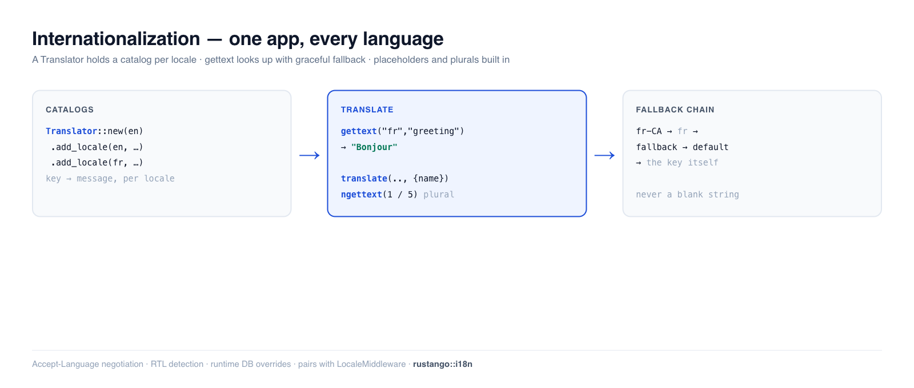

# Internationalization (i18n)

Internationalization is serving your app in the user's language. **Rustango**
splits it into two halves: **resolving** which locale a request wants (cookie →
`Accept-Language` → default — covered in [Middleware](middleware.md)), and
**translating** strings into that locale, which is this guide. The `Translator`
loads message catalogs per locale, substitutes `{placeholders}`, handles
plurals, and falls back gracefully — Django's `gettext` / ``, in Rust.

[](img/i18n.png)

> **New to a term here?** *locale*, *catalog*, *Accept-Language*, *pluralization*,
> *RTL* — see the [glossary](glossary.md).

> **Source:** `rustango::i18n` (`Translator`, `Locale`, `negotiate_language`,
> `plural_category`, `is_rtl_language`, `language_native_name`, and the
> `tera_tags` template bindings) — always compiled. The per-request
> locale/timezone *middleware* lives in `rustango::i18n::middleware` /
> `::timezone` (see [Middleware](middleware.md)).
>
> **Runnable version:** every snippet is copied from
> [`i18n_doc.rs`](https://github.com/ujeenet/rustango/blob/main/crates/rustango/tests/i18n_doc.rs)
> (`cargo test -p rustango --test i18n_doc`); DB-backed translation overrides are
> dogfooded by
> [`i18n_db_overrides_sqlite_live.rs`](https://github.com/ujeenet/rustango/blob/main/crates/rustango/tests/i18n_db_overrides_sqlite_live.rs).

## Table of contents

- [The two halves of i18n](#the-two-halves-of-i18n)
- [Step 1 — Build a Translator](#step-1--build-a-translator)
- [Step 2 — Translate strings (gettext)](#step-2--translate-strings-gettext)
- [Placeholders](#placeholders)
- [Pluralization](#pluralization)
- [Fallback order](#fallback-order)
- [Negotiating the language](#negotiating-the-language)
- [Right-to-left languages](#right-to-left-languages)
- [Translating in templates (Tera)](#translating-in-templates-tera)
- [Loading catalogs + runtime overrides](#loading-catalogs--runtime-overrides)
- [See also](#see-also)

---

## The two halves of i18n

| Concern | Where | What it does |
|---|---|---|
| **Resolve** the locale | [`i18n::middleware::LocaleMiddleware`](middleware.md#locale-aware-middleware) | picks a locale per request (cookie → Accept-Language → default) and exposes the `ActiveLocale` extractor |
| **Translate** strings | `i18n::Translator` (this guide) | looks up a message key in the active locale's catalog |
| Render dates in the user's TZ | [`i18n::timezone`](middleware.md#timezone-aware-middleware) | the `{{ ts \| localtime }}` filter |

You wire the middleware once, then translate using the locale it resolved.

---

## Step 1 — Build a Translator

A `Translator` holds one **catalog** (a `key → message` map) per locale. Build it
with a default locale, then add catalogs:

```rust
use rustango::i18n::{Locale, Translator};
use std::collections::HashMap;

let mut en = HashMap::new();
en.insert("greeting".to_owned(), "Hello".to_owned());
en.insert("welcome".to_owned(), "Welcome, {name}!".to_owned());

let mut fr = HashMap::new();
fr.insert("greeting".to_owned(), "Bonjour".to_owned());

let translator = Translator::new(Locale::new("en"))   // default locale
    .add_locale(Locale::new("en"), en)
    .add_locale(Locale::new("fr"), fr);
```

Keep the `Translator` in your app state (it's cheap to clone-share) and look up
strings with the [`ActiveLocale`](middleware.md#locale-aware-middleware) the
middleware resolved.

---

## Step 2 — Translate strings (gettext)

`gettext(locale, key)` returns the message for that locale — and degrades safely
when something's missing:

```rust
translator.gettext("en", "greeting");      // "Hello"
translator.gettext("fr", "greeting");      // "Bonjour"

translator.gettext("en", "missing.key");   // "missing.key"  — returns the key, never panics
translator.gettext("de", "greeting");      // "Hello"        — unknown locale → default
```

A missing key returns the key itself, so an untranslated string shows up
visibly rather than crashing the page.

---

## Placeholders

Messages can carry `{name}` placeholders; `translate` substitutes them from
key/value pairs:

```rust
// catalog: "welcome" = "Welcome, {name}!"
translator.translate("en", "welcome", &[("name", "Ada")]);   // "Welcome, Ada!"
```

`gettext` is the no-placeholder shorthand; `translate` (and `gettext_fmt`) take
params.

---

## Pluralization

Plurals differ by language *and* count. `ngettext` is the two-form shorthand: it
picks the singular key for the CLDR `one` category and the plural key otherwise,
binding `{count}` automatically:

```rust
// catalog: "cart.one" = "1 item",  "cart.other" = "{count} items"
translator.ngettext("en", "cart.one", "cart.other", 1);   // "1 item"
translator.ngettext("en", "cart.one", "cart.other", 5);   // "5 items"
```

Use `ngettext_fmt` to pass extra placeholders alongside `{count}`.

### Languages with more than two forms

Polish, Ukrainian, Russian, Arabic and others have `few` / `many` forms a
singular/plural pair can't express. `plural_category(locale, n)` returns the CLDR
category (`one` / `few` / `many` / `other`), and `translate_plural` picks the
matching form from a **per-category catalog** — one entry per key holding all its
forms:

```rust
use rustango::i18n::plural_category;

plural_category("en", 1);   // "one"
plural_category("fr", 0);   // "one"   — French treats 0 as singular
plural_category("pl", 2);   // "few"   — Polish 2–4
plural_category("pl", 5);   // "many"

// pl plural catalog: "deleted_pages" → { one, few, many }
let n = 5;
translator.translate_plural("pl", "deleted_pages", n, &[("count", &n.to_string())]);
// → "Usunięto 5 stron."   (the `many` form)
```

A missing form falls back to `other`, then to the scalar lookup (and finally the
key), so an untranslated language still renders. East-Asian languages
(`zh`, `ja`, …) have a single `other` form.

---

## Fallback order

Lookups walk a chain so a partial translation never leaves a blank: the
**requested locale → its base language → the fallback chain → the default locale
→ the key itself**. So a French-Canadian request resolves against the `fr`
catalog:

```rust
// only "fr" is registered, not "fr-CA"
translator.gettext("fr-CA", "greeting");   // "Bonjour"  — base-language fallback
```

Set extra fallbacks with `Translator::new(default).with_fallback_chain(&["en"])`.

---

## Negotiating the language

If you're resolving the locale yourself (outside the middleware),
`negotiate_language` parses a browser `Accept-Language` header and picks the best
match from the locales you support:

```rust
use rustango::i18n::negotiate_language;

negotiate_language("fr-FR,fr;q=0.9,en;q=0.8", &["en", "fr"]);   // Some("fr")
negotiate_language("de,ja;q=0.5", &["en", "fr"]);               // None — fall back to default
```

This is exactly what `LocaleMiddleware` uses under the hood.

---

## Right-to-left languages

`is_rtl_language` (and `Locale::direction()`) tell you whether to set
`dir="rtl"` on the page — for Arabic, Hebrew, Persian, etc.:

```rust
use rustango::i18n::is_rtl_language;

is_rtl_language("ar");   // true
is_rtl_language("en");   // false
```

In a template: `<html dir="{{ direction }}">`, fed from the `ActiveLocale`. See
the [RTL note in Middleware](middleware.md#locale-aware-middleware).

---

## Translating in templates (Tera)

Everything above is the Rust API; in Tera templates — HTML views, and the admin
UI — the same `Translator` is exposed as filters/functions. Register them once
against the translator, and the active locale (the `LANG` context var the
middleware sets) drives every lookup:

```rust
rustango::i18n::tera_tags::register(&mut tera, translator.clone());
```

```jinja
{{ "Save" | translate(locale=LANG) }}
<button title="{{ "Delete" | translate(locale=LANG) }}">…</button>

{# count-aware: pass the count both as the selector `n` and as a {count} arg #}
{{ translate_plural(key="deleted_pages", n=num, locale=LANG, count=num) }}

<html lang="{{ LANG }}" dir="{{ get_text_direction(locale=LANG) }}">
```

The **key is the English source string** (gettext-style), so an untranslated
string renders in English rather than a blank — you wrap a UI string first and
translate it later, with no key registry to maintain.

This is exactly how **rustango-cms localizes its admin**: every chrome string
goes through `translate` / `translate_plural`, catalogs ship per locale under
`src/admin/locales/`, the active locale is resolved by the cookie → per-user
preference → `Accept-Language` → per-tenant default chain, and a sidebar switcher
plus a per-user **Preferences → Language** setting let editors choose. Operator
edits via the DB-override layer (below) take effect without a redeploy.

---

## Loading catalogs + runtime overrides

You rarely hand-build maps in production. Two loaders:

- **`Translator::from_directory(dir, default)`** — load one catalog file per
  locale from a directory at startup.
- **`Translator::from_settings(&settings.i18n)`** — wire it from your config.

And operators can edit translations **at runtime** without a redeploy:
`set_override(locale, key, value)` (or `load_overrides(rows)` from a table) layer
on top of the file catalogs and win for that key. This DB-override flow powers
the admin translation editor and is dogfooded in
`i18n_db_overrides_sqlite_live.rs`.

---

## See also

- [Middleware](middleware.md) — resolving the per-request locale (`LocaleMiddleware`,
  `ActiveLocale`) and the `{{ ts | localtime }}` timezone filter.
- [HTML views](html-views.md) · [The admin](admin.md) — where translated strings
  and the translation editor surface.
- [Glossary](glossary.md) — locale, catalog, RTL, and friends in plain language.
