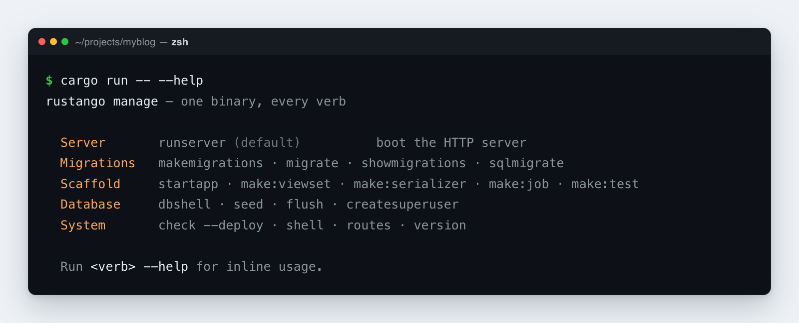

# `manage` CLI reference

This is **Rustango**'s command-line tool, like Django's `manage.py`, Laravel's
`artisan`, or Rails' `rails` command. In a project scaffolded via
`cargo rustango new`, one binary runs every command ("verb"):

```bash
cargo run                          # runserver (no args = boot the HTTP server)
cargo run -- migrate               # any other verb
cargo run -- --help                # full subcommand list
```

[](img/manage.png)

> **Source:** `rustango::manage` (`Cli`, the verb dispatcher) — behind the
> `manage` feature (on by default).
>
> **Runnable version:** every verb here runs in a scaffolded project; the
> [`getting_started_blog`](../crates/rustango/examples/getting_started_blog)
> example is driven by `cargo run -- migrate` and friends.

> **New to a term here?** *scaffold*, *migration*, *tenant* — see the
> [glossary](glossary.md).

The command router lives in [`rustango::manage::Cli`](https://docs.rs/rustango/latest/rustango/manage/struct.Cli.html);
your `src/main.rs` wires it up like this:

```rust
#[rustango::main]
async fn main() -> Result<(), Box<dyn std::error::Error>> {
    let _ = dotenvy::dotenv();
    rustango::manage::Cli::new().api(urls::api()).run().await
}
```

Multi-tenant projects add `.tenancy()` to the chain. That switches the
router to [`rustango::tenancy::manage`](https://docs.rs/rustango/latest/rustango/tenancy/manage/index.html)
and unlocks the multi-tenant commands.

> **Older shape** — projects scaffolded by `manage startapp --with-manage-bin`
> (or pre-v0.16 ones) still ship `src/bin/manage.rs`. Those use
> `cargo run --bin manage -- <verb>`. Both forms accept the same verbs.

Every command prints to stdout and exits with a non-zero code on
validation or I/O errors. Run `cargo run -- --help` (or `<verb> --help`)
for inline usage.

---

## Table of contents

- [Migrations](#migrations)
- [Data migrations](#data-migrations)
- [Project / app scaffolders](#project--app-scaffolders)
- [File generators (`make:*`)](#file-generators-make)
- [Database utilities](#database-utilities)
- [System commands](#system-commands)
- [Tenancy commands](#tenancy-commands)
- [Custom subcommands](#custom-subcommands)
- [Common workflows](#common-workflows)

---

## Migrations

### `makemigrations [name]`

Generates a migration file from changes to your models — like Django's
`makemigrations`. It compares your registered models against the last
saved schema snapshot in `migrations/` and writes a new JSON file with
whatever changed.

```bash
cargo run -- makemigrations                          # auto-name (e.g. 0004_add_slug_to_posts)
cargo run -- makemigrations rename_status_to_state   # custom suffix
```

**Auto-detected changes:**
- `CreateTable` / `DropTable`
- `AddColumn` / `DropColumn`
- `AlterColumnType` / `AlterColumnNullable` / `AlterColumnDefault` / `AlterColumnMaxLength`
- `AlterColumnUnique`
- `CreateIndex` / `DropIndex`
- `AddCheckConstraint` / `DropCheckConstraint`
- `CreateM2MTable` / `DropM2MTable`

**NOT auto-detected** (rename vs drop+add is ambiguous):
- `RenameTable`, `RenameColumn` — use `--empty` and edit the JSON.

### `makemigrations --app <app>`

Scopes the migration to a single app. It writes to that app's own
`<project_root>/<app>/migrations/` directory and only looks at models
belonging to that app.

```bash
cargo run -- makemigrations --app blog
cargo run -- makemigrations --app blog backfill_slugs
```

### `makemigrations --scope <registry|tenant>`

Multi-tenant only. Writes a single migration for just the models in one
scope — those whose `#[rustango(scope = "...")]` attribute matches.
("Registry" tables are shared across all tenants; "tenant" tables live
per tenant.) Without this flag, a plain `makemigrations` in a tenancy
project automatically splits the changes into TWO files — one for
registry models, one for tenant models — so shared framework tables
(`Org`, `Operator`) don't leak into the per-tenant migrations that
`migrate-tenants` runs.

```bash
cargo run -- makemigrations                       # tenancy: writes 0NN_<auto>.json (registry) + 0MM_<auto>.json (tenant) as needed
cargo run -- makemigrations --scope tenant        # explicit single-scope diff
cargo run -- makemigrations --scope registry      # explicit single-scope diff
```

Why the split matters: before v0.24.2, a plain `makemigrations` on a
tenancy project bundled operations on `rustango_operators` (a registry
table) into a tenant migration. When `migrate-tenants` ran that file,
`rustango_operators` resolved via `search_path` to the registry copy
and clashed with the constraint already there.

### `makemigrations --empty <name>`

Creates a blank migration (no `forward` operations) for you to fill in
by hand — like Django's `makemigrations --empty`. Use it when you need
to write data operations or rename operations the auto-detector can't
generate. Edit the resulting JSON yourself.

```bash
cargo run -- makemigrations --empty rename_status_to_state
# Then edit migrations/0005_rename_status_to_state.json:
#   "forward": [
#     {"schema": {"RenameColumn": {"table": "posts", "old_column": "status", "new_column": "state"}}}
#   ]
```

### `makemigrations --merge`

Fixes a migration history that has split into two branches — same idea
as Django's `makemigrations --merge` (issue #346). This happens when two
people each run `makemigrations` on their own feature branch, so both
new files point at the same parent. After both branches merge, the
history has two "leaves" (end points), and the next `makemigrations`
would arbitrarily pick one as its parent.

`--merge` detects this and writes an empty `NNNN_merge.json` whose parent
points at the last leaf alphabetically, reuniting the history into one
chain. Its schema snapshot reflects the combined state, read from the
live model registry — both branches' models are compiled in at this
point, so the snapshot is accurate.

```bash
cargo run -- makemigrations --merge
# wrote migrations/0004_merge.json
#     merge node — empty `forward`, anchors the chain after divergent leaves
```

- **Already a single chain** → prints `no merge needed` and exits
  cleanly. Safe to run on a healthy history.
- **Genuinely separate histories** (not a branch collision) → errors
  out instead of inventing a parent. Same safeguard Django uses.
- **Cannot be combined** with `--empty`, `--app`, `--scope`, or a
  positional name.

### `migrate`

Applies all pending migrations to the database, in order — like Django's
`migrate` or Laravel's `php artisan migrate`. This is the command you run
after `makemigrations` to actually change your schema.

```bash
cargo run -- migrate
cargo run -- migrate --dry-run                       # print SQL without writing
```

Each file runs inside a transaction by default, so a failure rolls the
whole file back. Set `"atomic": false` in the JSON to opt out — you need
that for statements like `CREATE INDEX CONCURRENTLY` that can't run in a
transaction.

In **tenancy mode** (`Cli::tenancy()`), `migrate` is scope-aware: it
first applies registry migrations to the shared registry database, then
applies tenant migrations across every active tenant. For finer control,
use [`migrate-registry`](#migrate-registry) /
[`migrate-tenants`](#migrate-tenants).

### `migrate <target>`

Migrates to a specific point in the history, forward or backward — like
Django's `migrate <app> <name>`. Name a migration to move to it; the
special target `zero` undoes everything.

```bash
cargo run -- migrate 0003_add_slug      # forward to 0003
cargo run -- migrate 0001_initial       # roll back to 0001 (unapply 0002+)
cargo run -- migrate zero               # unapply EVERY migration
```

### `downgrade [N]`

Rolls back the last N applied migrations (default 1) — Laravel's
`migrate:rollback`. Each migration must be reversible: schema changes
reverse automatically, but data operations need a `reverse_sql` defined
or the rollback fails.

```bash
cargo run -- downgrade                  # one step
cargo run -- downgrade 3                # three steps
```

### `showmigrations` / `status`

Lists every migration and whether it's been applied — like Django's
`showmigrations`. `[X]` means applied, `[ ]` means still pending.

```bash
cargo run -- showmigrations
cargo run -- status                     # alias
```

Output:

```
[X] 0001_initial
[X] 0002_add_status
[ ] 0003_add_slug
```

---

## Data migrations

### `add-data-op`

Adds a raw-SQL data step to a migration without editing JSON by hand.
Reach for this when you need to transform existing rows — backfill a
column, clean up data — as part of a migration. It's the equivalent of
Django's `RunSQL` data migration, generated for you from the command
line.

```bash
# New migration with up + down
cargo run -- add-data-op \
    --sql "UPDATE posts SET slug = lower(title)" \
    --reverse-sql "UPDATE posts SET slug = NULL" \
    --name backfill_post_slugs

# Append to an existing migration
cargo run -- add-data-op \
    --to 0003_add_slug \
    --sql "UPDATE posts SET slug = id::text"

# Irreversible (no rollback)
cargo run -- add-data-op \
    --sql "DELETE FROM legacy_data" \
    --name purge_legacy
```

| Flag | Required | Description |
|---|:-:|---|
| `--sql <SQL>` | yes | Forward SQL to run on `migrate` |
| `--reverse-sql <SQL>` | no | Rollback SQL on `unapply`; omit for irreversible |
| `--name <name>` | no | New-migration name suffix; defaults to `data_op` |
| `--to <migration>` | no | Append to an existing migration instead of creating one |

Leave off `--reverse-sql` and the step is marked `reversible: false` —
any attempt to roll it back fails immediately.

---

## Project / app scaffolders

### `cargo rustango new <name>` *(separate binary)*

Creates a brand-new **Rustango** project — like `django-admin startproject`
or `laravel new`. This is a separate tool, so install it first with
`cargo install cargo-rustango`. Pick from three templates:

```bash
cargo rustango new myblog                          # default = fullstack (ORM + admin)
cargo rustango new myapi --template api            # JSON-only, no admin
cargo rustango new shop --template tenant          # multi-tenancy
```

Writes:

```
<name>/
  Cargo.toml
  .env.example
  .gitignore
  rust-toolchain.toml
  docker-compose.yml
  README.md
  migrations/                               (tenant template only — bootstrap JSONs)
  src/{main,models,views,urls}.rs
```

The tenant template writes
`migrations/0001_rustango_registry_initial.json` and
`0001_rustango_tenant_initial.json` for you — see
[`init-tenancy`](#init-tenancy) for what they contain and when to
regenerate them.

### `startapp <name> [flags]`

Creates a new app (a feature module) under `src/<name>/` — exactly like
Django's `startapp`. Use it to keep models, views, and URLs for one part
of your project grouped together.

```bash
cargo run -- startapp blog
cargo run -- startapp shop --with-manage-bin             # also writes src/bin/manage.rs
cargo run -- startapp shop --with-bootstrap-migration    # tenancy: also seed bootstrap migrations
cargo run -- startapp shop --into apps                   # write under src/apps/shop/ instead
```

Creates:

```
src/<name>/
  mod.rs
  models.rs
  views.rs
  urls.rs
  migrations/                               (when --with-bootstrap-migration on tenancy)
```

Safe to re-run — existing files are left alone. One manual step: add
`pub mod <name>;` to `src/lib.rs` so Rust compiles the new module.

`--with-bootstrap-migration` is tenancy-only. It runs
[`init-tenancy`](#init-tenancy) inside the new app's `migrations/`
directory, writing the framework's registry and tenant bootstrap files
there. Skip it if you already have those bootstrap files at the project
root.

---

## File generators (`make:*`)

These create starter files for common building blocks — much like
Laravel's `make:*` commands (`make:controller`, `make:model`, …). Each
generator writes to `src/<snake_name>.rs` (or `tests/<snake_name>.rs`
for `make:test`) and:

- Checks the name is valid (PascalCase, letters/digits/underscore).
- Converts it to snake_case for the filename (`PostViewSet` →
  `post_view_set.rs`).
- Won't overwrite an existing file.
- Reminds you to add `pub mod X;` to your `lib.rs`.

### `make:viewset <Name> [--model <Model>]`

Generates a `#[derive(ViewSet)]` struct — a REST endpoint for a model,
like a Django REST Framework ViewSet. The field lists come pre-stubbed
for you to fill in.

```bash
cargo run -- make:viewset PostViewSet --model Post
```

Generated `src/post_view_set.rs`:

```rust
#[derive(ViewSet)]
#[viewset(model = Post, fields = "id, ", filter_fields = "", search_fields = "", page_size = 20)]
pub struct PostViewSet;
```

Mount with: `.merge(PostViewSet::router("/api/posts", pool.clone()))`.

### `make:serializer <Name> [--model <Model>]`

Generates a `#[derive(Serializer)]` struct — controls how a model is
converted to and from JSON (like a DRF serializer).

```bash
cargo run -- make:serializer PostSerializer --model Post
```

### `make:form <Name>`

Generates a `#[derive(Form)]` struct for validating and processing form
input — like a Django `Form`.

```bash
cargo run -- make:form ContactForm
```

### `make:job <Name>`

Generates a background-job skeleton (work that runs outside the
request, like a Celery task or a Laravel job), with a commented example
of how to schedule it.

```bash
cargo run -- make:job EmailDigestJob
```

### `make:notification <Name>`

Generates a notification struct that builds an email — like Laravel's
`make:notification`.

```bash
cargo run -- make:notification WelcomeEmail
```

### `make:middleware <Name>`

Generates a middleware function — code that runs before and after each
request (auth checks, logging, and so on). "axum" is the web framework
**Rustango** is built on, so the stub matches axum's middleware shape.

```bash
cargo run -- make:middleware AuditLog
```

### `make:test <Name>`

Generates an integration test in `tests/` that uses `TestClient` to
make requests against your app.

```bash
cargo run -- make:test post_smoke
```

---

## Database utilities

### `db:info`

Shows which database this build is configured to talk to, without
connecting. It prints the framework version, which database drivers
(`postgres`/`mysql` Cargo features) are compiled in, the connection URL
with the password hidden, and the detected backend. Because it never
opens a connection, it's handy in CI or containers where the database
isn't up yet but you want to confirm the settings are right.

```bash
cargo run -- db:info
```

### `db:dump [--out <path>] [--data-only|--schema-only] [--no-owner]`

Backs up your database by running `pg_dump` against `DATABASE_URL` —
like `php artisan db:dump`. By default the SQL goes to stdout (so you
can pipe it); pass `--out <path>` (`-o`) to write a file instead.
`--data-only` and `--schema-only` map straight to `pg_dump`'s flags, and
`--no-owner` drops the OWNER lines. You need `pg_dump` installed and on
your `PATH`.

```bash
cargo run -- db:dump > backups/before-migrate.sql    # stdout → file
cargo run -- db:dump --out backups/before-migrate.sql
```

### `db:restore <path> [--clean]`

Loads a dump file back into your database — the counterpart to
`db:dump`. It runs the file through `psql` against `DATABASE_URL` with
`ON_ERROR_STOP=1`, so it stops at the first error. Add `--clean` to wipe
the existing schema first (it prepends
`DROP SCHEMA IF EXISTS public CASCADE; CREATE SCHEMA public;`) so the
restore lands on an empty database. You need `psql` on your `PATH`.

```bash
cargo run -- db:restore backups/before-migrate.sql
cargo run -- db:restore backups/before-migrate.sql --clean
```

---

## System commands

### `version` / `--version`

Prints the **Rustango** framework version.

```bash
$ cargo run -- version
rustango 0.43.0
```

### `about`

Prints a snapshot of your environment: framework version, registered
models and apps, whether the database is reachable, and key environment
variables. Drop this into support tickets when something's wrong.

```bash
$ cargo run -- about
rustango
  version:        0.43.0
  models:         3 registered
  apps:           1 (blog)
  RUSTANGO_ENV:   local
  DATABASE_URL:   postgres://***@localhost:5433/myblog
  db_connect:     ok
```

### `check [--deploy]`

Runs health checks on your project — like Django's `check`. Add
`--deploy` for the stricter production-readiness checks, the same way
Django's `check --deploy` works.

**Always-on checks:**
- ≥ 1 model registered via `inventory`
- DB reachable (`SELECT 1`)
- Migration count vs model count

**With `--deploy`:**
- `RUSTANGO_ENV` is `prod` or `production`
- `RUSTANGO_SESSION_SECRET` set and ≥ 32 bytes (the HMAC key for
  cookies + JWTs; `SECRET_KEY` is never read by the framework)
- `DATABASE_URL` set
- `RUSTANGO_APEX_DOMAIN` set (tenancy projects)

```bash
$ cargo run -- check --deploy
running rustango system check (deploy mode)...
  [info]    3 models registered via inventory
  [info]    database reachable
  [info]    4 migration(s) on disk
  [info]    RUSTANGO_SESSION_SECRET length OK
all checks passed
```

Exits non-zero if any error-level check fails. Warnings alone don't
cause a failure.

### `docs`

Opens the **Rustango** docs (<https://docs.rs/rustango>) in your browser. It
always prints the URL too, so it still works on a headless server.

```bash
cargo run -- docs
```

### `--help` / `help`

Lists every command with a one-line description. In tenancy mode, the
multi-tenant commands listed below are added too.

---

## Tenancy commands

These commands exist only in multi-tenant projects (one app serving many
isolated customers/orgs). They show up only when the project is built
with `features = ["tenancy"]` AND `Cli::new()` is chained with
`.tenancy()`.

### `init-tenancy`

Writes the framework's starter migrations for multi-tenancy into your
migrations directory. It creates `0001_rustango_registry_initial.json`
(which builds the shared `rustango_orgs` and `rustango_operators`
tables) and `0001_rustango_tenant_initial.json` (which builds the
per-tenant `rustango_users` table).

```bash
cargo run -- init-tenancy
```

**Safe to re-run**: if those files already exist, they're left alone.
Most of the time this command runs for you indirectly:

- `cargo rustango new --template tenant` writes the same JSONs from a
  static template, so a freshly scaffolded project never needs
  `init-tenancy`.
- `startapp --with-bootstrap-migration` runs it against a per-app
  migrations directory.
- `Builder::migrate(project_root)` runs it implicitly before applying
  pending migrations.

If you've chained `.user_model::<AppUser>()` on `Cli`, this command
builds the starter migration from your `AppUser` schema instead of the
framework's `User`, so your extra columns end up in the `CREATE TABLE`.
See [Custom user model](#custom-user-model-extra-columns-on-rustango_users)
below.

### `migrate-registry`

Applies only the registry migrations — the shared, cross-tenant tables.
The registry holds `rustango_orgs` and `rustango_operators` plus any
registry-scoped tables you define. Tenant tables are untouched.

```bash
cargo run -- migrate-registry
```

### `migrate-tenants`

Applies tenant migrations to every active tenant, one after another.
Each tenant uses its own connection (its own schema or database), and if
one tenant fails, the rest still run — the command reports the outcome
per tenant at the end.

```bash
cargo run -- migrate-tenants
```

For the common case, plain `migrate` already does registry first, then
tenants — reach for `migrate-tenants` only when you need that step on
its own.

### `runserver` / `run-server`

Starts the multi-tenant web server — Django's `runserver`. In a tenancy
project this is the same as bare `cargo run`; the named form exists so
custom binaries that parse their own arguments can still trigger it.

```bash
cargo run                        # implicit
cargo run -- runserver           # explicit
```

### `create-tenant <slug> [options]`

Sets up a new tenant (customer/org) and applies the tenant migrations to
it. The `<slug>` is its short identifier. Safe to re-run — calling it
again on an existing tenant won't duplicate anything.

```bash
cargo run -- create-tenant acme --display-name "ACME Corp"
cargo run -- create-tenant beta --mode database --database-url postgres://...
```

| Flag | Description |
|---|---|
| `--display-name <name>` | Human-readable label shown in admin sidebars |
| `--mode schema \| database` | Storage mode (default: schema) |
| `--database-url <url>` | Tenant-specific DB URL (required for database mode) |
| `--host-pattern <pattern>` | Override the host pattern used by `SubdomainResolver` |
| `--no-migrate` | Skip applying tenant-scoped migrations after provisioning |

### `drop-tenant <slug> [--confirm <slug>]`

Deactivates a tenant by setting `active = false`. This is the soft,
reversible option — the tenant's data stays on disk, and re-running
`create-tenant` brings it back. When you're not running interactively
(no terminal attached), you must pass `--confirm <slug>` with the slug
typed again to confirm.

```bash
cargo run -- drop-tenant acme --confirm acme
```

### `purge-tenant <slug> [--confirm <slug>] [--purge-database]`

**Permanently deletes a tenant.** It drops the tenant's schema and
removes its row from `rustango_orgs`, with no undo. When you're not
running interactively (no terminal attached), you must pass
`--confirm <slug>` with the slug typed again. For database-mode tenants,
the underlying database is left in place unless you also pass
`--purge-database`.

```bash
cargo run -- purge-tenant acme --confirm acme
cargo run -- purge-tenant beta --confirm beta --purge-database   # database-mode: also DROP DATABASE
```

### `list-tenants`

Lists every tenant with its storage mode and active/inactive status.

```bash
cargo run -- list-tenants
```

### `create-operator <username> --password <pwd>`

Creates an operator — a global admin who can manage every tenant from a
cross-tenant console. Operators live in the shared registry, not inside
any one tenant.

```bash
cargo run -- create-operator admin --password letmein
```

### `create-user <tenant> <username> --password <pwd> [--superuser]`

Creates a user inside one tenant — roughly Django's `createsuperuser`,
but scoped to a single tenant.

```bash
cargo run -- create-user acme alice --password hunter2 --superuser
```

`--superuser` sets `is_superuser = true` for that user inside the
tenant. That makes them an admin of the tenant (full write access in the
tenant admin), but it never grants access to the cross-tenant operator
console.

### `create-role <tenant> <name>`

Creates a role (a named bundle of permissions, like a Django group)
inside one tenant.

```bash
cargo run -- create-role acme editor
```

### `list-roles <tenant>`

Lists the roles defined in a given tenant.

```bash
cargo run -- list-roles acme
```

### `assign-role <tenant> <username> <role>`

Gives a user one of the tenant's roles.

```bash
cargo run -- assign-role acme alice editor
```

### `revoke-role <tenant> <username> <role>`

Removes a role from a user — the reverse of `assign-role`.

```bash
cargo run -- revoke-role acme alice editor
```

### `grant-perm <tenant> <role-name|username> <codename> [--role]`

Grants a single permission. By default the second argument is a
**username**, so the permission goes straight to that user; add `--role`
to grant it to a role instead. Permission codenames use Django's
`<app>.<action>_<model>` format (`blog.add_post`, `blog.change_post`,
…). The `auto_create_permissions` feature creates the four standard CRUD
codenames automatically for any model marked `#[rustango(permissions)]`.

```bash
cargo run -- grant-perm acme alice blog.change_post           # grant to user alice
cargo run -- grant-perm acme editor blog.change_post --role   # grant to role editor
```

### `revoke-perm <tenant> <role-name|username> <codename> [--role]`

Removes a permission — the reverse of `grant-perm`. Targets a user by
default; add `--role` to revoke it from a role instead.

```bash
cargo run -- revoke-perm acme alice blog.change_post
cargo run -- revoke-perm acme editor blog.change_post --role
```

### `create-api-key <tenant> <username> [--label <s>]`

Issues an API key for a tenant user. The full token is printed **once**
and never again — copy it now, because only its prefix and a hash are
stored.

```bash
cargo run -- create-api-key acme alice --label "ci-bot"
```

### `audit-cleanup`

Prunes old entries from the audit log (`rustango_audit_log`) to keep it
from growing forever. Trim by age (`--days`) or by count (`--keep-last`),
and optionally limit it to one tenant.

```bash
cargo run -- audit-cleanup --days 90                       # delete > 90 days old
cargo run -- audit-cleanup --keep-last 50                  # keep most recent 50 per row
cargo run -- audit-cleanup --keep-last 50 --tenant acme    # scoped
```

---

## Custom user model (extra columns on `rustango_users`)

This is **Rustango**'s version of Django's "custom user model" — how you add
your own fields to the user table. The built-in tenant `User` has seven
fixed columns: `id`, `username`, `password_hash`, `is_superuser`,
`active`, `created_at`, plus a `data` JSONB column (a flexible
JSON blob) for any extra per-user metadata. **For most apps that JSONB
column is all you need** — no migration, no override, no surprises.

When you want **typed, indexable** columns on `rustango_users` instead,
there are two approaches. They're not interchangeable; pick the one that
fits where your project is in its life.

### Option 1 — Sibling profile model with FK *(works on any project)*

Best when the project already exists, or when you'd rather leave the
framework's `User` table as the single source of truth.

```rust
#[derive(rustango::Model)]
pub struct UserProfile {
    #[rustango(primary_key)] pub id: rustango::sql::Auto<i64>,
    #[rustango(fk = "rustango_users")] pub user_id: i64,
    #[rustango(max_length = 128, default = "''")] pub display_name: String,
    #[rustango(max_length = 64, default = "'UTC'")] pub timezone: String,
}
```

Run `cargo run -- makemigrations` then `cargo run -- migrate`, and you
have a typed extras table linked to the user by foreign key. Read it
with the ORM:

```rust
let profile = UserProfile::objects()
    .where_(UserProfile::user_id.eq(user.id.get().copied().unwrap()))
    .first(&pool).await?;            // Option<UserProfile>
```

Tradeoff: one extra row and a JOIN on every access. Upside: zero risk of
breaking framework auth.

### Option 2 — `Cli::user_model::<AppUser>()` *(greenfield only)*

Use this only on a fresh project where you want the extra fields right
on the `rustango_users` table itself. The `init-tenancy` command then
generates a starter migration whose `CREATE TABLE rustango_users`
includes your columns.

**Step 1.** Define your model. It has to declare every framework-required
column exactly (`id`, `username`, `password_hash`, `is_superuser`,
`active`, `created_at`, `data`), plus your extras. Each extra column must
either allow `NULL` or have a `default = "…"`.

```rust
use rustango::sql::Auto;

#[derive(rustango::Model, Debug, Clone)]
#[rustango(table = "rustango_users")]
pub struct AppUser {
    #[rustango(primary_key)] pub id: Auto<i64>,
    #[rustango(max_length = 64, unique)] pub username: String,
    #[rustango(max_length = 255)] pub password_hash: String,
    pub is_superuser: bool,
    pub active: bool,
    pub created_at: chrono::DateTime<chrono::Utc>,
    #[rustango(default = "'{}'")] pub data: serde_json::Value,
    // extras —
    #[rustango(max_length = 128, default = "''")] pub display_name: String,
    #[rustango(max_length = 64, default = "'UTC'")] pub timezone: String,
}
impl rustango::tenancy::TenantUserModel for AppUser {}
```

**Step 2.** Wire the override into `main.rs`:

```rust
#[rustango::main]
async fn main() -> Result<(), Box<dyn std::error::Error>> {
    rustango::manage::Cli::new()
        .api(my_app::urls::router())
        .tenancy()
        .user_model::<AppUser>()
        .run().await
}
```

**Step 3.** Make sure no starter migration exists yet. If you ran
`cargo rustango new --template tenant`, the scaffolder already wrote
`migrations/0001_rustango_{registry,tenant}_initial.json` from a static
template — those use the framework's `User`, and `init-tenancy` won't
overwrite them. So either:

- delete both `0001_rustango_*_initial.json` files before continuing, or
- start from a non-template `cargo new` and skip the scaffolder.

**Step 4.** Generate + apply:

```bash
cargo run -- init-tenancy        # writes 0001_*.json using AppUser's schema
cargo run -- migrate             # creates rustango_users with your extras
```

**Caveats:**

- `init-tenancy` won't rewrite the migration once it's on disk, so
  changing `AppUser` later has no effect on it. To add columns after
  the fact, write a normal `AddColumn` migration via `makemigrations`.
- Both the framework's `User` and your `AppUser` register as models
  (they share `table = "rustango_users"`). `makemigrations` may then
  produce redundant operations on that table — review the generated
  JSON before applying. This is the main reason Option 2 is for fresh
  projects only; on an existing project, Option 1 avoids the problem.
- Framework auth and admin code reads the seven core columns by name;
  your extra columns are reachable only through
  `AppUser::objects().fetch(...)`.

`Builder::user_model::<AppUser>()` does the same thing for code that
builds the server `Builder` directly, without going through `Cli`.

---

## Custom subcommands

You can add your own commands — **Rustango**'s take on Django's custom
management commands. The trick is to inspect the arguments yourself and
handle your command before passing the rest to `Cli::run`. Two ways to
do it:

**Inline in `src/main.rs`** (no extra binary):

```rust
#[rustango::main]
async fn main() -> Result<(), Box<dyn std::error::Error>> {
    let _ = dotenvy::dotenv();
    let args: Vec<String> = std::env::args().skip(1).collect();
    if matches!(args.first().map(String::as_str), Some("import-csv")) {
        let url = std::env::var("DATABASE_URL")?;
        let pool = rustango::sql::sqlx::PgPool::connect(&url).await?;
        return my_csv_importer::run(&pool, &args[1..]).await;
    }
    rustango::manage::Cli::new().api(urls::api()).run().await
}
```

**Via `--with-manage-bin`** (separate `src/bin/manage.rs`):

```bash
cargo run -- startapp app --with-manage-bin
```

Then in `src/bin/manage.rs`:

```rust
#[tokio::main]
async fn main() -> Result<(), Box<dyn std::error::Error>> {
    let _ = dotenvy::dotenv();
    let args: Vec<String> = std::env::args().skip(1).collect();
    let url = std::env::var("DATABASE_URL")?;
    let pool = rustango::sql::sqlx::PgPool::connect(&url).await?;

    match args.first().map(String::as_str) {
        Some("import-csv") => my_csv_importer::run(&pool, &args[1..]).await,
        _ => rustango::migrate::manage::run(&pool, "./migrations".as_ref(), args)
            .await
            .map_err(Into::into),
    }
}
```

Run your own commands just like the built-in ones:
`cargo run -- import-csv path/to/file.csv` (or
`cargo run --bin manage -- import-csv …` when using `--with-manage-bin`).

---

## Common workflows

### First-time project setup (single-tenant)

```bash
cargo rustango new myapp
cd myapp
cp .env.example .env             # edit DATABASE_URL
docker compose up -d
cargo run -- migrate
cargo run                        # serve at :8080
```

### First-time project setup (tenancy)

```bash
cargo rustango new myapp --template tenant
cd myapp
cp .env.example .env             # edit DATABASE_URL + RUSTANGO_APEX_DOMAIN
docker compose up -d
cargo run -- migrate                                      # registry + tenants
cargo run -- create-operator admin --password letmein
cargo run -- create-tenant acme --display-name "ACME Inc" \
                  --host-pattern acme.localhost
cargo run -- create-user acme alice --password tenantpw --superuser
cargo run                        # serve at :8080
```

### Adding tenants after the app is already running

A real tenancy app usually builds up models and migrations long before
its first tenant signs up. This flow works at any point in the project's
life:

```bash
# 1. (any time) develop user models — define structs with #[derive(Model)],
#    add `pub mod ...;` to src/lib.rs.
# 2. Generate scope-aware migrations. In a tenancy project this writes
#    up to TWO files: one tagged registry-scope (touches Org/Operator),
#    one tagged tenant-scope (touches User + your models). Pre-v0.24.2
#    this used to dump everything into one tenant-scoped file and
#    crash on `create-tenant` — see the changelog.
cargo run -- makemigrations

# 3. Apply migrations. `migrate` is scope-aware: it runs registry-
#    scoped files once against the registry pool first, then fans
#    tenant-scoped files across every active tenant.
cargo run -- migrate

# 4. Provision a NEW tenant whenever (could be days, weeks, many
#    migrations later). The tenancy code applies every accumulated
#    tenant-scoped migration to the new tenant's schema in one pass —
#    the new tenant arrives at the same schema state as existing ones.
cargo run -- create-tenant acme --display-name "ACME Inc" \
                  --host-pattern acme.localhost
cargo run -- create-user acme alice --password tenantpw --superuser
```

Why this is safe:
- `#[rustango(scope = "registry")]` on `Org`/`Operator` keeps changes to
  shared tables out of the per-tenant migrations.
- `migrate-tenants` visits every active tenant and applies only the
  tenant migrations — registry files are skipped.
- `create-tenant` runs that same `migrate-tenants` pass against the new
  tenant's schema, so it starts fully up to date with no manual fixup.

### Add a model

```bash
cargo run -- startapp blog        # if not done yet
# Edit src/blog/models.rs — add #[derive(Model)]
# Add `pub mod blog;` to src/lib.rs
cargo run -- makemigrations
cargo run -- migrate
```

### Add a JSON API for that model

```bash
cargo run -- make:viewset PostViewSet --model Post
# Edit src/post_view_set.rs — fill in field lists
# Mount in src/urls.rs
cargo run                        # GET /api/posts now works
```

### Add a data backfill

```bash
cargo run -- add-data-op \
    --sql "UPDATE posts SET slug = lower(title) WHERE slug IS NULL" \
    --reverse-sql "UPDATE posts SET slug = NULL" \
    --name backfill_post_slugs
cargo run -- migrate
```

### Pre-deploy audit

```bash
cargo run --release -- check --deploy
```

### Roll back the last migration

```bash
cargo run -- downgrade 1
```

### Apply a tenancy migration to one specific scope

```bash
cargo run -- migrate-registry            # registry-scoped only
cargo run -- migrate-tenants             # tenant-scoped, fan-out across orgs
```

### Decommission a tenant

```bash
cargo run -- drop-tenant acme            # soft (reversible)
cargo run -- purge-tenant acme           # hard (drops schema/db)
```

---

## Tenant-pool tuning (v0.27.7+)

Database-mode tenants get their own connection pool (a `PgPool` — a set
of reused database connections), cached by slug in
[`TenantPools`](../crates/rustango/src/tenancy/pools.rs). By default a
pool is built **lazily, on the tenant's first request**, unless you turn
on pre-warming. The settings live on `TenantPoolsConfig`:

| Field | Default | Purpose |
|---|---|---|
| `max_cached_database_pools` | 64 | Pool cache cap. Once full, the next uncached tenant errors out (no silent eviction). |
| `database_pool_max_connections` | 4 | Per-pool `max_connections`. Keep small so a tenant fan-out doesn't exhaust PG `max_connections`. |
| `database_pool_min_connections` | 0 | Keeps N connections warm at all times. `≥1` drops first-request latency by paying the TCP/TLS/auth round-trip at boot. |
| `database_pool_acquire_timeout` | 30s | How long `pool.acquire()` waits before erroring `PoolTimedOut`. |
| `database_pool_idle_timeout` | 10 min | Close idle connections after this duration. Defends against load-balancer / `idle_in_transaction_session_timeout` cuts. |
| `database_pool_max_lifetime` | 30 min | Force-rotate connections so vault-leased credentials get refreshed. |
| `prewarm_active_tenants` | false | When true, `Server::Builder::serve` calls `prewarm_database_tenants()` at boot. |

### Pre-warm at boot

Two ways to trigger:

1. **Automatic** — set `prewarm_active_tenants = true` on the
   `TenantPoolsConfig` you hand `TenantPools::new(...).config(...)`.
   `Server::Builder::serve` runs the pre-warm before binding.

2. **CLI verb** — `cargo run -- prewarm-pools` builds pools for
   every active database-mode tenant and exits. Useful as a
   post-deploy hook (e.g. after credential rotation), or to
   validate every tenant is reachable before flipping a load
   balancer.

Pre-warm walks `Org::objects().where(active = true, storage_mode =
"database")` and short-circuits when the cache cap is reached
(reported as `skipped_cap` in the [`PrewarmReport`]). Per-tenant
build failures log a `tracing::warn!` but don't abort the loop.

### Tracing

`crate::tenancy::pools::tenant_pool_init` is a `tracing::info_span!`
that wraps the cold-path pool build. Subscribe to it to see
per-tenant build latency:

```text
INFO crate::tenancy::pools: tenant pool connected (database mode)
     slug=acme elapsed_ms=42 min_conn=1 max_conn=4
```

### Setup gotcha — macOS `.local` TLDs

If you hit the tenant admin via `http://acme.local:8080/admin/`
on macOS and see a 5-second pause on every request: that's
**Bonjour / mDNS**, not rustango. macOS's resolver treats `.local`
specially and waits the full mDNS timeout before falling back to
`/etc/hosts`. Two fixes:

1. **Use a different TLD**: `127.0.0.1 acme.localhost` works
   without delay. `localhost` is reserved (RFC 6761) and skips
   mDNS.
2. **Run dnsmasq** with a `.local` zone pointing at 127.0.0.1
   so the OS gets an immediate answer.

Confirm with `curl -w "%{time_connect}\n"`: if `time_connect`
shows ~5s but it drops to milliseconds with
`--resolve acme.local:8080:127.0.0.1`, you're hitting mDNS.


---

## See also

- [ORM cookbook](orm.md)
- [Scaffolding](scaffolding.md)
- [ViewSets](viewsets.md)
- [Serializers](serializers.md)
- [Security guide](security.md)
