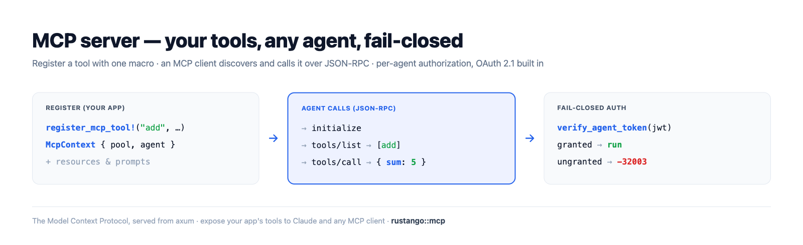
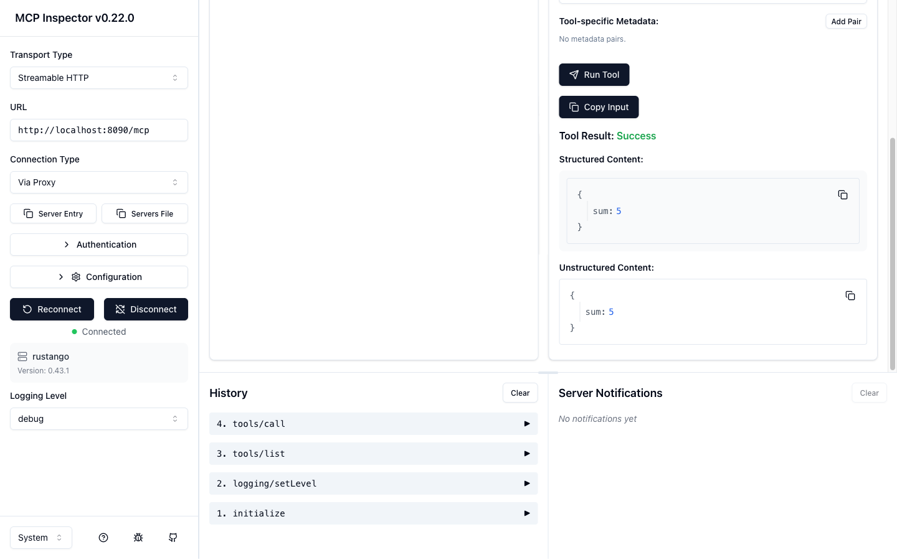

# MCP server

The **Model Context Protocol (MCP)** is the open standard for letting an AI agent
— Claude, an IDE assistant, your own LLM app — securely call *your* application's
**tools**, read its **resources**, and use its **prompts**. **Rustango** ships a
production MCP server: register a tool with one macro, mount a router, and any
MCP client can discover and call it over the standard JSON-RPC transport — with
per-agent, **fail-closed** authorization and OAuth 2.1 built in.

[](img/mcp.png)

> **New to a term here?** *MCP*, *JSON-RPC*, *tool/resource/prompt*, *agent*,
> *JWT*, *OAuth* — see the [glossary](glossary.md).

> **Source:** `rustango::mcp` (`router`, `tenant_router`, `secure_tenant_router`,
> `secure_tenant_router_from_settings`, `register_mcp_tool!`,
> `register_mcp_resource!`, `McpContext`, `issue_agent_token`) and the
> `rustango::tenancy` agent/skill helpers — behind the **`mcp` feature** (OFF by
> default; pulls `tenancy, sse, serializer, openapi, jwt`).
>
> **Runnable version:** every snippet is copied from
> [`mcp_doc.rs`](../crates/rustango/tests/mcp_doc.rs)
> (`cargo test -p rustango --features sqlite,mcp --test mcp_doc`); the full
> protocol surface is dogfooded by the `crates/rustango/tests/mcp_*.rs` suite,
> and a runnable server lives in
> [`examples/mcp_demo`](../crates/rustango/examples/mcp_demo).

## Table of contents

- [What MCP gives you](#what-mcp-gives-you)
- [Step 1 — Enable the feature](#step-1--enable-the-feature)
- [Step 2 — Define a tool](#step-2--define-a-tool)
- [Step 3 — Mount the server](#step-3--mount-the-server)
- [Step 4 — Authorize agents](#step-4--authorize-agents)
- [The protocol](#the-protocol)
- [Settings](#settings)
- [How to test](#how-to-test) — [the suite](#a-the-test-suite) · [curl](#b-curl-the-json-rpc) · [the visual MCP Inspector](#c-test-it-visually-with-the-mcp-inspector) · [a real client](#d-connect-a-real-mcp-client)
- [Optional vs default build](#optional-vs-default-build)
- [See also](#see-also)

---

## What MCP gives you

A rustango MCP server exposes three things an agent can use, all **hand-registered
for explicit control** (nothing is auto-exposed):

| Primitive | What it is | How it's declared |
|---|---|---|
| **Tool** | a function the agent calls (with typed JSON args) | `register_mcp_tool!` |
| **Resource** | readable content the agent fetches by URI | `register_mcp_resource!` + skill-attached |
| **Prompt** | a reusable instruction template | derived from a granted **skill** |

Every call is **authorized per agent**: an agent's JWT carries the **skills**
(and the tools they unlock) it was granted, and `tools/list` / `tools/call`
**fail closed** — an agent never sees or runs a tool it wasn't granted.

---

## Step 1 — Enable the feature

MCP is the optional `mcp` feature (off by default). Turn it on:

```toml
# Cargo.toml
rustango = { version = "0.43", features = ["mcp"] }
```

It pulls in `tenancy` (agents/skills), `sse` (the notification stream),
`serializer` + `openapi` (tool input schemas), and `jwt` (agent tokens). A build
**without** the feature compiles none of the MCP module — see
[Optional vs default build](#optional-vs-default-build).

---

## Step 2 — Define a tool

A tool is a typed input struct + an async handler, registered at compile time
with `register_mcp_tool!`. The input type derives `serde::Deserialize` and
implements `OpenApiSchema` (which becomes the tool's published JSON Schema):

```rust
use rustango::mcp::{McpContext, McpError};
use serde_json::json;

rustango::register_mcp_tool!(
    "add",
    "Add two integers",
    AddInput,
    |_ctx: McpContext, input: AddInput| async move {
        Ok::<_, McpError>(json!({ "sum": input.a + input.b }))
    },
);

#[derive(serde::Deserialize)]
struct AddInput { a: i64, b: i64 }

impl rustango::openapi::OpenApiSchema for AddInput {
    fn openapi_schema() -> rustango::openapi::Schema {
        rustango::openapi::Schema::object()
            .property("a", rustango::openapi::Schema::integer())
            .property("b", rustango::openapi::Schema::integer())
            .required(["a", "b"])
    }
}
```

The handler gets an `McpContext { pool, agent, progress, cancel }` — the tenant
DB pool, the authenticated agent, a progress reporter, and a cancellation token —
so a tool can query your models, report progress on long work, and bail on
cancel. Return any `serde_json::Value` (it's surfaced as the tool's
`structuredContent`) or an `McpError`.

**Resources** are static content registered the same way:

```rust
rustango::register_mcp_resource!(
    "rustango://about", "About", "text/plain",
    || "This server exposes the demo tools.".to_string(),
);
```

**Prompts** come from **skills** (next step) — a skill's instructions become a
prompt the agent can fetch.

---

## Step 3 — Mount the server

Pick a mount to match your deployment; all return an `axum::Router` you nest
under a prefix (conventionally `/mcp`):

| Mount | Tenancy | Auth | Use for |
|---|---|---|---|
| `mcp::router(pool)` | single-tenant | none | transport only (`initialize`/`ping`) |
| `mcp::tenant_router()` | multi-tenant | none | transport only (per-request pool) |
| `mcp::secure_tenant_router()` | multi-tenant | **agent JWT** | the real thing |
| `mcp::secure_tenant_router_from_settings(&s)` | multi-tenant | agent JWT | production (CORS, rate-limit, SSE, body cap from `[mcp]`) |

Tools require the **authed** path (an agent context), so production servers use
`secure_tenant_router*`:

```rust
use rustango::mcp;

let api = axum::Router::new()
    .nest("/mcp", mcp::secure_tenant_router_from_settings(&settings.mcp));
// hand `api` to your tenancy Cli/Builder as usual
```

The authed router mounts: `POST {prefix}` (JSON-RPC), `GET {prefix}` (SSE
notifications), `POST {prefix}/token` (credential → JWT), `POST {prefix}/oauth/token`
(OAuth 2.1), and the two `.well-known/*` discovery documents. It signs agent
tokens with `RUSTANGO_SESSION_SECRET`.

The `initialize` handshake is a plain JSON-RPC POST and works on any mount:

```json
// → POST /mcp
{ "jsonrpc": "2.0", "id": 1, "method": "initialize",
  "params": { "protocolVersion": "2025-06-18", "capabilities": {},
              "clientInfo": { "name": "my-client", "version": "0" } } }

// ← 200
{ "jsonrpc": "2.0", "id": 1, "result": {
    "protocolVersion": "2025-06-18",
    "serverInfo": { "name": "rustango", "version": "0.43.1" },
    "capabilities": { "tools": { "listChanged": true }, "prompts": {}, "resources": {} } } }
```

---

## Step 4 — Authorize agents

Authorization is **skill-based and fail-closed**. You provision an **agent**
(which gets a one-time secret), define a **skill** that bundles tools (and
resources/prompt), then **grant** the skill to the agent in a tenant:

```rust
use rustango::tenancy::{create_agent_pool, create_skill_pool, grant_skill_pool};

// 1. Provision an agent — returns a one-time `name`.`secret` credential.
let issued = create_agent_pool(&pool, "calc-bot").await?;

// 2. A skill bundles tools (here, the `add` tool) + a prompt body.
create_skill_pool(&pool, "calculator", "Calculator", "does arithmetic",
                  "You are a precise calculator.", &["add".into()]).await?;

// 3. Grant it to the agent in tenant "acme".
grant_skill_pool(&pool, "acme", "calc-bot", "calculator").await?;
```

The client exchanges its credential for a **tenant-pinned, scoped JWT** at
`POST /mcp/token` (or the OAuth `client_credentials` flow at `/mcp/oauth/token`).
The server resolves the grant into the token's `skills` + `tools` claims; every
request re-verifies it. The effect, verified end to end:

```rust
// tools/list returns ONLY the granted tool, with its JSON Schema:
let listed = list_tools(&agent);                       // → { "tools": [ { "name": "add", … } ] }

// tools/call runs the handler and returns a structured result:
let out = call_tool(ctx, json!({ "name": "add", "arguments": { "a": 2, "b": 3 } })).await?;
assert_eq!(out["structuredContent"]["sum"], 5);

// An agent WITHOUT the grant sees an empty list and is refused:
//   list_tools(&ungranted) → { "tools": [] }
//   call_tool(ungranted, "add") → Err(code = TOOL_FORBIDDEN)
```

Tokens are tenant-pinned: a token minted for `acme` is rejected against any other
tenant (cross-tenant replay → 401). Revoke an agent and its JTI is blacklisted.

---

## The protocol

JSON-RPC 2.0 (protocol version `2025-06-18`) over HTTP POST, with an optional SSE
stream (`GET {prefix}`) for server→client notifications. Methods:

| Method | Auth | Purpose |
|---|---|---|
| `initialize` · `ping` | no | handshake + liveness |
| `tools/list` · `tools/call` | yes | discover + invoke tools (granted only) |
| `prompts/list` · `prompts/get` | yes | skill-derived prompts |
| `resources/list` · `resources/read` · `resources/templates/list` | yes | static + skill resources |
| `logging/setLevel` · `completion/complete` | yes | log level + prefix completion |
| `notifications/progress` · `notifications/*/list_changed` | — | server→client over SSE |
| `notifications/cancelled` | — | client cancels an in-flight call |

A failed tool *handler* returns a normal result with `isError: true` (the agent
can react); protocol-level problems (unknown/forbidden tool, bad params) return a
JSON-RPC `error` with codes like `-32002` (`TOOL_NOT_FOUND`), `-32003`
(`TOOL_FORBIDDEN`), `-32602` (`INVALID_PARAMS`). Long tools report progress and
honor cancellation via the `McpContext`.

---

## Settings

The `[mcp]` section (read by `secure_tenant_router_from_settings`):

```toml
[mcp]
prefix                = "/mcp"   # URL prefix the router mounts under
token_ttl_secs        = 900      # agent access-token lifetime (15 min)
enable_sse            = true     # serve the GET {prefix} SSE stream
allowed_origins       = []       # CORS allow-list (empty = same-origin only)
rate_limit_per_minute = 0        # per-IP cap (0/unset = unlimited)
max_tools_listed      = 0        # tools/list page size (0/unset = unlimited)
```

---

## How to test

### (a) The test suite

The whole protocol is covered by `crates/rustango/tests/mcp_*.rs` + the doc's
backing test. Run them with the feature on:

```bash
# The doc's headline flow (register → initialize → grant → list → call → fail-closed):
cargo test -p rustango --features sqlite,mcp --test mcp_doc

# Slices + end-to-end + OAuth + settings:
cargo test -p rustango --features sqlite,mcp,config --test 'mcp_*'
```

### (b) curl the JSON-RPC

Boot the demo (next section) and talk to it directly. The demo guards **every**
method behind an agent token (an unauthed call returns `401`), so mint one first
— the demo prints the agent secret on boot:

```bash
TOKEN=$(curl -sX POST http://localhost:8090/mcp/token \
  -H 'content-type: application/json' -d '{"name":"demo-bot","secret":"<printed-secret>"}' \
  | jq -r .access_token)

# initialize:
curl -sX POST http://localhost:8090/mcp -H "authorization: Bearer $TOKEN" \
  -H 'content-type: application/json' \
  -d '{"jsonrpc":"2.0","id":1,"method":"initialize","params":{"protocolVersion":"2025-06-18","capabilities":{},"clientInfo":{"name":"curl","version":"0"}}}'

# tools/call — only the granted `add` tool is callable:
curl -sX POST http://localhost:8090/mcp -H "authorization: Bearer $TOKEN" \
  -H 'content-type: application/json' \
  -d '{"jsonrpc":"2.0","id":2,"method":"tools/call","params":{"name":"add","arguments":{"a":2,"b":3}}}'
# → { ... "result": { "structuredContent": { "sum": 5 }, "isError": false } }
```

### (c) Test it visually with the MCP Inspector

The [MCP Inspector](https://github.com/modelcontextprotocol/inspector) is the
official visual client — connect it to your server and click through tools,
resources, and prompts. Run the demo, then the Inspector:

```bash
# 1. Start the demo MCP server (seeds an `acme` tenant + `demo-bot` agent + the `add` tool):
cd crates/rustango/examples/mcp_demo && cargo run   # serves on http://localhost:8090/mcp

# 2. Launch the Inspector (opens a browser UI on http://localhost:6274):
npx @modelcontextprotocol/inspector
```

In the Inspector: set the transport to **Streamable HTTP** and the URL to
`http://localhost:8090/mcp`. Open **Authentication → Custom Headers**, add a
header `Authorization` with value `Bearer <token>` (mint the token with the
`/mcp/token` call above), flip the row on, then **Connect**.

Switch to the **Tools** tab and click **List Tools** — you'll see *only* the
`add` tool the agent's skill grants, with its JSON Schema. Select it, enter
`a = 2`, `b = 3`, and **Run Tool**:

[](img/mcp-inspector-tools.png)

The call returns a structured result — `{ "sum": 5 }` — and the request shows up
in the History pane (`initialize` → `tools/list` → `tools/call`):

[](img/mcp-inspector-call.png)

### (d) Connect a real MCP client

Point Claude Code (or any MCP client) at the running server, passing the agent
token as a header (mint it with the `/mcp/token` call above):

```bash
claude mcp add --transport http rustango-demo http://localhost:8090/mcp \
  --header "Authorization: Bearer $TOKEN"
```

Then ask the agent to add two numbers — it discovers and calls the `add` tool
over the same protocol the Inspector used.

---

## Optional vs default build

The feature is fully gated — the entire `rustango::mcp` module is behind
`#[cfg(feature = "mcp")]`, so it never affects apps that don't opt in:

```bash
cargo build -p rustango                 # default — MCP module NOT compiled
cargo build -p rustango --features mcp  # MCP server compiled + linked
```

A default app carries zero MCP code, dependencies, or routes; enabling the
feature is the only thing that turns it on.

---

## See also

- [OpenAPI](openapi.md) — the JSON Schema machinery a tool's input reuses.
- [JWT auth API](auth-jwt-api.md) · [Auth backends](auth-backends.md) — the token
  lifecycle agent auth is built on.
- [Security guide](security.md) — fail-closed authorization, secrets, rate limits.
- [Background jobs](jobs.md) — run a long tool's work off the request.
