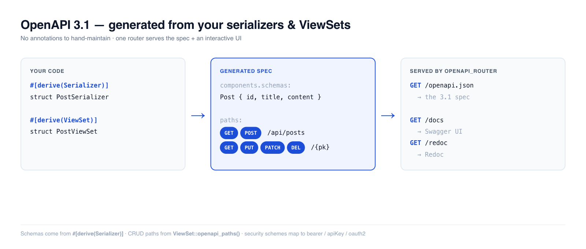

# OpenAPI

**Rustango** generates an **OpenAPI 3.1** spec for your API and serves it with
Swagger UI / Redoc — no annotations to hand-maintain. Point the generator at the
serializers and ViewSets you already wrote: field schemas come from
`#[derive(Serializer)]`, the CRUD paths come from your ViewSet, and a one-line
router mounts `/openapi.json` + an interactive docs page. When you need full
control, the same types let you hand-build any spec.

[](img/openapi.png)

> **Source:** `rustango::openapi` (`OpenApiSpec`, `Schema`, `OpenApiSchema`,
> `PathItem`, `Operation`, `SecurityScheme`, `router::openapi_router`) and
> `ViewSet::openapi_paths` — behind the `openapi` feature (on by default; the
> viewer router also needs `admin`).
>
> **Runnable version:** every snippet below is copied from the tested
> [`getting_started_blog`](https://github.com/ujeenet/rustango/blob/main/crates/rustango/examples/getting_started_blog/tests/openapi.rs)
> example — `cargo test -p getting_started_blog --test openapi`. The builder,
> schema, and router types are additionally covered by the framework's own unit
> tests (`crates/rustango/src/openapi/`).

> **New to a term here?** *OpenAPI*, *schema*, *serializer*, *ViewSet* — see the
> [glossary](glossary.md).

---

## Table of contents
- [Quick start](#quick-start) — generate + serve in one screen
- [Schemas from serializers](#schemas-from-serializers) · [Paths from ViewSets](#paths-from-viewsets)
- [Serving it](#serving-the-spec-swagger-ui--redoc) · [Hand-building a spec](#hand-building-a-spec)
- [Security schemes](#security-schemes) · [The `Schema` builder](#the-schema-builder)
- [Notes & limits](#notes-and-limits)

---

## Quick start

Generate a component schema from a serializer, CRUD paths from a ViewSet, then
mount the viewer:

```rust
use rustango::core::Model;                  // brings `Post::SCHEMA` into scope
use rustango::openapi::{OpenApiSpec, OpenApiSchema, SecurityScheme};
use rustango::openapi::router::openapi_router;
use rustango::viewset::ViewSet;

let mut spec = OpenApiSpec::new("Blog API", "1.0.0")
    .description("Demo of rustango's OpenAPI generation")
    .server("https://api.example.com", "Production")
    .add_security_scheme("bearerAuth", SecurityScheme::bearer("JWT"))
    .require_security("bearerAuth", [])                  // global default
    .add_schema("Post", PostSerializer::openapi_schema()); // from #[derive(Serializer)]

// CRUD path items straight off the ViewSet:
for (path, item) in ViewSet::for_model(Post::SCHEMA).openapi_paths("/api/posts", "Post") {
    spec = spec.add_path(path, item);
}

// Mount /openapi.json + /docs (Swagger UI) + /redoc:
let app = axum::Router::new().merge(openapi_router(spec));
```

Visit `/docs` for Swagger UI, `/redoc` for Redoc, or fetch the raw
`/openapi.json` for codegen (`openapi-generator`, `oapi-codegen`, etc.).

---

## Schemas from serializers

With the `openapi` feature on, `#[derive(Serializer)]` also emits an
[`OpenApiSchema`] impl, so any serializer becomes a component schema:

```rust
use rustango::openapi::OpenApiSchema;

let schema = PostSerializer::openapi_schema();   // -> rustango::openapi::Schema
spec = spec.add_schema("Post", schema);
```

The schema reflects the **API shape**, not the raw table: renamed fields
(`#[serializer(source = "body")]` → `content`), `read_only` / `write_only`
visibility, computed method fields, and nested serializers all carry through.
Field types map automatically:

| Rust field | OpenAPI |
|---|---|
| `i32` / `i64` | `integer` (`int32` / `int64`) |
| `f32` / `f64` | `number` (`float` / `double`) |
| `String`, `&str` | `string` |
| `bool` | `boolean` |
| `Vec<T>` / `[T; N]` | `array` of `T` |
| `Option<T>` | `T`, marked `nullable` |
| `chrono::DateTime<Utc>` | `string` / `date-time` |
| `chrono::NaiveDate` | `string` / `date` |
| `uuid::Uuid` | `string` / `uuid` |
| `Auto<T>` | same as `T` (server-assigned) |
| `HashMap<String, V>` | `object` with `additionalProperties` |
| `serde_json::Value` | free-form (any) |

For a **custom field type**, implement `OpenApiSchema` once and it works
everywhere that type appears:

```rust
struct Money { cents: i64 }

impl rustango::openapi::OpenApiSchema for Money {
    fn openapi_schema() -> rustango::openapi::Schema {
        rustango::openapi::Schema::integer().description("amount in cents")
    }
}
```

> See the [Serializers guide](serializers.md#openapi-schemas) for the field
> attributes that shape the output.

---

## Paths from ViewSets

`ViewSet::openapi_paths(prefix, schema_ref)` returns the `(path, PathItem)` pairs
for the five standard CRUD routes — list, create, retrieve, update, partial
update, delete — wired to reference a registered component schema:

```rust
for (path, item) in ViewSet::for_model(Post::SCHEMA)
    .filter_fields(&["author_id", "status"])
    .search_fields(&["title", "body"])
    .openapi_paths("/api/posts", "Post")
{
    spec = spec.add_path(path, item);
}
```

It produces `/api/posts` (GET list, POST create) and `/api/posts/{pk}` (GET, PUT,
PATCH, DELETE), and it stays in sync with the ViewSet's configuration:

- **Pagination** → the right query params + list-response envelope for the
  configured style (`page`/`page_size`, `cursor`, or `limit`/`offset`).
- **Filtering / search / ordering** → one `?field=` query param per
  `filter_fields` (with the available `__gt`/`__in`/… lookups described), plus
  `?search=` and `?ordering=` when configured.
- **`read_only()`** → the write operations (POST/PUT/PATCH/DELETE) are omitted.
- **Path param** → `{pk}` typed from the model's primary key.
- **`operationId`** → `list_post`, `create_post`, … (snake-cased per action).

> The ViewSet itself is documented in the [ViewSets guide](viewsets.md).

---

## Serving the spec (Swagger UI / Redoc)

`openapi_router(spec)` mounts three routes:

| Route | Serves |
|---|---|
| `GET /openapi.json` | the spec as JSON (`application/json`) |
| `GET /docs` | Swagger UI (interactive try-it-out) |
| `GET /redoc` | Redoc (clean three-pane reference) |

```rust
let app = axum::Router::new()
    .merge(PostViewSet::router("/api/posts", pool.clone()))
    .merge(openapi_router(spec));        // adds /openapi.json, /docs, /redoc
```

The viewer pages are tiny HTML shells that load Swagger UI / Redoc from a CDN
(`unpkg` / `jsdelivr`) — no JS is bundled into **Rustango**. For an air-gapped
deployment, write `spec.to_json()` to a file at startup and self-host the viewer
assets from your own static dir.

---

## Hand-building a spec

When your API isn't ViewSet-shaped, build the spec directly — the same types,
full OpenAPI 3.1 fidelity:

```rust
use rustango::openapi::{OpenApiSpec, PathItem, Operation, Response, Parameter, Schema};

let spec = OpenApiSpec::new("My API", "1.0.0")
    .description("Customer-facing public API")
    .add_schema("Post", Schema::object()
        .property("id", Schema::integer())
        .property("title", Schema::string())
        .required(["id", "title"]))
    .add_path("/posts/{id}", PathItem::new()
        .parameter(Parameter::path("id", Schema::integer()))
        .get(Operation::new()
            .summary("Get a post")
            .operation_id("get_post")
            .tag("posts")
            .response("200", Response::new("OK")
                .json_content(Schema::ref_("Post")))
            .response("404", Response::new("not found"))));

let json = spec.to_json();   // pretty-printed OpenAPI 3.1
```

`OpenApiSpec` also takes `.contact(...)`, `.license(...)`, `.add_tag(...)`, and
multiple `.server(...)` entries.

---

## Security schemes

Declare how the API authenticates, then require a scheme globally (per-operation
overrides win):

```rust
use rustango::openapi::SecurityScheme;

let spec = OpenApiSpec::new("API", "1.0")
    .add_security_scheme("bearerAuth", SecurityScheme::bearer("JWT"))
    .add_security_scheme("apiKey", SecurityScheme::api_key_header("X-API-Key"))
    .require_security("bearerAuth", []);     // default for every operation
```

Helpers: `SecurityScheme::bearer(fmt)`, `basic()`, `api_key_header(name)`,
`api_key_query(name)`, `oauth2_authorization_code(auth_url, token_url, scopes)`.
On an `Operation`, `.no_security()` marks a public endpoint and
`.require_security(scheme, scopes)` overrides the global default. These line up
with **Rustango**'s own auth (see the [Security guide](security.md#authenticating-users)):
JWT → `bearer`, API keys → `apiKey`, OAuth2 → `oauth2`.

---

## The `Schema` builder

`Schema` is a fluent JSON-Schema (OpenAPI 3.1 subset) builder:

```rust
Schema::object()
    .property("id", Schema::integer())                       // int64
    .property("email", Schema::email())                      // string/email
    .property("status", Schema::string().enum_(["draft", "published"]))
    .property("tags", Schema::array_of(Schema::string()))
    .property("created", Schema::datetime().nullable())
    .required(["id", "email"]);
```

Type constructors: `string` · `integer` / `int32` · `number` · `boolean` ·
`object` · `array_of(..)` · `any_object` · `datetime` / `date` / `time` · `uuid`
· `decimal` · `binary` · `email` · `uri` · `ref_("Name")`. Modifiers:
`.property`, `.required`, `.nullable`, `.enum_`, `.format`, `.description`,
`.example`, `.default_value`, `.min_length` / `.max_length`, `.minimum` /
`.maximum`.

---

## Notes and limits

- **It's OpenAPI 3.1** (`"openapi": "3.1.0"`), which aligns with JSON Schema
  2020-12 — most modern tooling consumes it directly.
- **The viewer router needs the `admin` feature** (for axum); `openapi` alone is
  enough to *build* and serialize a spec (`spec.to_json()`).
- **Viewers load from a CDN** — fine for internal/dev docs; self-host the assets
  for offline or CSP-locked deployments.
- **`openapi_paths` covers the standard CRUD shape.** Custom actions, or
  hand-rolled endpoints, you add with `add_path` (hand-building section above).
- Regenerate client SDKs from `/openapi.json` in CI so they never drift from the
  server.
