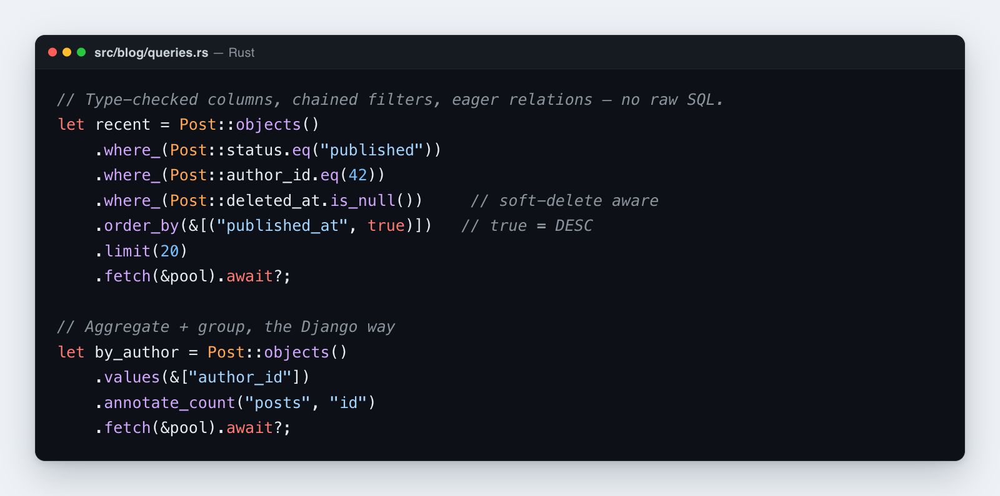

# ORM cookbook

Patterns for the **Rustango** ORM beyond the basics. If you come from Django's ORM, Laravel Eloquent, or Rails ActiveRecord, the shapes here will feel familiar. Most examples assume you already have a `Post` model from `Getting Started`.

[](img/orm.png)

> **Source:** `rustango::sql` (`QuerySet`, the `Q!` macro / `Qb` builder) and the
> `#[derive(Model)]` query API — always compiled; pick a backend feature
> (`postgres` / `mysql` / `sqlite`).
>
> **Runnable version:** the patterns here run in the tested
> [`orm_cookbook`](../crates/rustango/examples/orm_cookbook) example.
>
> **New to a term here?** The [glossary](glossary.md) defines *model*, *queryset*,
> *pool*, and *migration* in plain language.

A few Rust terms recur throughout. `&pool` is a shared reference to the database connection pool; you pass it to the methods that actually run SQL. `.await` runs an async call and waits for the result. `Option<T>` is a value that may be present (`Some`) or absent (`None`) — Rust's null. `Result` is success-or-error; the trailing `?` on a call returns early on error. `Auto<i64>` is an auto-incrementing primary key that's either `Set` (loaded from the DB) or `Unset` (not yet inserted).

## What's new (v0.41 / v0.42)

Recent releases added a batch of Django-parity features that aren't yet woven into every section below. Quick pointers:

- **`Q!` macro + `Qb` runtime builder** (#269, #263) — compile-time-safe Django-shape filters. `User::objects().where_(Q!(User.email__icontains = "alice"))` fails to build on a typo'd field name. Runtime-composable variant for admin filter chips: `let q = Qb::eq("active", true) & Qb::gt("age", 18i64);`.
- **`.distinct_on(&["author_id"])`** (#264) — PG native; portable window-function fallback on MySQL / SQLite. "Latest per group" patterns.
- **`bulk_upsert_pool(rows, unique_fields, update_fields, &pool)`** (#267) — Django `bulk_create(update_conflicts=True)`. Tri-dialect ON CONFLICT / ON DUPLICATE KEY UPDATE.
- **`explain_pool()`** (#272) — tri-dialect EXPLAIN. PG `EXPLAIN (FORMAT JSON, ANALYZE, BUFFERS)` / MySQL `EXPLAIN ANALYZE` / SQLite `EXPLAIN QUERY PLAN`.
- **DB function library** (#266) — `Cast`, `LPad`, `RPad`, `MD5`, `SHA1`, `SHA256`, `Position`, `Repeat`, `Reverse`, `Sign`, `Mod`, `Power`, `Sqrt`. Per-dialect emission with clear errors where SQLite lacks the function.
- **Field types** — `rust_decimal::Decimal` (PG/MySQL native, SQLite via Decode shim), `chrono::NaiveTime`, `Vec<u8>` (`FieldType::Binary`) now accepted by `#[derive(Model)]` (#524, v0.42).
- **`ModelForm::prepare_save()` / `PreparedSave`** (#375, v0.42) — Django `save(commit=False)`. Validate now, mutate the prepared write set, commit when ready.
- **`#[rustango(unique_when(columns = "...", condition = "..."))]`** (#265) — partial unique constraints. "Unique email per non-deleted row" / "Unique slug per tenant".
- **`#[rustango(manager(ext = "FooManagerExt"))]`** (#271) — Django-shape custom-manager extension trait emitted next to the model. (Also the Rust shape of Django proxy models — same physical table, multiple "personalities" via per-trait methods. See `inheritance.rs:98-127`.)
- **`manage makemigrations --merge`** (#346, v0.42) — Django-shape merge node for divergent branch chains. See [`docs/manage.md`](manage.md#makemigrations---merge).

The CHANGELOG carries the full ticket index for each release.

## Table of contents

- [Querying](#querying)
- [Computed values & database functions](#computed-values--database-functions)
- [Aggregations](#aggregations)
- [Joins & preloading related rows](#joins--preloading-related-rows)
- [Bulk operations](#bulk-operations)
- [Insert or update (upsert)](#insert-or-update-upsert)
- [Transactions](#transactions)
- [Many-to-many](#many-to-many)
- [JSON / JSONB](#json--jsonb)
- [Soft delete](#soft-delete)
- [Audit trail](#audit-trail)
- [Raw SQL escape hatch](#raw-sql-escape-hatch)
- [Lazy FK loading](#lazy-fk-loading)
- [Four ways to filter](#four-ways-to-filter)
- [Tenant-scoped queries](#tenant-scoped-queries)
- [Signals](#signals)
- [Performance tips](#performance-tips)

---

## Querying

Read rows from the database. `Post::objects()` starts a query (like Django's `Post.objects`); you chain filters and ordering, then call `.fetch(&pool).await?` to run it and get back a `Vec<Post>`. `.where_(...)` adds an AND-joined condition.

```rust
use rustango::core::Column as _;
use rustango::core::{Op, SqlValue, WhereExpr};   // for filter_op / where_raw below
use rustango::sql::FetcherPool as _;

// Simplest — fetch all
let posts = Post::objects().fetch(&pool).await?;

// Single equality filter
let drafts = Post::objects()
    .where_(Post::status.eq("draft"))
    .fetch(&pool).await?;

// Chained filters (AND)
let recent_drafts = Post::objects()
    .where_(Post::status.eq("draft"))
    .where_(Post::author_id.eq(42))
    .where_(Post::deleted_at.is_null())
    .order_by(&[("created_at", true)])        // true = DESC
    .limit(20)
    .fetch(&pool).await?;

// String-keyed filter (validated at compile of the queryset)
let by_id = Post::objects()
    .filter_op("id", Op::Eq, SqlValue::I64(42))
    .fetch(&pool).await?;

// OR / nested
let qs = Post::objects().where_raw(WhereExpr::Or(vec![
    Post::status.eq("draft").into(),
    Post::status.eq("review").into(),
]));

// XOR — Django 4.1+ `Q(a) ^ Q(b)`. Matches rows where an odd number
// of operands evaluate to true (binary case = "exactly one is true").
// Issue #27.
let either_but_not_both = Post::objects()
    .where_(Post::status.eq("draft").xor(Post::author_id.eq(42)))
    .fetch(&pool).await?;
// Tri-dialect emission: native logical XOR exists on MySQL but not PG
// or SQLite, so the writer emits a portable rewrite uniformly —
// `(a AND NOT b) OR (NOT a AND b)` for the binary form, or a
// CASE-WHEN-1/0 tally `% 2 = 1` for N-ary chains.
```

### Comparison filters

The everyday filter methods, one per SQL operator. These are Django's field lookups (`__gt`, `__in`, `__icontains`, and so on) in typed form.

```rust
Post::objects().where_(Post::view_count.gt(100)).fetch(&pool).await?;
Post::objects().where_(Post::view_count.gte(100)).fetch(&pool).await?;
Post::objects().where_(Post::view_count.lt(100)).fetch(&pool).await?;
Post::objects().where_(Post::view_count.lte(100)).fetch(&pool).await?;
Post::objects().where_(Post::status.ne("archived")).fetch(&pool).await?;
Post::objects().where_(Post::id.is_in([1, 2, 3])).fetch(&pool).await?;
Post::objects().where_(Post::status.not_in(["draft", "deleted"])).fetch(&pool).await?;
Post::objects().where_(Post::title.like("%draft%")).fetch(&pool).await?;          // case-sensitive contains
Post::objects().where_(Post::title.ilike("%draft%")).fetch(&pool).await?;         // case-insensitive contains
Post::objects().where_(Post::title.ilike("Hello%")).fetch(&pool).await?;          // case-insensitive starts-with
Post::objects().where_(Post::deleted_at.is_null()).fetch(&pool).await?;
Post::objects().where_(Post::published_at.between(start, end)).fetch(&pool).await?;
```

### Sorting results

Sort rows by one or more columns, by an expression, or with explicit control over where NULLs land. Beyond the basic `.order_by(&[("col", desc)])`, you get three extra dimensions:

```rust
use rustango::core::funcs::lower;
use rustango::core::{F, NullsOrder};

// 1. Plain field + ASC/DESC (back-compat — implicit NULLS handling
//    differs between dialects; see the dialect note below).
Post::objects()
    .order_by(&[("published_at", true), ("id", false)])
    .fetch(&pool).await?;

// 2. Explicit NULLS FIRST/LAST control — portable across PG, MySQL,
//    and SQLite. MySQL has no native `NULLS …` keyword; the writer
//    emulates with an `<col> IS NULL` pre-sort term so the on-wire
//    ordering matches PG/SQLite.
Post::objects()
    .order_by_with_nulls(&[("score", true, NullsOrder::Last)])
    .fetch(&pool).await?;

// 3. Arbitrary Expr in the ORDER BY position — case-insensitive
//    title sort via `LOWER(title)`, computed sort keys via
//    `case() / when() / value()`, arithmetic via `F("a") + F("b")`.
Post::objects()
    .order_by_expr(lower(F("title")), false)
    .order_by_expr_with_nulls(F("score") + 1_i64, true, NullsOrder::Last)
    .fetch(&pool).await?;
```

**Per-dialect NULLS handling (no explicit `NullsOrder` set):**

| Dialect | ASC default | DESC default |
|---|---|---|
| PostgreSQL | NULLS LAST | NULLS FIRST |
| SQLite | NULLS LAST | NULLS FIRST |
| MySQL | NULLs first (smallest-value semantics) | NULLs last |

Use `.order_by_with_nulls(...)` / `.order_by_expr_with_nulls(...)` to pin the placement; otherwise the database's native default applies. On MySQL the writer emits `<col> IS NULL <asc|desc>` ahead of the actual sort to emulate; the emitted SQL has two ORDER BY terms per pinned column but the semantic matches PG/SQLite.

**Chain composition.** `.order_by(...)`, `.order_by_with_nulls(...)`, and `.order_by_expr(...)` accumulate into one unified list in **registration order**. `.replace_order_by(&[...])` clears every prior order-by call. `.flip_order_by()` inverts every direction AND swaps `NullsOrder::First` ↔ `NullsOrder::Last` so the "NULLs at the same end" semantic survives an inversion (for explicit `First` / `Last`; the dialect-default behavior under `Default` still tracks direction).

### Random ordering

Return rows in random order — Django's `.order_by('?')`. Use `.order_random()`. It emits `ORDER BY RANDOM()` on PG and SQLite, `ORDER BY RAND()` on MySQL. Handy for banner rotation, sampling, or A/B-test bucket assignment without pulling rows into the app to shuffle them.

```rust
// Three random posts.
Post::objects()
    .order_random()
    .limit(3)
    .fetch(&pool).await?;

// Random tie-breaker after a primary sort: posts ordered by score
// descending, with ties shuffled.
Post::objects()
    .order_by(&[("score", true)])
    .order_random()
    .fetch(&pool).await?;
```

The IR variant carries no direction or NULLS clause: random ordering is unordered by definition, and the random key is computed per row (non-NULL).

**Performance caveat.** `ORDER BY RANDOM()` forces a **full table scan + in-memory sort by a per-row random key**. The query planner can't use an index. For tables much larger than memory, prefer the index-friendly pattern:

```rust
// Coin-flip offset; range-scans the PK index.
let max_id: i64 = Post::objects().max::<i64>("id", &pool).await?.unwrap_or(0);
let offset = rand::random::<u32>() as i64 % max_id.max(1);
Post::objects()
    .where_(Post::id.gte(offset))
    .order_by(&[("id", false)])
    .limit(1)
    .fetch(&pool).await?;
```

The trade-off: adjacency in the result rows mirrors PK adjacency, so it's not "uniformly random" in the strict sense — but it's free of the full-table-scan cost.

### Pagination

Fetch one page of results at a time. `.limit(size).offset(...)` is the simple page-number form; the cursor form ("everything after the last id I saw") scales better on large tables.

```rust
// Page-number — page 2 of 50-row pages = LIMIT 50 OFFSET 50.
let page = Post::objects().limit(50).offset(50).fetch(&pool).await?;

// Cursor (manual — no auto-next-token from QuerySet)
let next = Post::objects()
    .where_(Post::id.gt(last_id))
    .order_by(&[("id", false)])
    .limit(50)
    .fetch(&pool).await?;
```

For HTTP-side cursor pagination, use `ViewSet::cursor_pagination("id")` instead.

### Fetching rows into a map

Look up many rows by a list of values and get them back as a `HashMap` keyed by that column. This is Django's `in_bulk(ids, field_name=)`. Use `.in_bulk(...)` for "fetch these N rows in one round trip, indexed by id." A `HashMap<K, V>` is Rust's dictionary/hash table.

```rust
use std::collections::HashMap;
use rustango::sql::Auto;

// Default Django shape: keyed by the Auto<i64> PK.
let books: HashMap<i64, Book> = Book::objects()
    .in_bulk(Book::id, [1_i64, 2, 3], |b| match b.id {
        Auto::Set(v) => v,
        Auto::Unset  => unreachable!("fetched row has Auto::Set PK"),
    }, &pool)
    .await?;
assert_eq!(books[&1].title, "The Rust Programming Language");

// `field_name=` equivalent — key by any unique column.
let by_isbn: HashMap<String, Book> = Book::objects()
    .in_bulk(Book::isbn, ["isbn-1".to_string()], |b| b.isbn.clone(), &pool)
    .await?;
```

Composes with prior `.where_()` filters — the `IN`-list AND-joins with the existing WHERE. Empty `ids` short-circuits with an empty map (no SQL is issued). The closure handles `Auto<T>` / `ForeignKey<T, K>` unwrap explicitly, giving callers control over how the key materializes.

Tenant-scoped sibling: `in_bulk_on(column, ids, extract, &executor)` takes any sqlx executor — pair with `tenant.conn()` for schema-mode tenants.

### Locking rows for update

Lock the rows you select so no other transaction can change them until you commit — the standard way to claim work or prevent lost updates. This is Django's `select_for_update(skip_locked=, nowait=, of=, no_key=)`. Call `.select_for_update()`; it appends `SELECT … FOR UPDATE` (or a variant) and the lock lasts for the surrounding transaction.

```rust
// Canonical "claim next available row" pattern. Worker A grabs the
// lowest-priority pending job; concurrent worker B with SKIP LOCKED
// skips A's row and grabs the next instead — no blocking.
let mut tx = pool.begin().await?;
let claim: Vec<Job> = Job::objects()
    .where_(Job::status.eq("pending"))
    .order_by(&[("priority", false)])
    .limit(1)
    .select_for_update()
    .skip_locked()
    .fetch_on(&mut *tx).await?;
// ... mark claim[0] as in-progress, do work ...
tx.commit().await?;
```

**Builder methods** — chain to opt in:

- `.select_for_update()` — plain `FOR UPDATE`.
- `.skip_locked()` — append `SKIP LOCKED`; rows held by another tx are silently filtered out instead of blocking.
- `.nowait()` — append `NOWAIT`; surface a driver error immediately if any matching row is locked. Mutually exclusive with `skip_locked` (writer picks the more permissive `SKIP LOCKED` if both are set).
- `.no_key()` — emit `FOR NO KEY UPDATE` instead (PG 9.3+). Weaker lock that doesn't block writers touching only non-key columns.
- `.of(&["table_or_alias", …])` — restrict the lock to specific tables when the query JOINs.

Calling `.skip_locked()` / `.nowait()` / `.no_key()` / `.of(…)` without a prior `.select_for_update()` implicitly enables the lock, matching Django's ergonomics.

**Tri-dialect behaviour:**

| Dialect | Behaviour |
|---|---|
| PostgreSQL | Full support — every flag emits its native syntax. |
| MySQL 8.0.1+ | Supports everything except `NO KEY` — that flag falls back to plain `FOR UPDATE` (the stricter lock). |
| SQLite | No row-level lock syntax. The writer emits no clause at all; transactions hold an implicit write lock for the whole database. Use a different strategy for SQLite (typically a busy-wait loop on the transaction itself). |

**Must run inside a transaction.** `FOR UPDATE` outside a tx is a no-op on PostgreSQL (the implicit single-statement tx releases the lock immediately) and an error on MySQL. Pair with `pool.begin()` (or `rustango::sql::atomic`).

### Combining queries (union, intersection, difference)

Merge two or more queries over the same model with SQL set operators. These are Django's `.union()`, `.intersection()`, and `.difference()`.

```rust
// Posts that are EITHER drafts OR currently in review.
let inbox: Vec<Post> = Post::objects()
    .where_(Post::status.eq("draft"))
    .union(Post::objects().where_(Post::status.eq("review")))
    .order_by(&[("created_at", true)])
    .limit(50)
    .fetch(&pool).await?;
```

**Builder methods**:

| Method | SQL | Semantic |
|---|---|---|
| `.union(other)` | `UNION` | Combine + deduplicate |
| `.union_all(other)` | `UNION ALL` | Combine, keep duplicates (cheaper, no DISTINCT pass) |
| `.intersection(other)` | `INTERSECT` | Rows in BOTH querysets |
| `.difference(other)` | `EXCEPT` | Rows in first queryset but NOT others |

Every method takes `QuerySet<T>` — both branches must target the same model `T`, so the column shape matches by construction (verified at compile time by Rust's generics). Calls accumulate; mixing operators in one chain is allowed (`a.union(b).intersection(c)` evaluates left-to-right per SQL standard).

**Outer modifiers apply to the merged result**:

```rust
// Outer .order_by() / .limit() / .offset() / .select_for_update()
// set AFTER the union apply to the combined resultset, NOT per-branch.
let page: Vec<Post> = qs_a
    .union(qs_b)
    .union(qs_c)
    .order_by(&[("id", false)])    // sorts the merged rows
    .limit(20)                     // caps the merged count
    .offset(40)                    // skips into the merged result
    .fetch(&pool).await?;

// Per-branch ORDER BY / LIMIT stay INSIDE the branch's parens:
let mixed = qs_a
    .union(qs_b.order_by(&[("id", true)]).limit(5))   // branch picks its top 5
    .fetch(&pool).await?;
```

**Tri-dialect**: PostgreSQL + SQLite support all four operators on every version **Rustango** supports. MySQL 8.0+ supports `UNION`/`UNION ALL`; `INTERSECT`/`EXCEPT` landed in MySQL 8.0.31. Older MySQL versions surface the driver's syntax error at fetch time — there's no client-side gate.

**Error path on the typed builder**: `.union(other_qs)` (and `.intersection()` / `.difference()`) compiles the branch eagerly and panics if the branch fails to compile (typo'd column, etc.). For fallible composition where the caller wants a `Result`, compile the branch first and pass it via `.with_compound(SetOp::Union, branch)` — one generic entry point covers every operator. The panic shape matches Django's: a bad branch is a programmer error, not a runtime data condition.

### Streaming large result sets

Process a huge table without loading it all into memory. This is Django's `.iterator(chunk_size=2000)`. Call `.iterator(chunk_size)`; it fetches `chunk_size` rows at a time (via `LIMIT N OFFSET M`) and never buffers the whole result set. Reach for it on million-row exports, ETL pipelines, and batch jobs.

```rust
// 1. Whole-chunk loop — process N rows at a time.
let mut iter = Post::objects()
    .where_(Post::published.eq(true))
    .order_by(&[("id", false)])
    .iterator(2_000)?;
while let Some(chunk) = iter.next_chunk(&pool).await? {
    for post in chunk { /* … */ }
}

// 2. Row-by-row loop — buffer one chunk internally, yield one row.
let mut iter = Post::objects().order_by(&[("id", false)]).iterator(2_000)?;
while let Some(post) = iter.next_row(&pool).await? {
    /* … */
}
```

**Set an `order_by`.** `OFFSET` against a query with no stable sort returns unpredictable rows across chunks — typically `.order_by(&[("pk", false)])` so each chunk picks up cleanly. The method doesn't enforce ordering (some queries legitimately want no sort, e.g. a one-shot drain), but unsorted iteration is a footgun.

**Trade-off vs server-side cursors.** This is a simple LIMIT/OFFSET chunker. On a btree-indexed sort column, PostgreSQL scans the first N rows before returning the (N+1)th — so deep pagination is `O(n²)` total work. For a 10M-row drain this matters; for 100k rows it usually doesn't. The chunker wins on portability (works on all backends with no transaction overhead) and simplicity (no cursor lifecycle management). For truly streaming reads on PG, drop into `pool.begin()` + raw `sqlx::query(...).fetch(&mut *tx)` Stream API directly — the extended protocol streams from the server without offset reseek.

**Mixing `next_chunk` and `next_row` on the same iterator is safe.** The internal `VecDeque` buffer drains in row order before any new DB fetch, so `next_chunk` after a partial `next_row` drain yields the remaining buffered rows first, then continues with fresh chunks.

Both `.rows_seen()` (cumulative count) and `.is_exhausted()` (post-drain flag) are available for progress reporting and termination checks.

**Concurrent-write hazard.** Each chunk is a separate query, so rows inserted/deleted between chunks can be skipped or duplicated (the classic OFFSET-pagination "windowing" problem). For read-only / append-only tables — the typical export use case — this isn't a concern. For tables being written concurrently you need a snapshot-isolation transaction so every chunk sees the same view. **`ChunkedIter` takes `&Pool`, not a `&mut Transaction`, so the chunker API can't be used inside the tx directly** — hand-roll the chunked SELECT against the tx instead:

```rust
let mut tx = pool.begin().await?;
sqlx::query("SET TRANSACTION ISOLATION LEVEL REPEATABLE READ")
    .execute(&mut *tx).await?;

// Hand-loop LIMIT/OFFSET chunks against the tx with `.fetch_on(&mut *tx)`,
// so every chunk reads from the same snapshot.
let chunk_size = 2_000_i64;
let mut offset = 0_i64;
loop {
    let rows: Vec<Post> = Post::objects()
        .order_by(&[("id", false)])
        .limit(chunk_size)
        .offset(offset)
        .fetch_on(&mut *tx)
        .await?;
    if rows.is_empty() { break; }
    for post in &rows { /* … */ }
    if (rows.len() as i64) < chunk_size { break; }
    offset += rows.len() as i64;
}
tx.commit().await?;
```

**`select_for_update()` doesn't propagate across chunks.** Row locks held by `.select_for_update()` are released at the end of each chunk's implicit transaction. There's no chunker-shaped fix: the `.iterator()` builder takes `&Pool`, the locking variants need a `&mut Transaction`, and the two don't compose. For a locked drain you have two paths, each with a trade-off:

- **Whole-result `.fetch_on(&mut *tx)`** — single round trip, full `Vec<T>` in memory. Fine when the result fits.
- **Hand-rolled LIMIT/OFFSET inside the tx** — same shape as the snapshot-isolation snippet above; chunks stay streamed but you're outside the `ChunkedIter` API.

A future `iterator_on(&mut *tx, chunk_size)` companion (issue follow-up) would close this gap. Not in scope for issue #23.

**`chunk_size` must be > 0.** Zero or negative values panic. Pick a value that fits your row-size budget (Django's default is `2000`; reasonable for narrow rows, lower for wide TEXT/JSONB columns).

### Selecting specific columns

Fetch just a few columns instead of whole `Post` structs — Django's `.values('col')` and `.values_list('col', flat=True)`. Use these when you only need a couple of columns off a wide table, or when the result feeds dynamic code (templates, CSV export, JSON). You get maps, tuples, or a flat typed list back instead of model instances.

```rust
use rustango::core::SqlValue;
use std::collections::HashMap;

// 1. Column-keyed map per row — Django's `.values('id', 'title')`.
let rows: Vec<HashMap<String, SqlValue>> = Post::objects()
    .where_(Post::published.eq(true))
    .order_by(&[("id", false)])
    .values_dict(&["id", "title"])
    .fetch(&pool).await?;

// 2. Ordered tuple per row — Django's `.values_list('id', 'title')`.
//    Cell ordering matches the column-list argument.
let rows: Vec<Vec<SqlValue>> = Post::objects()
    .values_list(&["title", "id"])  // title first, id second
    .fetch(&pool).await?;

// 3. Single-column typed scalar — Django's `.values_list('id', flat=True)`.
//    Returns Vec<U> directly via sqlx's typed scalar path.
let ids: Vec<i64> = Post::objects()
    .where_(Post::published.eq(true))
    .values_list_flat("id")
    .fetch::<i64>(&pool).await?;
```

**Three builders, one IR.** All three set `SelectQuery::projection` to the validated column list — the SQL is identical across the three terminal shapes; only the row-decode differs:

| Builder | SQL shape | Returns |
|---|---|---|
| `.values_dict(&[cols])` | `SELECT col1, col2 FROM …` | `Vec<HashMap<String, SqlValue>>` |
| `.values_list(&[cols])` | `SELECT col1, col2 FROM …` | `Vec<Vec<SqlValue>>` (ordered by `cols`) |
| `.values_list_flat(col)` | `SELECT col FROM …` | `Vec<U>` (typed, via `fetch::<U>(...)`) |

**Works with the rest of the query chain.** `.where_()`, `.filter()`, `.order_by()`, `.limit()`, `.offset()`, and the set operators (`.union()` / `.intersection()` / `.difference()`) — every method called BEFORE `.values_*` carries through. The values builders are terminal (nothing chains after them), so set the query shape first, then fetch.

**Validation at `.compile()` / `.fetch()` time:**
- Empty column list (`.values_dict(&[])`) → [`QueryError::EmptyValuesProjection`].
- Typo'd column name (`.values_dict(&["nope"])`) → [`QueryError::UnknownField`].

**Tri-dialect: identical projection emission across PG / MySQL / SQLite** (only the identifier quoting differs). For `.values_list_flat::<U>(...)`, `U` must implement sqlx's `Decode + Type` on every backend the binary targets — common picks (`i64`, `i32`, `String`, `bool`, `f64`) work universally.

**Why not change the existing `.values()` to do pure projection?** `QuerySet::values(cols)` already promotes to [`AggregateBuilder`] for the GROUP BY auto-inference path (issue #75). Renaming would break ~20 existing call sites. The new `.values_dict()` / `.values_list()` / `.values_list_flat()` chain methods sit alongside, leaving the aggregate path untouched. The pre-existing `QueryError::ValuesRequiresAggregate` error still fires for `.values(cols).compile()` without a subsequent `.annotate(...)` — its message now points callers at the new pure-projection methods.

### Including or excluding columns

Same idea as the previous section, but in Django's include/exclude shape: `.only('id', 'name')` keeps only the named columns, `.defer('big_field')` keeps everything except them. Use these on wide tables where large TEXT / BLOB / JSONB columns make list views expensive to read:

```rust
// .only(...) — fetch only the named columns.
let rows: Vec<HashMap<String, SqlValue>> = Post::objects()
    .where_(Post::published.eq(true))
    .only(&["id", "title"])
    .fetch(&pool).await?;

// .defer(...) — fetch everything except the named columns.
// Useful for "list view: skip body / metadata / large JSON".
let rows: Vec<HashMap<String, SqlValue>> = Post::objects()
    .defer(&["body", "raw_html"])
    .fetch(&pool).await?;
```

**Semantics**: `.only(&[cols])` is a synonym for `.values_dict(cols)` — same IR, same return shape, separate entry point for Django-shape readability. `.defer(&[cols])` computes the complement against the model schema (every scalar column on the model EXCEPT the listed ones) and routes to the same path.

**Caveat — return type differs from Django.** Django's `.only()` / `.defer()` return partially-hydrated `Model` instances where the deferred fields lazy-load on attribute access. **Rustango** has no equivalent of Python's descriptor magic; the return shape is `Vec<HashMap<String, SqlValue>>` (or `Vec<Vec<SqlValue>>` if you swap in `.values_list(...)` instead). Typed partial-row decode is queued for a future slice.

**Typo-safety**: `.defer(&["nope_col"])` surfaces `QueryError::UnknownField` at `.compile()` time — the typo doesn't silently turn into "project all columns." `.only(&[])` surfaces `QueryError::EmptyValuesProjection`; `.defer(&[])` is a semantic no-op (projects every column).

### Matching with regular expressions

Match a column against a regex pattern — Django's `__regex` / `__iregex`. `.regex()` is case-sensitive, `.iregex()` case-insensitive, and `.not_regex()` / `.not_iregex()` are the negated forms.

```rust
use rustango::core::Column as _;

// Names starting with "al" (case-sensitive).
User::objects()
    .where_(User::name.regex("^al.*"))
    .fetch(&pool).await?;

// Names starting with "al" — case-insensitive.
User::objects()
    .where_(User::name.iregex("^al.*"))
    .fetch(&pool).await?;

// Negated: exclude names starting with "admin" (case-sensitive).
User::objects()
    .where_(User::name.not_regex("^admin"))
    .fetch(&pool).await?;

// Django-shape lookup-suffix form.
User::objects()
    .filter("name__iregex", "^bob")
    .fetch(&pool).await?;
```

**Tri-dialect emission**:

| Dialect | Case-sensitive | Case-insensitive | Notes |
|---|---|---|---|
| PostgreSQL | `<col> ~ ?` / `<col> !~ ?` | `<col> ~* ?` / `<col> !~* ?` | Native POSIX operators |
| MySQL | `` `col` REGEXP ? `` / `` `col` NOT REGEXP ? `` | `LOWER(`col`) REGEXP LOWER(?)` (negated wraps `NOT`) | LOWER() fallback for `i*` |
| SQLite | `"col" REGEXP ?` / `"col" NOT REGEXP ?` | `LOWER("col") REGEXP LOWER(?)` (negated wraps `NOT`) | Needs the `regexp` user-function loaded on the connection |

**SQLite requires a registered `regexp` user-function** — it's not built in. sqlx-sqlite 0.8 does **not** register one by default. Two paths to enable it:

1. **Easy** — enable sqlx-sqlite's `regexp` cargo feature, then opt the connection in:
   ```rust
   use sqlx::sqlite::SqliteConnectOptions;
   let opts = SqliteConnectOptions::new()
       .filename("app.db")
       .with_regexp();  // gated on sqlx-sqlite/regexp
   ```
2. **Manual** — register a Rust closure via `SqliteConnection::lock_handle()` + raw FFI (`sqlite3_create_function_v2`).

Without one, the query emits valid `REGEXP` SQL that SQLite rejects at execution with `no such function: regexp` (parser-clean — `tests/regex_sqlite_live.rs` pins this).

**Pattern dialect differs across backends.** PostgreSQL uses POSIX extended regex; MySQL uses ICU-based regex with its own flavor; SQLite delegates to whatever the user-function implements (typically Rust's `regex` crate). Patterns that lean on dialect-specific syntax (e.g. PG's `\m` / `\M` word boundaries) don't round-trip — stick to the portable subset (`^`, `$`, `.`, `*`, `+`, `?`, `[...]`, `()`, `|`) if the same model is queried from multiple backends.

**Non-string values are rejected at `.compile()`** — passing `SqlValue::I64(42)` to `__regex` surfaces `QueryError::InvalidLookupValue { suffix: "regex", expected: "SqlValue::String(<regex pattern>)", … }` rather than silently casting.

---

## Computed values & database functions

Let the database compute things instead of pulling rows into the app, mutating them, and writing them back. `F("col")` refers to a column by name (Django's `F()` object), and the `funcs::*` builders wrap scalar SQL functions like `LOWER` or `COALESCE`. Together they unlock three patterns that plain value-based `.set()` / `.where_()` can't express:

### Atomic increments (no read-modify-write race)

The classic counter bug — fetch a row, bump a field, save — loses updates when two requests run at once. `F("col") + 1` collapses the round-trip into a single `UPDATE`, so the database holds the row lock for you:

```rust
use rustango::core::F;

Post::objects()
    .eq("id", post_id)
    .update()
    .set_expr("view_count", F("view_count") + 1_i64)
    .execute(&pool).await?;
```

Tri-dialect: emits `views = ("views" + $1)` on PG, ``views = (`views` + ?)`` on MySQL, identical on SQLite. The arithmetic is parenthesized so nested operations stay unambiguous: `F("a") + F("b") * 2`.

Supported operators: `+ - * / %` plus `& | ^ << >>` (bitwise; XOR on SQLite emits a clear `OpNotSupportedInDialect` since SQLite has no XOR symbol).

### Comparing two columns in a filter

Filter on one column against another, not against a literal — e.g. `Reservation start_date < end_date` to sanity-check a row, or `Inventory available > reserved` to find rows with capacity:

```rust
use rustango::core::Column as _;

// `start_date < end_date` for every selected row.
let valid = Reservation::objects()
    .where_(Reservation::start_date.lt_expr(F("end_date")))
    .fetch(&pool).await?;

// Combine with literal predicates.
let oversold = Inventory::objects()
    .where_(Inventory::available.lt_expr(F("reserved")))
    .where_(Inventory::active.eq(true))
    .fetch(&pool).await?;
```

The `*_expr` family — `eq_expr`, `ne_expr`, `lt_expr`, `lte_expr`, `gt_expr`, `gte_expr` — mirrors the literal `eq`, `ne`, … methods but takes any `impl Into<Expr>` on the right side: bare column refs (`F("col")`), arithmetic (`F("price") * 2`), or function results (next section).

### Scalar functions — text, math, NULL handling

`rustango::core::funcs` ships builders for the most-used SQL functions. The 17 available so far:

| Group | Builders |
|---|---|
| **Text** | `lower`, `upper`, `length`, `trim`, `ltrim`, `rtrim`, `concat`, `substr`, `replace` |
| **Math** | `abs`, `ceil`, `floor`, `round` (1-arg) / `round_to` (2-arg precision) |
| **NULL** | `coalesce`, `greatest`, `least`, `nullif` |

```rust
use rustango::core::funcs::{lower, upper, concat, coalesce, trim, abs, round};
use rustango::core::F;

// Normalize on write.
User::objects()
    .eq("id", id)
    .update()
    .set_expr("email", lower(trim(F("email"))))
    .execute(&pool).await?;

// Build a derived column from two FKs + a literal.
User::objects()
    .update()
    .set_expr(
        "display_name",
        concat([F("first").into(), " ".into(), F("last").into()]),
    )
    .execute(&pool).await?;

// First non-NULL fallback.
User::objects()
    .update()
    .set_expr(
        "label",
        coalesce([F("nickname").into(), F("username").into(), "anonymous".into()]),
    )
    .execute(&pool).await?;

// Function on the WHERE rhs.
User::objects()
    .where_(User::email_norm.eq_expr(lower(F("email_norm"))))
    .fetch(&pool).await?;

// Functions compose freely — `abs(round(F("score") * 100))` is one Expr.
Player::objects()
    .update()
    .set_expr("score_int", abs(round(F("score") * 100_f64)))
    .execute(&pool).await?;
```

### Tri-dialect behavior

Most functions emit identical SQL across PG / MySQL / SQLite. The divergent shapes are handled per-dialect transparently:

| Builder | PG | MySQL | SQLite |
|---|---|---|---|
| `concat([a, b])` | `CONCAT(a, b)` | `CONCAT(a, b)` | `(a \|\| b)` |
| `substr(s, 1, 3)` | `SUBSTRING(s FROM 1 FOR 3)` | `SUBSTRING(s, 1, 3)` | `SUBSTR(s, 1, 3)` |
| `greatest([a, b])` | `GREATEST(a, b)` | `GREATEST(a, b)` | `MAX(a, b)` scalar |
| `least([a, b])` | `LEAST(a, b)` | `LEAST(a, b)` | `MIN(a, b)` scalar |

### Passing mixed arguments to a function

Functions that take a list of arguments (like `concat`) accept any iterable of `Expr`. Rust arrays must hold one type, so a mix of `F` (column) and `&str` (literal) won't type-check on its own — call `.into()` once per element to lift each into an `Expr`:

```rust
concat([F("first").into(), " ".into(), F("last").into()])
//          ^^^^^^ each element lifted to Expr
```

Or build a `Vec<Expr>` and pass it directly — same shape, same result.

### Caveats

- **`length` byte-vs-char**: PG returns chars on `TEXT`/`VARCHAR`, MySQL returns **bytes** (use the framework's future `CharLength` builder or wrap in `CHAR_LENGTH` manually if you need cross-dialect char counts).
- **`round(x, n)` on PG**: PG's 2-arg form requires `numeric`, not `double`. Either pass an integer column or cast the float first; MySQL and SQLite accept either type.
- **`greatest([single_arg])` / `least([single_arg])` on SQLite**: not supported — SQLite's `MAX(x)` with one arg is the *aggregate*, not the scalar, form. The writer returns `OpNotSupportedInDialect`. PG and MySQL accept the single-arg form as a no-op returning `x`. Wrap with at least one literal to stay portable.
- **`substr` with negative start**: PG treats negative as "start from char position N" (effectively clamps to 0); MySQL and SQLite treat negative as "count from end". Avoid negative starts in portable code.

### Date & time functions

The `now()`, `extract_*`, and `trunc_*` builders work on dates and timestamps. Use them for cohort queries, time-bucket aggregates, and stamping the current time on write — all in the database, without round-tripping rows through the app.

```rust
use rustango::core::funcs::{
    now, trunc_date, trunc_month,
    extract_year, extract_month, extract_weekday,
};
use rustango::core::F;

// 1. Stamp server-side current time on write.
Post::objects()
    .eq("id", id)
    .update()
    .set_expr("published_at", now())
    .execute(&pool).await?;

// 2. Extract year / month / weekday into denormalized indexable
// columns so cohort + day-of-week queries are cheap.
Signup::objects()
    .update()
    .set_expr("bucket_year", extract_year(F("created_at")))
    .set_expr("bucket_month", extract_month(F("created_at")))
    .set_expr("weekday", extract_weekday(F("created_at")))
    .execute(&pool).await?;

// 3. Filter on the stored bucket — typed integer comparison, uses
// the index, portable across all three dialects.
let friday_signups = Signup::objects()
    .where_(Signup::weekday.eq(5_i64))            // 5 = Friday (0=Sun)
    .fetch(&pool).await?;

// 4. For range filters where you'd be tempted to write
// `created_at >= trunc_year(now())` directly: don't. The function
// builders for `Trunc*` return text on MySQL/SQLite (see caveats
// below), so a column-vs-trunc comparison in WHERE only behaves
// well on PG. Compute the boundary in Rust instead and pass it as a
// typed literal — works the same on every backend and uses the
// index on `created_at`:
use chrono::{Datelike, TimeZone};
let this_year = chrono::Utc::now().year();
let year_start = chrono::Utc.with_ymd_and_hms(this_year, 1, 1, 0, 0, 0).unwrap();

let recent = Order::objects()
    .where_(Order::created_at.gte(year_start))
    .fetch(&pool).await?;

// 5. `Trunc*` shines on the *write* side. `trunc_date` is the
// one trunc-family builder with identical SQL on every dialect
// (`DATE(x)`) — handy for grouping by day without the type-divergence
// caveat the year/month variants carry.
Order::objects()
    .update()
    .set_expr("day_bucket", trunc_date(F("created_at")))     // DATE column on every backend
    .set_expr("month_bucket", trunc_month(F("created_at")))  // see caveat
    .execute(&pool).await?;
// `month_bucket` should be `TIMESTAMPTZ` on PG and `VARCHAR(10)` /
// `TEXT` on MySQL/SQLite — parse client-side when reading if you
// need a typed `chrono::NaiveDate`.
```

**Per-dialect emission:**

| Builder | PG | MySQL | SQLite |
|---|---|---|---|
| `now()` | `NOW()` | `NOW()` | `CURRENT_TIMESTAMP` |
| `extract_year(x)` | `CAST(EXTRACT(YEAR FROM x) AS INTEGER)` | `YEAR(x)` | `CAST(strftime('%Y', x) AS INTEGER)` |
| `extract_week(x)` ⚠ | `EXTRACT(WEEK FROM x)` — ISO 8601, range 1–53 | `WEEK(x)` — Sunday-start, range **0**–53 | `strftime('%W', x)` — Monday-start, range 00–53 |
| `extract_weekday(x)` | `CAST(EXTRACT(DOW FROM x) AS INTEGER)` | `(DAYOFWEEK(x) - 1)` | `CAST(strftime('%w', x) AS INTEGER)` |
| `extract_quarter(x)` | `EXTRACT(QUARTER FROM x)` | `QUARTER(x)` | **unsupported** — error |
| `trunc_date(x)` | `DATE(x)` | `DATE(x)` | `DATE(x)` |
| `trunc_year(x)` | `DATE_TRUNC('year', x)` → timestamp | `DATE_FORMAT(x, '%Y-01-01')` → **string** | `strftime('%Y-01-01', x)` → **string** |
| `trunc_month(x)` | `DATE_TRUNC('month', x)` → timestamp | `DATE_FORMAT(x, '%Y-%m-01')` → **string** | `strftime('%Y-%m-01', x)` → **string** |
| `trunc_day(x)` | `DATE_TRUNC('day', x)` → timestamp | `DATE(x)` → date | `date(x)` → text |

**Caveats specific to date/time:**

- **`trunc_year/month` return type diverges**: timestamp on PG, text on MySQL/SQLite. Cast on the app side when reading if you need a typed `chrono::NaiveDate` — or store the bucket as a plain integer (`extract_year` + `extract_month`) and reconstruct in code.
- **`extract_weekday` is normalized to 0 = Sunday** across all three dialects. MySQL's native `DAYOFWEEK()` returns 1=Sunday, so the writer subtracts 1.
- **⚠ `extract_week` is NOT portable.** PG returns ISO 8601 week numbers (Monday-start, range 1–53); MySQL's default `WEEK(x)` is Sunday-start with range **0**–53; SQLite's `strftime('%W')` is Monday-start with range 00–53. For 2024-01-01 (a Monday), the three backends return `1`, `0`, and `01` respectively. Single-backend code can use it freely; cross-dialect code should compute the week boundary as a typed `chrono::DateTime` in Rust and filter on the timestamp column instead.
- **`extract_quarter` on SQLite errors** with `OpNotSupportedInDialect` — SQLite has no native quarter token. Either gate the feature behind `cfg(not(sqlite))` or compute via `((extract_month - 1) / 3) + 1` in app code.
- **Time-zone handling**: PG `EXTRACT` operates in the column's timezone; MySQL `YEAR()` operates in the session timezone (`SET time_zone = ...`); SQLite has no real TZ support — treat everything as UTC. Use `TIMESTAMPTZ` on PG, `DATETIME` on MySQL with the session TZ set, ISO-8601 strings on SQLite.

### CASE WHEN expressions

Build a SQL `CASE WHEN … THEN … ELSE … END` with the `case()` / `.when()` / `value()` builders — Django's `Case`/`When`. Use it for custom orderings, derived columns in `annotate`, computed defaults in `update`, and (paired with `Sum`) conditional aggregates.

```rust
use rustango::core::case::{case, value};
use rustango::core::{Column as _, F};
use rustango::core::funcs::lower;

// Custom ordering — published posts first, drafts last.
Post::objects()
    .update()
    .set_expr(
        "priority",
        case()
            .when(Post::status.eq("published"), 0_i64)
            .when(Post::status.eq("review"), 1_i64)
            .when(Post::status.eq("draft"), 2_i64)
            .default(99_i64),
    )
    .execute(&pool).await?;

let ordered = Post::objects()
    .order_by(&[("priority", false), ("id", false)])
    .fetch(&pool).await?;

// Computed default on update — drafts get a lowercased title for
// the label, everything else uses the title verbatim.
Post::objects()
    .update()
    .set_expr(
        "label",
        case()
            .when(Post::status.eq("draft"), lower(F("title")))
            .default(F("title")),
    )
    .execute(&pool).await?;

// AND / OR composition in the WHEN predicate.
let viral = Post::status.eq("published").and(Post::views.gt(1_000_i64));
Post::objects()
    .update()
    .set_expr(
        "label",
        case()
            .when(viral, value("viral"))
            .when(Post::status.eq("published"), value("live"))
            .default(value("pending")),
    )
    .execute(&pool).await?;
```

**Builder shape:**

- `case()` — start a builder.
- `.when(condition, then)` — append a branch. `condition` is anything `Into<WhereExpr>` (typically `Column::eq()`, `.and()`, `.or()`); `then` is anything `Into<Expr>` (literal, `F()`, function call, nested `case()`).
- `.default(expr)` — set the optional `ELSE` branch. Omitting it produces a `CASE` that returns `NULL` for unmatched rows (SQL standard).
- `.build()` or `.into()` — finalize into an `Expr` for `set_expr` / `eq_expr` / `annotate`.
- `value(literal)` — Django-style sugar for `Expr::Literal(...)`. Optional — bare literals coerce via `Into<Expr>`, but `value("…")` reads explicitly as "this is a string literal, not a column ref".

**Tri-dialect emission:**

`CASE WHEN … THEN … [ELSE …] END` is SQL-92 standard — emitted identically across PG, MySQL, and SQLite. No dialect dispatch in the writer.

**Caveats:**

- **Empty branches**: `case().build()` with no `.when(...)` calls is rejected at emit time with `SqlError::EmptyCaseBranches`. SQL requires at least one `WHEN` clause. An empty `WHEN` condition (e.g. `WhereExpr::And(vec![])`) is rejected with `SqlError::EmptyCaseWhenCondition` for the same reason.
- **Type unification across branches**: every dialect picks a common type from the `THEN` and `ELSE` values. Mixing types (`THEN 1_i64` + `ELSE "string"`) can throw a runtime cast error or coerce surprisingly. Stick to one type per `CASE`.
- **Performance**: each row evaluates `WHEN` predicates in order until one matches (first-match-wins, per row). Cost grows with the number of branches and the cost of the predicates. For many fixed-string mappings, a join against a small lookup table can be cheaper and more readable.

### Subqueries (EXISTS, IN, scalar)

Embed one query inside another — Django's `Exists`, `Subquery`, and `OuterRef`. These builders cover most "does a related row exist?" and "is this value in that set?" patterns:

| Builder | Shape | Use it for |
|---|---|---|
| `exists(qs)` | `EXISTS (SELECT … FROM …)` | "Authors who have at least one book" |
| `not_exists(qs)` | `NOT EXISTS (SELECT …)` | "Authors with no books" (anti-join) |
| `in_subquery(col, qs)` | `<col> IN (SELECT …)` | "Posts in any public category" |
| `not_in_subquery(col, qs)` | `<col> NOT IN (SELECT …)` | Inverse of the above |
| `subquery(qs)` | `(SELECT …)` as a scalar | Computed default in `set_expr` |
| `outer_ref(col)` | `"<outer_table>"."<col>"` | Reference outer row from inside any of the above |

```rust
use rustango::core::subquery::{exists, not_exists, in_subquery, outer_ref};
use rustango::core::{Column as _, WhereExpr};

// "Authors with no books" — the canonical anti-join. Build the inner
// queryset first so its compile() catches typos; embed via not_exists.
let no_books = Book::objects()
    .where_(Book::author_id.eq_expr(outer_ref("id")))
    .compile()?;
let orphans = Author::objects()
    .where_raw(not_exists(no_books))
    .fetch(&pool).await?;

// "Authors who have a published book of more than 100 pages" — the
// inner predicate combines a correlation (outer_ref) with literal
// filters in the same WHERE.
let inner = Book::objects()
    .where_(Book::author_id.eq_expr(outer_ref("id")))
    .where_(Book::status.eq("published"))
    .where_(Book::pages.gt(100_i64))
    .compile()?;
let long_writers = Author::objects()
    .where_raw(exists(inner))
    .fetch(&pool).await?;

// Compose EXISTS with an OR.
let inner = Book::objects()
    .where_(Book::author_id.eq_expr(outer_ref("id")))
    .compile()?;
let featured = Author::objects()
    .where_raw(WhereExpr::Or(vec![
        Author::name.eq("Carol").into(),
        exists(inner),
    ]))
    .fetch(&pool).await?;
```

**Nested correlation works.** OuterRef inside a doubly-nested subquery resolves to the *immediate* enclosing scope — the writer maintains a scope stack as it descends, so `EXISTS (Book WHERE id = outer.id AND EXISTS (Comment WHERE book_id = outer.id))` resolves the inner `outer.id` to `Book.id`, not to the outermost `Author.id`. Use `outer_ref(...)` twice if you really do need to reach two scopes up.

**Errors:**

- **`OuterRefOutsideSubquery`** — emitting `outer_ref("col")` at the top level (not inside any subquery wrapper) is a programming error. The writer raises this loudly with the column name so the call site is easy to find.

**Caveats:**

- **`IN (SELECT …)` projection narrowing**: PG strictly requires the inner SELECT to project exactly one column for the `<col> IN (…)` form. **Rustango** doesn't ship `.values("col")`-style projection narrowing yet (issue #62), so the inner queryset always projects every model column — which makes `in_subquery` only work today against tables whose model has a single column. For the multi-column case, reach for `exists(inner.where_(<outer col>.eq_expr(outer_ref(...))))` — it has the same semantics and doesn't depend on the projection shape.
- **Scalar `subquery(...)` requires a one-column-one-row inner**: the SQL emitted is `SET col = (SELECT …)` — if the inner produces more than one row, the database errors at runtime. Constrain via `.limit(1)` and either narrow projection (once it lands) or design the inner around a uniqueness invariant.
- **Subquery compile-time validation lives on the inner queryset**: column typos surface at the inner `queryset.compile()?` call, not at the outer query's `compile()`. Build the inner first and propagate `?`.

### When to drop to raw SQL instead

The builders above cover the common cases. For things they don't yet express — `Cast`, full-text search, JSON path operators, hash functions, trig, window functions — see the [Raw SQL escape hatch](#raw-sql-escape-hatch) section below, or wait on the follow-up issues that extend the same expression tree.

---

## Aggregations

Count, sum, average, and group rows. `.count()`, `.sum()`, `.avg()`, `.min()`, and `.max()` return a single number; `.annotate(...)` plus `.values(...)` builds GROUP BY queries (Django's `aggregate` / `annotate`). Aggregate results come back as `Vec<HashMap<String, SqlValue>>` rather than typed structs, since the shape is dynamic.

```rust
use rustango::sql::CounterPool as _;

// COUNT
let n = Post::objects()
    .where_(Post::status.eq("published"))
    .count(&pool).await?;

// SUM / AVG / MIN / MAX — string column name; each returns Option<U>
// (None when the filtered result set is empty).
let total_views = Post::objects().sum::<i64>("view_count", &pool).await?;
let avg_views = Post::objects().avg::<f64>("view_count", &pool).await?;
let max_views = Post::objects().max::<i64>("view_count", &pool).await?;

// Annotate + GROUP BY (issue #75 — Django-shape auto-inference)
use rustango::core::aggregates::{count_all, sum};

// "Posts per author" — `.values()` lists the GROUP BY columns.
let by_author = Sale::objects()
    .values(&["author_id"])
    .annotate("n", count_all().into())
    .compile()?;
let rows = rustango::sql::fetch_aggregate_dict(&pool, &by_author).await?;
// rows: Vec<HashMap<String, SqlValue>> — { author_id: 1, n: 3 }, …
```

### How GROUP BY is inferred

You rarely write `GROUP BY` yourself — **Rustango** infers it from the query's shape, just like Django. You only call `.group_by(...)` to override that inference. The table shows what each shape produces:

| Shape | Builder | Resulting `GROUP BY` |
|---|---|---|
| **2 — values + aggregate** | `.values(&["author_id"]).annotate("n", count_all().into())` | `GROUP BY "author_id"` |
| **3 — bare aggregate** | `.annotate("n", count_all().into())` | `GROUP BY` every non-aggregate scalar column on the model |
| **Window-only** | `.aggregate().annotate("rn", row_number()…)` | (no `GROUP BY` — window funcs are per-row) |
| **Explicit override** | `.aggregate().group_by("month").annotate(...)` | `GROUP BY "month"` — explicit wins |

The classifier `AggregateExpr::is_aggregating()` distinguishes the row-collapsing variants (`Count` / `Sum` / `Avg` / `Max` / `Min` / `CountDistinct` / `StdDev*` / `Variance*` — plus recursive `Filtered` / `Coalesced` wrappers) from `Window`, which is per-row. Only the aggregating variants trigger Shape 3 inference.

```rust
use rustango::core::aggregates::{count_all, sum};

// Shape 2 — "monthly revenue per author".
Sale::objects()
    .where_(Sale::status.eq("paid"))
    .values(&["author_id", "month"])
    .annotate("total", sum("amount").into())
    .compile()?;
// → SELECT "author_id", "month", SUM("amount")::bigint AS "total"
//   FROM "sale" WHERE "status" = $1
//   GROUP BY "author_id", "month"

// Shape 3 — a bare .annotate() with no .values(): rustango adds every
// non-aggregate scalar column of the model to the GROUP BY.
Post::objects()
    .annotate("n", count_all().into())
    .compile()?;
// → SELECT <every Post column>, COUNT(*) AS "n"
//   FROM "post" GROUP BY <every Post column>
```

**Pure projection caveat.** `.values(cols)` *alone* (no aggregate annotation) is **not** supported in v0.40 — `compile()` returns `QueryError::ValuesRequiresAggregate`. Pure projection-as-dicts needs a separate writer path (it's a SELECT without GROUP BY, decoded into `Vec<HashMap>`) and is queued for a follow-up. For now, use the typed `QuerySet::fetch(...)` to read whole rows.

### Conditional & statistical aggregates

Count or sum only the rows that match a condition, supply a fallback for empty results, and compute standard deviation / variance. These mirror Django's `Count('id', filter=...)`, `Sum('price', default=0)`, and `StdDev`. Chain `.filter(...)` and `.default(...)` onto any aggregate builder.

```rust
use rustango::core::aggregates::{avg, count, count_all, stddev, sum};
use rustango::core::Column as _;

let rows = Post::objects()
    .aggregate()
    // COUNT(*) FILTER (WHERE is_active AND status = 'published')
    .annotate(
        "active_published",
        count_all()
            .filter(Post::is_active.eq(true).and(Post::status.eq("published")))
            .into(),
    )
    // COALESCE(SUM(price) FILTER (WHERE status = 'published'), 0)
    //   — returns 0 instead of NULL when the queryset is empty.
    .annotate(
        "revenue_or_zero",
        sum("price")
            .filter(Post::status.eq("published"))
            .default(0_i64)
            .into(),
    )
    .annotate("avg_pages", avg("pages").into())
    .annotate("page_stddev", stddev("pages").into())
    .compile()?;
let result = rustango::sql::fetch_aggregate_dict(&pool, &rows).await?;
```

**Builders** in `rustango::core::aggregates`:

| Builder | SQL |
|---|---|
| `count(col)` | `COUNT(col)` |
| `count_all()` | `COUNT(*)` |
| `count_distinct(col)` | `COUNT(DISTINCT col)` |
| `sum(col)` / `avg(col)` / `max(col)` / `min(col)` | the usual |
| `stddev(col)` / `stddev_pop(col)` | `STDDEV_SAMP` / `STDDEV_POP` |
| `variance(col)` / `variance_pop(col)` | `VAR_SAMP` / `VAR_POP` |

Each returns an `AggregateBuilder` with two chainable modifiers:

- `.filter(predicate)` — wrap in `FILTER (WHERE predicate)`. The predicate is any `WhereExpr` (typed `.eq()` / `.and()` / raw `WhereExpr::Or(...)`), so it composes the same way as a normal WHERE.
- `.default(value)` — wrap in `COALESCE(..., value)` so an empty queryset returns the default instead of `NULL`.

Calling both chains as `Coalesced` outside `Filtered`: `COALESCE(SUM(col) FILTER (WHERE p), 0)`. Chain order doesn't matter — `.filter(p).default(0)` and `.default(0).filter(p)` produce the same IR.

**Tri-dialect emission:**

| Feature | PG | MySQL | SQLite |
|---|---|---|---|
| `Count` / `Sum` / `Avg` / `Max` / `Min` / `CountDistinct` | ✓ | ✓ | ✓ |
| `StdDev` / `StdDevPop` / `Variance` / `VariancePop` | ✓ | ✓ (8.0+) | ✗ `SqlError::AggregateNotSupported` |
| `.filter(...)` — native `FILTER (WHERE …)` | ✓ | ✗ rewritten | ✓ (3.30+) |
| `.filter(...)` — `CASE WHEN` fallback | — | ✓ `<agg>(CASE WHEN … THEN <arg> END)` | — |
| `.default(...)` — `COALESCE` | ✓ | ✓ | ✓ |

The writer applies the dialect's int/float cast (`::bigint`, `CAST(... AS SIGNED)`, etc.) around the whole `FILTER` expression — `SUM(col)::bigint FILTER (...)` is a PG parse error, so the emitted form is `(SUM(col) FILTER (...))::bigint`. Same shape for `STDDEV_SAMP` / `VAR_SAMP` (they return NUMERIC on PG for bigint input).

**SQLite + StdDev/Variance:** SQLite has no built-in statistical aggregates, so the writer rejects with `SqlError::AggregateNotSupported { aggregate, dialect: "sqlite" }`. Compute the variance formula in app code if portable stats are needed (same posture Django takes).

### Window functions

Compute running totals, rankings, and row-over-row deltas without collapsing rows — Django's `Window(expression, partition_by=, order_by=, frame=)`. Eight functions (`row_number`, `rank`, `dense_rank`, `lag`, `lead`, `first_value`, `last_value`, `ntile`) plus ROWS/RANGE frames. Every backend **Rustango** supports (PG ≥ 9.0, MySQL ≥ 8.0, SQLite ≥ 3.25) ships native `OVER (…)` syntax, so emission is uniform.

```rust
use rustango::core::aggregates::max;
use rustango::core::window::{lag, rank, row_number};

// "Rank users by score within each tenant" — the canonical
// integration target.
let q = User::objects()
    .aggregate()
    .group_by("id")
    .group_by("tenant_id")
    .group_by("name")
    .group_by("score")
    .annotate("_a", max("id").into())  // satisfies GROUP BY on the projection
    .annotate(
        "tenant_rank",
        rank().partition_by("tenant_id").order_by(&[("score", true)]).into(),
    )
    .order_by(&[("tenant_id", false), ("score", true)])
    .compile()?;
let rows = rustango::sql::fetch_aggregate_dict(&pool, &q).await?;

// Day-over-day delta via LAG with a default for the first row.
let q = Event::objects()
    .aggregate()
    .group_by("id")
    .group_by("day")
    .group_by("count")
    .annotate("_a", max("id").into())
    .annotate(
        "prev_count",
        lag("count", 1, Some(SqlValue::I64(0)))
            .partition_by("user_id")
            .order_by(&[("day", false)])
            .into(),
    )
    .compile()?;

// Stable row index per group for "show me row N" pagination.
let q = Post::objects()
    .aggregate()
    .group_by("id")
    .group_by("status")
    .group_by("created_at")
    .annotate("_a", max("id").into())
    .annotate(
        "rn",
        row_number()
            .partition_by("status")
            .order_by(&[("created_at", true)])
            .into(),
    )
    .compile()?;
```

**Builders** in `rustango::core::window`:

| Builder | SQL | Args |
|---|---|---|
| `row_number()` | `ROW_NUMBER()` | — |
| `rank()` | `RANK()` | — |
| `dense_rank()` | `DENSE_RANK()` | — |
| `ntile(buckets)` | `NTILE(buckets)` | bucket count |
| `lag(col, offset, default)` | `LAG(col, offset, default?)` | column + offset + optional default |
| `lead(col, offset, default)` | `LEAD(col, offset, default?)` | column + offset + optional default |
| `first_value(col)` | `FIRST_VALUE(col)` | column |
| `last_value(col)` | `LAST_VALUE(col)` | column |

Each returns a `WindowBuilder` with three chainable modifiers:

- `.partition_by("col")` — append a `PARTITION BY` column. Call multiple times for multi-column partitioning.
- `.order_by(&[("col", desc)])` — append `ORDER BY` columns (`desc = true` → DESC).
- `.frame(WindowFrame { kind, start, end })` — set the optional `ROWS`/`RANGE` frame clause. `FrameBoundary::UnboundedPreceding` / `Preceding(n)` / `CurrentRow` / `Following(n)` / `UnboundedFollowing`.

The builder lowers via `Into<AggregateExpr>` so window functions compose with `annotate()`. `Into<Expr>` is also implemented (the IR-level slot for window expressions), but **every backend **Rustango** supports restricts window functions to the `SELECT` list and `ORDER BY` clause of a query** — they cannot appear in `WHERE` / `HAVING` / `GROUP BY` / `UPDATE SET` / `JOIN ON` / `RETURNING`. The writer doesn't gate emission on this, so `set_expr("col", row_number())` compiles to SQL the database rejects at execute. Build window expressions through `annotate()`; reach for a subquery if you need to feed a window result into a WHERE filter or an UPDATE.

**`LAST_VALUE` default-frame trap:**

A bare `last_value(col).order_by(&[("x", false)])` emits `LAST_VALUE("col") OVER (ORDER BY "x")` and looks like it should return the partition's last `col`. It doesn't — SQL's *default* window frame is `RANGE BETWEEN UNBOUNDED PRECEDING AND CURRENT ROW`, so `LAST_VALUE` returns the **current row's** value, not the partition's last row. To get the intuitive "last row of the partition" behavior, pass an explicit unbounded frame:

```rust
use rustango::core::{FrameBoundary, FrameKind, WindowFrame};

last_value("score")
    .partition_by("tenant_id")
    .order_by(&[("created_at", true)])
    .frame(WindowFrame {
        kind: FrameKind::Rows,
        start: FrameBoundary::UnboundedPreceding,
        end: Some(FrameBoundary::UnboundedFollowing),
    })
```

`first_value` doesn't have this trap — the default frame's start matches the partition start, so the intuitive answer falls out.

**Annotate caveat (until issue #75 ships):**

`annotate()` lives on the aggregate-builder which requires `GROUP BY` to project per-row scalar columns alongside aggregates. To project window-function results next to row columns today, list every row column you want to return in `.group_by(...)` calls and `annotate("_a", max("id").into())` as a no-op placeholder to keep the row identity stable. Issue #75 (GROUP BY auto-inference) lands a cleaner shape.

**Frame clauses:**

```rust
use rustango::core::{FrameBoundary, FrameKind, WindowFrame};

// Running total over the last 7 rows:
let frame = WindowFrame {
    kind: FrameKind::Rows,
    start: FrameBoundary::Preceding(6),
    end: Some(FrameBoundary::CurrentRow),
};

// Centered 11-row window:
let frame = WindowFrame {
    kind: FrameKind::Rows,
    start: FrameBoundary::Preceding(5),
    end: Some(FrameBoundary::Following(5)),
};
```

**Tri-dialect emission:**

`<fn>(args) OVER (PARTITION BY … ORDER BY … [frame])` is SQL-standard — identical across PG, MySQL 8+, and SQLite 3.25+. The one quirk: `LAG` / `LEAD` / `NTILE` require integer offsets/buckets on PG (binding as a bigint `$N` parameter causes `function lag(bigint, bigint, bigint) does not exist`). The writer inlines integer literals directly in the SQL for those slots; default-value args bind through normally.

**Caveats:**

- **`FILTER` + `Window` not yet supported**: combining `.filter(...)` with a window function raises `SqlError::NestedAggregateWrapper { wrapper: "Filtered(Window)" }` — the underlying syntax varies by function kind (PG allows `agg_fn() FILTER (WHERE …) OVER (…)` for aggregate-window funcs but not for ranking ones), and the writer hasn't been taught the dispatch. Filed for a follow-up if demand surfaces.
- **`PercentRank` / `CumeDist` / `NthValue`** aren't in v1 — Django's complete set is bigger. v1 ships the 8 most-used variants; the missing three can be added incrementally with the same builder shape.

### Filtering on aggregates (HAVING)

A `.filter(...)` call after `.annotate(...)` lands in either `WHERE` or `HAVING`, depending on whether the name matches an aggregate alias — exactly Django's behavior. So filtering on a real column adds a `WHERE`, while filtering on an annotation like `post_count` adds a `HAVING`:

```rust
use rustango::core::aggregates::count_all;
use rustango::core::Op;

// "Authors with > 10 published posts" — the canonical pattern.
// status='published' is on the model       → routes to WHERE.
// post_count > 10 references the annotation → routes to HAVING.
let q = Post::objects()
    .aggregate()
    .group_by("author_id")
    .annotate("post_count", count_all().into())
    .filter("status",     Op::Eq, "published")
    .filter("post_count", Op::Gt, 10_i64)
    .compile()?;
let rows = rustango::sql::fetch_aggregate_dict(&pool, &q).await?;
```

Emits, on PG:

```sql
SELECT "author_id", COUNT(*) AS "post_count"
FROM "post"
WHERE "status" = $1
GROUP BY "author_id"
HAVING COUNT(*) > $2
```

**The aggregate expression is lifted into HAVING, not the SELECT alias.** PG strictly disallows aliases in HAVING (only the expression resolves); MySQL + SQLite are more lenient. The writer emits the lifted form uniformly across all three so the same query works everywhere.

**Chain ordering matters in v1.** Call `.annotate(alias, ...)` BEFORE the corresponding `.filter(alias, ...)`. If the order is reversed, `filter()` looks up an empty annotation registry and routes to `WHERE` — and the `resolve_pending` validator surfaces `UnknownField` at `compile()` because the alias isn't a real model column. Django defers this resolution to query-construction time; a v0.50 follow-up may match that posture.

**Validator gap (matches existing aggregate posture)**: alias-routed HAVING predicates skip the model-schema column walk. Typo'd aliases surface at the database, not at `compile()`. Same gap as `Sum("typo_col")` — pre-existing and orthogonal.

**Supported ops on alias-routed `.filter()`** (issue #87): the binary-comparison set (`Op::Eq` / `Ne` / `Lt` / `Lte` / `Gt` / `Gte`) **plus** the SQL-92 standard predicates that compose against an aggregate LHS uniformly across every backend — `Op::In` / `NotIn`, `Between`, `IsNull`, `Like` / `NotLike`, `ILike` / `NotILike`. Each emits the predictable shape:

```rust
use rustango::core::{Op, SqlValue};

// HAVING COUNT(*) IN ($1, $2, $3)
Post::objects()
    .aggregate()
    .group_by("author_id")
    .annotate("post_count", count_all().into())
    .filter("post_count", Op::In, SqlValue::List(vec![5_i64.into(), 10_i64.into(), 20_i64.into()]))
    .compile()?;

// HAVING COUNT(*) BETWEEN $1 AND $2
.filter("post_count", Op::Between, SqlValue::List(vec![5_i64.into(), 10_i64.into()]))

// HAVING COUNT(*) IS NULL  /  IS NOT NULL  (bool: true = IS NULL)
.filter("post_count", Op::IsNull, SqlValue::Bool(false))

// HAVING MAX("name") LIKE $1  /  ILIKE $1 (PG) / LOWER(MAX("name")) LIKE LOWER(?) (MySQL/SQLite)
.filter("max_name", Op::ILike, "SMITH%")
```

The remaining ops — the JSON-op family (`JsonContains` / `JsonContainedBy` / `JsonHasKey` / `JsonHasAnyKey` / `JsonHasAllKeys`) and null-safe equality (`IsDistinctFrom` / `IsNotDistinctFrom`) — still need dialect-specific writers that take a `&str` for the LHS, so they reject at `compile()` with `QueryError::HavingOpNotSupported { alias, op }`. For those, drop into the typed `.having(<TypedExpr>)` form with a pre-built predicate.

**Param-vector bloat with non-trivial aggregates**: when the alias targets a `Filtered { Count, filter: pred }` or `Coalesced { Sum, default: 0 }` annotation, the writer lifts the **whole aggregate expression** into HAVING — including its inner predicates and defaults. Their bound literals get fresh parameter slots in HAVING separate from the SELECT-list emission. Concretely:

```text
SELECT … COUNT(*) FILTER (WHERE "status" = $1) AS "published_count" …
HAVING COUNT(*) FILTER (WHERE "status" = $2) > $3
              -- "published" bound twice (once at $1, once at $2)
```

SQL semantic is unchanged (the same row counts come back), but `stmt.params.len()` grows per `.filter()` call that targets a non-trivial alias. For `COUNT(*)` aliases (no inner literals) the bloat is zero. Document if your test suite pins param counts.

---

## Joins & preloading related rows

Pull a foreign-key target along with the main row in a single query, so you don't fire one extra query per row (the N+1 problem). `.select_related("author")` is Django's `select_related` / Eloquent's eager loading. A `ForeignKey<T>` field then arrives already populated instead of needing a separate lookup.

```rust
let posts = Post::objects()
    .select_related("author")              // JOIN posts.author -> authors.id
    .fetch(&pool).await?;

for post in &posts {
    let author = post.author.value().unwrap();   // already loaded, no DB round-trip
    println!("{} by {}", post.title, author.name);
}
```

`select_related` resolves FK fields at compile-of-queryset time. The `ForeignKey<T>` field on the parent goes from `Unloaded(pk)` to `Loaded { pk, value }`.

For reverse FKs (parent.children), use the macro-generated `_set` method:

```rust
let author_posts = author.post_set(&pool).await?;
```

### Custom joins

When the join isn't driven by a foreign key — a custom predicate, a non-equi join, INNER instead of LEFT, a self-join, or joining on a non-PK column — use `.join(Join { … })`. Its `on` field takes any `WhereExpr`, so `and()` / `or()` / `Not` / function calls / column-vs-column / literal filters all compose freely.

```rust
use rustango::core::joins::aliased;
use rustango::core::{Join, JoinKind, Op, WhereExpr};

// "Posts that have at least one APPROVED comment" — INNER JOIN with
// an extra predicate inside the ON. Posts with no approved comment
// drop out; LEFT JOIN would keep them.
Post::objects()
    .join(Join {
        target: Comment::SCHEMA,
        alias: "c",
        kind: JoinKind::Inner,
        on: WhereExpr::And(vec![
            // Column-on-column condition — both sides aliased.
            WhereExpr::ExprCompare {
                lhs: aliased("c", "post_id"),
                op: Op::Eq,
                rhs: aliased("post", "id"),
            },
            // Bare Filter — unqualified columns inside `on` resolve
            // to the joined alias ("c"), so this becomes
            // `"c"."is_approved" = $N`.
            Comment::is_approved.eq(true).into(),
        ]),
        project: vec![],
    })
    .fetch(&pool).await?;
```

**Column qualification rules inside `on`:**

- **Bare `Filter` / `ColumnFilter` columns + `F()` column refs** resolve to the joined alias (`<alias>` you passed). That's the natural reading because most of an ON predicate is about the joined table.
- **`aliased(alias, col)`** emits `"<alias>"."<col>"` explicitly — use this for cross-references back to the outer table (`aliased("<outer_table>", "<col>")`) or to a previously joined alias.
- **`WhereExpr::ExprCompare { lhs, op, rhs }`** is the right shape for column-vs-column comparisons across tables, since both sides take any `Expr`.

> ⚠️ **DANGEROUS PATTERN — typed filters from the OUTER model inside `on`.**
> `Post::status.eq("draft").into()` produces a `WhereExpr::Predicate(Filter { column: "status", ... })` and **drops the `Post` model tag** at the `Into<WhereExpr>` boundary. The auto-qualification rule above then misroutes that filter to the **joined alias**, not to `Post`. You get `"<joined_alias>"."status" = $N` — wrong table — and the compiler can't catch it. **Use [`joins::col_filter`] for predicates against any column whose table isn't the join's default alias:**
>
> ```rust
> use rustango::core::joins::{aliased, col_filter};
> use rustango::core::Op;
>
> // SAFE: explicit alias on the LHS.
> col_filter("post", "status", Op::Eq, "draft")
> ```
>
> Reserve bare typed filters (`Comment::is_approved.eq(true).into()`) for columns on the JOINED model only — never for outer-model columns.

**JoinKind tri-dialect support:**

| Kind | PG | MySQL | SQLite |
|---|---|---|---|
| `Inner` | ✓ | ✓ | ✓ |
| `Left` (default) | ✓ | ✓ | ✓ |
| `Right` | ✓ | ✓ | ✗ `SqlError::JoinKindNotSupported` |
| `Full` | ✓ | ✗ | ✗ |

`Right` is easy to work around — swap operands and use `Left`. `Full` on MySQL is usually emulated with `(LEFT JOIN) UNION (RIGHT JOIN)` if you really need it.

**Other emit-time errors:**

- **Empty `on` predicate** (`WhereExpr::And(vec![])` or no `ExprCompare`s) is rejected with `SqlError::EmptyJoinOnCondition`. SQL requires at least one boolean predicate inside `ON`; the auto-`true` shorthand from top-level WHERE doesn't apply here.

**`project` is currently dead data on ad-hoc joins.**

The `Join.project` field tells the writer to emit `<alias>"."<col>" AS "<alias>__<col>"` columns in the SELECT list. Today only `select_related` actually decodes those (via the FK-target's full-row decoder); ad-hoc joins emit the columns but the `Vec<MainModel>` decoder ignores them, so populating `project` on an ad-hoc join just adds bytes to the wire. Leave it as `vec![]` until projection-narrowing + tuple-decoding land.

**When to reach for ad-hoc joins:**

| Need | Tool |
|---|---|
| Pull related rows along with the main row | `select_related` (Django shape) |
| Filter main rows by a related-table predicate | `exists(...)` / `not_exists(...)` |
| Filter via INNER instead of LEFT, or with extra ON predicates | `.join(...)` |
| Self-join (e.g. `employee.manager_id = manager.id`) | `.join(...)` |
| Anti-join (rows in A with NO match in B) | `not_exists(...)` |

`select_related` stays the right tool when the join is "follow this FK and project all its columns." Ad-hoc joins are the escape hatch when you need: non-FK join key, INNER instead of LEFT, an extra predicate inside the ON, or a self-join.

[`joins::col_filter`]: https://docs.rs/rustango/latest/rustango/core/joins/fn.col_filter.html

[`WhereExpr`]: https://docs.rs/rustango/latest/rustango/core/enum.WhereExpr.html

---

## Saving only some fields

Write just the fields you changed instead of every column — Django's `save(update_fields=[...])`. A normal save rewrites every non-PK column; `save_partial(&[...], &pool)` rewrites only the ones you name.

```rust
let mut post = Post::objects().fetch(&pool).await?.pop().unwrap();
post.title = "new title".into();
post.save_partial(&["title"], &pool).await?;  // SET "title" = $1
                                                  // — leaves body, status, views untouched
```

Two motivations:

* **Performance.** Wide rows with `TEXT` / `JSON` / `bytea` columns pay to re-bind and re-write every field on every `save()` even when only one mutated. `save_partial` keeps the `SET` clause to exactly what changed.
* **Concurrency safety.** When two writers diverge after a shared read, the loser silently overwrites the winner's edits on fields it didn't touch. Naming only the field you actually changed preserves the other writer's work everywhere else.

```rust
// Writer A — flips title.
a.title = "from-A".into();
a.save_partial(&["title"], &pool).await?;

// Writer B — started from the same read, flips status.
// B's local `title` is stale, but it's not in the list, so A's
// write survives.
b.status = "from-B".into();
b.save_partial(&["status"], &pool).await?;
```

**Field names are Rust-side struct fields**, not SQL columns — `["author_id"]` (not `["author"]` for an FK-typed field). Unknown field names return `ExecError::Query(QueryError::UnknownField)`. An empty list is a no-op (returns `Ok(())` and logs a `tracing::warn!`), matching Django's "nothing to do" semantic. Audited models (`#[rustango(audit(...))]`) narrow the audit-log snapshot to the same column set — the log reflects exactly what was written.

**Auto-PK note.** `save_partial` is UPDATE-only; calling it on an `Auto::Unset` PK is a user error (use `insert_pool` / `save_pool` for that case). Unlike `save_pool` which auto-dispatches `Unset → insert_pool`, this method assumes you've already inserted.

### Compile-time-checked field list

The string-keyed form above suits dynamic field lists (admin forms, API payloads). When the list is fixed in your code, `save_partial_typed((Post::title, ...), &pool)` catches misspelled or renamed fields at **compile time** instead of at runtime:

```rust
post.save_partial_typed((Post::title, Post::slug), &pool).await?;
//                       ──────────  ──────────
//                       title_col   slug_col   ← distinct ZSTs
```

Each `Post::<field>` is its own zero-sized type — a homogeneous slice (`&[Post::title, Post::slug]`) doesn't type-check in Rust, so the API takes a **tuple** instead. Single-field calls use the trailing-comma idiom: `(Post::title,)`. Tuples are supported from arity 1 up to 12 — past that, drop to `save_partial(&[&str], _)`.

Cross-model tuples are a **compile error** — `(Post::title, Author::name)` fails the `TypedFieldList<Post>` trait bound because `Author::name`'s `Column::Model = Author`. This is the headline value over the string-keyed shape: rename refactors on a column name surface at the typed call site, not at runtime.

Internally lowers to `save_partial` — same audit narrowing, same `Auto::Unset` constraint, same empty-list no-op semantic.

---

## Bulk operations

> **Pitfall — bulk ops skip per-row hooks.** `bulk_insert`, queryset
> `.update().execute()`, and `.delete()` run as set-based SQL: they do **not**
> fire signals, write the audit trail, route through soft-delete, or run
> per-row validation. Use them for speed; drop to per-row `save()` / `delete()`
> when you need those side effects.

Insert, update, or delete many rows in one statement instead of one per row — Django's `bulk_create`, `QuerySet.update()`, and `QuerySet.delete()`. The `as _` import brings a trait's methods into scope without naming the trait directly.

```rust
// Bulk INSERT — rows FIRST (a `&mut [Self]`), executor/pool second.
let mut rows = [p1, p2, p3];
Post::bulk_insert_on(&mut rows, &pool).await?;

// Bulk UPDATE — applies the same set to every matched row. `.set`
// takes a string column name.
Post::objects()
    .where_(Post::status.eq("draft"))
    .where_(Post::created_at.lt(thirty_days_ago))
    .update()
    .set("status", "archived")
    .execute_on(&pool).await?;

// Bulk DELETE
Post::objects()
    .where_(Post::deleted_at.is_not_null())
    .delete_on(&pool).await?;
```

---

## Insert or update (upsert)

Insert a row, or update it if a row with the same key already exists — Django's `update_or_create` / Rails' `upsert`. It emits the database's native `ON CONFLICT … DO UPDATE`.

The single-instance `.upsert_on(executor)` conflicts on the **primary key**: with an `Auto::Unset` PK the server assigns a new key (equivalent to `insert`); with an `Auto::Set` PK the row is inserted if absent or all non-PK columns are overwritten if present.

```rust
// Upsert on the PK — INSERT, or UPDATE every non-PK column if the
// PK already exists.
post.upsert_on(&pool).await?;
```

To upsert on an arbitrary unique key (Django `bulk_create(update_conflicts=True, unique_fields=…, update_fields=…)`), use the bulk helper — it takes the rows, the conflict-target columns, the columns to update on conflict, and the pool LAST:

```rust
// ON CONFLICT (external_id) DO UPDATE SET title = EXCLUDED.title
Post::bulk_upsert_pool(
    &[post],
    &["external_id"],          // conflict target (unique key)
    &["title"],                // columns to overwrite on conflict
    &pool,
).await?;
```

---

## Transactions

> **Pitfall — don't mix `&pool` calls inside a transaction.** Every call
> between `pool.begin()` and `commit` must target the transaction handle
> (`&mut *tx`). A stray `&pool` / `fetch()` / `save_on(&pool)` checks out a
> *second* connection and can deadlock the pool under load. Thread the `tx`
> through, or use `rustango::sql::atomic`.

Run several writes as a unit that either all succeed or all roll back — Django's `transaction.atomic()`. Open one with `pool.begin()` and run every statement against the transaction's connection via the `_on` methods (`fetch_on`, `save_on`), so the work lands on the in-flight transaction rather than a fresh pooled connection.

```rust
let mut tx = pool.begin().await?;

let mut a = Account::objects()
    .where_(Account::id.eq(1))
    .fetch_on(&mut *tx).await?
    .pop().unwrap();
let mut b = Account::objects()
    .where_(Account::id.eq(2))
    .fetch_on(&mut *tx).await?
    .pop().unwrap();

a.balance -= 100;
b.balance += 100;
a.save_on(&mut *tx).await?;
b.save_on(&mut *tx).await?;

tx.commit().await?;
```

Drop the `tx` without calling `commit()` (e.g. on an early `?` return) and the transaction rolls back. For an after-commit hook (Django's `transaction.on_commit`) reach for the closure-style `rustango::sql::atomic(&pool, |tx| Box::pin(async move { … }))` helper, which auto-commits on `Ok` and auto-rolls-back on `Err`.

---

## Many-to-many

Relate many rows to many others through a junction table — Django's `ManyToManyField`. Declare the relation on the model, then use the generated accessor to add, remove, set, or list the linked ids.

```rust
#[rustango(
    table = "posts",
    m2m(name = "tags", to = "tags", through = "post_tags",
        src = "post_id", dst = "tag_id"),
)]
pub struct Post { ... }
```

Use the auto-generated accessor:

```rust
let tag_ids: Vec<i64> = post.tags_m2m().all(&pool).await?;
post.tags_m2m().add(42, &pool).await?;
post.tags_m2m().remove(42, &pool).await?;
post.tags_m2m().set(&[1, 2, 3], &pool).await?;        // replace all
post.tags_m2m().clear(&pool).await?;
let has = post.tags_m2m().contains(42, &pool).await?;
```

Junction table (`post_tags`) is auto-created by `make_migrations` with composite PK + two FKs `ON DELETE CASCADE`. Currently the junction has only the two FK columns — for extra columns (added_by, order, created_at) you'll define a separate Model and traverse manually until "custom through model" ships.

---

## JSON / JSONB

Store and query a JSON document in a column — Django's `JSONField`. Declare the field as `serde_json::Value` (the generic JSON type), then query into it with `json_contains` or a path filter.

```rust
#[derive(Model)]
pub struct Event {
    #[rustango(primary_key)]
    pub id: Auto<i64>,
    #[rustango(default = r#"'{}'::jsonb"#)]
    pub data: serde_json::Value,
}
```

Query JSON contents:

```rust
use rustango::core::{Expr, Op, SqlValue, WhereExpr};
use rustango::core::funcs::json_path;
use rustango::core::F;

let with_email = Event::objects()
    .where_(Event::data.json_contains(serde_json::json!({"email_set": true})))
    .fetch(&pool).await?;

// Path extract — `json_path(F("data"), &["type"], true)` builds the
// `data ->> 'type'` text-extract LHS; compare it via `where_raw`.
let typed = Event::objects()
    .where_raw(WhereExpr::ExprCompare {
        lhs: json_path(F("data"), &["type"], true),
        op: Op::Eq,
        rhs: Expr::Literal(SqlValue::String("user.created".into())),
    })
    .fetch(&pool).await?;
```

Read/write Rust types via `serde_json::from_value` / `to_value`.

---

## Soft delete

Mark a row as deleted by setting a timestamp instead of removing it — like Django's `django-safedelete` or Laravel's `SoftDeletes`. Mark the timestamp column with the `#[rustango(soft_delete)]` attribute (a derive annotation that tells the macro how to treat the field):

```rust
#[derive(Model)]
pub struct Post {
    #[rustango(primary_key)]
    pub id: Auto<i64>,
    pub title: String,
    #[rustango(soft_delete)]
    pub deleted_at: Option<DateTime<Utc>>,
}
```

Use:

```rust
post.soft_delete_on(&pool).await?;     // sets deleted_at = NOW()
post.restore_on(&pool).await?;          // sets deleted_at = NULL

// Default queries DO include soft-deleted rows. Filter explicitly:
let live = Post::objects().where_(Post::deleted_at.is_null()).fetch(&pool).await?;
```

The admin's "Delete" button auto-routes to `soft_delete_on` for any model that has the column. The auto-filter (default exclusion) is on the v0.21 roadmap.

---

## Audit trail

Record who changed which fields and when, automatically on every save and delete — like Django's `django-simple-history` or Laravel's auditing packages. Annotate the model with the fields to track:

```rust
#[derive(Model)]
#[rustango(audit(track = "title, body, status"))]
pub struct Post { ... }
```

Every save/delete writes a row to `rustango_audit_log` with a `before / after` JSONB diff for the listed fields. Set the source per-request:

```rust
use rustango::audit::{with_source, AuditSource};

with_source(
    AuditSource::User { id: user_id.to_string() },
    async {
        post.save_on(&pool).await
    },
).await?;
```

The admin's per-row history panel reads from this table; the cross-model feed is at `/__audit`.

Cleanup:

```rust
rustango::audit::cleanup_older_than(&pool, 90).await?;       // delete > 90 days
rustango::audit::cleanup_keep_last_n(&pool, 50).await?;      // keep most recent 50/row

// CLI
manage audit-cleanup --days 90
manage audit-cleanup --keep-last 50 --tenant acme
```

---

## Raw SQL escape hatch

Drop to hand-written SQL when the query builder can't express what you need — Django's `Model.objects.raw()` / `connection.cursor()`. The `sqlx` macros run a query and decode the result into a tuple, a typed `Model`, or nothing:

```rust
use rustango::sql::sqlx;

// Raw query → typed rows
let rows = sqlx::query_as::<_, (i64, String)>("SELECT id, title FROM posts WHERE views > $1 ORDER BY views DESC")
    .bind(1000)
    .fetch_all(&pool)
    .await?;

// Raw with model decoding
let posts: Vec<Post> = sqlx::query_as::<_, Post>("SELECT * FROM posts WHERE complicated_condition")
    .fetch_all(&pool)
    .await?;

// Raw without rows (DDL / DML)
sqlx::query("REINDEX TABLE posts").execute(&pool).await?;
```

For programmatic raw SQL within the **Rustango** query layer (tri-dialect; takes the SQL, a `Vec<SqlValue>` of binds, then the pool LAST, and returns `Vec<T>`):

```rust
use rustango::sql::raw_query_pool;

let rows = raw_query_pool::<(i64,)>(
    "SELECT COUNT(*) FROM posts WHERE complicated",
    vec![],
    &pool,
).await?;
let count = rows.first().map(|r| r.0).unwrap_or(0);
```

---

## Lazy FK loading

A foreign key starts out holding just the related id (`Unloaded`), and you fetch the full related row only when you ask for it — Django's lazy related-object access. `match` on the `ForeignKey` to handle both states, or call `.get(&pool)` to load it on demand. For a whole batch, use `select_related` (above) to preload them in one query and skip the per-row fetch.

```rust
let mut post = Post::objects().find_or_fail(1, &pool).await?;

// FK starts Unloaded — just the PK. `Loaded` is a struct variant
// `{ pk, value }`; `value` is a `Box<Author>`.
match &post.author {
    ForeignKey::Unloaded(pk) => println!("author id = {pk}"),
    ForeignKey::Loaded { pk, value } => println!("author = {}", value.name),
}

// Force-load
let author = post.author.get(&pool).await?;          // fetches if Unloaded
```

Use `select_related("author")` on the queryset to pre-load a batch.

---

## Four ways to filter

There are four ways to express a filter; pick by context. Typed columns are checked at compile time and best for app code; the `field__lookup` string form is Django's familiar syntax for admin and generic CRUD; `filter_op` is for when you already hold an `Op`; the HTTP query string drives the public API.

```rust
// 1. HTTP query string (set via ViewSet filter_fields)
//    GET /api/posts?author_id=42&status__ne=archived

// 2. Django-shape string lookup (the same `field__lookup` grammar your
//    URL parser uses, but inside Rust). Suffix decides the operator
//    and value-shape; bare key is exact-eq. Field name is validated
//    at `.compile()`.
Post::objects()
    .filter("status", "published")                 // exact-eq
    .filter("title__icontains", "rust")            // ILIKE %rust%
    .filter("views__gt", 100_i64);

// 3. Explicit operator (legacy 3-arg shape — when you want to pass
//    an Op directly without parsing a suffix)
Post::objects().filter_op("author_id", Op::Eq, SqlValue::I64(42));

// 4. Typed columns (compile-time field check; preferred in app code)
Post::objects().where_(Post::author_id.eq(42));
```

**Convention:** typed in app code, Django-shape in admin / generic CRUD code, `filter_op` only when you've already computed an `Op` (e.g. from a request parser), HTTP query for the public API surface.

### Supported lookup suffixes

| Suffix | SQL operator | Value shape | Notes |
|---|---|---|---|
| *(none)* / `__exact` | `=` | scalar | bare key is exact-eq |
| `__ne` | `<>` | scalar | |
| `__gt` / `__gte` / `__lt` / `__lte` | `>` `>=` `<` `<=` | scalar | |
| `__contains` | `LIKE` | string | wraps value as `%v%` |
| `__icontains` | `ILIKE` | string | wraps value as `%v%`; MySQL emulated via `LOWER()` |
| `__startswith` | `LIKE` | string | wraps as `v%` |
| `__istartswith` | `ILIKE` | string | wraps as `v%` |
| `__endswith` | `LIKE` | string | wraps as `%v` |
| `__iendswith` | `ILIKE` | string | wraps as `%v` |
| `__iexact` | `ILIKE` | string | no wildcard wrapping — exact case-insensitive match |
| `__in` | `IN (…)` | `SqlValue::List` | rejects non-list values |
| `__isnull` | `IS NULL` / `IS NOT NULL` | `bool` | `true` → IS NULL, `false` → IS NOT NULL |
| `__between` / `__range` | `BETWEEN … AND …` | 2-elt `SqlValue::List` | inclusive on both ends |
| `__regex` / `__iregex` | PG `~` / `~*`, MySQL/SQLite `REGEXP` | string | case-insensitive emulated on MySQL/SQLite via `LOWER()` wrap; SQLite needs a `regexp` user-function |

**Errors surface at `.compile()`, not at `.filter()` call time** — value-shape mismatches (e.g. `__in` with a scalar, `__isnull` with a non-bool, `__between` with the wrong arity) and unknown suffixes (`status__nope`) return `QueryError::UnknownLookup` / `QueryError::InvalidLookupValue` from `.compile()` so the fluent chain stays type-clean. Chained traversals (`author__name__icontains`) are **not** supported in v0.39 — the splitter takes the suffix after the first `__`, so the whole tail `name__icontains` is treated as an unknown suffix.

Each filter call AND-joins to any preceding ones; mix Django-shape, `filter_op`, and `where_` freely on the same queryset.

---

## Tenant-scoped queries

In a multi-tenant app, run each query against the current tenant's connection rather than the shared pool. Grab a per-request connection and pass it to `fetch_on` (which accepts any database executor) instead of `fetch` (which always uses `&pool`).

```rust
use rustango::extractors::Tenant;

async fn handler(mut t: Tenant) -> Result<...> {
    let conn = t.conn();        // &mut PgConnection for this tenant
    let posts = Post::objects().fetch_on(&mut *conn).await?;
    Ok(...)
}
```

`fetch_on` works with any `sqlx::Executor`; `fetch` is sugar for `fetch_on(&pool)`.

---

## Signals

Run a callback when something happens — Django's signals. There are two independent registries: one for model writes, one for HTTP requests.

### Model lifecycle

Fire a hook before or after a model is saved or deleted: `pre_save`, `post_save`, `pre_delete`, `post_delete`. Register one with `connect_post_save::<Post, _, _>(...)`.

```rust
use rustango::signals::{connect_post_save, PostSaveContext};

connect_post_save::<Post, _, _>(|post, ctx| async move {
    if ctx.created {
        tracing::info!("new post #{}", post.id.get().copied().unwrap_or(0));
    }
});
```

`T: Clone + 'static` is required (the dispatcher hands each receiver an `Arc<T>` clone). Receivers run sequentially in registration order. Disconnect via the `ReceiverId` returned by `connect_*`. The four signal kinds + their context shapes are documented inline in `rustango::signals`.

### Request lifecycle

Fire a hook around every HTTP request: `request_started`, `request_finished`, `got_request_exception`. Add the `RequestSignalsLayer` middleware to your router, then connect callbacks. Useful for tracing, audit, request-time metrics, and Django-style error reporting.

```rust
use axum::Router;
use rustango::signals::request::{
    connect_request_started, connect_request_finished, RequestSignalsLayer,
};

connect_request_started(|ctx| Box::pin(async move {
    tracing::info!(method = %ctx.method, path = %ctx.path, "started");
}));
connect_request_finished(|ctx| Box::pin(async move {
    metrics::histogram!("http_request_ms").record(ctx.elapsed_ms);
}));

let app: Router = Router::new()
    .route("/", get(home))
    .layer(RequestSignalsLayer::new());  // outermost — sees request first / response last
```

| Signal | Context fields |
|---|---|
| `request_started` | `method`, `path`, `query` |
| `request_finished` | `method`, `path`, `status`, `elapsed_ms` |
| `got_request_exception` | `method`, `path`, `error` |

Receivers run sequentially in registration order; wrap a body in `tokio::spawn` for parallel fanout or panic isolation. The request and model registries are independent — connecting / disconnecting / clearing one doesn't touch the other.

---

## Performance tips

A quick checklist for keeping queries fast as the data grows:

- **Always use indexes for `WHERE` and `ORDER BY` columns.** Declare via `#[rustango(index)]` so they're in migrations.
- **`select_related` for FK display in lists** — eliminates N+1 in admin/list views.
- **`page` instead of `fetch().drain()`** — never load entire tables.
- **Cursor pagination for huge tables** — skips `COUNT(*)` per page.
- **`bulk_insert_on` for batches** — single round trip vs N.
- **`upsert_on` for idempotent imports** — `ON CONFLICT` is faster than SELECT-then-INSERT.
- **`transaction` for related writes** — reduces commit overhead and keeps consistency.
- **Cache hot reads** with `cache::get_or_set` — invalidate on `connect_post_save<T>(...)` signal handler.

---

## See also

- [Models](models.md) — declaring a model: field types, primary keys, every attribute (the companion to this query guide).
- [Serializers](serializers.md) — shape model rows into JSON.
- [ViewSets](viewsets.md) — turn a model into a JSON CRUD API.
- [The admin](admin.md) — an auto-generated UI over the same models.
- [`manage` CLI](manage.md) — `makemigrations` / `migrate` for schema changes.
