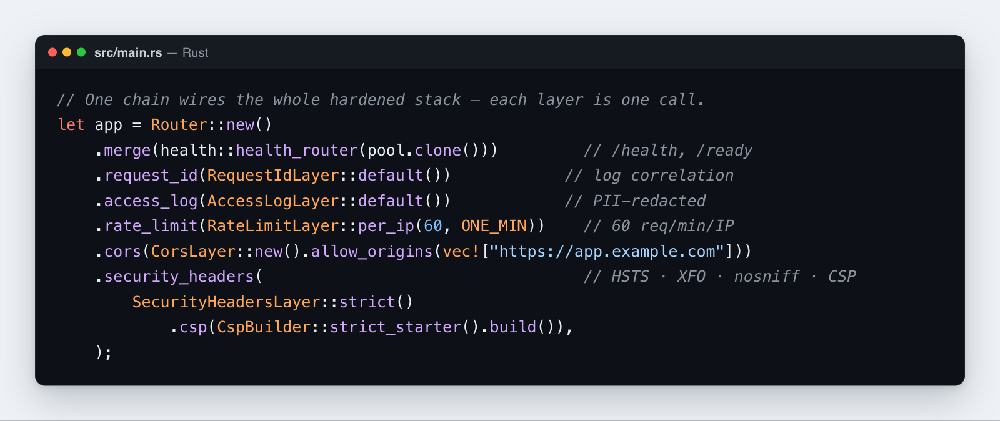

# Security guide

This guide covers every security feature **Rustango** ships and how to combine them. If you come from Django, Laravel, or Rails, most of these will feel familiar — the names differ, but the ideas are the same. Each feature below is usually one line of setup. When you're ready to ship, run `manage check --deploy` for an automated audit.

[](img/security.png)

## Table of contents

- [The defense-in-depth checklist](#the-defense-in-depth-checklist)
- [Setting security headers](#setting-security-headers)
- [Allowing cross-origin requests (CORS)](#allowing-cross-origin-requests-cors)
- [Rate limiting requests](#rate-limiting-requests)
- [Allowing or blocking IPs](#allowing-or-blocking-ips)
- [Protecting against CSRF](#protecting-against-csrf)
- [Preventing XSS](#preventing-xss)
- [Preventing SQL injection](#preventing-sql-injection)
- [Authenticating users](#authenticating-users)
- [Hashing and checking passwords](#hashing-and-checking-passwords)
- [Issuing and refreshing JWTs](#issuing-and-refreshing-jwts)
- [Authenticating with API keys](#authenticating-with-api-keys)
- [Adding two-factor auth (TOTP)](#adding-two-factor-auth-totp)
- [Sending signed URLs (magic links)](#sending-signed-urls-magic-links)
- [Verifying incoming webhooks](#verifying-incoming-webhooks)
- [Keeping secrets out of your logs](#keeping-secrets-out-of-your-logs)
- [Tracing requests across services](#tracing-requests-across-services)
- [Managing secrets](#managing-secrets)
- [Auditing before you deploy](#auditing-before-you-deploy)

---

## The defense-in-depth checklist

Good security comes from many small layers, not one big wall. A production **Rustango** app should stack the layers below — most are one line each. The rest of this guide explains each one.

```rust
let app = Router::new()
    .route("/...", ...)
    .merge(health::health_router(pool.clone()))         // /health, /ready
    .request_id(RequestIdLayer::default())              // log correlation
    .access_log(AccessLogLayer::default())              // PII-redacted by default
    .rate_limit(RateLimitLayer::per_ip(60, ONE_MIN))    // 60 req/min/IP
    .cors(CorsLayer::new().allow_origins(vec!["..."])) // explicit allowlist
    .security_headers(                                   // HSTS + XFO + nosniff + Referrer + CSP
        SecurityHeadersLayer::strict()
            .csp(CspBuilder::strict_starter().build()),
    );
// Plus: TLS termination at reverse proxy.
// Plus: argon2 for passwords, JWT lifecycle for tokens, TOTP for MFA.
```

---

## Setting security headers

Security headers tell the browser how to protect your users (block clickjacking, force HTTPS, stop content-type sniffing). `SecurityHeadersLayer` sets the standard set with one line — the same headers Django ships by default. (A "layer" is **Rustango**'s term for middleware; you attach it to your router.)

> Deep dive: [Middleware](middleware.md) covers how layers work, ordering, the full built-in catalog, and writing your own (locale-, timezone-aware, headers, CSRF).

```rust
use rustango::security_headers::{SecurityHeadersLayer, SecurityHeadersRouterExt, CspBuilder};

let app = router.security_headers(SecurityHeadersLayer::strict());
```

### Presets

| Preset | When to use |
|---|---|
| `strict()` | Production: HSTS preload + XFO=DENY + nosniff + Referrer-Policy=no-referrer + COOP=same-origin + Permissions-Policy locked down |
| `relaxed()` | Embeddable in iframes: SAMEORIGIN + 1y HSTS |
| `dev()` | Local: nosniff only (no HSTS to avoid locking localhost into HTTPS forever) |
| `empty()` | Build up from scratch |

### Custom CSP

```rust
let csp = CspBuilder::new()
    .default_src(&["'self'"])
    .script_src(&["'self'", "https://cdn.example.com"])
    .style_src(&["'self'", "'unsafe-inline'"])    // for inline <style>
    .img_src(&["'self'", "data:", "https:"])
    .font_src(&["'self'", "data:"])
    .connect_src(&["'self'", "wss://realtime.example.com"])
    .frame_ancestors(&["'none'"])                 // disallow embedding (clickjacking)
    .object_src(&["'none'"])
    .directive("base-uri", &["'self'"])
    .build();

let layer = SecurityHeadersLayer::strict().csp(csp);
```

### Staged CSP rollout

Use `csp_report_only` to monitor without breaking production:

```rust
let layer = SecurityHeadersLayer::strict()
    .csp(CspBuilder::strict_starter().build())
    .csp_report_only(true);                       // sends Content-Security-Policy-Report-Only
```

After verifying no console errors → flip `csp_report_only(false)` to enforce.

---

## Allowing cross-origin requests (CORS)

CORS controls which other websites are allowed to call your API from a browser. By default browsers block these calls; you opt specific origins back in. List your real front-end domains in production and never open it up to everyone.

```rust
use rustango::cors::{CorsLayer, CorsRouterExt};

// Production
let layer = CorsLayer::new()
    .allow_origins(vec!["https://app.example.com", "https://admin.example.com"])
    .allow_methods(vec!["GET", "POST", "PUT", "PATCH", "DELETE"])
    .allow_headers(vec!["content-type", "authorization"])
    .allow_credentials(true)
    .max_age(Duration::from_secs(3600));

// Dev only
let layer = CorsLayer::permissive();              // any origin, common methods
```

**Security note:** never combine `allow_credentials(true)` with `allow_any_origin()` — the browser will reject the response. With credentials, you MUST list explicit origins.

---

## Rate limiting requests

Rate limiting caps how many requests a client can make in a window of time. Use it to slow down brute-force logins, scraping, and abuse. You can limit per IP, per API key, or globally for one expensive endpoint.

```rust
use rustango::rate_limit::{RateLimitLayer, RateLimitRouterExt};

// Per-IP
router.rate_limit(RateLimitLayer::per_ip(60, Duration::from_secs(60)));

// Per-API-key (header)
router.rate_limit(RateLimitLayer::per_header("authorization", 1000, Duration::from_secs(3600)));

// Global ceiling for an expensive endpoint
router.rate_limit(RateLimitLayer::global(10, Duration::from_secs(1)));
```

When exhausted: `429 Too Many Requests` with `Retry-After` header. Every successful response includes `X-RateLimit-Limit` + `X-RateLimit-Remaining`.

> **Behind a reverse proxy, pair `per_ip` with `real_ip`.** `RateLimitLayer::per_ip` keys on the connecting socket (`ConnectInfo`), which behind a proxy is the *proxy's* IP — so every client shares one bucket and the limit is useless. Put `real_ip::RealIpLayer` (reads `X-Forwarded-For` / `X-Real-IP`) ahead of it so the true client IP is used.

`RateLimitLayer` is **process-local** — it counts requests only within one running instance, which is fine if you run a single instance. If you run several instances (replicas) behind a load balancer, each would keep its own count, so the real limit multiplies. To share one count across all replicas, use `rate_limit_cache::CacheRateLimitLayer`, which delegates to any `cache::Cache` impl (pair with `cache::RedisCache` for a shared counter incremented atomically by Redis `INCRBY`):

```rust
use rustango::cache::RedisCache;
use rustango::rate_limit::KeyBy;
use rustango::rate_limit_cache::{CacheRateLimitLayer, CacheRateLimitRouterExt};

let cache: rustango::cache::BoxedCache =
    std::sync::Arc::new(RedisCache::new("redis://localhost").await?);

let app = axum::Router::new()
    .route("/api/login", axum::routing::post(login))
    .cache_rate_limit(
        CacheRateLimitLayer::new(cache, 5, Duration::from_secs(60))
            .key_by(KeyBy::Ip)
            .key_prefix("login"),
    );
```

---

## Allowing or blocking IPs

Lock down sensitive routes (like your admin) to a known set of IP addresses, or block specific abusers. An allowlist permits only the listed networks; a blocklist denies the listed ones.

```rust
use rustango::ip_filter::{IpFilterLayer, IpFilterRouterExt};

// Internal admin only
let admin_router = admin_router
    .ip_filter(IpFilterLayer::allow_only(vec![
        "10.0.0.0/8",
        "192.168.0.0/16",
        "203.0.113.0/24",
    ])?);

// Block known abusers
let public_router = public_router
    .ip_filter(IpFilterLayer::block(vec!["203.0.113.42"])?);
```

**IPv4 + IPv6 supported.** Cross-family safe (an IPv4 CIDR doesn't match IPv6 addresses). Returns `403 Forbidden` on rejection.

**Important:** **Rustango** reads the client IP from `ConnectInfo<SocketAddr>`. Mount with:

```rust
axum::serve(listener, app.into_make_service_with_connect_info::<SocketAddr>()).await?;
```

If your reverse proxy forwards `X-Forwarded-For`, configure it to set `RemoteAddr` — `ip_filter` reads the connecting peer, not headers.

---

## Protecting against CSRF

> **CSRF and token APIs.** CSRF protects **cookie-authenticated** requests. A
> pure token / Bearer / [JWT](auth-jwt.md) API isn't a CSRF target — don't apply
> the CSRF layer to it (or you'll 403 legitimate clients). For an SPA that *does*
> use cookies, read the `rustango_csrf` cookie and echo it in the `X-CSRF-Token`
> header.

CSRF (cross-site request forgery) is when another site tricks a logged-in user's browser into submitting a request to your app. The defense is a secret token on every form, just like Django's ``. The CSRF middleware lives in `rustango::forms::csrf` (behind the `csrf` feature, which is turned on automatically by the `admin` feature):

```rust
use rustango::forms::csrf;

let app = Router::new()
    .route("/contact", get(form).post(submit))
    .layer(csrf::layer());
```

`csrf::layer()` builds the layer with sensible defaults; `csrf::with_config(CsrfConfig)` lets you override the cookie/header names and the `Secure` flag. In templates, `{{ csrf_token }}` gives you the raw token and `{{ csrf_input }}` gives you a ready-made hidden `<input>` — drop one inside every form. It uses the double-submit cookie pattern: on unsafe methods (POST, PUT, PATCH, DELETE) the layer checks the `X-CSRF-Token` header (or the `_csrf` form field) against the `rustango_csrf` cookie; a mismatch returns `403 Forbidden`.

**Exempting collector endpoints.** `CsrfConfig::exempt_prefix("/path")` (repeatable) skips CSRF enforcement for unsafe methods on requests whose path starts with the given prefix. This is for append-only, no-auth-state endpoints hit via `navigator.sendBeacon` — e.g. an analytics collector — which can't set an `X-CSRF-Token` header and, when the page is served from a CDN cache that strips `Set-Cookie`, may carry no CSRF cookie at all. Keep prefixes narrow and never exempt anything that reads or writes auth state.

The auto-admin enables CSRF on every mutation by default, and there is no way to opt out.

---

## Preventing XSS

XSS (cross-site scripting) happens when user input is rendered as HTML and runs as code in someone else's browser. The fix is to escape any user input before it reaches the page. **Rustango** handles this two ways:

**1. Tera template auto-escape** — Tera is **Rustango**'s template engine (like Django templates or Blade). Every `{{ var }}` is HTML-escaped automatically. Use `{{ var | safe }}` to opt out — rare, and dangerous, so only do it for HTML you fully trust.

**2. Manual escape helper** — for when you build HTML in Rust code instead of a template:

```rust
use rustango::text::html_escape;

let safe = html_escape(user_input);
// "<script>" → "&lt;script&gt;"
// "a & b" → "a &amp; b"
```

Replaces `&`, `<`, `>`, `"`, `'`. Suitable for HTML element content + double-quoted attributes.

For CSP-based XSS defense, see [Setting security headers](#setting-security-headers).

---

## Preventing SQL injection

SQL injection happens when user input gets pasted straight into a SQL string and changes the query. **Rustango**'s ORM stops this by design: it uses sqlx parameter binding everywhere — every value is sent as a `$1, $2, ...` placeholder, never glued into the query text. (sqlx is the underlying database library.) **You can't accidentally concatenate user input into SQL through the ORM API.**

There are two spots to stay careful about:

**1. Table and column names in `bulk_actions`:**

Placeholders protect values, but they can't carry an identifier (a table or column name), so those need their own guard. The bulk-action runner never glues raw user-supplied table/column names into SQL. Internally it validates every identifier (a crate-private
`validate_ident` that rejects `"`, `` ` ``, `\0`, `\n`, `\r`, `\`, `;`,
spaces, and control chars) and then quotes it via `dialect.quote_ident()`
before building the statement. This guard runs for you — you don't call it
yourself.

**2. The raw SQL escape hatch:**

If you drop down to raw `sqlx`, bind every *value* as a parameter and
never paste an *identifier* (table or column name) that came from
user input into the query string — placeholders can't carry identifiers:

```rust
// ✅ values go through bound placeholders
sqlx::query("SELECT * FROM posts WHERE id = $1")
    .bind(1).fetch_all(&pool).await?;

// ❌ NEVER interpolate a user-supplied identifier into the SQL string
let sql = format!("SELECT * FROM \"{user_table}\" WHERE id = $1");
sqlx::query(&sql).bind(1).fetch_all(&pool).await?;
```

---

## Authenticating users

Authentication is how you confirm who is making a request. **Rustango** ships three ready-made backends (Basic auth, API keys, and JWTs) and lets you write your own — much like Django's authentication backends. You attach them to routes, and requests without a recognized credential get a `401`.

### Three ready-made backends

```rust
use rustango::tenancy::auth_backends::{ModelBackend, ApiKeyBackend, JwtBackend};
use rustango::tenancy::middleware::{RouterAuthExt, CurrentUser};
use std::sync::Arc;

let backends = vec![
    Arc::new(ModelBackend) as _,                   // Authorization: Basic <b64>
    Arc::new(ApiKeyBackend) as _,                   // Authorization: Bearer <prefix>.<secret>
    Arc::new(JwtBackend::new(secret)) as _,         // Authorization: Bearer <jwt>
];

let app = Router::new()
    .route("/me", get(profile))
    .require_auth(backends.clone(), pool.clone())   // 401 if no backend recognizes
    .route("/posts/new", post(create_post))
    .require_perm("post.add", pool.clone())         // gate by codename
    .require_auth(backends, pool);
```

The middleware tries each backend in order. The first one that succeeds wins; the first one that returns a hard error stops the chain.

### Writing your own backend

```rust
use rustango::tenancy::auth_backends::{AuthBackend, AuthUser, AuthError};
use async_trait::async_trait;

pub struct OAuthBackend { /* ... */ }

#[async_trait]
impl AuthBackend for OAuthBackend {
    async fn authenticate(&self, parts: &Parts, pool: &rustango::sql::Pool)
        -> Result<Option<AuthUser>, AuthError>
    {
        // Read your custom header, validate, look up the user
        Ok(None)  // means: not my request, try next backend
    }
}
```

---

## Hashing and checking passwords

Never store passwords as plain text. Hash them on signup with `hash`, and on login compare the attempt with `verify`. Use `strength_score` to reject weak passwords before you ever hash them.

```rust
use rustango::passwords::{hash, verify, strength_score, StrengthIssue};

// Signup
let issues = strength_score(&new_password);
if !issues.is_empty() {
    return Err(format!("password too weak: {issues:?}"));
}
let hashed = hash(&new_password)?;

// Login
let ok = verify(&attempted, &user.password_hash)?;
```

Hashing uses **argon2id** (the OWASP-recommended default since 2023 — it resists GPU cracking better than bcrypt). Hashes are stored in PHC-string format, so you can change parameters later without breaking old hashes.

The built-in **strength check** is intentionally minimal. For serious deployments, also check passwords against the HIBP / pwned-passwords API to reject ones known to be leaked.

> **Deep dive:** [Passwords](auth-passwords.md) — argon2id internals, automatic salting, timing-safe logins (`verify_dummy`), and where the hash lives. Once authenticated, hand off to a [Session](auth-sessions.md) (browser) or a [JWT](auth-jwt.md) (API).

---

## Issuing and refreshing JWTs

A JWT (JSON Web Token) is a signed token a client sends instead of logging in every time. `JwtLifecycle` handles the whole flow: a short-lived access token plus a longer-lived refresh token, with verify, refresh, and revoke built in.

```rust
use rustango::tenancy::jwt_lifecycle::{JwtLifecycle, JwtTokenPair, JwtIssueError};
use serde_json::json;

let jwt = JwtLifecycle::new(secret)
    .with_access_ttl(900)                         // 15 min
    .with_refresh_ttl(7 * 86400);                 // 7 days
```

### Issuing a token with custom claims (no DB lookup on verify)

```rust
let pair = jwt.issue_pair_with(user_id, json!({
    "roles":  ["admin", "editor"],
    "tenant": "acme",
    "scope":  "read:posts write:posts",
    "email":  "alice@example.com",
}).as_object().unwrap().clone())?;
```

"Claims" are the key/value facts you embed in the token (roles, tenant, and so on); the client sends them back and you read them without hitting the database. Reserved claim names (`sub`, `exp`, `jti`, `typ`) are used by the framework and can't appear in your custom claims — trying returns `JwtIssueError::ReservedClaim`.

### Verifying a token

```rust
let claims = jwt.verify_access(&access_token)
    .ok_or(StatusCode::UNAUTHORIZED)?;

let roles: Vec<String> = claims.get_custom("roles").unwrap_or_default();
let tenant: String = claims.get_custom("tenant").unwrap_or_default();
```

### Refreshing a token (keeps your custom claims)

```rust
let new_pair = jwt.refresh(&refresh_token)
    .ok_or(StatusCode::UNAUTHORIZED)?;
// new_pair has the same roles + scope + tenant
```

The old refresh token's JTI (its unique ID) is added to a blacklist so it can't be reused — this blocks replay attacks where a stolen old token is sent again.

### Refreshing with re-checked permissions

```rust
// returns Result<Option<JwtTokenPair>, JwtIssueError>:
// Err on a reserved-claim collision, Ok(None) on an invalid/expired refresh.
let new_pair = jwt.refresh_with(&refresh_token, json!({
    "roles": ["viewer"],     // role was demoted since login
    "tenant": "acme",
}).as_object().unwrap().clone())?
    .ok_or(StatusCode::UNAUTHORIZED)?;
```

### Revoking a token

```rust
jwt.revoke(&access_token);     // adds JTI to blacklist
jwt.revoke(&refresh_token);
```

The default in-memory blacklist (`InMemoryJtiStore`) cleans out expired entries on its own, but it lives in one process and forgets every revocation on restart. For multi-process deployments, install a shared, durable store via `JwtLifecycle::new(secret).with_jti_store(store)` — `store` is any `Arc<dyn JtiStore>` (for example a Redis- or DB-backed one). Without a shared store, a token you revoke on one replica can still be replayed on another until it expires.

> **Deep dive:** [JWT auth API](auth-jwt-api.md) — the built-in `/api/auth/login|refresh|logout|me` router, sliding refresh, and the JTI revocation store. For a single self-managed token, see [JWT (standalone)](auth-jwt.md). To gate browser/API routes by login, see [access decorators](auth-decorators.md).

---

## Authenticating with API keys

API keys let scripts and services authenticate without a username, password, or session — handy for machine-to-machine access. You generate a key, show it to the user once, and store only its prefix and hash.

```rust
use rustango::api_keys::{generate_key, verify_key, split_token};

// Issuance
let (full_token, prefix, hash) = generate_key()?;
// Format: {8-char hex prefix}.{32-char hex secret}
// Show full_token to the user once. Store prefix + hash in your DB.

// Verification on each request
let (prefix, secret) = split_token(&inbound_header)
    .ok_or(StatusCode::UNAUTHORIZED)?;
let row = lookup_by_prefix(prefix).await?;
if !verify_key(secret, &row.hash)? {
    return Err(StatusCode::UNAUTHORIZED);
}
```

These keys work directly with the multi-tenancy `ApiKeyBackend` — both use the same `{prefix}.{secret}` format with argon2id-hashed secrets, so a key issued here authenticates there with no extra work.

---

## Adding two-factor auth (TOTP)

TOTP is the 6-digit code from an authenticator app — a second factor on top of the password. You generate a secret per user, show it as a QR code to enroll, then verify the code they type on each login. It follows the RFC 6238 standard.

```rust
use rustango::totp::{TotpSecret, otpauth_url, verify};

// Enrollment
let secret = TotpSecret::generate();                           // 20 random bytes
user.totp_secret = secret.to_base32();                          // store in DB
let qr_url = otpauth_url("MyApp", &user.email, &secret);        // encode as QR

// Verification on login
let secret = TotpSecret::from_base32(&user.totp_secret).unwrap();
if !verify(&secret, &user_supplied_code, 30, 6, 1) {            // 6 digits, ±30s drift
    return Err("bad TOTP code");
}
```

Works with Google Authenticator, Authy, 1Password, Bitwarden, and other standard authenticator apps.

**Recovery codes** (one-time backup codes for when a user loses their phone) aren't shipped yet. The common pattern is to store 8–10 hashed codes per user and burn one each time it's used.

---

## Sending signed URLs (magic links)

A signed URL carries a tamper-proof signature, so you can trust it without a session — perfect for magic-link logins, password resets, and time-limited download links. You `sign` a URL (optionally with an expiry) and `verify` it when the user clicks. (Laravel calls these "signed routes.")

```rust
use rustango::signed_url::{sign, verify, SignedUrlError};
use std::time::Duration;

// Issue a 1-hour magic-link login URL
let url = sign(
    "https://app.example.com/auth/login?email=alice@x.com",
    secret,
    Some(Duration::from_secs(3600)),
);
// Send via email...

// On the callback handler
match verify(&incoming_url, secret) {
    Ok(()) => { /* identity confirmed */ }
    Err(SignedUrlError::Expired) => { /* prompt to request a new link */ }
    Err(SignedUrlError::InvalidSignature) => { /* tampered — log + 401 */ }
    Err(_) => { /* malformed */ }
}
```

Common uses:
- Magic-link login (email a one-time URL instead of asking for password)
- Password reset confirmation
- Time-limited file downloads
- "Click here to verify your email" links
- Unsubscribe links (no auth needed; URL itself proves intent)

Before signing, the query params are sorted into a fixed order, so an attacker can't reorder them (for example moving `?expires=...`) to change what the signature covers and forge a valid-looking link.

> Deep dive: [Account flows](auth-flows.md) builds password reset, email verification, and magic-link login on this signed-URL primitive.

---

## Verifying incoming webhooks

A webhook is an HTTP callback another service sends you (a payment succeeded, a push happened). Always check its signature so you know it really came from that service and the body wasn't changed. `verify_signature` handles the common formats.

```rust
use rustango::webhook::{verify_signature, SignatureFormat};

async fn handle_stripe_webhook(headers: HeaderMap, body: Bytes) -> impl IntoResponse {
    let signature = headers.get("stripe-signature")
        .and_then(|v| v.to_str().ok())
        .unwrap_or("");

    if !verify_signature(SignatureFormat::HexSha256, secret, &body, signature) {
        return StatusCode::UNAUTHORIZED;
    }
    // ... process the verified payload
    StatusCode::OK
}
```

| Format | Used by |
|---|---|
| `HexSha256WithPrefix` | GitHub (`sha256=<hex>`) |
| `HexSha256` | Slack, raw HMAC providers |
| `Base64Sha256` | Stripe, AWS SNS |

The signature comparison is constant-time, meaning it always takes the same amount of time whether the guess is right or wrong. That stops timing attacks, where an attacker measures tiny response-time differences to guess the secret one character at a time.

---

## Keeping secrets out of your logs

Logged URLs can leak passwords and tokens that show up in query strings. `AccessLogLayer` automatically masks known credential params before writing the log line (PII = personally identifiable information).

```rust
let app = router.access_log(AccessLogLayer::default());
```

By default, values for these query params get replaced with `[redacted]`:
`password`, `passwd`, `token`, `secret`, `api_key`, `apikey`, `access_token`, `refresh_token`, `signature`, `auth`.

Add to the list:

```rust
let layer = AccessLogLayer::default()
    .redact_additional("session_id")
    .redact_additional("private_key");
```

Replace the entire list:

```rust
let layer = AccessLogLayer::default()
    .redact(vec!["only_this".into()]);
```

Note: this redacts **query strings** only. To scrub request bodies or headers, filter at the source with `tracing::Subscriber`.

---

## Tracing requests across services

A request ID tags every log line for one request with the same ID, so you can follow that request across handlers — and across services. `RequestIdLayer` adds one to every request.

```rust
let app = router.request_id(RequestIdLayer::default());
```

It reuses an inbound `X-Request-Id` (so chained services share one ID) or generates a fresh 22-char base64 ID. Inbound IDs are validated first — anything with control chars, newlines, null bytes, or longer than 128 chars is rejected, which blocks header-injection attacks.

In handlers:

```rust
async fn handler(id: rustango::request_id::RequestId) -> String {
    tracing::info!(req_id = %id.0, "handling /me");
    format!("req {}", id.0)
}
```

In a zero-trust setup, where you don't trust IDs sent by upstream services, always make your own:

```rust
router.request_id(RequestIdLayer::always_generate());
```

---

## Managing secrets

Never hard-code secrets (database passwords, API keys) in your source. Read them at runtime through the `Secrets` trait, which abstracts over where they actually live. (A "trait" is Rust's version of an interface.) The built-in `EnvSecrets` reads from environment variables.

```rust
use rustango::secrets::{Secrets, EnvSecrets, BoxedSecrets};
use std::sync::Arc;

// Env vars (with optional prefix)
let secrets: BoxedSecrets = Arc::new(EnvSecrets::with_prefix("MYAPP_"));

let db_pwd = secrets.require("DB_PASSWORD").await?;       // reads MYAPP_DB_PASSWORD
let redis_url = secrets.get("REDIS_URL").await?;          // None when unset
```

To pull secrets from Vault, AWS Secrets Manager, or GCP Secret Manager, implement the trait yourself — it's just one async method.

---

## Auditing before you deploy

Before going to production, run the built-in audit. It catches common misconfigurations — like a missing or too-short signing secret — that you don't want to discover in production.

```bash
manage check --deploy
```

Always-on checks (run with or without `--deploy`):
- ✅ Models registered in inventory
- ✅ DB reachable (`SELECT 1`)
- ✅ Migrations on disk for registered models

Additional `--deploy` (production-hardening) checks:
- ✅ `RUSTANGO_ENV` is `prod` or `production`
- ✅ `RUSTANGO_SESSION_SECRET` set and ≥ 32 bytes (the HMAC key for cookie + JWT signing — `SECRET_KEY` is **not** read by the framework), with no scaffolder placeholder left in
- ✅ `DATABASE_URL` set (and warns if it points at localhost)
- ⚠️ `RUSTANGO_APEX_DOMAIN` / `RUSTANGO_BIND` sanity warnings for tenancy + non-loopback binding

Returns non-zero exit on any **error-level** finding (good for CI gates). Warnings don't trigger failure but show in output.

For checks beyond what ships, extend with custom code in your `manage` binary before forwarding to `manage::run`.

---

## What's NOT yet shipped

The framework comparison roadmap (memory:`framework-comparison-2026-05-02.md`) flags these as future work:

- **OAuth2 social login** (Google, GitHub, etc.) — Tier 2
- **Password reset + email verification end-to-end flow** (helpers exist; no built-in token+email+view+validate cycle)
- **PII redaction of request body / headers** in access_log

Already shipped (don't reach for these on the roadmap):

- **Per-account lockout** — `rustango::account_lockout::Lockout` (cache-backed; `is_locked` / `record_failure` / `clear`, configurable `max_attempts` + `lockout_duration`)
- **CSP report endpoint** — `security_headers::csp_report_router(path)` + `SecurityHeadersLayer::csp_report_uri(uri)`
- **Distributed rate limiting** — `rate_limit_cache::CacheRateLimitLayer` (see [Rate limiting requests](#rate-limiting-requests))

Until the unshipped items land, glue them yourself using the primitives above (`signed_url::sign` for password reset tokens, etc.).

---

## See also

- [Middleware](middleware.md) — how the security layers attach, their order, and the full catalog.
- [Authentication](auth-passwords.md) — passwords, sessions, JWTs, API keys, HMAC, auth backends, and account flows, each in depth.
- [API conventions](api-conventions.md) — the error-type and return-type rules behind these APIs.
