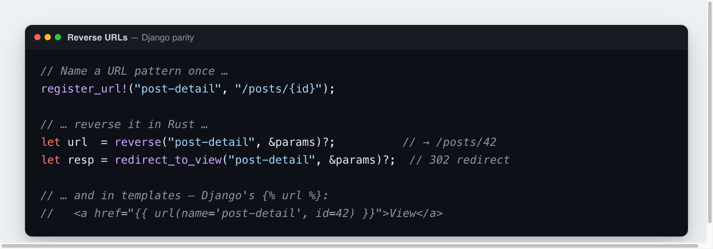

# URL names & reverse

Hardcoding URLs (`/posts/42`) all over handlers and templates is fragile — change
a route and every literal breaks silently. **Rustango** gives you Django's
answer: **name a URL pattern once, then build the URL by name everywhere** — in
Rust with `reverse(...)`, in templates with `{{ url(...) }}`, and in redirects
with `redirect_to_view(...)`. The API surface mirrors Django's
`reverse()` / `` / `resolve_url()` / `redirect()`.

[](img/urls.png)

> **Source:** `rustango::urls` (`register_url!`, `reverse`, `reverse_owned`,
> `all_routes`, `duplicates`, `register_url_tag`) and `rustango::shortcuts`
> (`resolve_url`, `redirect_to_view`).

---

## Contents

- [Register a named URL](#register-a-named-url)
- [Reverse in Rust](#reverse-in-rust) · [Reverse in templates](#reverse-in-templates)
- [Redirect by name](#redirect-by-name) · [Namespacing](#namespacing)
- [Inspect the URL map](#inspect-the-url-map) · [Errors](#errors)
- [Regex & typed path patterns](#regex--typed-path-patterns) · [Notes & limits](#notes-and-limits)

---

## Register a named URL

`register_url!("name", "/pattern")` registers a name → pattern mapping. It runs
at module-load time (via `inventory`), so the route lands in a global registry
the moment its module is linked — no central `urls.py` to edit, and no
`include()` to wire up.

```rust
use rustango::register_url;

register_url!("post-detail", "/posts/{id}");
register_url!("user-posts",  "/users/{user_id}/posts/{post_id}");
register_url!("home",        "/");
```

Placeholders use axum's `{name}` path syntax. The pattern is the same string you
mount the handler at — keep them in sync (register the name next to where you
build the route).

---

## Reverse in Rust

`reverse(name, &params)` substitutes the pattern's `{placeholders}` with the
given values (percent-encoding each) and returns the URL:

```rust
use std::collections::HashMap;
use rustango::urls::reverse;

let mut params = HashMap::new();
params.insert("id", "42".to_string());

let url = reverse("post-detail", &params)?;   // → "/posts/42"
```

For dynamic keys (e.g. values assembled from a request), `reverse_owned` takes
`HashMap<String, String>` instead of `HashMap<&str, String>`:

```rust
use rustango::urls::reverse_owned;
let url = reverse_owned("post-detail", &owned_params)?;
```

`reverse` is **strict**: a missing placeholder, or an extra `params` key that
the pattern doesn't have, is an error (not a silent mismatch) — see
[Errors](#errors).

---

## Reverse in templates

Templates get Django's `` as a Tera function. Register it once on your
`Tera` instance at setup (it's behind the `template_views` feature):

```rust
rustango::urls::register_url_tag(&mut tera);
```

Then call `url(name=..., <param>=...)` in any template — `name` is required, and
every other keyword argument is a path parameter (strings, numbers and bools are
accepted):

```jinja
<a href="{{ url(name='post-detail', id=42) }}">View post</a>
<a href="{{ url(name='user-posts', user_id=7, post_id=42) }}">…</a>
```

That's the equivalent of Django's ``. For the
`` capture pattern, use Tera's ``:

```jinja

<a href="{{ post_url }}">{{ post.title }}</a>
```

A `null` argument (usually an undefined template variable) errors loudly rather
than silently producing a broken URL.

---

## Redirect by name

`rustango::shortcuts` mirrors Django's view-name redirect helpers, so handlers
never hardcode a `Location`:

```rust
use std::collections::HashMap;
use rustango::shortcuts::{redirect_to_view, resolve_url};

// redirect('post-detail', id=42) → 302 Location: /posts/42
let mut params = HashMap::new();
params.insert("id", "42".to_string());
let response = redirect_to_view("post-detail", &params)?;
```

`resolve_url(spec, &params)` is Django's `resolve_url`: if `spec` already looks
like a URL (`/…`, `http://`, `https://`, `./`, `../`) it's returned unchanged;
otherwise it's treated as a route name and reverse-resolved. Handy for a
`?next=` parameter or a setting that may hold *either* a path or a name:

```rust
let url = resolve_url("post-detail", &params)?;  // name  → "/posts/42"
let url = resolve_url("/dashboard", &params)?;   // path  → "/dashboard" (as-is)
```

(For raw redirects to a known URL, `rustango::shortcuts::redirect(url)` returns a
plain `302`.)

---

## Namespacing

There's no `include()` and no auto-applied app namespace — every `register_url!`
lands in one global registry. Namespacing is a **convention in the name itself**:
prefix with `app:`, exactly as you'd call Django's `reverse("app:detail")`.

```rust
register_url!("blog:post-detail", "/blog/posts/{id}");
register_url!("shop:product",     "/shop/products/{slug}");
```

```rust
reverse("blog:post-detail", &params)?;   // "/blog/posts/42"
```

The colon is just part of the registered string — pick a consistent prefix per
app to avoid collisions.

---

## Inspect the URL map

List every registered route from the CLI — useful for a quick audit or to script
against:

```bash
cargo run -- showurls                  # plain table of name → pattern
cargo run -- showurls --format json    # machine-readable
```

In code, `all_routes()` returns the whole registry, and `duplicates()` returns
any name registered more than once (first-wins otherwise — worth asserting at
boot):

```rust
use rustango::urls::{all_routes, duplicates};

for route in all_routes() {
    println!("{} → {}", route.name, route.pattern);
}

let dups = duplicates();
assert!(dups.is_empty(), "duplicate URL names: {dups:?}");
```

---

## Errors

`reverse` / `reverse_owned` / `resolve_url` / `redirect_to_view` return
`Result<_, rustango::urls::ReverseError>`:

| Variant | When |
|---|---|
| `UnknownName(name)` | No `register_url!` ran for that name (typo, or its module wasn't linked). |
| `MissingParam { name, param }` | The pattern has `{param}` but `params` didn't supply it. |
| `UnexpectedParam { name, param }` | `params` carried a key the pattern doesn't have (catches typos). |
| `MalformedPattern { name, detail }` | The registered pattern is malformed (e.g. an unclosed `{`). |

In templates these surface as Tera render errors (a 500 via
`shortcuts::render` / `template_views`), so a bad `{{ url(...) }}` fails visibly
rather than rendering a broken link.

---

## Regex & typed path patterns

**Rustango has no `re_path`, and no path converter is ever enforced.** A pattern
segment is either a literal (`/posts/new`) or a `{name}` placeholder that captures
exactly one segment; `{*name}` captures the rest of the path. That's the whole
vocabulary — there is no `r'(?P<year>[0-9]{4})'`, and `{int:id}` does **not**
constrain `id` to an integer.

### Why — the matcher isn't a regex engine

Routing *is* [axum](https://docs.rs/axum) 0.8, and axum matches paths with
[`matchit`](https://docs.rs/matchit), a **radix-trie** router. It walks the URL
one segment at a time down a prefix tree, so a match costs O(path length) and is
independent of how many routes you've registered. A regex router does the
opposite: Django evaluates `urlpatterns` top-to-bottom, running each entry's
regex against the path until one matches. The trie buys constant-time matching
and an unambiguous "most-specific literal wins" precedence — at the cost of not
expressing character-class constraints *in the path itself*.

Rustango inherits that matcher wholesale. There is **no second, regex-based
resolver** layered on top, and `register_url!` deliberately records the *same*
`{name}` strings the router already understands — it never compiles a regex. So
regex paths aren't "turned off"; the routing layer was simply never a regex
engine to begin with.

The `{int:id}` form is accepted only as a **porting affordance** for `reverse()`:
the builder splits the placeholder on `:` and keeps just the name, discarding the
type prefix ([`urls.rs`](../crates/rustango/src/urls.rs)). That lets `reverse()`
run on a pattern copied verbatim from a Django `path("<int:id>/", …)` — but
nothing validates that the supplied value is actually an integer.

### How to express a constrained route

Match the segment with a plain `{placeholder}`, then enforce its shape where the
value is used. Django's `re_path(r'^articles/(?P<year>[0-9]{4})/$', …)` becomes:

```rust
register_url!("article-by-year", "/articles/{year}");
// router:
.route("/articles/{year}", get(article_by_year))

async fn article_by_year(Path(year): Path<String>) -> impl IntoResponse {
    // the router accepted any single segment; enforce [0-9]{4} here
    match year.parse::<u16>() {
        Ok(y) if (1000..=9999).contains(&y) => render_year(y).await,
        _ => StatusCode::NOT_FOUND.into_response(),
    }
}
```

To reject *before* the handler runs (closer to Django's converter semantics), put
the check in a custom axum extractor (`FromRequestParts`) and take that type as
the handler argument instead of `Path<String>` — the framework doesn't ship one,
but axum's extractor trait is the intended seam. The `regex` crate is already a
dependency (the ORM uses it for `__regex` lookups), so a validating extractor can
compile a `Regex` once and reuse it across requests.

---

## Notes and limits

- **Registration is link-time.** A `register_url!` only takes effect if its
  module is compiled into the binary. An `UnknownName` error usually means the
  name is a typo *or* its module isn't referenced anywhere (so the linker
  dropped it).
- **Patterns aren't validated against your real routes.** `register_url!` records
  a name → string mapping; it doesn't check that a handler is actually mounted at
  that pattern. Register the name where you mount the route so they stay in sync.
- **Values are percent-encoded** by `reverse`, so they're safe to drop into a
  `Location` header or an `href`.
- **No regex/typed converters** in patterns (Django's `<int:pk>`); placeholders
  are plain `{name}` and values are substituted as-is (after encoding). See
  [Regex & typed path patterns](#regex--typed-path-patterns) for why, and how to
  constrain a route instead.
